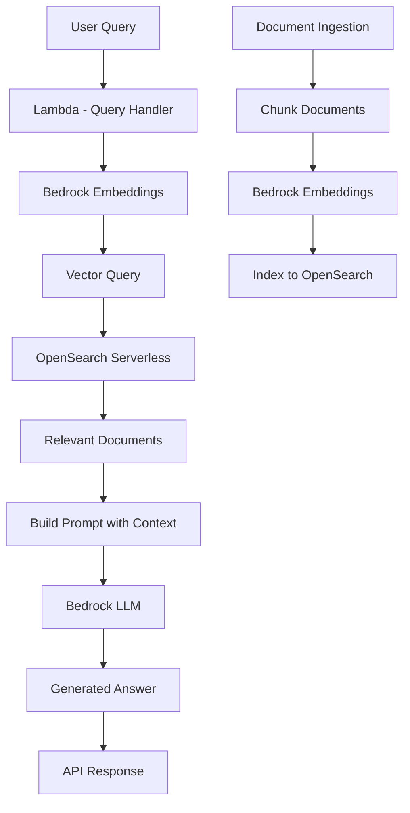

# How to Build a RAG Application with Amazon Bedrock and OpenSearch

Author: [nawazdhandala](https://github.com/nawazdhandala)

Tags: AWS, Bedrock, RAG, OpenSearch, AI, Vector Search

Description: Build a Retrieval Augmented Generation application using Amazon Bedrock for LLM inference and OpenSearch Serverless for vector search and document retrieval.

---

Large language models are impressive, but they hallucinate. Ask them about your company's internal processes, recent product changes, or domain-specific knowledge, and they will confidently make things up. Retrieval Augmented Generation (RAG) fixes this by grounding LLM responses in your actual data.

The idea is simple: before asking the LLM to answer a question, first search your knowledge base for relevant documents, then include those documents as context in the prompt. The LLM generates its answer based on your real data instead of its training data.

In this guide, we will build a RAG application using Amazon Bedrock for the LLM and OpenSearch Serverless for vector search.

## Architecture



## Setting Up OpenSearch Serverless for Vector Search

OpenSearch Serverless with a vector search collection is purpose-built for this use case:

```python
# Set up OpenSearch Serverless vector collection
import boto3
import json
import time

opensearch_serverless = boto3.client('opensearchserverless')

def create_vector_collection(collection_name):
    """Create an OpenSearch Serverless collection for vector search."""
    # Create encryption policy (required)
    opensearch_serverless.create_security_policy(
        name=f'{collection_name}-encryption',
        type='encryption',
        policy=json.dumps({
            'Rules': [{'ResourceType': 'collection', 'Resource': [f'collection/{collection_name}']}],
            'AWSOwnedKey': True
        })
    )

    # Create network policy
    opensearch_serverless.create_security_policy(
        name=f'{collection_name}-network',
        type='network',
        policy=json.dumps([{
            'Rules': [{'ResourceType': 'collection', 'Resource': [f'collection/{collection_name}']},
                      {'ResourceType': 'dashboard', 'Resource': [f'collection/{collection_name}']}],
            'AllowFromPublic': True
        }])
    )

    # Create data access policy
    opensearch_serverless.create_access_policy(
        name=f'{collection_name}-access',
        type='data',
        policy=json.dumps([{
            'Rules': [
                {'ResourceType': 'collection', 'Resource': [f'collection/{collection_name}'], 'Permission': ['aoss:*']},
                {'ResourceType': 'index', 'Resource': [f'index/{collection_name}/*'], 'Permission': ['aoss:*']}
            ],
            'Principal': ['arn:aws:iam::123456789:role/RAGApplicationRole']
        }])
    )

    # Create the collection
    response = opensearch_serverless.create_collection(
        name=collection_name,
        type='VECTORSEARCH',
        description='Vector search collection for RAG application'
    )

    return response['createCollectionDetail']
```

## Creating the Vector Index

Once the collection is active, create an index with the right mapping for vector search:

```python
# Create the vector index in OpenSearch Serverless
from opensearchpy import OpenSearch, RequestsHttpConnection
from requests_aws4auth import AWS4Auth
import boto3

def create_vector_index(collection_endpoint, index_name):
    """Create an index optimized for vector similarity search."""
    credentials = boto3.Session().get_credentials()
    auth = AWS4Auth(
        credentials.access_key,
        credentials.secret_key,
        'us-east-1',
        'aoss',
        session_token=credentials.token
    )

    client = OpenSearch(
        hosts=[{'host': collection_endpoint, 'port': 443}],
        http_auth=auth,
        use_ssl=True,
        verify_certs=True,
        connection_class=RequestsHttpConnection
    )

    # Index mapping with vector field for embeddings
    index_body = {
        'settings': {
            'index': {
                'knn': True,
                'knn.algo_param.ef_search': 512
            }
        },
        'mappings': {
            'properties': {
                'embedding': {
                    'type': 'knn_vector',
                    'dimension': 1536,  # Titan embedding dimension
                    'method': {
                        'engine': 'faiss',
                        'space_type': 'l2',
                        'name': 'hnsw',
                        'parameters': {
                            'ef_construction': 512,
                            'm': 16
                        }
                    }
                },
                'text': {'type': 'text'},
                'title': {'type': 'text'},
                'source': {'type': 'keyword'},
                'chunk_id': {'type': 'keyword'},
                'metadata': {'type': 'object'}
            }
        }
    }

    client.indices.create(index=index_name, body=index_body)
    return client
```

## Document Ingestion Pipeline

Documents need to be chunked, embedded, and indexed. Chunking strategy matters a lot for RAG quality.

```python
# Document ingestion: chunk, embed, and index documents
import boto3
import json
import re

bedrock = boto3.client('bedrock-runtime')

def chunk_document(text, chunk_size=500, overlap=50):
    """Split a document into overlapping chunks for better retrieval."""
    words = text.split()
    chunks = []
    start = 0

    while start < len(words):
        end = start + chunk_size
        chunk_text = ' '.join(words[start:end])
        chunks.append(chunk_text)
        start = end - overlap  # Overlap for context continuity

    return chunks

def generate_embedding(text):
    """Generate a vector embedding using Amazon Titan Embeddings."""
    response = bedrock.invoke_model(
        modelId='amazon.titan-embed-text-v2:0',
        contentType='application/json',
        accept='application/json',
        body=json.dumps({
            'inputText': text[:8192]  # Titan V2 supports up to 8192 tokens
        })
    )

    result = json.loads(response['body'].read())
    return result['embedding']

def ingest_document(opensearch_client, index_name, document):
    """Process and index a single document."""
    title = document['title']
    text = document['text']
    source = document['source']
    metadata = document.get('metadata', {})

    # Clean the text
    text = re.sub(r'\s+', ' ', text).strip()

    # Chunk the document
    chunks = chunk_document(text)

    # Embed and index each chunk
    for i, chunk in enumerate(chunks):
        embedding = generate_embedding(chunk)

        doc = {
            'embedding': embedding,
            'text': chunk,
            'title': title,
            'source': source,
            'chunk_id': f'{source}_{i}',
            'metadata': metadata
        }

        opensearch_client.index(
            index=index_name,
            body=doc,
            id=f'{source}_{i}'
        )

    return len(chunks)

def batch_ingest(opensearch_client, index_name, documents):
    """Ingest multiple documents in batch."""
    total_chunks = 0
    for doc in documents:
        chunks = ingest_document(opensearch_client, index_name, doc)
        total_chunks += chunks
        print(f'Indexed {doc["title"]}: {chunks} chunks')

    return total_chunks
```

## The RAG Query Handler

This is the core of the application. It retrieves relevant context and generates an answer:

```python
# Lambda - RAG query handler
import boto3
import json
from opensearchpy import OpenSearch, RequestsHttpConnection
from requests_aws4auth import AWS4Auth

bedrock = boto3.client('bedrock-runtime')

def get_opensearch_client():
    """Create an authenticated OpenSearch client."""
    credentials = boto3.Session().get_credentials()
    auth = AWS4Auth(
        credentials.access_key,
        credentials.secret_key,
        'us-east-1',
        'aoss',
        session_token=credentials.token
    )
    return OpenSearch(
        hosts=[{'host': 'COLLECTION_ENDPOINT', 'port': 443}],
        http_auth=auth,
        use_ssl=True,
        verify_certs=True,
        connection_class=RequestsHttpConnection
    )

def handler(event, context):
    body = json.loads(event['body'])
    query = body['query']
    top_k = body.get('topK', 5)
    model_id = body.get('modelId', 'anthropic.claude-3-sonnet-20240229-v1:0')

    # Step 1: Generate embedding for the user query
    query_embedding = generate_embedding(query)

    # Step 2: Search OpenSearch for relevant document chunks
    os_client = get_opensearch_client()
    search_results = os_client.search(
        index='rag-knowledge-base',
        body={
            'size': top_k,
            'query': {
                'knn': {
                    'embedding': {
                        'vector': query_embedding,
                        'k': top_k
                    }
                }
            },
            '_source': ['text', 'title', 'source', 'metadata']
        }
    )

    # Step 3: Build context from retrieved documents
    context_docs = []
    sources = []
    for hit in search_results['hits']['hits']:
        source_doc = hit['_source']
        context_docs.append(f"[Source: {source_doc['title']}]\n{source_doc['text']}")
        sources.append({
            'title': source_doc['title'],
            'source': source_doc['source'],
            'score': hit['_score']
        })

    context_text = '\n\n---\n\n'.join(context_docs)

    # Step 4: Generate answer using Bedrock LLM with retrieved context
    prompt = f"""You are a helpful assistant. Answer the user's question based ONLY on the provided context.
If the context does not contain enough information to answer the question, say so clearly.
Do not make up information that is not in the context.

Context:
{context_text}

Question: {query}

Answer:"""

    llm_response = bedrock.invoke_model(
        modelId=model_id,
        contentType='application/json',
        accept='application/json',
        body=json.dumps({
            'anthropic_version': 'bedrock-2023-05-31',
            'messages': [{'role': 'user', 'content': prompt}],
            'max_tokens': 1024,
            'temperature': 0.1  # Low temperature for factual responses
        })
    )

    result = json.loads(llm_response['body'].read())
    answer = result['content'][0]['text']

    return {
        'statusCode': 200,
        'body': json.dumps({
            'answer': answer,
            'sources': sources,
            'query': query
        })
    }

def generate_embedding(text):
    response = bedrock.invoke_model(
        modelId='amazon.titan-embed-text-v2:0',
        contentType='application/json',
        accept='application/json',
        body=json.dumps({'inputText': text[:8192]})
    )
    return json.loads(response['body'].read())['embedding']
```

## Improving RAG Quality

Several techniques improve RAG accuracy:

```python
# Advanced RAG techniques for better answers

def hybrid_search(os_client, index_name, query, query_embedding, top_k=5):
    """Combine vector search with keyword search for better retrieval."""
    response = os_client.search(
        index=index_name,
        body={
            'size': top_k,
            'query': {
                'bool': {
                    'should': [
                        {
                            'knn': {
                                'embedding': {
                                    'vector': query_embedding,
                                    'k': top_k
                                }
                            }
                        },
                        {
                            'match': {
                                'text': {
                                    'query': query,
                                    'boost': 0.3  # Lower weight for keyword match
                                }
                            }
                        }
                    ]
                }
            }
        }
    )
    return response

def rerank_results(query, results, bedrock_client):
    """Rerank retrieved results using the LLM for better relevance."""
    texts = [hit['_source']['text'] for hit in results['hits']['hits']]

    # Ask the LLM to rank the passages by relevance
    prompt = f"""Given the question: "{query}"

Rank the following passages by relevance (most relevant first). Return only the passage numbers.

{chr(10).join(f'Passage {i+1}: {t[:200]}...' for i, t in enumerate(texts))}

Ranking (most relevant first):"""

    response = bedrock_client.invoke_model(
        modelId='anthropic.claude-3-haiku-20240307-v1:0',
        body=json.dumps({
            'anthropic_version': 'bedrock-2023-05-31',
            'messages': [{'role': 'user', 'content': prompt}],
            'max_tokens': 100,
            'temperature': 0
        })
    )

    return json.loads(response['body'].read())
```

## Conversation History for Multi-Turn RAG

Support follow-up questions by maintaining conversation context:

```python
# Multi-turn RAG with conversation history
def handle_conversational_query(query, conversation_history, os_client):
    """Handle follow-up questions by reformulating with conversation context."""
    # If there is conversation history, reformulate the query
    if conversation_history:
        reformulated = reformulate_query(query, conversation_history)
    else:
        reformulated = query

    # Proceed with standard RAG using the reformulated query
    embedding = generate_embedding(reformulated)
    results = hybrid_search(os_client, 'rag-knowledge-base', reformulated, embedding)

    # Generate answer
    answer = generate_answer(reformulated, results, conversation_history)

    return answer

def reformulate_query(query, history):
    """Use the LLM to reformulate a follow-up question into a standalone question."""
    history_text = '\n'.join([
        f"{'User' if i % 2 == 0 else 'Assistant'}: {msg}"
        for i, msg in enumerate(history)
    ])

    prompt = f"""Given this conversation history:
{history_text}

And this follow-up question: {query}

Reformulate the follow-up question into a standalone question that captures the full context.
Return only the reformulated question, nothing else."""

    response = bedrock.invoke_model(
        modelId='anthropic.claude-3-haiku-20240307-v1:0',
        body=json.dumps({
            'anthropic_version': 'bedrock-2023-05-31',
            'messages': [{'role': 'user', 'content': prompt}],
            'max_tokens': 200,
            'temperature': 0
        })
    )

    result = json.loads(response['body'].read())
    return result['content'][0]['text']
```

## Monitoring Your RAG Application

RAG applications have multiple failure modes: embedding generation can fail, vector search can return irrelevant results, and the LLM can still hallucinate despite context. Monitor embedding latency, search relevance scores, answer generation time, and user feedback. Track the full pipeline with [OneUptime](https://oneuptime.com/blog/post/2026-02-12-build-a-chatbot-with-amazon-bedrock-and-lambda/view) to ensure every component is healthy.

## Wrapping Up

RAG is the practical way to make LLMs useful with your own data. Amazon Bedrock provides both the embedding model and the LLM, while OpenSearch Serverless handles vector search at scale. The combination gives you grounded, accurate answers based on your actual documents.

The biggest impact on RAG quality comes from chunking strategy and retrieval tuning, not the LLM choice. Spend time getting your chunks right - too small and you lose context, too large and you dilute relevance. Overlap between chunks ensures you do not split important information across boundaries.
