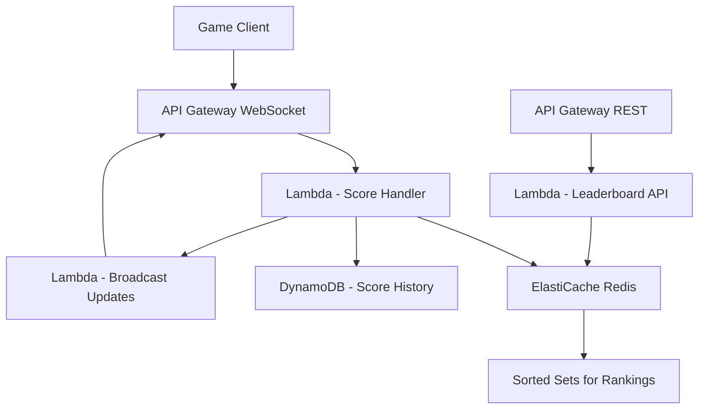

# How to Build a Real-Time Leaderboard on AWS

Author: [nawazdhandala](https://github.com/nawazdhandala)

Tags: AWS, ElastiCache, Redis, DynamoDB, Real-Time, Lambda

Description: Build a real-time leaderboard system on AWS using ElastiCache Redis sorted sets, DynamoDB for persistence, and WebSocket API for live updates.

---

Leaderboards seem simple until you try to build one at scale. Showing the top 10 players is easy. Showing a player their exact rank out of 10 million? That requires the right data structure. Updating ranks in real time as scores change? That requires the right architecture.

In this guide, we will build a real-time leaderboard on AWS using ElastiCache Redis for fast rank calculations, DynamoDB for durable storage, and API Gateway WebSockets for pushing live updates to clients.

## Architecture



## Why Redis Sorted Sets

Redis sorted sets are built for leaderboards. Every member in the set has a score, and Redis maintains them in sorted order. Getting the rank of any member is an O(log N) operation, regardless of how many members exist. Getting the top N members is O(log N + N).

Compare this to DynamoDB, where getting a player's rank would require scanning all items with a higher score. At a million players, that is not feasible.

## Setting Up ElastiCache Redis

```yaml
# CloudFormation for ElastiCache Redis cluster
AWSTemplateFormatVersion: '2010-09-09'
Resources:
  RedisSubnetGroup:
    Type: AWS::ElastiCache::SubnetGroup
    Properties:
      Description: Subnets for leaderboard Redis
      SubnetIds:
        - !Ref PrivateSubnet1
        - !Ref PrivateSubnet2

  RedisCluster:
    Type: AWS::ElastiCache::ReplicationGroup
    Properties:
      ReplicationGroupDescription: Leaderboard Redis cluster
      Engine: redis
      EngineVersion: '7.0'
      CacheNodeType: cache.r6g.large
      NumCacheClusters: 2
      AutomaticFailoverEnabled: true
      CacheSubnetGroupName: !Ref RedisSubnetGroup
      SecurityGroupIds:
        - !Ref RedisSecurityGroup

  # DynamoDB table for persistent score storage
  ScoreTable:
    Type: AWS::DynamoDB::Table
    Properties:
      TableName: LeaderboardScores
      BillingMode: PAY_PER_REQUEST
      AttributeDefinitions:
        - AttributeName: leaderboardId
          AttributeType: S
        - AttributeName: playerId
          AttributeType: S
      KeySchema:
        - AttributeName: leaderboardId
          KeyType: HASH
        - AttributeName: playerId
          KeyType: RANGE
```

## Submitting Scores

The score submission handler writes to both Redis and DynamoDB. Redis is the source of truth for rankings, while DynamoDB preserves the history.

```python
# Lambda to handle score submissions
import boto3
import json
import redis
from datetime import datetime

# Redis connection (inside VPC)
r = redis.Redis(
    host='leaderboard-redis.xxx.cache.amazonaws.com',
    port=6379,
    decode_responses=True
)

dynamodb = boto3.resource('dynamodb')
score_table = dynamodb.Table('LeaderboardScores')

def handler(event, context):
    body = json.loads(event['body'])
    leaderboard_id = body['leaderboardId']
    player_id = body['playerId']
    score = float(body['score'])
    mode = body.get('mode', 'highest')  # highest, lowest, or cumulative

    redis_key = f'lb:{leaderboard_id}'

    if mode == 'cumulative':
        # Add to existing score
        new_score = r.zincrby(redis_key, score, player_id)
    elif mode == 'highest':
        # Only update if new score is higher
        current = r.zscore(redis_key, player_id)
        if current is None or score > current:
            r.zadd(redis_key, {player_id: score})
            new_score = score
        else:
            new_score = current
    elif mode == 'lowest':
        # Only update if new score is lower (e.g., speedrun times)
        current = r.zscore(redis_key, player_id)
        if current is None or score < current:
            r.zadd(redis_key, {player_id: score})
            new_score = score
        else:
            new_score = current

    # Get the player's new rank (0-indexed, so add 1)
    rank = r.zrevrank(redis_key, player_id)
    rank = rank + 1 if rank is not None else None

    # Persist to DynamoDB
    score_table.put_item(Item={
        'leaderboardId': leaderboard_id,
        'playerId': player_id,
        'score': str(new_score),
        'rank': rank,
        'updatedAt': datetime.utcnow().isoformat()
    })

    return {
        'statusCode': 200,
        'body': json.dumps({
            'playerId': player_id,
            'score': new_score,
            'rank': rank
        })
    }
```

## Querying the Leaderboard

Multiple query patterns are needed: top N, around a player, and specific rank ranges.

```python
# Lambda for leaderboard query endpoints
import redis
import json

r = redis.Redis(
    host='leaderboard-redis.xxx.cache.amazonaws.com',
    port=6379,
    decode_responses=True
)

def handler(event, context):
    path = event['path']
    params = event.get('queryStringParameters', {}) or {}
    leaderboard_id = params.get('leaderboardId', 'default')
    redis_key = f'lb:{leaderboard_id}'

    if '/top' in path:
        return get_top(redis_key, int(params.get('count', '10')))
    elif '/rank' in path:
        return get_player_rank(redis_key, params['playerId'])
    elif '/around' in path:
        return get_around_player(redis_key, params['playerId'], int(params.get('range', '5')))
    elif '/range' in path:
        return get_rank_range(redis_key, int(params['start']), int(params['end']))

    return respond(404, {'error': 'Not found'})

def get_top(redis_key, count):
    """Get the top N players with scores."""
    # ZREVRANGE returns members in descending score order
    results = r.zrevrange(redis_key, 0, count - 1, withscores=True)
    entries = [
        {'rank': i + 1, 'playerId': member, 'score': score}
        for i, (member, score) in enumerate(results)
    ]
    return respond(200, {'entries': entries})

def get_player_rank(redis_key, player_id):
    """Get a specific player's rank and score."""
    rank = r.zrevrank(redis_key, player_id)
    score = r.zscore(redis_key, player_id)

    if rank is None:
        return respond(404, {'error': 'Player not found'})

    total_players = r.zcard(redis_key)
    percentile = ((total_players - rank) / total_players) * 100

    return respond(200, {
        'playerId': player_id,
        'rank': rank + 1,
        'score': score,
        'totalPlayers': total_players,
        'percentile': round(percentile, 2)
    })

def get_around_player(redis_key, player_id, range_size):
    """Get players ranked around a specific player."""
    rank = r.zrevrank(redis_key, player_id)
    if rank is None:
        return respond(404, {'error': 'Player not found'})

    start = max(0, rank - range_size)
    end = rank + range_size

    results = r.zrevrange(redis_key, start, end, withscores=True)
    entries = [
        {'rank': start + i + 1, 'playerId': member, 'score': score}
        for i, (member, score) in enumerate(results)
    ]
    return respond(200, {'entries': entries, 'playerRank': rank + 1})

def get_rank_range(redis_key, start, end):
    """Get players within a specific rank range."""
    results = r.zrevrange(redis_key, start - 1, end - 1, withscores=True)
    entries = [
        {'rank': start + i, 'playerId': member, 'score': score}
        for i, (member, score) in enumerate(results)
    ]
    return respond(200, {'entries': entries})

def respond(status, body):
    return {
        'statusCode': status,
        'headers': {'Content-Type': 'application/json'},
        'body': json.dumps(body)
    }
```

## Real-Time Updates with WebSockets

Push leaderboard changes to connected clients using API Gateway WebSocket API:

```python
# Lambda to manage WebSocket connections and broadcast updates
import boto3
import json

dynamodb = boto3.resource('dynamodb')
connections_table = dynamodb.Table('WebSocketConnections')

def connect_handler(event, context):
    """Handle new WebSocket connections."""
    connection_id = event['requestContext']['connectionId']
    leaderboard_id = event.get('queryStringParameters', {}).get('leaderboardId', 'default')

    connections_table.put_item(Item={
        'connectionId': connection_id,
        'leaderboardId': leaderboard_id
    })

    return {'statusCode': 200}

def disconnect_handler(event, context):
    """Handle WebSocket disconnections."""
    connection_id = event['requestContext']['connectionId']
    connections_table.delete_item(Key={'connectionId': connection_id})
    return {'statusCode': 200}

def broadcast_update(leaderboard_id, update_data):
    """Send leaderboard update to all connected clients watching this leaderboard."""
    apigw = boto3.client('apigatewaymanagementapi',
        endpoint_url='https://xxx.execute-api.us-east-1.amazonaws.com/prod'
    )

    # Find all connections watching this leaderboard
    response = connections_table.scan(
        FilterExpression='leaderboardId = :lb',
        ExpressionAttributeValues={':lb': leaderboard_id}
    )

    stale_connections = []
    for conn in response['Items']:
        try:
            apigw.post_to_connection(
                ConnectionId=conn['connectionId'],
                Data=json.dumps(update_data).encode()
            )
        except apigw.exceptions.GoneException:
            stale_connections.append(conn['connectionId'])

    # Clean up stale connections
    for conn_id in stale_connections:
        connections_table.delete_item(Key={'connectionId': conn_id})
```

## Multiple Leaderboard Types

Support different leaderboard types - daily, weekly, all-time, and per-region:

```python
# Manage multiple leaderboard types with automatic expiration
import redis
from datetime import datetime, timedelta

r = redis.Redis(host='leaderboard-redis.xxx.cache.amazonaws.com', port=6379)

def submit_to_all_boards(player_id, score):
    """Submit a score to all relevant leaderboard timeframes."""
    today = datetime.utcnow().strftime('%Y-%m-%d')
    week = datetime.utcnow().strftime('%Y-W%W')
    month = datetime.utcnow().strftime('%Y-%m')

    pipe = r.pipeline()

    # Daily leaderboard (expires after 48 hours)
    daily_key = f'lb:daily:{today}'
    pipe.zadd(daily_key, {player_id: score})
    pipe.expire(daily_key, 172800)

    # Weekly leaderboard (expires after 8 days)
    weekly_key = f'lb:weekly:{week}'
    pipe.zadd(weekly_key, {player_id: score})
    pipe.expire(weekly_key, 691200)

    # Monthly leaderboard (expires after 35 days)
    monthly_key = f'lb:monthly:{month}'
    pipe.zadd(monthly_key, {player_id: score})
    pipe.expire(monthly_key, 3024000)

    # All-time leaderboard (never expires)
    pipe.zadd('lb:alltime', {player_id: score})

    pipe.execute()
```

## Monitoring Leaderboard Performance

Redis sorted set operations should be sub-millisecond. If response times climb, you have a problem - either the dataset is too large for the instance, or network latency is the bottleneck. Monitor Redis memory usage, operation latency, and connection counts. For end-to-end API monitoring including client-perceived latency, [OneUptime](https://oneuptime.com/blog/post/2026-02-12-build-an-api-monetization-platform-on-aws/view) can help track the full request path.

## Wrapping Up

Redis sorted sets are the perfect data structure for leaderboards. They give you O(log N) rank lookups and score updates regardless of how many players you have. By combining ElastiCache Redis with DynamoDB for persistence and WebSockets for live updates, you get a system that handles millions of players with sub-millisecond rank calculations.

The key design decisions: use `ZREVRANGE` for descending leaderboards (highest score wins), use `ZRANGE` for ascending leaderboards (lowest time wins), and always write to both Redis and DynamoDB so you can reconstruct the leaderboard if Redis fails.
