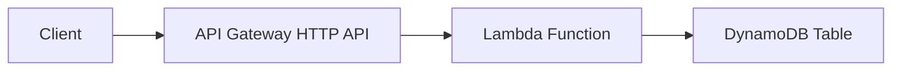

# How to Build a REST API with Lambda and DynamoDB

Author: [nawazdhandala](https://github.com/nawazdhandala)

Tags: AWS, Lambda, DynamoDB, API Gateway, REST API

Description: Build a complete serverless REST API using AWS Lambda and DynamoDB with CRUD operations, input validation, error handling, and production-ready patterns.

---

Lambda and DynamoDB are the classic serverless pairing. Lambda handles the compute, DynamoDB handles the data, and API Gateway ties it all together with HTTP endpoints. No servers to manage, automatic scaling, and you pay only for what you use.

In this post, we'll build a complete REST API for managing a "tasks" resource - full CRUD operations, input validation, proper error handling, and pagination. The patterns here apply to any resource type.

## Architecture

The architecture is simple and proven:



API Gateway routes HTTP requests to a single Lambda function that handles all routes. DynamoDB stores the data. You could use one Lambda per route, but a single function with routing logic is simpler to manage and shares connection initialization costs.

## Step 1: Create the DynamoDB Table

First, create the table:

```bash
# Create a DynamoDB table for tasks
aws dynamodb create-table \
  --table-name Tasks \
  --attribute-definitions \
    AttributeDefinition=AttributeName=taskId,AttributeType=S \
    AttributeDefinition=AttributeName=userId,AttributeType=S \
  --key-schema \
    KeySchemaElement=AttributeName=taskId,KeyType=HASH \
  --global-secondary-indexes '[
    {
      "IndexName": "userId-index",
      "KeySchema": [
        {"AttributeName": "userId", "KeyType": "HASH"}
      ],
      "Projection": {"ProjectionType": "ALL"}
    }
  ]' \
  --billing-mode PAY_PER_REQUEST
```

PAY_PER_REQUEST billing mode means you don't need to provision capacity - DynamoDB scales automatically and you pay per read/write.

## Step 2: Build the Lambda Function

Here's the complete API handler with CRUD operations:

```javascript
// REST API handler for Tasks resource
const { DynamoDBClient } = require('@aws-sdk/client-dynamodb');
const {
  DynamoDBDocumentClient,
  GetCommand,
  PutCommand,
  UpdateCommand,
  DeleteCommand,
  QueryCommand,
  ScanCommand,
} = require('@aws-sdk/lib-dynamodb');
const crypto = require('crypto');

const client = new DynamoDBClient({ region: 'us-east-1' });
const dynamo = DynamoDBDocumentClient.from(client);
const TABLE_NAME = process.env.TABLE_NAME || 'Tasks';

// Main handler - routes requests to the right function
exports.handler = async (event) => {
  const method = event.requestContext?.http?.method || event.httpMethod;
  const path = event.rawPath || event.path;
  const pathParams = event.pathParameters || {};

  try {
    // Route the request
    if (method === 'GET' && path === '/tasks') {
      return await listTasks(event);
    }
    if (method === 'GET' && pathParams.taskId) {
      return await getTask(pathParams.taskId);
    }
    if (method === 'POST' && path === '/tasks') {
      return await createTask(event);
    }
    if (method === 'PUT' && pathParams.taskId) {
      return await updateTask(pathParams.taskId, event);
    }
    if (method === 'DELETE' && pathParams.taskId) {
      return await deleteTask(pathParams.taskId);
    }

    return response(404, { error: 'Route not found' });
  } catch (error) {
    console.error('Unhandled error:', error);
    return response(500, { error: 'Internal server error' });
  }
};

// Helper to build HTTP responses
function response(statusCode, body) {
  return {
    statusCode,
    headers: {
      'Content-Type': 'application/json',
      'Access-Control-Allow-Origin': '*',
    },
    body: JSON.stringify(body),
  };
}

// Parse the request body safely
function parseBody(event) {
  if (!event.body) return null;
  try {
    return event.isBase64Encoded
      ? JSON.parse(Buffer.from(event.body, 'base64').toString())
      : JSON.parse(event.body);
  } catch {
    return null;
  }
}
```

## Step 3: Implement CRUD Operations

### Create a Task

```javascript
// POST /tasks - Create a new task
async function createTask(event) {
  const body = parseBody(event);

  if (!body) {
    return response(400, { error: 'Request body is required' });
  }

  // Validate required fields
  if (!body.title || typeof body.title !== 'string') {
    return response(400, { error: 'title is required and must be a string' });
  }

  if (!body.userId || typeof body.userId !== 'string') {
    return response(400, { error: 'userId is required' });
  }

  const task = {
    taskId: crypto.randomUUID(),
    userId: body.userId,
    title: body.title.trim(),
    description: body.description?.trim() || '',
    status: body.status || 'pending',
    priority: body.priority || 'medium',
    createdAt: new Date().toISOString(),
    updatedAt: new Date().toISOString(),
  };

  await dynamo.send(new PutCommand({
    TableName: TABLE_NAME,
    Item: task,
    // Prevent overwriting an existing task with the same ID
    ConditionExpression: 'attribute_not_exists(taskId)',
  }));

  return response(201, task);
}
```

### Get a Task

```javascript
// GET /tasks/:taskId - Get a single task
async function getTask(taskId) {
  const result = await dynamo.send(new GetCommand({
    TableName: TABLE_NAME,
    Key: { taskId },
  }));

  if (!result.Item) {
    return response(404, { error: 'Task not found' });
  }

  return response(200, result.Item);
}
```

### List Tasks

```javascript
// GET /tasks - List tasks with optional filtering and pagination
async function listTasks(event) {
  const query = event.queryStringParameters || {};
  const limit = Math.min(parseInt(query.limit) || 20, 100);

  // If userId is provided, query the GSI
  if (query.userId) {
    const params = {
      TableName: TABLE_NAME,
      IndexName: 'userId-index',
      KeyConditionExpression: 'userId = :userId',
      ExpressionAttributeValues: { ':userId': query.userId },
      Limit: limit,
    };

    // Add status filter if provided
    if (query.status) {
      params.FilterExpression = '#status = :status';
      params.ExpressionAttributeNames = { '#status': 'status' };
      params.ExpressionAttributeValues[':status'] = query.status;
    }

    // Handle pagination with cursor
    if (query.cursor) {
      params.ExclusiveStartKey = JSON.parse(
        Buffer.from(query.cursor, 'base64').toString()
      );
    }

    const result = await dynamo.send(new QueryCommand(params));

    const responseBody = {
      items: result.Items,
      count: result.Count,
    };

    // Include pagination cursor if there are more results
    if (result.LastEvaluatedKey) {
      responseBody.nextCursor = Buffer.from(
        JSON.stringify(result.LastEvaluatedKey)
      ).toString('base64');
    }

    return response(200, responseBody);
  }

  // Without userId, scan the table (less efficient but works for small datasets)
  const params = {
    TableName: TABLE_NAME,
    Limit: limit,
  };

  if (query.cursor) {
    params.ExclusiveStartKey = JSON.parse(
      Buffer.from(query.cursor, 'base64').toString()
    );
  }

  const result = await dynamo.send(new ScanCommand(params));

  return response(200, {
    items: result.Items,
    count: result.Count,
    nextCursor: result.LastEvaluatedKey
      ? Buffer.from(JSON.stringify(result.LastEvaluatedKey)).toString('base64')
      : undefined,
  });
}
```

### Update a Task

```javascript
// PUT /tasks/:taskId - Update a task
async function updateTask(taskId, event) {
  const body = parseBody(event);

  if (!body) {
    return response(400, { error: 'Request body is required' });
  }

  // Build the update expression dynamically based on provided fields
  const allowedFields = ['title', 'description', 'status', 'priority'];
  const updates = [];
  const expressionValues = {};
  const expressionNames = {};

  for (const field of allowedFields) {
    if (body[field] !== undefined) {
      updates.push(`#${field} = :${field}`);
      expressionNames[`#${field}`] = field;
      expressionValues[`:${field}`] = typeof body[field] === 'string'
        ? body[field].trim()
        : body[field];
    }
  }

  if (updates.length === 0) {
    return response(400, { error: 'No valid fields to update' });
  }

  // Always update the timestamp
  updates.push('#updatedAt = :updatedAt');
  expressionNames['#updatedAt'] = 'updatedAt';
  expressionValues[':updatedAt'] = new Date().toISOString();

  try {
    const result = await dynamo.send(new UpdateCommand({
      TableName: TABLE_NAME,
      Key: { taskId },
      UpdateExpression: `SET ${updates.join(', ')}`,
      ExpressionAttributeNames: expressionNames,
      ExpressionAttributeValues: expressionValues,
      // Only update if the item exists
      ConditionExpression: 'attribute_exists(taskId)',
      ReturnValues: 'ALL_NEW',
    }));

    return response(200, result.Attributes);
  } catch (error) {
    if (error.name === 'ConditionalCheckFailedException') {
      return response(404, { error: 'Task not found' });
    }
    throw error;
  }
}
```

### Delete a Task

```javascript
// DELETE /tasks/:taskId - Delete a task
async function deleteTask(taskId) {
  try {
    await dynamo.send(new DeleteCommand({
      TableName: TABLE_NAME,
      Key: { taskId },
      ConditionExpression: 'attribute_exists(taskId)',
    }));

    return response(204, null);
  } catch (error) {
    if (error.name === 'ConditionalCheckFailedException') {
      return response(404, { error: 'Task not found' });
    }
    throw error;
  }
}
```

## Step 4: Set Up API Gateway

Create an HTTP API (cheaper and faster than REST API) that routes to your Lambda function:

```yaml
# CloudFormation: HTTP API with Lambda integration
Resources:
  HttpApi:
    Type: AWS::ApiGatewayV2::Api
    Properties:
      Name: tasks-api
      ProtocolType: HTTP
      CorsConfiguration:
        AllowOrigins:
          - "*"
        AllowMethods:
          - GET
          - POST
          - PUT
          - DELETE
        AllowHeaders:
          - Content-Type
          - Authorization

  # Lambda integration
  ApiIntegration:
    Type: AWS::ApiGatewayV2::Integration
    Properties:
      ApiId: !Ref HttpApi
      IntegrationType: AWS_PROXY
      IntegrationUri: !GetAtt TasksFunction.Arn
      PayloadFormatVersion: "2.0"

  # Route all requests to the Lambda function
  GetTasksRoute:
    Type: AWS::ApiGatewayV2::Route
    Properties:
      ApiId: !Ref HttpApi
      RouteKey: "GET /tasks"
      Target: !Sub "integrations/${ApiIntegration}"

  GetTaskRoute:
    Type: AWS::ApiGatewayV2::Route
    Properties:
      ApiId: !Ref HttpApi
      RouteKey: "GET /tasks/{taskId}"
      Target: !Sub "integrations/${ApiIntegration}"

  CreateTaskRoute:
    Type: AWS::ApiGatewayV2::Route
    Properties:
      ApiId: !Ref HttpApi
      RouteKey: "POST /tasks"
      Target: !Sub "integrations/${ApiIntegration}"

  UpdateTaskRoute:
    Type: AWS::ApiGatewayV2::Route
    Properties:
      ApiId: !Ref HttpApi
      RouteKey: "PUT /tasks/{taskId}"
      Target: !Sub "integrations/${ApiIntegration}"

  DeleteTaskRoute:
    Type: AWS::ApiGatewayV2::Route
    Properties:
      ApiId: !Ref HttpApi
      RouteKey: "DELETE /tasks/{taskId}"
      Target: !Sub "integrations/${ApiIntegration}"

  # Auto-deploy stage
  DefaultStage:
    Type: AWS::ApiGatewayV2::Stage
    Properties:
      ApiId: !Ref HttpApi
      StageName: $default
      AutoDeploy: true

  # Permission for API Gateway to invoke Lambda
  ApiPermission:
    Type: AWS::Lambda::Permission
    Properties:
      FunctionName: !Ref TasksFunction
      Action: lambda:InvokeFunction
      Principal: apigateway.amazonaws.com
      SourceArn: !Sub "arn:aws:execute-api:${AWS::Region}:${AWS::AccountId}:${HttpApi}/*"
```

## Step 5: IAM Permissions

The Lambda function needs DynamoDB access:

```json
{
  "Version": "2012-10-17",
  "Statement": [
    {
      "Effect": "Allow",
      "Action": [
        "dynamodb:GetItem",
        "dynamodb:PutItem",
        "dynamodb:UpdateItem",
        "dynamodb:DeleteItem",
        "dynamodb:Query",
        "dynamodb:Scan"
      ],
      "Resource": [
        "arn:aws:dynamodb:us-east-1:123456789012:table/Tasks",
        "arn:aws:dynamodb:us-east-1:123456789012:table/Tasks/index/*"
      ]
    }
  ]
}
```

## Testing the API

Once deployed, test the endpoints:

```bash
API_URL="https://abc123.execute-api.us-east-1.amazonaws.com"

# Create a task
curl -X POST "$API_URL/tasks" \
  -H "Content-Type: application/json" \
  -d '{
    "title": "Write blog post",
    "description": "Write about Lambda and DynamoDB",
    "userId": "user-123",
    "priority": "high"
  }'

# List tasks for a user
curl "$API_URL/tasks?userId=user-123"

# Get a specific task
curl "$API_URL/tasks/TASK_ID_HERE"

# Update a task
curl -X PUT "$API_URL/tasks/TASK_ID_HERE" \
  -H "Content-Type: application/json" \
  -d '{"status": "completed"}'

# Delete a task
curl -X DELETE "$API_URL/tasks/TASK_ID_HERE"

# List with pagination
curl "$API_URL/tasks?userId=user-123&limit=10"
# Use the nextCursor from the response for the next page
curl "$API_URL/tasks?userId=user-123&limit=10&cursor=CURSOR_VALUE"
```

## Input Validation

For production APIs, add thorough validation:

```javascript
// Validate task input
function validateTask(body, isUpdate = false) {
  const errors = [];

  if (!isUpdate && !body.title) {
    errors.push('title is required');
  }
  if (body.title && (typeof body.title !== 'string' || body.title.length > 200)) {
    errors.push('title must be a string under 200 characters');
  }

  if (body.status && !['pending', 'in-progress', 'completed', 'cancelled'].includes(body.status)) {
    errors.push('status must be: pending, in-progress, completed, or cancelled');
  }

  if (body.priority && !['low', 'medium', 'high', 'urgent'].includes(body.priority)) {
    errors.push('priority must be: low, medium, high, or urgent');
  }

  if (body.description && body.description.length > 2000) {
    errors.push('description must be under 2000 characters');
  }

  return errors;
}
```

## Performance Considerations

- DynamoDB single-digit millisecond reads and writes pair perfectly with Lambda's sub-second cold starts
- Use the DynamoDB Document Client for simplified attribute marshalling
- Keep the DynamoDB client initialization outside the handler for connection reuse
- Use GSIs for your most common query patterns
- Use `Scan` sparingly - it reads every item in the table and gets slower as the table grows

For monitoring your API's performance, see [monitoring Lambda performance with CloudWatch](https://oneuptime.com/blog/post/2026-02-12-monitor-lambda-function-performance-with-cloudwatch/view).

## Wrapping Up

Lambda and DynamoDB give you a REST API that scales from zero to millions of requests without any capacity planning. The key is solid input validation, proper error handling with conditional expressions, cursor-based pagination for large result sets, and GSIs for efficient query patterns. This foundation works for todo apps, user management, product catalogs, or any CRUD-based API. Start here and add authentication, caching, and more sophisticated queries as your application grows.
