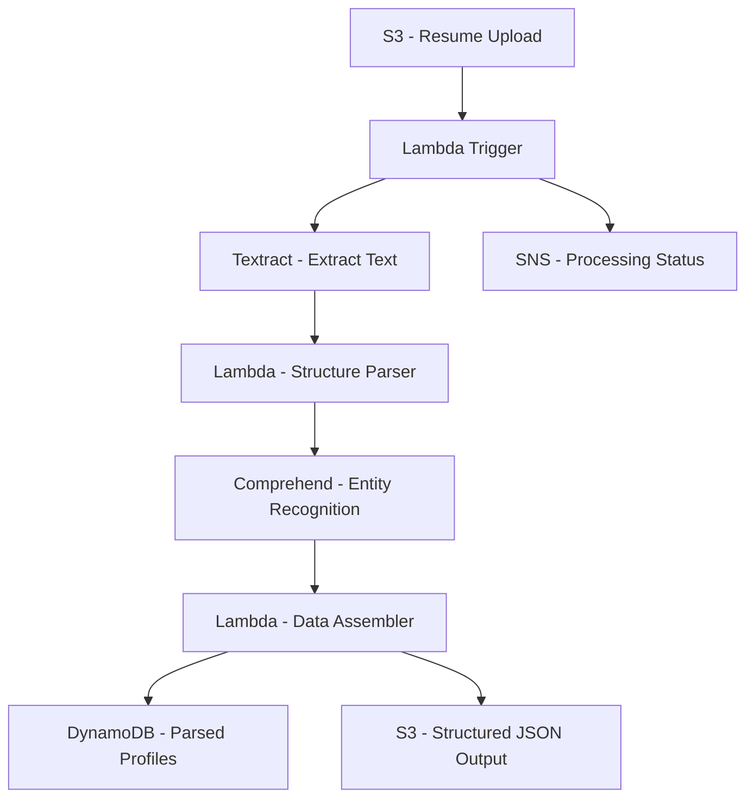

# How to Build a Resume/CV Parser with AWS Textract and Lambda

Author: [nawazdhandala](https://github.com/nawazdhandala)

Tags: AWS, Textract, Lambda, NLP, Document Processing

Description: Build an automated resume and CV parser using AWS Textract, Comprehend, and Lambda to extract structured candidate data from uploaded documents.

---

Parsing resumes is one of those problems that sounds straightforward but hides a mess of edge cases. Resumes come in PDFs, Word documents, and images. Layouts range from single-column to multi-column to creative designs that break every parser. Names, dates, skills, and experience sections are never in the same place twice.

AWS Textract extracts text and structure from documents. Combined with Comprehend for entity recognition and a bit of custom logic, you can build a resume parser that handles the variety of formats recruiters deal with every day.

## Architecture



## Setting Up the Upload Pipeline

When a resume is uploaded to S3, a Lambda function kicks off the parsing pipeline:

```yaml
# CloudFormation for the resume parsing pipeline
AWSTemplateFormatVersion: '2010-09-09'
Resources:
  ResumeBucket:
    Type: AWS::S3::Bucket
    Properties:
      BucketName: resume-uploads
      NotificationConfiguration:
        LambdaConfigurations:
          - Event: s3:ObjectCreated:*
            Filter:
              S3Key:
                Rules:
                  - Name: prefix
                    Value: uploads/
            Function: !GetAtt ResumeParserLambda.Arn

  ParsedOutputBucket:
    Type: AWS::S3::Bucket
    Properties:
      BucketName: parsed-resumes

  ProfilesTable:
    Type: AWS::DynamoDB::Table
    Properties:
      TableName: CandidateProfiles
      BillingMode: PAY_PER_REQUEST
      AttributeDefinitions:
        - AttributeName: profileId
          AttributeType: S
        - AttributeName: email
          AttributeType: S
      KeySchema:
        - AttributeName: profileId
          KeyType: HASH
      GlobalSecondaryIndexes:
        - IndexName: EmailIndex
          KeySchema:
            - AttributeName: email
              KeyType: HASH
          Projection:
            ProjectionType: ALL
```

## Extracting Text with Textract

The first step is pulling raw text from the resume. Textract handles PDFs, PNGs, JPGs, and TIFFs:

```python
# Lambda function to extract text from resume using Textract
import boto3
import json
import uuid

textract = boto3.client('textract')
s3 = boto3.client('s3')

def extract_text(event, context):
    # Get the uploaded file info from S3 event
    record = event['Records'][0]
    bucket = record['s3']['bucket']['name']
    key = record['s3']['object']['key']

    # Check file size - Textract has limits
    obj = s3.head_object(Bucket=bucket, Key=key)
    file_size = obj['ContentLength']

    if file_size > 10 * 1024 * 1024:  # 10MB limit
        return {'error': 'File too large for Textract'}

    # For single-page documents, use synchronous API
    # For multi-page PDFs, use asynchronous API
    content_type = obj.get('ContentType', '')

    if key.endswith('.pdf'):
        # Use async API for PDFs (handles multi-page)
        response = textract.start_document_text_detection(
            DocumentLocation={
                'S3Object': {'Bucket': bucket, 'Name': key}
            }
        )
        job_id = response['JobId']
        text = wait_for_textract_job(job_id)
    else:
        # Use sync API for images
        response = textract.detect_document_text(
            Document={
                'S3Object': {'Bucket': bucket, 'Name': key}
            }
        )
        text = extract_text_from_blocks(response['Blocks'])

    # Pass extracted text to the parser
    profile_id = str(uuid.uuid4())
    return parse_resume_text(text, profile_id, bucket, key)

def wait_for_textract_job(job_id):
    """Poll for Textract async job completion."""
    import time
    while True:
        response = textract.get_document_text_detection(JobId=job_id)
        status = response['JobStatus']

        if status == 'SUCCEEDED':
            return extract_text_from_blocks(response['Blocks'])
        elif status == 'FAILED':
            raise Exception(f'Textract job failed: {response.get("StatusMessage")}')

        time.sleep(2)

def extract_text_from_blocks(blocks):
    """Extract plain text from Textract blocks, preserving line structure."""
    lines = []
    for block in blocks:
        if block['BlockType'] == 'LINE':
            lines.append(block['Text'])
    return '\n'.join(lines)
```

## Parsing the Resume Structure

This is where the custom logic lives. We need to identify sections (Experience, Education, Skills) and extract structured data from each:

```python
# Resume structure parser - identifies sections and extracts data
import re
from datetime import datetime

# Section header patterns
SECTION_PATTERNS = {
    'experience': r'(?i)(work\s*experience|professional\s*experience|employment|work\s*history)',
    'education': r'(?i)(education|academic|qualifications|degrees)',
    'skills': r'(?i)(skills|technical\s*skills|competencies|technologies)',
    'summary': r'(?i)(summary|objective|profile|about\s*me|introduction)',
    'certifications': r'(?i)(certifications?|licenses?|accreditations?)',
    'projects': r'(?i)(projects|portfolio|key\s*projects)'
}

# Common date patterns in resumes
DATE_PATTERN = r'(?:Jan|Feb|Mar|Apr|May|Jun|Jul|Aug|Sep|Oct|Nov|Dec)[a-z]*\.?\s*\d{4}|' \
               r'\d{1,2}/\d{4}|\d{4}\s*[-/]\s*(?:present|current|\d{4})'

# Email and phone patterns
EMAIL_PATTERN = r'[\w.+-]+@[\w-]+\.[\w.-]+'
PHONE_PATTERN = r'(?:\+?\d{1,3}[-.\s]?)?\(?\d{3}\)?[-.\s]?\d{3}[-.\s]?\d{4}'

def parse_resume_text(text, profile_id, bucket, key):
    """Parse raw resume text into structured data."""
    lines = text.split('\n')

    # Extract contact information from the top of the resume
    contact = extract_contact_info(lines[:10])

    # Identify sections
    sections = identify_sections(lines)

    # Parse each section
    profile = {
        'profileId': profile_id,
        'sourceFile': f's3://{bucket}/{key}',
        'contact': contact,
        'summary': parse_summary(sections.get('summary', [])),
        'experience': parse_experience(sections.get('experience', [])),
        'education': parse_education(sections.get('education', [])),
        'skills': parse_skills(sections.get('skills', [])),
        'certifications': sections.get('certifications', []),
        'rawText': text[:5000]
    }

    return profile

def extract_contact_info(header_lines):
    """Extract name, email, phone, and location from resume header."""
    text = '\n'.join(header_lines)

    email_match = re.search(EMAIL_PATTERN, text)
    phone_match = re.search(PHONE_PATTERN, text)

    # The first non-empty line is usually the name
    name = ''
    for line in header_lines:
        cleaned = line.strip()
        if cleaned and not re.search(EMAIL_PATTERN, cleaned) and not re.search(PHONE_PATTERN, cleaned):
            name = cleaned
            break

    return {
        'name': name,
        'email': email_match.group(0) if email_match else None,
        'phone': phone_match.group(0) if phone_match else None
    }

def identify_sections(lines):
    """Split the resume into named sections."""
    sections = {}
    current_section = 'header'
    current_lines = []

    for line in lines:
        matched_section = None
        for section_name, pattern in SECTION_PATTERNS.items():
            if re.search(pattern, line) and len(line.strip()) < 50:
                matched_section = section_name
                break

        if matched_section:
            if current_lines:
                sections[current_section] = current_lines
            current_section = matched_section
            current_lines = []
        else:
            current_lines.append(line)

    if current_lines:
        sections[current_section] = current_lines

    return sections

def parse_experience(lines):
    """Parse work experience entries."""
    experiences = []
    current_entry = None
    text = '\n'.join(lines)

    # Split by date patterns to find individual job entries
    entries = re.split(r'\n(?=.*(?:' + DATE_PATTERN + r'))', text)

    for entry in entries:
        entry = entry.strip()
        if not entry:
            continue

        dates = re.findall(DATE_PATTERN, entry)
        entry_lines = entry.split('\n')

        experiences.append({
            'title': entry_lines[0].strip() if entry_lines else '',
            'dates': dates,
            'description': '\n'.join(entry_lines[1:]).strip()
        })

    return experiences

def parse_skills(lines):
    """Extract skills from the skills section."""
    skills = []
    text = ' '.join(lines)

    # Skills are often comma-separated or bullet-pointed
    # Split on common delimiters
    raw_skills = re.split(r'[,;|]|\s{2,}|[*]|\n', text)

    for skill in raw_skills:
        cleaned = skill.strip(' -.')
        if cleaned and len(cleaned) > 1 and len(cleaned) < 50:
            skills.append(cleaned)

    return list(set(skills))  # Deduplicate
```

## Enhancing with Comprehend

Use Amazon Comprehend to extract entities that the regex-based parser might miss:

```python
# Use Comprehend to enhance parsed data with NLP
import boto3

comprehend = boto3.client('comprehend')

def enhance_with_nlp(text, parsed_profile):
    """Use Comprehend to extract additional entities."""

    # Detect key phrases
    phrases_response = comprehend.detect_key_phrases(
        Text=text[:5000],  # Comprehend has a 5000 byte limit per call
        LanguageCode='en'
    )

    key_phrases = [
        p['Text'] for p in phrases_response['KeyPhrases']
        if p['Score'] > 0.8
    ]

    # Detect entities (organizations, dates, locations)
    entities_response = comprehend.detect_entities(
        Text=text[:5000],
        LanguageCode='en'
    )

    organizations = []
    locations = []
    for entity in entities_response['Entities']:
        if entity['Score'] > 0.8:
            if entity['Type'] == 'ORGANIZATION':
                organizations.append(entity['Text'])
            elif entity['Type'] == 'LOCATION':
                locations.append(entity['Text'])

    # Detect the dominant language
    lang_response = comprehend.detect_dominant_language(Text=text[:500])
    language = lang_response['Languages'][0]['LanguageCode'] if lang_response['Languages'] else 'en'

    parsed_profile['nlpEnhanced'] = {
        'keyPhrases': key_phrases[:20],
        'organizations': list(set(organizations)),
        'locations': list(set(locations)),
        'language': language
    }

    return parsed_profile
```

## Storing and Searching Parsed Profiles

Store the structured data in DynamoDB and make it searchable:

```python
# Store parsed profiles and enable searching
import boto3
import json
from datetime import datetime

dynamodb = boto3.resource('dynamodb')
s3 = boto3.client('s3')
profiles_table = dynamodb.Table('CandidateProfiles')

def store_profile(profile):
    """Store the parsed profile in DynamoDB and S3."""
    # Store full profile JSON in S3
    s3.put_object(
        Bucket='parsed-resumes',
        Key=f'profiles/{profile["profileId"]}.json',
        Body=json.dumps(profile, default=str),
        ContentType='application/json'
    )

    # Store searchable fields in DynamoDB
    profiles_table.put_item(Item={
        'profileId': profile['profileId'],
        'name': profile['contact'].get('name', ''),
        'email': profile['contact'].get('email', ''),
        'phone': profile['contact'].get('phone', ''),
        'skills': profile.get('skills', []),
        'experienceCount': len(profile.get('experience', [])),
        'sourceFile': profile['sourceFile'],
        'parsedAt': datetime.utcnow().isoformat(),
        'status': 'PARSED'
    })

def search_profiles(skills=None, min_experience=0):
    """Search profiles by skills or experience count."""
    filter_parts = []
    attr_values = {}

    if skills:
        for i, skill in enumerate(skills):
            filter_parts.append(f'contains(skills, :skill{i})')
            attr_values[f':skill{i}'] = skill

    if min_experience > 0:
        filter_parts.append('experienceCount >= :minExp')
        attr_values[':minExp'] = min_experience

    if not filter_parts:
        return profiles_table.scan()['Items']

    return profiles_table.scan(
        FilterExpression=' AND '.join(filter_parts),
        ExpressionAttributeValues=attr_values
    )['Items']
```

## Monitoring the Parser Pipeline

Resume parsing is a batch operation, but reliability matters. If uploads sit in S3 without being processed, recruiting teams lose time. Monitor the Lambda invocation success rate, Textract API latency, and queue depth of unprocessed uploads. [OneUptime](https://oneuptime.com/blog/post/build-an-invoice-processing-system-with-aws-textract/view) can help you track the health of the entire parsing pipeline.

## Wrapping Up

A resume parser built on Textract and Comprehend handles the variety of document formats that manual parsing cannot scale through. Textract extracts the raw text, regex-based section detection identifies the structure, and Comprehend adds NLP-powered entity recognition on top. The result is structured candidate data that your ATS can search and filter.

The accuracy will not be 100% - no resume parser achieves that given the infinite variety of resume formats. But for the 80% of resumes that follow common patterns, this system extracts usable data in seconds instead of the minutes it takes a human to read and enter the same information.
