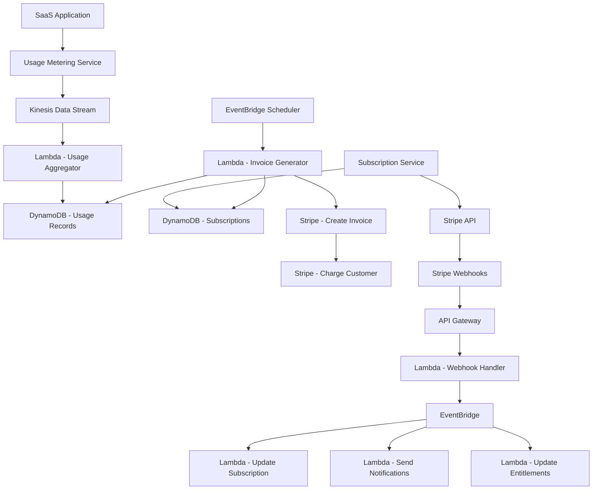

# How to Build a SaaS Billing System with AWS

Author: [nawazdhandala](https://github.com/nawazdhandala)

Tags: AWS, SaaS, Billing, Stripe, DynamoDB, Lambda, EventBridge, Subscriptions

Description: Build a production-grade SaaS billing system on AWS with subscription management, usage metering, invoicing, and payment processing

---

Billing is the part of a SaaS application that nobody wants to build but everybody needs to get right. Getting it wrong means lost revenue, angry customers, or compliance problems. This guide walks through building a billing system on AWS that handles subscriptions, usage-based pricing, invoicing, and payment processing.

We will use Stripe for payment processing (because building your own payment gateway is a terrible idea) and AWS services for everything around it: metering, invoice generation, subscription lifecycle management, and event processing.

## Architecture



## Step 1: Subscription Management

Start with the data model for subscriptions:

```javascript
// DynamoDB table design for subscriptions
// PK: CUSTOMER#{customerId}, SK: SUBSCRIPTION#{subscriptionId}

const subscriptionItem = {
  PK: 'CUSTOMER#cust_123',
  SK: 'SUBSCRIPTION#sub_456',
  customerId: 'cust_123',
  subscriptionId: 'sub_456',
  stripeSubscriptionId: 'sub_stripe_789',
  stripeCustomerId: 'cus_stripe_012',
  planId: 'plan_pro',
  status: 'active',  // active, past_due, canceled, trialing
  currentPeriodStart: '2026-02-01T00:00:00Z',
  currentPeriodEnd: '2026-03-01T00:00:00Z',
  cancelAtPeriodEnd: false,
  metadata: {
    seats: 10,
    storageGb: 100,
  },
  createdAt: '2026-01-01T00:00:00Z',
  updatedAt: '2026-02-01T00:00:00Z',
};
```

The subscription service handles creating, updating, and canceling subscriptions:

```javascript
// subscription-service/handler.js - Subscription management
const Stripe = require('stripe');
const { DynamoDBDocumentClient, PutCommand, UpdateCommand, GetCommand } = require('@aws-sdk/lib-dynamodb');

const stripe = new Stripe(process.env.STRIPE_SECRET_KEY);

// Create a new subscription
exports.createSubscription = async (event) => {
  const { customerId, planId, paymentMethodId } = JSON.parse(event.body);

  // Get or create Stripe customer
  const customer = await getOrCreateStripeCustomer(customerId, paymentMethodId);

  // Look up the price ID for the plan
  const priceId = getPriceIdForPlan(planId);

  // Create Stripe subscription
  const stripeSubscription = await stripe.subscriptions.create({
    customer: customer.stripeCustomerId,
    items: [{ price: priceId }],
    default_payment_method: paymentMethodId,
    payment_behavior: 'default_incomplete',
    expand: ['latest_invoice.payment_intent'],
  });

  // Save subscription to DynamoDB
  await docClient.send(new PutCommand({
    TableName: process.env.SUBSCRIPTIONS_TABLE,
    Item: {
      PK: `CUSTOMER#${customerId}`,
      SK: `SUBSCRIPTION#${stripeSubscription.id}`,
      customerId,
      stripeSubscriptionId: stripeSubscription.id,
      stripeCustomerId: customer.stripeCustomerId,
      planId,
      status: stripeSubscription.status,
      currentPeriodStart: new Date(stripeSubscription.current_period_start * 1000).toISOString(),
      currentPeriodEnd: new Date(stripeSubscription.current_period_end * 1000).toISOString(),
      createdAt: new Date().toISOString(),
    },
  }));

  return {
    statusCode: 200,
    body: JSON.stringify({
      subscriptionId: stripeSubscription.id,
      clientSecret: stripeSubscription.latest_invoice.payment_intent.client_secret,
    }),
  };
};

// Cancel subscription at end of period
exports.cancelSubscription = async (event) => {
  const { customerId, subscriptionId } = JSON.parse(event.body);

  // Cancel in Stripe (at period end, not immediately)
  await stripe.subscriptions.update(subscriptionId, {
    cancel_at_period_end: true,
  });

  // Update DynamoDB
  await docClient.send(new UpdateCommand({
    TableName: process.env.SUBSCRIPTIONS_TABLE,
    Key: { PK: `CUSTOMER#${customerId}`, SK: `SUBSCRIPTION#${subscriptionId}` },
    UpdateExpression: 'SET cancelAtPeriodEnd = :cancel, updatedAt = :now',
    ExpressionAttributeValues: {
      ':cancel': true,
      ':now': new Date().toISOString(),
    },
  }));

  return { statusCode: 200, body: JSON.stringify({ message: 'Subscription will cancel at period end' }) };
};
```

## Step 2: Usage Metering

For usage-based pricing (API calls, storage, compute time), you need to collect and aggregate usage data:

```javascript
// usage-metering/collector.js - Collect usage events via Kinesis
const { KinesisClient, PutRecordCommand } = require('@aws-sdk/client-kinesis');

const kinesis = new KinesisClient({});
const STREAM_NAME = process.env.USAGE_STREAM;

// Call this from your application whenever a billable event occurs
exports.recordUsage = async (customerId, metric, quantity) => {
  await kinesis.send(new PutRecordCommand({
    StreamName: STREAM_NAME,
    Data: Buffer.from(JSON.stringify({
      customerId,
      metric,      // e.g., 'api_calls', 'storage_gb', 'compute_minutes'
      quantity,
      timestamp: new Date().toISOString(),
    })),
    PartitionKey: customerId,
  }));
};
```

The aggregator Lambda processes Kinesis records in batches:

```javascript
// usage-metering/aggregator.js - Aggregate usage from Kinesis
const { DynamoDBDocumentClient, UpdateCommand } = require('@aws-sdk/lib-dynamodb');

exports.handler = async (event) => {
  // Group records by customer and metric
  const aggregates = {};

  for (const record of event.Records) {
    const data = JSON.parse(Buffer.from(record.kinesis.data, 'base64').toString());
    const key = `${data.customerId}:${data.metric}`;

    if (!aggregates[key]) {
      aggregates[key] = { customerId: data.customerId, metric: data.metric, total: 0 };
    }
    aggregates[key].total += data.quantity;
  }

  // Write aggregated totals to DynamoDB
  const period = getCurrentBillingPeriod();

  for (const agg of Object.values(aggregates)) {
    await docClient.send(new UpdateCommand({
      TableName: process.env.USAGE_TABLE,
      Key: {
        PK: `CUSTOMER#${agg.customerId}`,
        SK: `USAGE#${period}#${agg.metric}`,
      },
      UpdateExpression: 'ADD quantity :qty SET metric = :metric, period = :period, updatedAt = :now',
      ExpressionAttributeValues: {
        ':qty': agg.total,
        ':metric': agg.metric,
        ':period': period,
        ':now': new Date().toISOString(),
      },
    }));
  }
};

function getCurrentBillingPeriod() {
  const now = new Date();
  return `${now.getFullYear()}-${String(now.getMonth() + 1).padStart(2, '0')}`;
}
```

## Step 3: Invoice Generation

An EventBridge scheduled rule triggers invoice generation at the end of each billing period:

```javascript
// invoicing/generator.js - Generate and send invoices
const Stripe = require('stripe');
const stripe = new Stripe(process.env.STRIPE_SECRET_KEY);

exports.handler = async (event) => {
  // Get all active subscriptions with usage-based components
  const subscriptions = await getActiveSubscriptions();

  for (const sub of subscriptions) {
    // Get usage for the current period
    const usage = await getUsageForPeriod(sub.customerId, sub.currentPeriodStart, sub.currentPeriodEnd);

    // Report usage to Stripe
    for (const record of usage) {
      await stripe.subscriptionItems.createUsageRecord(
        getSubscriptionItemId(sub, record.metric),
        {
          quantity: record.quantity,
          timestamp: Math.floor(Date.now() / 1000),
          action: 'set',
        }
      );
    }

    // Stripe automatically generates the invoice at the end of the billing period
    // But we can also create an invoice manually for mid-cycle adjustments
    console.log(`Reported usage for customer ${sub.customerId}:`, usage);
  }
};
```

## Step 4: Webhook Handler

Stripe sends webhooks for subscription lifecycle events. Handle them reliably:

```javascript
// webhooks/stripe-handler.js - Process Stripe webhooks
const Stripe = require('stripe');
const { EventBridgeClient, PutEventsCommand } = require('@aws-sdk/client-eventbridge');

const stripe = new Stripe(process.env.STRIPE_SECRET_KEY);
const eventBridge = new EventBridgeClient({});

exports.handler = async (event) => {
  const sig = event.headers['stripe-signature'];
  let stripeEvent;

  // Verify webhook signature
  try {
    stripeEvent = stripe.webhooks.constructEvent(
      event.body,
      sig,
      process.env.STRIPE_WEBHOOK_SECRET
    );
  } catch (err) {
    return { statusCode: 400, body: `Webhook Error: ${err.message}` };
  }

  // Forward to EventBridge for fan-out processing
  await eventBridge.send(new PutEventsCommand({
    Entries: [{
      Source: 'billing.stripe',
      DetailType: stripeEvent.type,
      Detail: JSON.stringify(stripeEvent.data.object),
      EventBusName: 'billing-events',
    }],
  }));

  return { statusCode: 200, body: 'OK' };
};
```

EventBridge rules route events to the appropriate handlers:

```json
{
  "Source": ["billing.stripe"],
  "DetailType": [
    "invoice.payment_succeeded",
    "invoice.payment_failed",
    "customer.subscription.updated",
    "customer.subscription.deleted"
  ]
}
```

## Step 5: Entitlement Management

After payment succeeds, update what the customer can access:

```javascript
// entitlements/handler.js - Manage feature access based on subscription
exports.updateEntitlements = async (event) => {
  const subscription = event.detail;
  const customerId = await getCustomerIdFromStripeId(subscription.customer);

  // Get plan features
  const plan = getPlanFeatures(subscription.plan?.id);

  // Update entitlements in DynamoDB
  await docClient.send(new PutCommand({
    TableName: process.env.ENTITLEMENTS_TABLE,
    Item: {
      PK: `CUSTOMER#${customerId}`,
      SK: 'ENTITLEMENTS',
      features: plan.features,
      limits: plan.limits,
      status: subscription.status,
      updatedAt: new Date().toISOString(),
    },
  }));

  // Invalidate any cached entitlements
  await redis.del(`entitlements:${customerId}`);
};

function getPlanFeatures(planId) {
  const plans = {
    'plan_starter': {
      features: ['basic_analytics', 'email_support'],
      limits: { api_calls: 10000, storage_gb: 5, team_members: 3 },
    },
    'plan_pro': {
      features: ['advanced_analytics', 'priority_support', 'custom_domains', 'webhooks'],
      limits: { api_calls: 100000, storage_gb: 50, team_members: 20 },
    },
    'plan_enterprise': {
      features: ['all'],
      limits: { api_calls: -1, storage_gb: 500, team_members: -1 },  // -1 = unlimited
    },
  };
  return plans[planId] || plans['plan_starter'];
}
```

## Step 6: Dunning Management

When payments fail, you need a process to recover revenue:

```javascript
// dunning/handler.js - Handle failed payments
exports.handleFailedPayment = async (event) => {
  const invoice = event.detail;
  const customerId = await getCustomerIdFromStripeId(invoice.customer);
  const attemptCount = invoice.attempt_count;

  if (attemptCount === 1) {
    // First failure: send a friendly email
    await sendEmail(customerId, 'payment_failed_first', {
      amount: invoice.amount_due / 100,
      updatePaymentUrl: getPaymentUpdateUrl(customerId),
    });
  } else if (attemptCount === 2) {
    // Second failure: more urgent email
    await sendEmail(customerId, 'payment_failed_second', {
      daysUntilSuspension: 7,
    });
  } else if (attemptCount >= 3) {
    // Third failure: downgrade to free plan
    await downgradeToFreePlan(customerId);
    await sendEmail(customerId, 'account_downgraded', {});
  }
};
```

## Monitoring Your Billing System

Critical metrics to track:

- Monthly Recurring Revenue (MRR)
- Churn rate (cancellations per period)
- Failed payment rate
- Usage metering lag (time between event and aggregation)
- Invoice generation success rate

For a thorough monitoring setup, see our guide on [building a metrics collection system on AWS](https://oneuptime.com/blog/post/2026-02-12-build-a-metrics-collection-system-on-aws/view).

## Testing Billing

Always test billing in Stripe's test mode before going live. Stripe provides test card numbers and webhook testing tools:

```bash
# Forward Stripe webhooks to your local machine for testing
stripe listen --forward-to localhost:3000/webhooks/stripe

# Trigger test events
stripe trigger invoice.payment_failed
stripe trigger customer.subscription.updated
```

## Wrapping Up

A SaaS billing system has more moving parts than most developers expect. Subscriptions, usage metering, invoicing, webhook processing, entitlement management, and dunning each need careful implementation. By using Stripe for payment processing and AWS for the surrounding infrastructure, you get the reliability and scalability you need without building everything from scratch. The architecture in this guide has served production SaaS platforms handling thousands of subscriptions, and it scales well as your customer base grows.
