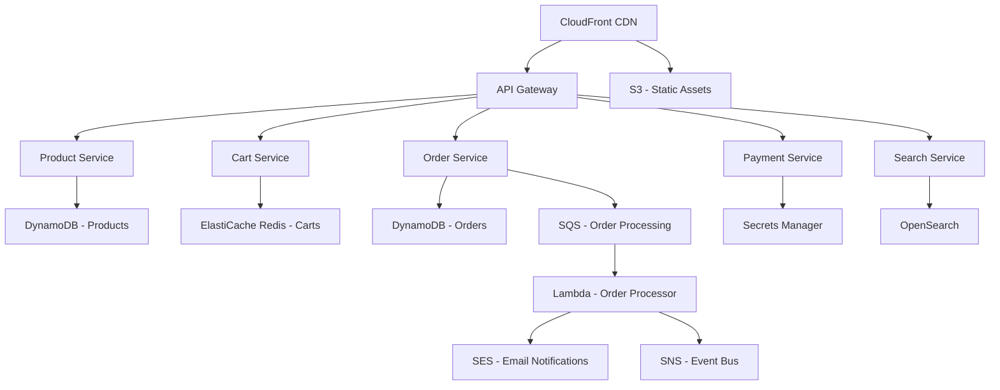

# How to Build a Scalable E-Commerce Platform on AWS

Author: [nawazdhandala](https://github.com/nawazdhandala)

Tags: AWS, E-Commerce, Scalability, Microservices, DynamoDB, Lambda, API Gateway

Description: Design and build a scalable e-commerce platform on AWS using serverless and managed services that handles traffic spikes during sales events

---

E-commerce platforms face a unique scaling challenge. Traffic is unpredictable, with massive spikes during sales events like Black Friday, followed by quiet periods. A platform that runs fine with 1,000 concurrent users can collapse under 100,000. Building on AWS gives you the tools to handle this, but only if you architect it correctly from the start.

This guide covers the architecture, key services, and implementation details for building an e-commerce platform that scales automatically and costs proportionally to your traffic.

## Architecture Overview

A modern e-commerce platform on AWS breaks down into several microservices:



## Step 1: Product Catalog Service

The product catalog is the most read-heavy part of your platform. Use DynamoDB for predictable performance at any scale.

Design the DynamoDB table with access patterns in mind:

```javascript
// Product table design
// Primary Key: PK (partition key), SK (sort key)
// Uses single-table design for efficiency

const productTableSchema = {
  TableName: 'ECommerceProducts',
  KeySchema: [
    { AttributeName: 'PK', KeyType: 'HASH' },
    { AttributeName: 'SK', KeyType: 'RANGE' },
  ],
  AttributeDefinitions: [
    { AttributeName: 'PK', AttributeType: 'S' },
    { AttributeName: 'SK', AttributeType: 'S' },
    { AttributeName: 'GSI1PK', AttributeType: 'S' },
    { AttributeName: 'GSI1SK', AttributeType: 'S' },
  ],
  GlobalSecondaryIndexes: [
    {
      IndexName: 'GSI1',
      KeySchema: [
        { AttributeName: 'GSI1PK', KeyType: 'HASH' },
        { AttributeName: 'GSI1SK', KeyType: 'RANGE' },
      ],
      Projection: { ProjectionType: 'ALL' },
    },
  ],
  BillingMode: 'PAY_PER_REQUEST',
};

// Example items:
// Product: PK=PRODUCT#123, SK=METADATA, GSI1PK=CATEGORY#Electronics, GSI1SK=PRODUCT#123
// Variant: PK=PRODUCT#123, SK=VARIANT#Red-Large
// Review:  PK=PRODUCT#123, SK=REVIEW#2026-02-12#user456
```

The Lambda function for the product API:

```javascript
// product-service/handler.js - Product catalog Lambda
const { DynamoDBClient } = require('@aws-sdk/client-dynamodb');
const { DynamoDBDocumentClient, GetCommand, QueryCommand } = require('@aws-sdk/lib-dynamodb');

const client = new DynamoDBClient({});
const docClient = DynamoDBDocumentClient.from(client);
const TABLE_NAME = process.env.TABLE_NAME;

// Get a single product with its variants
exports.getProduct = async (event) => {
  const productId = event.pathParameters.id;

  const result = await docClient.send(new QueryCommand({
    TableName: TABLE_NAME,
    KeyConditionExpression: 'PK = :pk',
    ExpressionAttributeValues: {
      ':pk': `PRODUCT#${productId}`,
    },
  }));

  // Separate metadata from variants
  const metadata = result.Items.find(item => item.SK === 'METADATA');
  const variants = result.Items.filter(item => item.SK.startsWith('VARIANT#'));

  return {
    statusCode: 200,
    body: JSON.stringify({ ...metadata, variants }),
  };
};

// List products by category with pagination
exports.listByCategory = async (event) => {
  const category = event.pathParameters.category;
  const lastKey = event.queryStringParameters?.lastKey;

  const result = await docClient.send(new QueryCommand({
    TableName: TABLE_NAME,
    IndexName: 'GSI1',
    KeyConditionExpression: 'GSI1PK = :category',
    ExpressionAttributeValues: {
      ':category': `CATEGORY#${category}`,
    },
    Limit: 20,
    ExclusiveStartKey: lastKey ? JSON.parse(lastKey) : undefined,
  }));

  return {
    statusCode: 200,
    body: JSON.stringify({
      products: result.Items,
      nextPage: result.LastEvaluatedKey
        ? Buffer.from(JSON.stringify(result.LastEvaluatedKey)).toString('base64')
        : null,
    }),
  };
};
```

## Step 2: Shopping Cart Service

Carts are temporary, frequently updated, and need sub-millisecond response times. Use ElastiCache Redis:

```javascript
// cart-service/handler.js - Shopping cart Lambda
const Redis = require('ioredis');

const redis = new Redis({
  host: process.env.REDIS_ENDPOINT,
  port: 6379,
  tls: {},
});

// Cart TTL: 7 days
const CART_TTL = 60 * 60 * 24 * 7;

exports.getCart = async (event) => {
  const userId = event.requestContext.authorizer.claims.sub;
  const cart = await redis.get(`cart:${userId}`);

  return {
    statusCode: 200,
    body: cart || JSON.stringify({ items: [], total: 0 }),
  };
};

exports.addToCart = async (event) => {
  const userId = event.requestContext.authorizer.claims.sub;
  const { productId, variantId, quantity } = JSON.parse(event.body);

  // Get existing cart or create new one
  const existing = await redis.get(`cart:${userId}`);
  const cart = existing ? JSON.parse(existing) : { items: [], total: 0 };

  // Add or update item
  const existingItem = cart.items.find(
    i => i.productId === productId && i.variantId === variantId
  );

  if (existingItem) {
    existingItem.quantity += quantity;
  } else {
    cart.items.push({ productId, variantId, quantity, addedAt: new Date().toISOString() });
  }

  // Save with TTL
  await redis.setex(`cart:${userId}`, CART_TTL, JSON.stringify(cart));

  return {
    statusCode: 200,
    body: JSON.stringify(cart),
  };
};
```

## Step 3: Order Processing Service

Orders need reliability above all else. Use DynamoDB for storage and SQS for async processing:

```javascript
// order-service/handler.js - Order placement and processing
const { SQSClient, SendMessageCommand } = require('@aws-sdk/client-sqs');
const { DynamoDBDocumentClient, PutCommand } = require('@aws-sdk/lib-dynamodb');
const { v4: uuidv4 } = require('uuid');

const sqs = new SQSClient({});
const QUEUE_URL = process.env.ORDER_QUEUE_URL;

exports.placeOrder = async (event) => {
  const userId = event.requestContext.authorizer.claims.sub;
  const { items, shippingAddress, paymentMethodId } = JSON.parse(event.body);
  const orderId = uuidv4();

  // Save order to DynamoDB with PENDING status
  await docClient.send(new PutCommand({
    TableName: process.env.ORDERS_TABLE,
    Item: {
      PK: `ORDER#${orderId}`,
      SK: 'METADATA',
      userId,
      items,
      shippingAddress,
      status: 'PENDING',
      createdAt: new Date().toISOString(),
      GSI1PK: `USER#${userId}`,
      GSI1SK: `ORDER#${new Date().toISOString()}`,
    },
  }));

  // Send to SQS for async processing (payment, inventory, notification)
  await sqs.send(new SendMessageCommand({
    QueueUrl: QUEUE_URL,
    MessageBody: JSON.stringify({
      orderId,
      userId,
      items,
      paymentMethodId,
    }),
    MessageGroupId: userId,
  }));

  return {
    statusCode: 202,
    body: JSON.stringify({ orderId, status: 'PENDING' }),
  };
};
```

The SQS consumer handles payment processing, inventory updates, and notifications:

```javascript
// order-processor/handler.js - Processes orders from SQS
exports.processOrder = async (event) => {
  for (const record of event.Records) {
    const order = JSON.parse(record.body);

    try {
      // Step 1: Process payment
      await processPayment(order);

      // Step 2: Reserve inventory
      await reserveInventory(order.items);

      // Step 3: Update order status
      await updateOrderStatus(order.orderId, 'CONFIRMED');

      // Step 4: Send confirmation email
      await sendConfirmationEmail(order);
    } catch (error) {
      // Update order to FAILED
      await updateOrderStatus(order.orderId, 'FAILED');
      // Message returns to queue for retry (DLQ after 3 attempts)
      throw error;
    }
  }
};
```

## Step 4: Search Service with OpenSearch

Product search needs full-text capabilities that DynamoDB cannot provide. Use OpenSearch:

```javascript
// search-service/handler.js - Product search with OpenSearch
const { Client } = require('@opensearch-project/opensearch');

const client = new Client({
  node: process.env.OPENSEARCH_ENDPOINT,
});

exports.search = async (event) => {
  const { q, category, minPrice, maxPrice, page = 1 } = event.queryStringParameters;

  // Build the search query with filters
  const must = [{ multi_match: { query: q, fields: ['name^3', 'description', 'tags'] } }];
  const filter = [];

  if (category) {
    filter.push({ term: { 'category.keyword': category } });
  }
  if (minPrice || maxPrice) {
    filter.push({
      range: {
        price: {
          ...(minPrice && { gte: parseFloat(minPrice) }),
          ...(maxPrice && { lte: parseFloat(maxPrice) }),
        },
      },
    });
  }

  const result = await client.search({
    index: 'products',
    body: {
      query: { bool: { must, filter } },
      from: (page - 1) * 20,
      size: 20,
      sort: [{ _score: 'desc' }, { createdAt: 'desc' }],
      aggs: {
        categories: { terms: { field: 'category.keyword' } },
        price_ranges: {
          range: {
            field: 'price',
            ranges: [
              { to: 25 },
              { from: 25, to: 50 },
              { from: 50, to: 100 },
              { from: 100 },
            ],
          },
        },
      },
    },
  });

  return {
    statusCode: 200,
    body: JSON.stringify({
      hits: result.body.hits.hits.map(h => h._source),
      total: result.body.hits.total.value,
      facets: result.body.aggregations,
    }),
  };
};
```

## Step 5: API Gateway Configuration

Wire everything together with API Gateway:

```yaml
# serverless.yml or SAM template - API routes
Resources:
  HttpApi:
    Type: AWS::ApiGatewayV2::Api
    Properties:
      Name: ecommerce-api
      ProtocolType: HTTP

  # Product routes
  GetProductRoute:
    Type: AWS::ApiGatewayV2::Route
    Properties:
      ApiId: !Ref HttpApi
      RouteKey: GET /products/{id}
      Target: !Sub integrations/${ProductIntegration}

  ListByCategoryRoute:
    Type: AWS::ApiGatewayV2::Route
    Properties:
      ApiId: !Ref HttpApi
      RouteKey: GET /categories/{category}/products
      Target: !Sub integrations/${ProductIntegration}

  # Cart routes
  GetCartRoute:
    Type: AWS::ApiGatewayV2::Route
    Properties:
      ApiId: !Ref HttpApi
      RouteKey: GET /cart
      AuthorizationType: JWT
      Target: !Sub integrations/${CartIntegration}

  # Order routes
  PlaceOrderRoute:
    Type: AWS::ApiGatewayV2::Route
    Properties:
      ApiId: !Ref HttpApi
      RouteKey: POST /orders
      AuthorizationType: JWT
      Target: !Sub integrations/${OrderIntegration}
```

## Handling Traffic Spikes

The key to surviving a Black Friday traffic spike is pre-provisioning and auto-scaling:

1. **DynamoDB on-demand mode**: Automatically scales read/write capacity. No provisioning needed.
2. **Lambda concurrency**: Set reserved concurrency for critical functions (cart, orders) so less critical functions (search analytics) cannot starve them.
3. **ElastiCache scaling**: Use cluster mode to shard across nodes for higher throughput.
4. **CloudFront caching**: Cache product pages aggressively so most requests never hit your backend.

```bash
# Set reserved concurrency for the order processing function
aws lambda put-function-concurrency \
  --function-name order-service \
  --reserved-concurrent-executions 500
```

## Monitoring

Track these metrics for your e-commerce platform:

- Order conversion rate (cart to order)
- Payment failure rate
- Search latency (P99)
- Cart abandonment events
- Inventory reservation failures

For more on building a comprehensive monitoring setup, see our guide on [building a metrics collection system on AWS](https://oneuptime.com/blog/post/2026-02-12-build-a-metrics-collection-system-on-aws/view).

## Wrapping Up

Building an e-commerce platform on AWS is not about picking the fanciest services. It is about matching each service to its workload: DynamoDB for predictable CRUD, Redis for ephemeral session data, SQS for reliable async processing, and OpenSearch for full-text search. This architecture scales from your first customer to millions without architectural changes, and you only pay for what you use.
