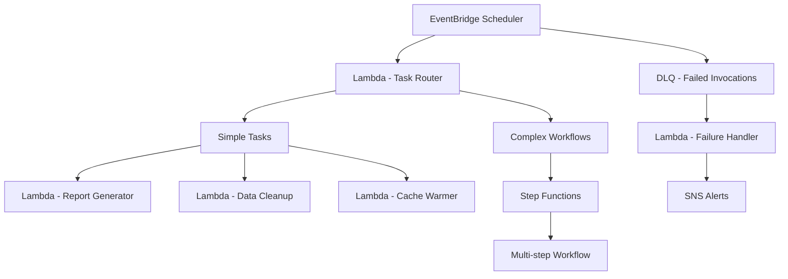

# How to Build a Scheduled Task System on AWS Without Servers

Author: [nawazdhandala](https://github.com/nawazdhandala)

Tags: AWS, Serverless, EventBridge, Lambda, Step Functions, Scheduling

Description: Build a robust serverless scheduled task system on AWS using EventBridge Scheduler, Lambda, and Step Functions with retry logic and monitoring.

---

Cron jobs are the backbone of most backend systems. Report generation, data cleanup, cache warming, billing runs, email digests - every application has tasks that need to run on a schedule. Traditionally, you would throw these on a server with crontab and hope that server stays up. That approach fails in obvious ways: the server goes down, cron jobs silently fail, there is no retry logic, and scaling is a nightmare.

AWS gives you a fully serverless alternative. In this guide, we will build a scheduled task system using EventBridge Scheduler, Lambda, and Step Functions that handles retries, error tracking, and task dependencies without a single server.

## Architecture



## EventBridge Scheduler vs. EventBridge Rules

You might be wondering why we are using EventBridge Scheduler instead of regular EventBridge rules with schedule expressions. Both work, but Scheduler offers advantages:

- One-time schedules (not just recurring)
- Built-in retry policies with configurable attempts
- Dead letter queues for failed invocations
- Time zone support (no more UTC-only headaches)
- Much higher limits (millions of schedules vs. 300 rules per bus)

## Setting Up the Scheduler Infrastructure

Here is the CloudFormation for the core infrastructure:

```yaml
# CloudFormation for serverless scheduling infrastructure
AWSTemplateFormatVersion: '2010-09-09'
Resources:
  # DLQ for failed schedule invocations
  SchedulerDLQ:
    Type: AWS::SQS::Queue
    Properties:
      QueueName: scheduler-dlq
      MessageRetentionPeriod: 1209600  # 14 days

  # IAM role for EventBridge Scheduler
  SchedulerRole:
    Type: AWS::IAM::Role
    Properties:
      AssumeRolePolicyDocument:
        Version: '2012-10-17'
        Statement:
          - Effect: Allow
            Principal:
              Service: scheduler.amazonaws.com
            Action: sts:AssumeRole
      Policies:
        - PolicyName: InvokeLambda
          PolicyDocument:
            Statement:
              - Effect: Allow
                Action: lambda:InvokeFunction
                Resource: '*'
        - PolicyName: SendToDLQ
          PolicyDocument:
            Statement:
              - Effect: Allow
                Action: sqs:SendMessage
                Resource: !GetAtt SchedulerDLQ.Arn

  # Task tracking table
  TaskRegistry:
    Type: AWS::DynamoDB::Table
    Properties:
      TableName: ScheduledTasks
      BillingMode: PAY_PER_REQUEST
      AttributeDefinitions:
        - AttributeName: taskId
          AttributeType: S
        - AttributeName: nextRun
          AttributeType: S
      KeySchema:
        - AttributeName: taskId
          KeyType: HASH
      GlobalSecondaryIndexes:
        - IndexName: NextRunIndex
          KeySchema:
            - AttributeName: nextRun
              KeyType: HASH
          Projection:
            ProjectionType: ALL
```

## Creating Scheduled Tasks

Here is how to create different types of scheduled tasks programmatically:

```python
# Lambda function to manage scheduled tasks
import boto3
import json
from datetime import datetime

scheduler = boto3.client('scheduler')

def create_recurring_task(task_id, schedule_expression, target_lambda_arn, payload, timezone='America/New_York'):
    """Create a recurring scheduled task."""
    scheduler.create_schedule(
        Name=task_id,
        ScheduleExpression=schedule_expression,
        ScheduleExpressionTimezone=timezone,
        FlexibleTimeWindow={'Mode': 'OFF'},
        Target={
            'Arn': target_lambda_arn,
            'RoleArn': 'arn:aws:iam::123456789:role/SchedulerRole',
            'Input': json.dumps(payload),
            'RetryPolicy': {
                'MaximumRetryAttempts': 3,
                'MaximumEventAgeInSeconds': 3600
            },
            'DeadLetterConfig': {
                'Arn': 'arn:aws:sqs:us-east-1:123456789:scheduler-dlq'
            }
        }
    )

def create_one_time_task(task_id, run_at, target_lambda_arn, payload):
    """Create a one-time scheduled task that runs at a specific time."""
    schedule_time = run_at.strftime('%Y-%m-%dT%H:%M:%S')
    scheduler.create_schedule(
        Name=task_id,
        ScheduleExpression=f'at({schedule_time})',
        FlexibleTimeWindow={'Mode': 'OFF'},
        Target={
            'Arn': target_lambda_arn,
            'RoleArn': 'arn:aws:iam::123456789:role/SchedulerRole',
            'Input': json.dumps(payload),
            'RetryPolicy': {
                'MaximumRetryAttempts': 3,
                'MaximumEventAgeInSeconds': 7200
            },
            'DeadLetterConfig': {
                'Arn': 'arn:aws:sqs:us-east-1:123456789:scheduler-dlq'
            }
        },
        # Auto-delete the schedule after it runs
        ActionAfterCompletion='DELETE'
    )

# Example: Create a daily report generation task at 8 AM Eastern
create_recurring_task(
    task_id='daily-sales-report',
    schedule_expression='cron(0 8 * * ? *)',
    target_lambda_arn='arn:aws:lambda:us-east-1:123456789:function:generate-report',
    payload={'reportType': 'daily-sales', 'format': 'pdf'},
    timezone='America/New_York'
)

# Example: Create a weekly cleanup task on Sundays at 2 AM
create_recurring_task(
    task_id='weekly-data-cleanup',
    schedule_expression='cron(0 2 ? * SUN *)',
    target_lambda_arn='arn:aws:lambda:us-east-1:123456789:function:data-cleanup',
    payload={'retentionDays': 90}
)
```

## Building the Task Router

For applications with many scheduled tasks, a task router pattern keeps things organized:

```python
# Central task router that dispatches to the right handler
import json
import importlib
from datetime import datetime

# Registry of task handlers
TASK_HANDLERS = {
    'daily-sales-report': 'handlers.reports.generate_sales_report',
    'weekly-data-cleanup': 'handlers.cleanup.run_cleanup',
    'cache-refresh': 'handlers.cache.refresh_all',
    'billing-run': 'handlers.billing.process_billing',
    'email-digest': 'handlers.notifications.send_digest'
}

def handler(event, context):
    task_type = event.get('taskType')
    task_params = event.get('params', {})

    if task_type not in TASK_HANDLERS:
        raise ValueError(f'Unknown task type: {task_type}')

    # Dynamically import and run the handler
    module_path, func_name = TASK_HANDLERS[task_type].rsplit('.', 1)
    module = importlib.import_module(module_path)
    task_func = getattr(module, func_name)

    start_time = datetime.utcnow()

    try:
        result = task_func(task_params)
        duration = (datetime.utcnow() - start_time).total_seconds()

        # Log task execution metrics
        print(json.dumps({
            'taskType': task_type,
            'status': 'SUCCESS',
            'duration': duration,
            'result': str(result)[:500]
        }))

        return {'status': 'SUCCESS', 'duration': duration}

    except Exception as e:
        duration = (datetime.utcnow() - start_time).total_seconds()
        print(json.dumps({
            'taskType': task_type,
            'status': 'FAILED',
            'duration': duration,
            'error': str(e)
        }))
        raise  # Re-raise so Scheduler's retry policy kicks in
```

## Complex Workflows with Step Functions

Some scheduled tasks involve multiple steps that depend on each other. Use Step Functions for these:

```json
{
  "Comment": "Monthly billing workflow",
  "StartAt": "FetchUsageData",
  "States": {
    "FetchUsageData": {
      "Type": "Task",
      "Resource": "arn:aws:lambda:us-east-1:123456789:function:fetch-usage",
      "ResultPath": "$.usageData",
      "Retry": [
        {
          "ErrorEquals": ["States.TaskFailed"],
          "IntervalSeconds": 60,
          "MaxAttempts": 3,
          "BackoffRate": 2.0
        }
      ],
      "Next": "CalculateCharges"
    },
    "CalculateCharges": {
      "Type": "Task",
      "Resource": "arn:aws:lambda:us-east-1:123456789:function:calculate-charges",
      "ResultPath": "$.charges",
      "Next": "GenerateInvoices"
    },
    "GenerateInvoices": {
      "Type": "Map",
      "ItemsPath": "$.charges.customers",
      "MaxConcurrency": 10,
      "Iterator": {
        "StartAt": "CreateInvoice",
        "States": {
          "CreateInvoice": {
            "Type": "Task",
            "Resource": "arn:aws:lambda:us-east-1:123456789:function:create-invoice",
            "Next": "SendInvoiceEmail"
          },
          "SendInvoiceEmail": {
            "Type": "Task",
            "Resource": "arn:aws:lambda:us-east-1:123456789:function:send-invoice",
            "End": true
          }
        }
      },
      "Next": "UpdateBillingRecords"
    },
    "UpdateBillingRecords": {
      "Type": "Task",
      "Resource": "arn:aws:lambda:us-east-1:123456789:function:update-records",
      "End": true
    }
  }
}
```

Trigger this Step Functions workflow from EventBridge Scheduler:

```python
# Schedule a Step Functions workflow execution
scheduler.create_schedule(
    Name='monthly-billing-workflow',
    ScheduleExpression='cron(0 0 1 * ? *)',  # First of every month at midnight
    ScheduleExpressionTimezone='UTC',
    FlexibleTimeWindow={'Mode': 'OFF'},
    Target={
        'Arn': 'arn:aws:states:us-east-1:123456789:stateMachine:billing-workflow',
        'RoleArn': 'arn:aws:iam::123456789:role/SchedulerRole',
        'Input': json.dumps({'month': '{{$.time}}'}),
        'RetryPolicy': {
            'MaximumRetryAttempts': 2,
            'MaximumEventAgeInSeconds': 3600
        }
    }
)
```

## Handling Failed Tasks

The DLQ catches tasks that failed after all retry attempts. Process them with a failure handler:

```python
# Lambda to process failed scheduled tasks from the DLQ
import boto3
import json

sns = boto3.client('sns')
dynamodb = boto3.resource('dynamodb')
table = dynamodb.Table('FailedTasks')

def handler(event, context):
    for record in event['Records']:
        body = json.loads(record['body'])

        # Store the failure for investigation
        table.put_item(Item={
            'messageId': record['messageId'],
            'taskPayload': json.dumps(body),
            'failedAt': record['attributes']['SentTimestamp'],
            'retryCount': record['attributes'].get('ApproximateReceiveCount', '0'),
            'status': 'NEEDS_INVESTIGATION'
        })

        # Alert the team
        sns.publish(
            TopicArn='arn:aws:sns:us-east-1:123456789:task-failures',
            Subject='Scheduled Task Failed After Retries',
            Message=json.dumps(body, indent=2)
        )

    return {'processed': len(event['Records'])}
```

## Monitoring Scheduled Tasks

Silent failures are the biggest risk with scheduled tasks. A task that stops running is worse than a task that fails loudly. Set up monitoring that detects both failures and missing executions.

Use CloudWatch metric filters to track task execution:

```python
# Custom metrics for task execution monitoring
import boto3

cloudwatch = boto3.client('cloudwatch')

def publish_task_metric(task_type, status, duration):
    """Publish custom metrics for scheduled task execution."""
    cloudwatch.put_metric_data(
        Namespace='ScheduledTasks',
        MetricData=[
            {
                'MetricName': 'TaskExecution',
                'Dimensions': [
                    {'Name': 'TaskType', 'Value': task_type},
                    {'Name': 'Status', 'Value': status}
                ],
                'Value': 1,
                'Unit': 'Count'
            },
            {
                'MetricName': 'TaskDuration',
                'Dimensions': [
                    {'Name': 'TaskType', 'Value': task_type}
                ],
                'Value': duration,
                'Unit': 'Seconds'
            }
        ]
    )
```

For a centralized view of all your scheduled tasks - whether they ran, how long they took, and whether they succeeded - consider using [OneUptime](https://oneuptime.com/blog/post/build-a-dead-letter-queue-processing-system-on-aws/view) to set up uptime monitors and alerting for your critical background jobs.

## Wrapping Up

Serverless scheduled tasks on AWS are more reliable, more scalable, and cheaper than running cron on servers. EventBridge Scheduler handles the timing, Lambda runs the tasks, Step Functions orchestrates complex workflows, and DLQs catch failures. You get built-in retries, time zone support, and the ability to create millions of schedules.

The total cost for most applications is pennies per day. A task that runs once daily and takes 10 seconds costs less than a fraction of a cent per month in Lambda charges. Compare that to running a t3.small 24/7 just for cron jobs.
