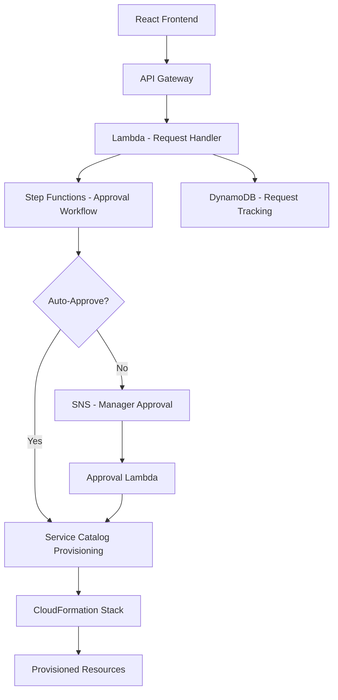

# How to Build a Self-Service Portal for AWS Resources

Author: [nawazdhandala](https://github.com/nawazdhandala)

Tags: AWS, Service Catalog, Self-Service, IAM, CloudFormation

Description: Build a self-service portal that lets developers provision approved AWS resources safely using Service Catalog, Lambda, and Step Functions.

---

Every growing engineering team hits the same bottleneck: developers need AWS resources, but the platform team cannot keep up with requests. Tickets pile up. People wait days for an S3 bucket or an RDS instance. So developers start sharing credentials or creating resources in ways that bypass security controls.

A self-service portal solves this. Developers pick from a menu of pre-approved resources, fill in some parameters, and the portal provisions everything with the right tags, security settings, and compliance guardrails baked in.

## What We Are Building

The portal lets developers:
- Browse a catalog of approved AWS resources
- Request provisioning with customizable parameters
- Track the status of their requests
- See what they have provisioned and estimated costs
- Tear down resources they no longer need



## Setting Up AWS Service Catalog

Service Catalog is the backbone of our portal. It lets you define "products" - CloudFormation templates that developers can launch without needing direct CloudFormation access.

First, create a portfolio and add some products:

```yaml
# CloudFormation template for Service Catalog portfolio and products
AWSTemplateFormatVersion: '2010-09-09'
Resources:
  DevPortfolio:
    Type: AWS::ServiceCatalog::Portfolio
    Properties:
      DisplayName: Developer Self-Service
      Description: Pre-approved resources for dev teams
      ProviderName: Platform Team

  # S3 bucket product
  S3Product:
    Type: AWS::ServiceCatalog::CloudFormationProduct
    Properties:
      Name: Secure S3 Bucket
      Description: An encrypted S3 bucket with versioning and lifecycle rules
      Owner: Platform Team
      ProvisioningArtifactParameters:
        - Name: v1.0
          Info:
            LoadTemplateFromURL: https://s3.amazonaws.com/templates/s3-bucket.yaml

  # RDS instance product
  RDSProduct:
    Type: AWS::ServiceCatalog::CloudFormationProduct
    Properties:
      Name: PostgreSQL RDS Instance
      Description: A PostgreSQL RDS instance with automated backups
      Owner: Platform Team
      ProvisioningArtifactParameters:
        - Name: v1.0
          Info:
            LoadTemplateFromURL: https://s3.amazonaws.com/templates/rds-postgres.yaml

  # Associate products with portfolio
  S3Association:
    Type: AWS::ServiceCatalog::PortfolioProductAssociation
    Properties:
      PortfolioId: !Ref DevPortfolio
      ProductId: !Ref S3Product

  RDSAssociation:
    Type: AWS::ServiceCatalog::PortfolioProductAssociation
    Properties:
      PortfolioId: !Ref DevPortfolio
      ProductId: !Ref RDSProduct
```

Here is what one of the product templates looks like. This S3 bucket template enforces encryption, versioning, and proper tagging:

```yaml
# S3 product template with security controls baked in
AWSTemplateFormatVersion: '2010-09-09'
Parameters:
  BucketPurpose:
    Type: String
    AllowedValues: [data-lake, application-assets, logs, backups]
  TeamName:
    Type: String
    AllowedPattern: '[a-z0-9-]+'
  Environment:
    Type: String
    AllowedValues: [dev, staging, prod]

Resources:
  Bucket:
    Type: AWS::S3::Bucket
    Properties:
      BucketName: !Sub '${TeamName}-${BucketPurpose}-${Environment}'
      BucketEncryption:
        ServerSideEncryptionConfiguration:
          - ServerSideEncryptionByDefault:
              SSEAlgorithm: aws:kms
      VersioningConfiguration:
        Status: Enabled
      PublicAccessBlockConfiguration:
        BlockPublicAcls: true
        BlockPublicPolicy: true
        IgnorePublicAcls: true
        RestrictPublicBuckets: true
      LifecycleConfiguration:
        Rules:
          - Id: TransitionToIA
            Status: Enabled
            Transitions:
              - StorageClass: STANDARD_IA
                TransitionInDays: 30
      Tags:
        - Key: Team
          Value: !Ref TeamName
        - Key: Environment
          Value: !Ref Environment
        - Key: ManagedBy
          Value: self-service-portal
```

Notice that public access is blocked, encryption is mandatory, and tags are enforced. Developers cannot skip these controls because the template is the only way to provision through the portal.

## Building the Request Handler

The Lambda function that handles provisioning requests validates inputs and kicks off the Step Functions workflow:

```python
# Lambda function to handle resource provisioning requests
import boto3
import json
import uuid
from datetime import datetime

dynamodb = boto3.resource('dynamodb')
sfn_client = boto3.client('stepfunctions')
table = dynamodb.Table('ProvisioningRequests')

PRODUCT_MAP = {
    's3-bucket': {
        'productId': 'prod-abc123',
        'artifactId': 'pa-xyz789',
        'autoApprove': True,
        'maxPerTeam': 10
    },
    'rds-postgres': {
        'productId': 'prod-def456',
        'artifactId': 'pa-uvw012',
        'autoApprove': False,
        'maxPerTeam': 3
    }
}

def handler(event, context):
    body = json.loads(event['body'])
    user = event['requestContext']['authorizer']['claims']['email']
    team = event['requestContext']['authorizer']['claims']['custom:team']

    product_key = body['productType']
    parameters = body['parameters']

    if product_key not in PRODUCT_MAP:
        return respond(400, {'error': 'Unknown product type'})

    product = PRODUCT_MAP[product_key]

    # Check team quota
    existing = table.query(
        IndexName='TeamProductIndex',
        KeyConditionExpression='teamName = :t AND productType = :p',
        ExpressionAttributeValues={
            ':t': team,
            ':p': product_key
        }
    )
    if len(existing['Items']) >= product['maxPerTeam']:
        return respond(400, {'error': f'Team quota exceeded. Max {product["maxPerTeam"]} allowed.'})

    # Create the request record
    request_id = str(uuid.uuid4())
    table.put_item(Item={
        'requestId': request_id,
        'userId': user,
        'teamName': team,
        'productType': product_key,
        'parameters': parameters,
        'status': 'PENDING',
        'createdAt': datetime.utcnow().isoformat()
    })

    # Start the provisioning workflow
    sfn_client.start_execution(
        stateMachineArn='arn:aws:states:us-east-1:123456789:stateMachine:ProvisioningWorkflow',
        input=json.dumps({
            'requestId': request_id,
            'productKey': product_key,
            'product': product,
            'parameters': parameters,
            'user': user,
            'team': team,
            'autoApprove': product['autoApprove']
        })
    )

    return respond(202, {'requestId': request_id, 'status': 'PENDING'})

def respond(status, body):
    return {
        'statusCode': status,
        'headers': {'Content-Type': 'application/json'},
        'body': json.dumps(body)
    }
```

## The Approval Workflow with Step Functions

The Step Functions state machine handles the approval flow. Some resources auto-approve (like S3 buckets), while others (like RDS instances) need manager approval:

```json
{
  "Comment": "Resource provisioning approval workflow",
  "StartAt": "CheckAutoApprove",
  "States": {
    "CheckAutoApprove": {
      "Type": "Choice",
      "Choices": [
        {
          "Variable": "$.autoApprove",
          "BooleanEquals": true,
          "Next": "ProvisionResource"
        }
      ],
      "Default": "RequestApproval"
    },
    "RequestApproval": {
      "Type": "Task",
      "Resource": "arn:aws:states:::sns:publish.waitForTaskToken",
      "Parameters": {
        "TopicArn": "arn:aws:sns:us-east-1:123456789:approval-requests",
        "Message": {
          "requestId.$": "$.requestId",
          "user.$": "$.user",
          "team.$": "$.team",
          "productKey.$": "$.productKey",
          "taskToken.$": "$$.Task.Token"
        }
      },
      "TimeoutSeconds": 86400,
      "Next": "ProvisionResource",
      "Catch": [
        {
          "ErrorEquals": ["States.Timeout"],
          "Next": "RequestTimedOut"
        }
      ]
    },
    "ProvisionResource": {
      "Type": "Task",
      "Resource": "arn:aws:lambda:us-east-1:123456789:function:ProvisionViaServiceCatalog",
      "Next": "UpdateStatus"
    },
    "UpdateStatus": {
      "Type": "Task",
      "Resource": "arn:aws:lambda:us-east-1:123456789:function:UpdateRequestStatus",
      "End": true
    },
    "RequestTimedOut": {
      "Type": "Task",
      "Resource": "arn:aws:lambda:us-east-1:123456789:function:HandleTimeout",
      "End": true
    }
  }
}
```

## The Provisioning Lambda

This function actually provisions the resource through Service Catalog:

```python
# Lambda to provision resources via AWS Service Catalog
import boto3

sc_client = boto3.client('servicecatalog')

def handler(event, context):
    product = event['product']
    parameters = event['parameters']
    request_id = event['requestId']

    # Convert parameters to Service Catalog format
    provisioning_params = [
        {'Key': k, 'Value': v}
        for k, v in parameters.items()
    ]

    response = sc_client.provision_product(
        ProductId=product['productId'],
        ProvisioningArtifactId=product['artifactId'],
        ProvisionedProductName=f'portal-{request_id[:8]}',
        ProvisioningParameters=provisioning_params,
        Tags=[
            {'Key': 'RequestId', 'Value': request_id},
            {'Key': 'ProvisionedBy', 'Value': 'self-service-portal'}
        ]
    )

    return {
        'requestId': request_id,
        'provisionedProductId': response['RecordDetail']['ProvisionedProductId'],
        'status': 'PROVISIONING'
    }
```

## Resource Cleanup and TTL

Self-service portals often lead to resource sprawl. Build in TTL (time-to-live) enforcement:

```python
# Lambda to check for expired resources and notify owners
import boto3
from datetime import datetime, timedelta

dynamodb = boto3.resource('dynamodb')
ses_client = boto3.client('ses')
table = dynamodb.Table('ProvisioningRequests')

def handler(event, context):
    # Find resources older than 30 days without renewal
    cutoff = (datetime.utcnow() - timedelta(days=30)).isoformat()

    response = table.scan(
        FilterExpression='createdAt < :cutoff AND #s = :active AND attribute_not_exists(renewedAt)',
        ExpressionAttributeNames={'#s': 'status'},
        ExpressionAttributeValues={
            ':cutoff': cutoff,
            ':active': 'ACTIVE'
        }
    )

    for item in response['Items']:
        # Send warning email to the resource owner
        ses_client.send_email(
            Source='platform-team@company.com',
            Destination={'ToAddresses': [item['userId']]},
            Message={
                'Subject': {'Data': f'Resource expiring: {item["productType"]}'},
                'Body': {'Text': {'Data': (
                    f'Your {item["productType"]} (request {item["requestId"]}) '
                    f'will be terminated in 7 days unless you renew it.\n\n'
                    f'Renew at: https://portal.company.com/requests/{item["requestId"]}'
                )}}
            }
        )
```

## Monitoring and Audit

Track everything. Every provisioning request, approval, and teardown should be logged. For operational monitoring of the portal itself - uptime, API response times, Lambda error rates - you can integrate with [OneUptime](https://oneuptime.com/blog/post/build-a-cost-dashboard-for-aws-multi-account/view) to make sure developers always have access to the portal when they need it.

CloudTrail will capture all Service Catalog API calls, giving you a full audit trail of who provisioned what and when.

## Wrapping Up

A self-service portal transforms how developers interact with cloud infrastructure. Instead of waiting on tickets, they get resources in minutes. Instead of bypassing security controls, they work within them. The platform team shifts from being a bottleneck to being a product team that maintains and improves the catalog.

Start with two or three common resource types - S3 buckets, RDS instances, and maybe ECS services. Get feedback from developers, iterate on the templates, and expand the catalog over time. The combination of Service Catalog, Step Functions, and Lambda gives you all the flexibility you need.
