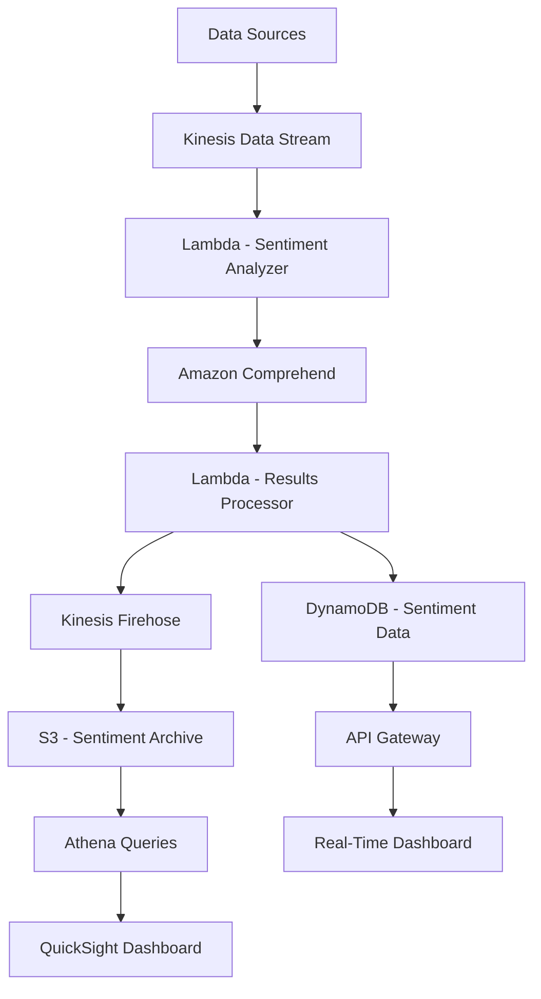

# How to Build a Sentiment Analysis Dashboard on AWS

Author: [nawazdhandala](https://github.com/nawazdhandala)

Tags: AWS, Comprehend, Sentiment Analysis, Lambda, QuickSight

Description: Build a real-time sentiment analysis dashboard on AWS using Comprehend, Kinesis, Lambda, and QuickSight to track customer sentiment across channels.

---

Customer sentiment is a leading indicator. When sentiment drops, churn follows. When it spikes positive after a product launch, you know you hit the mark. But most companies only measure sentiment through periodic surveys that arrive weeks late with low response rates.

A real-time sentiment analysis dashboard changes this. Feed in customer reviews, support tickets, social media mentions, and chat transcripts, and you get a live view of how customers feel about your product. AWS Comprehend does the heavy lifting for natural language processing, and the rest is plumbing.

## Architecture



## Setting Up the Data Ingestion Pipeline

Customer feedback arrives from multiple sources. We use Kinesis Data Streams as the central ingestion point:

```yaml
# CloudFormation for sentiment analysis pipeline
AWSTemplateFormatVersion: '2010-09-09'
Resources:
  FeedbackStream:
    Type: AWS::Kinesis::Stream
    Properties:
      Name: customer-feedback
      ShardCount: 2
      RetentionPeriodHours: 24

  SentimentTable:
    Type: AWS::DynamoDB::Table
    Properties:
      TableName: SentimentData
      BillingMode: PAY_PER_REQUEST
      AttributeDefinitions:
        - AttributeName: pk
          AttributeType: S
        - AttributeName: sk
          AttributeType: S
      KeySchema:
        - AttributeName: pk
          KeyType: HASH
        - AttributeName: sk
          KeyType: RANGE
      TimeToLiveSpecification:
        AttributeName: ttl
        Enabled: true
```

## Feeding Data from Multiple Sources

Create connectors for each feedback source:

```python
# Connectors to ingest feedback from various sources into Kinesis
import boto3
import json
from datetime import datetime

kinesis = boto3.client('kinesis')

def ingest_feedback(source, text, metadata=None):
    """Send a feedback item to the Kinesis stream for analysis."""
    record = {
        'source': source,
        'text': text,
        'metadata': metadata or {},
        'timestamp': datetime.utcnow().isoformat(),
        'id': f'{source}-{datetime.utcnow().timestamp()}'
    }

    kinesis.put_record(
        StreamName='customer-feedback',
        Data=json.dumps(record),
        PartitionKey=source
    )

# Connector: Process incoming support tickets
def process_support_ticket(ticket):
    ingest_feedback(
        source='support',
        text=ticket['description'],
        metadata={
            'ticketId': ticket['id'],
            'category': ticket['category'],
            'priority': ticket['priority'],
            'customerId': ticket['customerId']
        }
    )

# Connector: Process app store reviews
def process_app_review(review):
    ingest_feedback(
        source='app_store',
        text=review['body'],
        metadata={
            'rating': review['rating'],
            'platform': review['platform'],
            'appVersion': review['version']
        }
    )

# Connector: Process NPS survey responses
def process_nps_response(response):
    ingest_feedback(
        source='nps',
        text=response['comment'],
        metadata={
            'score': response['score'],
            'surveyId': response['surveyId'],
            'customerId': response['customerId']
        }
    )

# Connector: Process social media mentions
def process_social_mention(mention):
    ingest_feedback(
        source='social',
        text=mention['text'],
        metadata={
            'platform': mention['platform'],
            'username': mention['username'],
            'postUrl': mention['url']
        }
    )
```

## Analyzing Sentiment with Comprehend

The core Lambda function reads from Kinesis and runs each piece of feedback through Comprehend:

```python
# Lambda - Analyze sentiment of customer feedback using Comprehend
import boto3
import json
import base64
from datetime import datetime
import time

comprehend = boto3.client('comprehend')
dynamodb = boto3.resource('dynamodb')
sentiment_table = dynamodb.Table('SentimentData')

def handler(event, context):
    results = []

    for record in event['Records']:
        # Decode the Kinesis record
        payload = json.loads(base64.b64decode(record['kinesis']['data']))
        text = payload['text']
        source = payload['source']

        if not text or len(text.strip()) < 10:
            continue

        # Run sentiment analysis
        sentiment_response = comprehend.detect_sentiment(
            Text=text[:5000],
            LanguageCode='en'
        )

        # Run key phrase extraction
        phrases_response = comprehend.detect_key_phrases(
            Text=text[:5000],
            LanguageCode='en'
        )

        # Run entity detection
        entities_response = comprehend.detect_entities(
            Text=text[:5000],
            LanguageCode='en'
        )

        result = {
            'id': payload['id'],
            'source': source,
            'text': text[:500],
            'sentiment': sentiment_response['Sentiment'],
            'sentimentScores': {
                'positive': str(round(sentiment_response['SentimentScore']['Positive'], 4)),
                'negative': str(round(sentiment_response['SentimentScore']['Negative'], 4)),
                'neutral': str(round(sentiment_response['SentimentScore']['Neutral'], 4)),
                'mixed': str(round(sentiment_response['SentimentScore']['Mixed'], 4))
            },
            'keyPhrases': [
                p['Text'] for p in phrases_response['KeyPhrases']
                if p['Score'] > 0.8
            ][:10],
            'entities': [
                {'text': e['Text'], 'type': e['Type']}
                for e in entities_response['Entities']
                if e['Score'] > 0.8
            ][:10],
            'metadata': payload.get('metadata', {}),
            'analyzedAt': datetime.utcnow().isoformat()
        }

        # Store in DynamoDB
        store_sentiment_data(result)
        results.append(result)

    return {'processed': len(results)}

def store_sentiment_data(result):
    """Store sentiment analysis results in DynamoDB."""
    now = datetime.utcnow()
    date_str = now.strftime('%Y-%m-%d')
    hour_str = now.strftime('%Y-%m-%dT%H')

    # Individual record
    sentiment_table.put_item(Item={
        'pk': f'RECORD#{result["id"]}',
        'sk': result['analyzedAt'],
        'source': result['source'],
        'sentiment': result['sentiment'],
        'sentimentScores': result['sentimentScores'],
        'keyPhrases': result['keyPhrases'],
        'text': result['text'],
        'metadata': result['metadata'],
        'ttl': int(time.time()) + (90 * 86400)  # Keep for 90 days
    })

    # Hourly aggregation counter
    sentiment_table.update_item(
        Key={
            'pk': f'HOURLY#{result["source"]}',
            'sk': hour_str
        },
        UpdateExpression='ADD #total :one, #sent :one SET #src = :source',
        ExpressionAttributeNames={
            '#total': 'totalCount',
            '#sent': f'{result["sentiment"].lower()}Count',
            '#src': 'source'
        },
        ExpressionAttributeValues={
            ':one': 1,
            ':source': result['source']
        }
    )
```

## Building the Sentiment API

Expose the sentiment data through an API for the dashboard:

```python
# Lambda - API endpoints for the sentiment dashboard
import boto3
import json
from datetime import datetime, timedelta
from boto3.dynamodb.conditions import Key

dynamodb = boto3.resource('dynamodb')
table = dynamodb.Table('SentimentData')

def handler(event, context):
    path = event['path']
    params = event.get('queryStringParameters', {}) or {}

    if '/summary' in path:
        return get_summary(params)
    elif '/trend' in path:
        return get_trend(params)
    elif '/recent' in path:
        return get_recent(params)
    elif '/topics' in path:
        return get_top_topics(params)

    return respond(404, {'error': 'Not found'})

def get_summary(params):
    """Get sentiment summary for the last 24 hours."""
    hours = int(params.get('hours', '24'))
    source = params.get('source', 'all')

    now = datetime.utcnow()
    summary = {'positive': 0, 'negative': 0, 'neutral': 0, 'mixed': 0, 'total': 0}

    for h in range(hours):
        hour_str = (now - timedelta(hours=h)).strftime('%Y-%m-%dT%H')
        prefix = f'HOURLY#{source}' if source != 'all' else 'HOURLY#'

        if source != 'all':
            response = table.get_item(Key={'pk': prefix, 'sk': hour_str})
            item = response.get('Item', {})
            summary['positive'] += int(item.get('positiveCount', 0))
            summary['negative'] += int(item.get('negativeCount', 0))
            summary['neutral'] += int(item.get('neutralCount', 0))
            summary['mixed'] += int(item.get('mixedCount', 0))
            summary['total'] += int(item.get('totalCount', 0))

    if summary['total'] > 0:
        summary['positivePercent'] = round(summary['positive'] / summary['total'] * 100, 1)
        summary['negativePercent'] = round(summary['negative'] / summary['total'] * 100, 1)

    return respond(200, summary)

def get_recent(params):
    """Get the most recent sentiment results."""
    limit = int(params.get('limit', '20'))
    sentiment_filter = params.get('sentiment', None)

    # Scan recent records (in production, use a GSI for better performance)
    response = table.scan(
        FilterExpression='begins_with(pk, :prefix)',
        ExpressionAttributeValues={':prefix': 'RECORD#'},
        Limit=limit * 3  # Overscan to allow for filtering
    )

    items = response['Items']
    if sentiment_filter:
        items = [i for i in items if i.get('sentiment') == sentiment_filter.upper()]

    items.sort(key=lambda x: x.get('sk', ''), reverse=True)
    return respond(200, {'items': items[:limit]})

def respond(status, body):
    return {
        'statusCode': status,
        'headers': {'Content-Type': 'application/json'},
        'body': json.dumps(body, default=str)
    }
```

## Targeted Sentiment for Specific Aspects

Comprehend also supports targeted sentiment analysis, which tells you sentiment about specific aspects. For example, in "The product is great but the shipping was terrible," it identifies positive sentiment for "product" and negative for "shipping":

```python
# Targeted sentiment analysis for aspect-level insights
def analyze_targeted_sentiment(text):
    """Analyze sentiment for specific aspects/entities in the text."""
    response = comprehend.detect_targeted_sentiment(
        Text=text[:5000],
        LanguageCode='en'
    )

    aspects = []
    for entity in response['Entities']:
        for mention in entity['Mentions']:
            aspects.append({
                'text': mention['Text'],
                'type': mention['Type'],
                'sentiment': mention['MentionSentiment']['Sentiment'],
                'scores': {
                    'positive': mention['MentionSentiment']['SentimentScore']['Positive'],
                    'negative': mention['MentionSentiment']['SentimentScore']['Negative']
                }
            })

    return aspects
```

## Monitoring the Sentiment Pipeline

If your sentiment analysis pipeline goes down, you lose real-time visibility into customer health. Monitor Kinesis shard utilization, Lambda processing errors, and Comprehend API throttling. Track the end-to-end latency from feedback submission to dashboard update. [OneUptime](https://oneuptime.com/blog/post/2026-02-12-build-a-content-moderation-system-on-aws/view) can centralize monitoring for all the services in the pipeline.

## Wrapping Up

A real-time sentiment analysis dashboard turns unstructured customer feedback into actionable signals. Comprehend handles the NLP, Kinesis provides the real-time ingestion, and DynamoDB with aggregation counters gives you fast dashboard queries. The targeted sentiment feature adds nuance by showing you which specific aspects of your product customers love or hate.

Start with your highest-volume feedback channel - usually support tickets or app reviews. Get the pipeline working end-to-end, then add more sources. The aggregation pattern with hourly counters scales well and keeps dashboard queries fast regardless of how much feedback you process.
