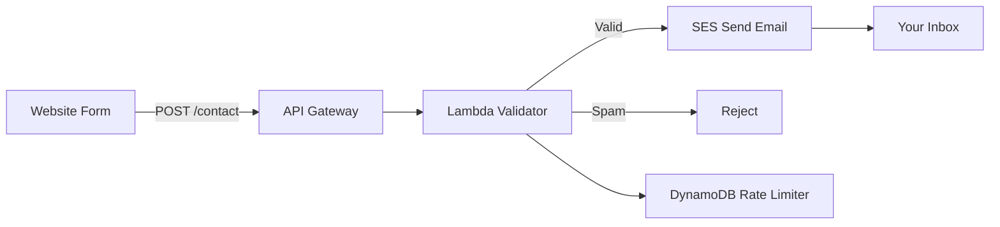

# How to Build a Serverless Contact Form with Lambda and SES

Author: [nawazdhandala](https://github.com/nawazdhandala)

Tags: AWS, Lambda, SES, API Gateway, Serverless, Contact Form

Description: Build a serverless contact form backend using AWS Lambda and SES with spam protection and form validation

---

Every website needs a contact form. The traditional approach is a backend server that receives form submissions and sends emails. But running a server 24/7 for a form that gets maybe 10 submissions a day is overkill. A serverless contact form with Lambda and SES costs fractions of a penny per submission and requires zero maintenance.

This guide builds a complete contact form backend with validation, spam protection, rate limiting, and email delivery.

## Architecture



## Step 1: Verify Your Email in SES

Before SES can send emails, you need to verify either a domain or email address:

```bash
# Verify your domain in SES
aws ses verify-domain-identity --domain example.com

# Or verify a specific email address
aws ses verify-email-identity --email-address contact@example.com
```

If you are in the SES sandbox (new accounts), you can only send to verified email addresses. Request production access through the AWS console to send to any address.

## Step 2: Build the Lambda Function

```python
# Contact form handler with validation, spam filtering, and rate limiting
import boto3
import json
import re
import time
import os
import hashlib

ses = boto3.client('ses')
dynamodb = boto3.resource('dynamodb')
rate_table = dynamodb.Table('contact-form-rates')

RECIPIENT_EMAIL = os.environ.get('RECIPIENT_EMAIL', 'contact@example.com')
SENDER_EMAIL = os.environ.get('SENDER_EMAIL', 'noreply@example.com')
MAX_SUBMISSIONS_PER_HOUR = 5

def handler(event, context):
    # Handle CORS preflight
    if event.get('httpMethod') == 'OPTIONS':
        return cors_response(200, '')

    try:
        # Parse and validate the form data
        body = json.loads(event.get('body', '{}'))
    except json.JSONDecodeError:
        return cors_response(400, {'error': 'Invalid JSON'})

    # Validate required fields
    validation_error = validate_form(body)
    if validation_error:
        return cors_response(400, {'error': validation_error})

    # Check for spam
    if is_spam(body):
        # Return success to the spammer but do not actually send
        return cors_response(200, {'message': 'Thank you for your message!'})

    # Rate limit by IP address
    source_ip = event.get('requestContext', {}).get('identity', {}).get('sourceIp', 'unknown')
    if is_rate_limited(source_ip):
        return cors_response(429, {'error': 'Too many submissions. Please try again later.'})

    # Send the email
    try:
        send_contact_email(body, source_ip)
    except Exception as e:
        print(f"SES error: {e}")
        return cors_response(500, {'error': 'Failed to send message. Please try again.'})

    return cors_response(200, {'message': 'Thank you! Your message has been sent.'})

def validate_form(body):
    """Validate the form fields and return an error message or None."""
    name = body.get('name', '').strip()
    email = body.get('email', '').strip()
    message = body.get('message', '').strip()

    if not name:
        return 'Name is required'
    if len(name) > 200:
        return 'Name is too long'
    if not email:
        return 'Email is required'
    if not re.match(r'^[a-zA-Z0-9._%+-]+@[a-zA-Z0-9.-]+\.[a-zA-Z]{2,}$', email):
        return 'Invalid email address'
    if not message:
        return 'Message is required'
    if len(message) > 5000:
        return 'Message is too long (max 5000 characters)'
    if len(message) < 10:
        return 'Message is too short'

    return None

def is_spam(body):
    """Simple spam detection heuristics."""
    message = body.get('message', '').lower()
    name = body.get('name', '').lower()

    # Honeypot field - if filled, it is a bot
    if body.get('website', ''):
        return True

    # Check for common spam patterns
    spam_keywords = ['buy now', 'click here', 'free money', 'congratulations', 'winner',
                     'casino', 'viagra', 'cryptocurrency offer', 'act now']
    for keyword in spam_keywords:
        if keyword in message:
            return True

    # Too many URLs in the message
    url_count = len(re.findall(r'https?://', message))
    if url_count > 3:
        return True

    return False

def is_rate_limited(source_ip):
    """Check if this IP has exceeded the submission rate limit."""
    # Hash the IP for privacy
    ip_hash = hashlib.sha256(source_ip.encode()).hexdigest()[:16]
    current_hour = int(time.time()) // 3600

    try:
        response = rate_table.update_item(
            Key={
                'ipHash': ip_hash,
                'hourBucket': current_hour
            },
            UpdateExpression='SET submissions = if_not_exists(submissions, :zero) + :inc, #ttl = :ttl',
            ExpressionAttributeNames={'#ttl': 'ttl'},
            ExpressionAttributeValues={
                ':inc': 1,
                ':zero': 0,
                ':ttl': int(time.time()) + 7200  # Expire after 2 hours
            },
            ReturnValues='UPDATED_NEW'
        )

        submissions = int(response['Attributes']['submissions'])
        return submissions > MAX_SUBMISSIONS_PER_HOUR

    except Exception:
        # If rate limiting fails, allow the request
        return False

def send_contact_email(body, source_ip):
    """Send the contact form submission via SES."""
    name = body['name'].strip()
    email = body['email'].strip()
    message = body['message'].strip()
    subject = body.get('subject', 'Contact Form Submission').strip()

    email_body = f"""New contact form submission:

Name: {name}
Email: {email}
Subject: {subject}

Message:
{message}

---
Submitted from IP: {source_ip}
"""

    ses.send_email(
        Source=SENDER_EMAIL,
        Destination={
            'ToAddresses': [RECIPIENT_EMAIL]
        },
        Message={
            'Subject': {'Data': f'[Contact Form] {subject}'},
            'Body': {
                'Text': {'Data': email_body}
            }
        },
        ReplyToAddresses=[email]  # Reply goes to the submitter
    )

def cors_response(status_code, body):
    """Return a response with CORS headers."""
    return {
        'statusCode': status_code,
        'headers': {
            'Content-Type': 'application/json',
            'Access-Control-Allow-Origin': 'https://example.com',
            'Access-Control-Allow-Methods': 'POST, OPTIONS',
            'Access-Control-Allow-Headers': 'Content-Type'
        },
        'body': json.dumps(body) if body else ''
    }
```

## Step 3: Create the Rate Limiting Table

```bash
# Create DynamoDB table for rate limiting with TTL
aws dynamodb create-table \
  --table-name contact-form-rates \
  --attribute-definitions \
    AttributeName=ipHash,AttributeType=S \
    AttributeName=hourBucket,AttributeType=N \
  --key-schema \
    AttributeName=ipHash,KeyType=HASH \
    AttributeName=hourBucket,KeyType=RANGE \
  --billing-mode PAY_PER_REQUEST

# Enable TTL for automatic cleanup
aws dynamodb update-time-to-live \
  --table-name contact-form-rates \
  --time-to-live-specification 'Enabled=true,AttributeName=ttl'
```

## Step 4: Set Up API Gateway

```bash
# Create the REST API
API_ID=$(aws apigateway create-rest-api \
  --name contact-form-api \
  --query 'id' --output text)

ROOT_ID=$(aws apigateway get-resources \
  --rest-api-id $API_ID \
  --query 'items[0].id' --output text)

# Create /contact resource
CONTACT_ID=$(aws apigateway create-resource \
  --rest-api-id $API_ID \
  --parent-id $ROOT_ID \
  --path-part contact \
  --query 'id' --output text)

# Create POST method
aws apigateway put-method \
  --rest-api-id $API_ID \
  --resource-id $CONTACT_ID \
  --http-method POST \
  --authorization-type NONE

# Create OPTIONS method for CORS preflight
aws apigateway put-method \
  --rest-api-id $API_ID \
  --resource-id $CONTACT_ID \
  --http-method OPTIONS \
  --authorization-type NONE
```

## Step 5: Frontend Form

Here is the HTML and JavaScript for the contact form:

```html
<!-- Simple contact form with honeypot spam trap -->
<form id="contact-form">
  <div>
    <label for="name">Name</label>
    <input type="text" id="name" name="name" required>
  </div>

  <div>
    <label for="email">Email</label>
    <input type="email" id="email" name="email" required>
  </div>

  <div>
    <label for="subject">Subject</label>
    <input type="text" id="subject" name="subject">
  </div>

  <div>
    <label for="message">Message</label>
    <textarea id="message" name="message" rows="5" required></textarea>
  </div>

  <!-- Honeypot field - hidden from real users, filled by bots -->
  <div style="display: none;">
    <label for="website">Website</label>
    <input type="text" id="website" name="website" tabindex="-1" autocomplete="off">
  </div>

  <button type="submit">Send Message</button>
  <div id="form-status"></div>
</form>
```

```javascript
// Submit the contact form to the Lambda backend
document.getElementById('contact-form').addEventListener('submit', async (e) => {
  e.preventDefault();

  const statusDiv = document.getElementById('form-status');
  const submitBtn = e.target.querySelector('button[type="submit"]');

  // Disable the button to prevent double submissions
  submitBtn.disabled = true;
  statusDiv.textContent = 'Sending...';

  const formData = {
    name: document.getElementById('name').value,
    email: document.getElementById('email').value,
    subject: document.getElementById('subject').value,
    message: document.getElementById('message').value,
    website: document.getElementById('website').value // Honeypot
  };

  try {
    const response = await fetch('https://API_ID.execute-api.us-east-1.amazonaws.com/production/contact', {
      method: 'POST',
      headers: { 'Content-Type': 'application/json' },
      body: JSON.stringify(formData)
    });

    const result = await response.json();

    if (response.ok) {
      statusDiv.textContent = result.message;
      e.target.reset();
    } else {
      statusDiv.textContent = result.error || 'Something went wrong.';
    }
  } catch (error) {
    statusDiv.textContent = 'Network error. Please try again.';
  } finally {
    submitBtn.disabled = false;
  }
});
```

## Adding reCAPTCHA

For stronger spam protection, add Google reCAPTCHA:

```python
# Verify reCAPTCHA token on the server side
import requests

RECAPTCHA_SECRET = os.environ.get('RECAPTCHA_SECRET')

def verify_recaptcha(token):
    """Verify the reCAPTCHA token with Google."""
    response = requests.post(
        'https://www.google.com/recaptcha/api/siteverify',
        data={
            'secret': RECAPTCHA_SECRET,
            'response': token
        }
    )
    result = response.json()
    return result.get('success', False) and result.get('score', 0) >= 0.5
```

Add the verification to your handler before sending the email:

```python
# Check reCAPTCHA before processing the submission
recaptcha_token = body.get('recaptchaToken')
if recaptcha_token and not verify_recaptcha(recaptcha_token):
    return cors_response(403, {'error': 'reCAPTCHA verification failed'})
```

## Storing Submissions

Besides sending an email, store submissions in DynamoDB for backup:

```python
# Store every submission in DynamoDB as a backup
submissions_table = dynamodb.Table('contact-form-submissions')

def store_submission(body, source_ip):
    submissions_table.put_item(Item={
        'submissionId': str(uuid.uuid4()),
        'name': body['name'],
        'email': body['email'],
        'subject': body.get('subject', ''),
        'message': body['message'],
        'sourceIp': source_ip,
        'submittedAt': datetime.utcnow().isoformat(),
        'ttl': int(time.time()) + (90 * 86400)  # Keep for 90 days
    })
```

## IAM Permissions

```json
// IAM policy for the contact form Lambda
{
  "Version": "2012-10-17",
  "Statement": [
    {
      "Effect": "Allow",
      "Action": "ses:SendEmail",
      "Resource": "*",
      "Condition": {
        "StringEquals": {
          "ses:FromAddress": "noreply@example.com"
        }
      }
    },
    {
      "Effect": "Allow",
      "Action": [
        "dynamodb:UpdateItem",
        "dynamodb:PutItem"
      ],
      "Resource": [
        "arn:aws:dynamodb:us-east-1:123456789012:table/contact-form-rates",
        "arn:aws:dynamodb:us-east-1:123456789012:table/contact-form-submissions"
      ]
    }
  ]
}
```

## Wrapping Up

A serverless contact form is one of the simplest and most cost-effective Lambda applications. The entire stack - API Gateway, Lambda, SES, and DynamoDB - costs virtually nothing for typical contact form volumes. The honeypot field catches most bots, rate limiting prevents abuse, and SES handles reliable email delivery. Add reCAPTCHA for stronger spam protection if the honeypot alone is not enough.

For sending more complex emails (HTML templates, attachments), see the SES documentation on using email templates.
