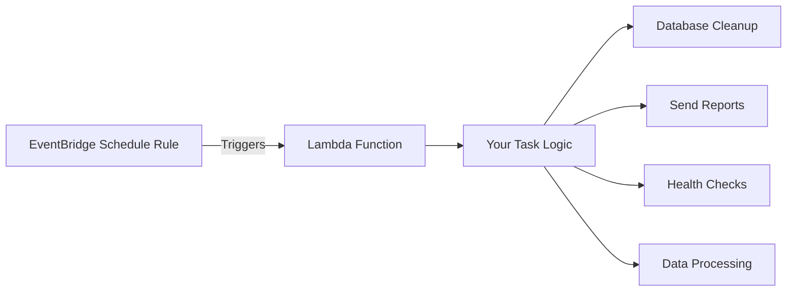

# How to Build a Serverless Cron Job with EventBridge and Lambda

Author: [nawazdhandala](https://github.com/nawazdhandala)

Tags: AWS, EventBridge, Lambda, Cron, Serverless, Scheduling

Description: Create reliable serverless scheduled tasks using Amazon EventBridge rules and AWS Lambda without managing any servers

---

Every application needs scheduled tasks. Cleaning up expired sessions, sending daily reports, processing batch jobs, checking service health - these all run on a schedule. Traditionally, you would set up a cron job on a server. But servers need patching, monitoring, and someone to notice when the cron daemon silently stops working.

EventBridge combined with Lambda gives you serverless cron jobs that scale automatically, cost nothing when idle, and have built-in monitoring. No servers to manage, no cron daemons to babysit.

## How It Works

EventBridge (formerly CloudWatch Events) fires events on a schedule. Lambda runs your code when the event arrives. That is it. No EC2 instances, no ECS tasks, no Kubernetes CronJobs.



## Creating a Basic Cron Job

### Step 1: Write the Lambda Function

```python
# Lambda function for a daily database cleanup cron job
import boto3
import json
from datetime import datetime, timedelta

dynamodb = boto3.resource('dynamodb')

def handler(event, context):
    print(f"Cron job triggered at {datetime.utcnow().isoformat()}")

    # Example: Clean up expired sessions
    table = dynamodb.Table('user-sessions')
    cutoff = (datetime.utcnow() - timedelta(days=7)).isoformat()

    # Scan for expired items
    response = table.scan(
        FilterExpression='expiresAt < :cutoff',
        ExpressionAttributeValues={':cutoff': cutoff},
        ProjectionExpression='sessionId'
    )

    deleted_count = 0
    for item in response['Items']:
        table.delete_item(Key={'sessionId': item['sessionId']})
        deleted_count += 1

    print(f"Deleted {deleted_count} expired sessions")

    return {
        'statusCode': 200,
        'deletedCount': deleted_count
    }
```

### Step 2: Create the EventBridge Rule

EventBridge supports two schedule types: cron expressions and rate expressions.

**Cron expression** (run at specific times):

```bash
# Run every day at 3:00 AM UTC
aws events put-rule \
  --name daily-cleanup \
  --schedule-expression "cron(0 3 * * ? *)" \
  --state ENABLED \
  --description "Daily expired session cleanup"
```

**Rate expression** (run at fixed intervals):

```bash
# Run every 5 minutes
aws events put-rule \
  --name health-check \
  --schedule-expression "rate(5 minutes)" \
  --state ENABLED \
  --description "Service health check every 5 minutes"
```

### Step 3: Add the Lambda Target

```bash
# Point the EventBridge rule at your Lambda function
aws events put-targets \
  --rule daily-cleanup \
  --targets '[{
    "Id": "cleanup-lambda",
    "Arn": "arn:aws:lambda:us-east-1:123456789012:function:daily-cleanup"
  }]'
```

### Step 4: Grant EventBridge Permission to Invoke Lambda

```bash
# Allow EventBridge to invoke the Lambda function
aws lambda add-permission \
  --function-name daily-cleanup \
  --statement-id eventbridge-invoke \
  --action lambda:InvokeFunction \
  --principal events.amazonaws.com \
  --source-arn arn:aws:events:us-east-1:123456789012:rule/daily-cleanup
```

## Cron Expression Reference

AWS cron expressions have 6 fields:

```
cron(minutes hours day-of-month month day-of-week year)
```

| Expression | Schedule |
|---|---|
| `cron(0 9 * * ? *)` | Every day at 9:00 AM UTC |
| `cron(0 */2 * * ? *)` | Every 2 hours |
| `cron(0 9 ? * MON-FRI *)` | Weekdays at 9:00 AM UTC |
| `cron(0 0 1 * ? *)` | First day of every month at midnight |
| `cron(30 18 ? * FRI *)` | Every Friday at 6:30 PM UTC |
| `cron(0/15 * * * ? *)` | Every 15 minutes |

Important: You cannot specify both day-of-month and day-of-week. Use `?` for the one you are not using.

## Passing Input to the Lambda

You can pass static or dynamic input to the Lambda function:

```bash
# Pass custom input JSON to the Lambda function
aws events put-targets \
  --rule daily-cleanup \
  --targets '[{
    "Id": "cleanup-lambda",
    "Arn": "arn:aws:lambda:us-east-1:123456789012:function:daily-cleanup",
    "Input": "{\"tableName\": \"user-sessions\", \"retentionDays\": 7, \"dryRun\": false}"
  }]'
```

For dynamic input based on the event time:

```bash
# Use input transformer to include the event timestamp
aws events put-targets \
  --rule daily-cleanup \
  --targets '[{
    "Id": "cleanup-lambda",
    "Arn": "arn:aws:lambda:us-east-1:123456789012:function:daily-cleanup",
    "InputTransformer": {
      "InputPathsMap": {
        "time": "$.time"
      },
      "InputTemplate": "{\"scheduledTime\": \"<time>\", \"tableName\": \"user-sessions\"}"
    }
  }]'
```

## Example: Daily Report Generator

Here is a complete cron job that generates and emails a daily report:

```python
# Daily report generator - sends summary email via SES
import boto3
import json
from datetime import datetime, timedelta

ses = boto3.client('ses')
dynamodb = boto3.resource('dynamodb')

def handler(event, context):
    yesterday = (datetime.utcnow() - timedelta(days=1)).strftime('%Y-%m-%d')

    # Gather metrics from DynamoDB
    orders_table = dynamodb.Table('orders')
    response = orders_table.scan(
        FilterExpression='orderDate = :date',
        ExpressionAttributeValues={':date': yesterday}
    )

    orders = response['Items']
    total_revenue = sum(float(o.get('amount', 0)) for o in orders)
    order_count = len(orders)

    # Build the report
    report = f"""
    <h2>Daily Report - {yesterday}</h2>
    <table border="1" cellpadding="8">
        <tr><td>Total Orders</td><td>{order_count}</td></tr>
        <tr><td>Total Revenue</td><td>${total_revenue:,.2f}</td></tr>
        <tr><td>Average Order Value</td><td>${total_revenue/max(order_count,1):,.2f}</td></tr>
    </table>
    """

    # Send via SES
    ses.send_email(
        Source='reports@example.com',
        Destination={'ToAddresses': ['team@example.com']},
        Message={
            'Subject': {'Data': f'Daily Report - {yesterday}'},
            'Body': {'Html': {'Data': report}}
        }
    )

    print(f"Report sent: {order_count} orders, ${total_revenue:,.2f} revenue")
    return {'statusCode': 200}
```

## Example: Health Check Cron

```python
# Health check cron that runs every 5 minutes and alerts on failures
import boto3
import requests
import json

sns = boto3.client('sns')

ENDPOINTS = [
    {'name': 'API', 'url': 'https://api.example.com/health'},
    {'name': 'Web App', 'url': 'https://app.example.com/health'},
    {'name': 'Payment Service', 'url': 'https://payments.example.com/health'},
]

def handler(event, context):
    failures = []

    for endpoint in ENDPOINTS:
        try:
            response = requests.get(endpoint['url'], timeout=10)
            if response.status_code != 200:
                failures.append({
                    'name': endpoint['name'],
                    'status': response.status_code,
                    'error': 'Non-200 status code'
                })
        except requests.exceptions.Timeout:
            failures.append({
                'name': endpoint['name'],
                'error': 'Request timed out'
            })
        except Exception as e:
            failures.append({
                'name': endpoint['name'],
                'error': str(e)
            })

    if failures:
        sns.publish(
            TopicArn='arn:aws:sns:us-east-1:123456789012:health-alerts',
            Subject=f'{len(failures)} Health Check(s) Failed',
            Message=json.dumps(failures, indent=2)
        )

    return {
        'statusCode': 200,
        'healthy': len(ENDPOINTS) - len(failures),
        'unhealthy': len(failures)
    }
```

## Monitoring Your Cron Jobs

### CloudWatch Metrics

Lambda automatically publishes metrics. Set up alarms for your cron functions:

```bash
# Alarm when cron Lambda fails
aws cloudwatch put-metric-alarm \
  --alarm-name cron-cleanup-errors \
  --namespace AWS/Lambda \
  --metric-name Errors \
  --dimensions Name=FunctionName,Value=daily-cleanup \
  --statistic Sum \
  --period 86400 \
  --evaluation-periods 1 \
  --threshold 1 \
  --comparison-operator GreaterThanOrEqualToThreshold \
  --alarm-actions arn:aws:sns:us-east-1:123456789012:ops-alerts
```

### Detecting Missed Executions

The trickiest failure mode is when the cron job simply does not run. Set up a "dead man's switch" alarm that alerts you when the function has NOT been invoked:

```bash
# Alarm when cron job has not run in the expected window
aws cloudwatch put-metric-alarm \
  --alarm-name cron-cleanup-missing \
  --namespace AWS/Lambda \
  --metric-name Invocations \
  --dimensions Name=FunctionName,Value=daily-cleanup \
  --statistic Sum \
  --period 86400 \
  --evaluation-periods 1 \
  --threshold 1 \
  --comparison-operator LessThanThreshold \
  --alarm-actions arn:aws:sns:us-east-1:123456789012:ops-alerts \
  --treat-missing-data breaching
```

The key is `--treat-missing-data breaching`. Without this, CloudWatch treats missing data as "not breaching" and the alarm never fires.

## EventBridge Scheduler (Alternative)

For more advanced scheduling needs, consider EventBridge Scheduler. It supports:

- One-time schedules (run once at a specific time)
- Timezone-aware cron expressions
- Flexible time windows
- Built-in retry policies
- Dead-letter queues

```bash
# EventBridge Scheduler with timezone support and retry policy
aws scheduler create-schedule \
  --name daily-report \
  --schedule-expression "cron(0 9 * * ? *)" \
  --schedule-expression-timezone "America/New_York" \
  --flexible-time-window '{"Mode": "OFF"}' \
  --target '{
    "Arn": "arn:aws:lambda:us-east-1:123456789012:function:daily-report",
    "RoleArn": "arn:aws:iam::123456789012:role/scheduler-role",
    "RetryPolicy": {
      "MaximumRetryAttempts": 3,
      "MaximumEventAgeInSeconds": 3600
    },
    "DeadLetterConfig": {
      "Arn": "arn:aws:sqs:us-east-1:123456789012:scheduler-dlq"
    }
  }'
```

## Wrapping Up

Serverless cron jobs with EventBridge and Lambda are simpler, more reliable, and cheaper than traditional server-based cron. You get automatic scaling, built-in monitoring, pay-per-invocation pricing, and zero infrastructure to manage. Start with the basic EventBridge rule pattern for simple schedules. Upgrade to EventBridge Scheduler when you need timezone support, one-time schedules, or built-in retries.
