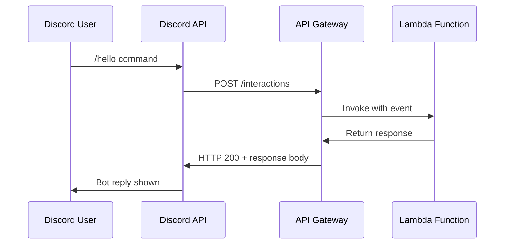

# How to Build a Serverless Discord Bot on AWS

Author: [nawazdhandala](https://github.com/nawazdhandala)

Tags: AWS, Lambda, API Gateway, Discord, Serverless, Chatbot

Description: Learn how to build and deploy a fully serverless Discord bot using AWS Lambda and API Gateway with slash commands and interactions

---

Discord bots are everywhere. They moderate servers, play music, track game stats, and run entire communities. But most tutorials have you spinning up a Node.js server on EC2 or a VPS, which means you are paying for compute even when nobody is talking to your bot. That is wasteful.

A serverless approach using AWS Lambda and API Gateway means you only pay when someone actually interacts with your bot. For most community bots, that translates to pennies per month instead of dollars.

In this guide, you will build a Discord bot from scratch using AWS Lambda, API Gateway, and the Discord Interactions API. No always-on server required.

## How Discord Bot Interactions Work

Before writing code, it helps to understand how Discord's interaction model works. Discord supports two connection models for bots: the Gateway (WebSocket) and the Interactions Endpoint (HTTP webhook). The serverless approach uses the webhook model.



When a user types a slash command, Discord sends an HTTP POST to your registered endpoint. Your Lambda function processes it and returns a response. Simple, stateless, and perfect for serverless.

## Prerequisites

You will need:

- An AWS account with permissions to create Lambda functions and API Gateway endpoints
- Node.js 18+ installed locally
- A Discord account and a server where you have admin permissions
- The Discord developer portal access

## Step 1: Create a Discord Application

Head to the [Discord Developer Portal](https://discord.com/developers/applications) and create a new application. Give it a name like "ServerlessBot" and note down the **Application ID** and **Public Key**. You will need both later.

Under the "Bot" section, click "Add Bot" and grab the **Bot Token**. Keep this secret. Never commit it to version control.

## Step 2: Set Up the Lambda Function

Create a new directory for your project and initialize it.

```bash
# Create project structure
mkdir serverless-discord-bot && cd serverless-discord-bot
npm init -y
npm install discord-interactions
```

Now write the Lambda handler. This function needs to handle three things: Discord's ping verification, slash command interactions, and returning proper responses.

```javascript
// index.mjs - Lambda handler for Discord interactions
import { verifyKey, InteractionType, InteractionResponseType } from 'discord-interactions';

const PUBLIC_KEY = process.env.DISCORD_PUBLIC_KEY;

export const handler = async (event) => {
  // Parse the incoming request
  const signature = event.headers['x-signature-ed25519'];
  const timestamp = event.headers['x-signature-timestamp'];
  const body = event.body;

  // Verify the request is actually from Discord
  const isValid = await verifyKey(body, signature, timestamp, PUBLIC_KEY);

  if (!isValid) {
    return {
      statusCode: 401,
      body: JSON.stringify({ error: 'Invalid request signature' }),
    };
  }

  const interaction = JSON.parse(body);

  // Handle Discord's ping verification
  if (interaction.type === InteractionType.PING) {
    return {
      statusCode: 200,
      body: JSON.stringify({ type: InteractionResponseType.PONG }),
    };
  }

  // Handle slash commands
  if (interaction.type === InteractionType.APPLICATION_COMMAND) {
    const { name } = interaction.data;

    if (name === 'hello') {
      const userName = interaction.member?.user?.username || 'stranger';
      return {
        statusCode: 200,
        body: JSON.stringify({
          type: InteractionResponseType.CHANNEL_MESSAGE_WITH_SOURCE,
          data: {
            content: `Hey ${userName}! I am running on AWS Lambda. No servers here.`,
          },
        }),
      };
    }

    if (name === 'status') {
      // Report Lambda execution environment details
      const region = process.env.AWS_REGION;
      const memoryMb = process.env.AWS_LAMBDA_FUNCTION_MEMORY_SIZE;
      return {
        statusCode: 200,
        body: JSON.stringify({
          type: InteractionResponseType.CHANNEL_MESSAGE_WITH_SOURCE,
          data: {
            content: `Running in ${region} with ${memoryMb}MB memory. Cold start? Maybe. But I cost almost nothing.`,
          },
        }),
      };
    }
  }

  // Fallback for unknown interactions
  return {
    statusCode: 400,
    body: JSON.stringify({ error: 'Unknown interaction type' }),
  };
};
```

The signature verification step is critical. Discord sends a signature with every request, and your endpoint must validate it. If you skip this, Discord will reject your endpoint during setup.

## Step 3: Deploy the Lambda Function

Zip up your project and deploy it through the AWS Console or CLI.

```bash
# Bundle the function and dependencies
zip -r function.zip index.mjs node_modules/ package.json

# Create the Lambda function
aws lambda create-function \
  --function-name discord-bot \
  --runtime nodejs18.x \
  --handler index.handler \
  --zip-file fileb://function.zip \
  --role arn:aws:iam::YOUR_ACCOUNT_ID:role/lambda-execution-role \
  --environment "Variables={DISCORD_PUBLIC_KEY=your_public_key_here}" \
  --timeout 10 \
  --memory-size 128
```

A 128MB Lambda with a 10-second timeout is more than enough for responding to slash commands. Most interactions complete in under 100ms.

## Step 4: Create the API Gateway Endpoint

You need a public HTTPS endpoint that Discord can send requests to. API Gateway gives you exactly that.

```bash
# Create an HTTP API (v2 - cheaper and faster than REST API)
aws apigatewayv2 create-api \
  --name discord-bot-api \
  --protocol-type HTTP \
  --target arn:aws:lambda:us-east-1:YOUR_ACCOUNT_ID:function:discord-bot

# Note the API endpoint URL from the output
```

You also need to grant API Gateway permission to invoke your Lambda.

```bash
# Allow API Gateway to invoke the Lambda function
aws lambda add-permission \
  --function-name discord-bot \
  --statement-id apigateway-invoke \
  --action lambda:InvokeFunction \
  --principal apigateway.amazonaws.com
```

## Step 5: Register Slash Commands

Use the Discord API to register your commands globally. This script uses a simple fetch call.

```javascript
// register-commands.mjs - Run this once to register slash commands
const APP_ID = 'your_application_id';
const BOT_TOKEN = 'your_bot_token';

const commands = [
  {
    name: 'hello',
    description: 'Get a greeting from the serverless bot',
  },
  {
    name: 'status',
    description: 'Check the bot execution environment',
  },
];

// Register commands globally
const response = await fetch(
  `https://discord.com/api/v10/applications/${APP_ID}/commands`,
  {
    method: 'PUT',
    headers: {
      'Content-Type': 'application/json',
      Authorization: `Bot ${BOT_TOKEN}`,
    },
    body: JSON.stringify(commands),
  }
);

console.log('Registration result:', response.status);
```

Run this once with `node register-commands.mjs`. Global commands can take up to an hour to propagate across Discord.

## Step 6: Configure the Interactions Endpoint

Go back to the Discord Developer Portal, find your application, and under "General Information", paste your API Gateway URL into the **Interactions Endpoint URL** field. Discord will immediately send a PING to verify your endpoint. If your Lambda and signature verification are set up correctly, it will accept it.

## Step 7: Invite the Bot to Your Server

Generate an invite URL with the `applications.commands` scope.

```
https://discord.com/api/oauth2/authorize?client_id=YOUR_APP_ID&scope=applications.commands+bot
```

Open that URL in your browser, select your server, and authorize the bot.

## Handling Deferred Responses

Some commands take longer than 3 seconds to process. Discord requires a response within that window or it considers the interaction failed. For longer operations, you can send a deferred response first, then follow up.

```javascript
// For long-running commands, defer first then follow up
if (name === 'report') {
  // Immediately acknowledge the interaction
  // Then use a separate function to send the follow-up
  return {
    statusCode: 200,
    body: JSON.stringify({
      type: InteractionResponseType.DEFERRED_CHANNEL_MESSAGE_WITH_SOURCE,
    }),
  };
}
```

You would then have a second Lambda function (or the same one triggered asynchronously) that calls the Discord webhook URL to send the actual response.

## Cost Breakdown

For a bot handling 10,000 interactions per month with an average execution time of 100ms at 128MB:

- **Lambda**: 10,000 requests x 100ms = 1,000 GB-seconds. Well within the free tier.
- **API Gateway**: 10,000 requests at HTTP API pricing = about $0.01.
- **Total**: Effectively free for small to mid-sized Discord servers.

Compare that to running a t3.micro EC2 instance 24/7 at roughly $8/month. The serverless approach wins by a wide margin for bots that are not handling constant traffic.

## Monitoring Your Bot

You should set up CloudWatch alarms for your Lambda function to catch errors early. Track the invocation count, error rate, and duration metrics. If you want deeper observability, consider connecting your logs to a monitoring platform. For more on monitoring serverless applications, check out our guide on [monitoring AWS Lambda functions](https://oneuptime.com/blog/post/2026-02-12-implement-graceful-shutdown-in-lambda-functions/view).

## Wrapping Up

Building a Discord bot on AWS Lambda is a practical exercise in serverless architecture. You get automatic scaling, per-invocation billing, and zero server maintenance. The Discord Interactions API was designed with this exact pattern in mind.

From here, you can extend your bot with DynamoDB for state persistence, SQS for queuing heavy workloads, or Step Functions for multi-step workflows. The serverless ecosystem on AWS gives you all the building blocks, and you only pay for what you use.
