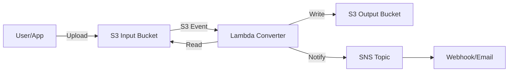

# How to Build a Serverless File Converter with Lambda and S3

Author: [nawazdhandala](https://github.com/nawazdhandala)

Tags: AWS, Lambda, S3, File Conversion, Serverless, Event-Driven

Description: Build an event-driven serverless file conversion pipeline using AWS Lambda and S3 for automatic document and media processing

---

Users upload a file, and you need to convert it into a different format. CSV to JSON. DOCX to PDF. PNG to WebP. The traditional approach is running a conversion server 24/7, waiting for files. With Lambda and S3, you can build an event-driven converter that spins up automatically when a file lands in S3, converts it, and goes back to sleep.

Zero cost when idle. Automatic scaling when busy. No servers to patch.

## Architecture Overview

The pattern is simple: upload to an input bucket, Lambda picks it up, converts it, and writes the result to an output location.



## Step 1: Create the S3 Buckets

```bash
# Create input and output buckets
aws s3 mb s3://my-file-converter-input
aws s3 mb s3://my-file-converter-output
```

Using separate buckets prevents infinite loops. If you wrote the converted file back to the same bucket, the S3 event would trigger Lambda again, which would convert the already-converted file, triggering another event, and so on.

## Step 2: Build the Lambda Function

Here is a versatile converter that handles multiple format conversions:

### CSV to JSON Converter

```python
# Converts uploaded CSV files to JSON format automatically
import boto3
import csv
import json
import io
import os
from urllib.parse import unquote_plus

s3 = boto3.client('s3')
OUTPUT_BUCKET = os.environ['OUTPUT_BUCKET']

def handler(event, context):
    # Get the uploaded file details from the S3 event
    record = event['Records'][0]
    source_bucket = record['s3']['bucket']['name']
    source_key = unquote_plus(record['s3']['object']['key'])

    print(f"Processing: s3://{source_bucket}/{source_key}")

    # Determine the conversion type based on file extension
    extension = source_key.rsplit('.', 1)[-1].lower()

    if extension == 'csv':
        convert_csv_to_json(source_bucket, source_key)
    elif extension in ('png', 'jpg', 'jpeg'):
        convert_image_to_webp(source_bucket, source_key)
    elif extension == 'md':
        convert_markdown_to_html(source_bucket, source_key)
    else:
        print(f"No converter for .{extension} files")
        return {'statusCode': 400, 'message': f'Unsupported format: {extension}'}

    return {'statusCode': 200, 'message': 'Conversion complete'}

def convert_csv_to_json(bucket, key):
    """Convert a CSV file to JSON."""
    # Download the CSV file
    response = s3.get_object(Bucket=bucket, Key=key)
    content = response['Body'].read().decode('utf-8')

    # Parse CSV
    reader = csv.DictReader(io.StringIO(content))
    records = list(reader)

    # Generate output key (same path but .json extension)
    output_key = key.rsplit('.', 1)[0] + '.json'

    # Upload the JSON result
    s3.put_object(
        Bucket=OUTPUT_BUCKET,
        Key=output_key,
        Body=json.dumps(records, indent=2),
        ContentType='application/json'
    )

    print(f"Converted {len(records)} records to s3://{OUTPUT_BUCKET}/{output_key}")
```

### Image Format Converter

For image conversion, you need the Pillow library. Package it as a Lambda layer or use a container image.

```python
# Converts uploaded images to WebP format for better web performance
from PIL import Image
import io

def convert_image_to_webp(bucket, key):
    """Convert PNG/JPG images to WebP format."""
    # Download the image
    response = s3.get_object(Bucket=bucket, Key=key)
    image_data = response['Body'].read()

    # Open and convert
    image = Image.open(io.BytesIO(image_data))

    # Convert to WebP with quality setting
    buffer = io.BytesIO()
    image.save(buffer, format='WEBP', quality=85)
    buffer.seek(0)

    # Generate output key
    output_key = key.rsplit('.', 1)[0] + '.webp'

    s3.put_object(
        Bucket=OUTPUT_BUCKET,
        Key=output_key,
        Body=buffer.read(),
        ContentType='image/webp'
    )

    original_size = len(image_data)
    converted_size = buffer.tell()
    savings = ((original_size - converted_size) / original_size) * 100

    print(f"Converted image: {original_size} -> {converted_size} bytes ({savings:.1f}% smaller)")
```

### Markdown to HTML Converter

```python
# Converts Markdown files to styled HTML documents
import markdown

def convert_markdown_to_html(bucket, key):
    """Convert Markdown to HTML."""
    response = s3.get_object(Bucket=bucket, Key=key)
    md_content = response['Body'].read().decode('utf-8')

    # Convert Markdown to HTML with extensions
    html_content = markdown.markdown(
        md_content,
        extensions=['tables', 'fenced_code', 'toc']
    )

    # Wrap in a basic HTML document
    full_html = f"""<!DOCTYPE html>
<html>
<head>
    <meta charset="utf-8">
    <style>
        body {{ font-family: sans-serif; max-width: 800px; margin: 0 auto; padding: 20px; }}
        code {{ background: #f4f4f4; padding: 2px 6px; border-radius: 3px; }}
        pre {{ background: #f4f4f4; padding: 16px; border-radius: 6px; overflow-x: auto; }}
        table {{ border-collapse: collapse; width: 100%; }}
        th, td {{ border: 1px solid #ddd; padding: 8px; text-align: left; }}
    </style>
</head>
<body>
{html_content}
</body>
</html>"""

    output_key = key.rsplit('.', 1)[0] + '.html'

    s3.put_object(
        Bucket=OUTPUT_BUCKET,
        Key=output_key,
        Body=full_html.encode('utf-8'),
        ContentType='text/html'
    )

    print(f"Converted Markdown to HTML: s3://{OUTPUT_BUCKET}/{output_key}")
```

## Step 3: Configure the S3 Event Trigger

```bash
# Add S3 event notification to trigger Lambda on file upload
aws s3api put-bucket-notification-configuration \
  --bucket my-file-converter-input \
  --notification-configuration '{
    "LambdaFunctionConfigurations": [
      {
        "LambdaFunctionArn": "arn:aws:lambda:us-east-1:123456789012:function:file-converter",
        "Events": ["s3:ObjectCreated:*"],
        "Filter": {
          "Key": {
            "FilterRules": [
              {"Name": "prefix", "Value": "uploads/"}
            ]
          }
        }
      }
    ]
  }'
```

Grant S3 permission to invoke the Lambda:

```bash
# Allow the S3 bucket to invoke the Lambda function
aws lambda add-permission \
  --function-name file-converter \
  --statement-id s3-invoke \
  --action lambda:InvokeFunction \
  --principal s3.amazonaws.com \
  --source-arn arn:aws:s3:::my-file-converter-input \
  --source-account 123456789012
```

## Step 4: Set Up Lambda Configuration

Configure the Lambda function with appropriate resources:

```bash
# Update Lambda configuration for file processing
aws lambda update-function-configuration \
  --function-name file-converter \
  --timeout 300 \
  --memory-size 1024 \
  --environment 'Variables={OUTPUT_BUCKET=my-file-converter-output}' \
  --ephemeral-storage '{"Size": 1024}'
```

Key settings:

- **Timeout**: 300 seconds gives enough time for large file conversions
- **Memory**: 1024MB provides good CPU allocation for processing
- **Ephemeral storage**: 1024MB for temporary files during conversion (default is 512MB)

## Handling Large Files

Lambda has a 15-minute timeout and 10GB ephemeral storage limit. For files that exceed these limits, use a two-tier approach:

```python
# Route large files to ECS Fargate for processing
import boto3

ecs = boto3.client('ecs')

def handler(event, context):
    record = event['Records'][0]
    file_size = record['s3']['object']['size']

    # Files over 500MB go to ECS Fargate
    if file_size > 500 * 1024 * 1024:
        return start_ecs_task(record)

    # Smaller files process in Lambda
    return convert_file(record)

def start_ecs_task(record):
    """Start an ECS Fargate task for large file processing."""
    ecs.run_task(
        cluster='file-converter-cluster',
        taskDefinition='large-file-converter',
        launchType='FARGATE',
        networkConfiguration={
            'awsvpcConfiguration': {
                'subnets': ['subnet-abc123'],
                'securityGroups': ['sg-abc123'],
                'assignPublicIp': 'DISABLED'
            }
        },
        overrides={
            'containerOverrides': [{
                'name': 'converter',
                'environment': [
                    {'name': 'SOURCE_BUCKET', 'value': record['s3']['bucket']['name']},
                    {'name': 'SOURCE_KEY', 'value': record['s3']['object']['key']},
                    {'name': 'OUTPUT_BUCKET', 'value': os.environ['OUTPUT_BUCKET']}
                ]
            }]
        }
    )
    return {'statusCode': 202, 'message': 'Large file sent to ECS for processing'}
```

## Adding Conversion Status Tracking

Track conversion status in DynamoDB so clients can poll for results:

```python
# Track conversion status in DynamoDB for client polling
dynamodb = boto3.resource('dynamodb')
status_table = dynamodb.Table('conversion-jobs')

def update_status(job_id, status, output_key=None, error=None):
    item = {
        'jobId': job_id,
        'status': status,
        'updatedAt': datetime.utcnow().isoformat()
    }
    if output_key:
        item['outputKey'] = output_key
    if error:
        item['error'] = error
    status_table.put_item(Item=item)
```

## Error Handling

Always handle conversion failures gracefully:

```python
# Robust error handling with dead-letter queue
import traceback

def handler(event, context):
    record = event['Records'][0]
    source_key = record['s3']['object']['key']

    try:
        result = convert_file(record)
        return result
    except Exception as e:
        error_msg = traceback.format_exc()
        print(f"Conversion failed for {source_key}: {error_msg}")

        # Move failed file to error prefix for review
        s3.copy_object(
            Bucket=OUTPUT_BUCKET,
            Key=f"errors/{source_key}",
            CopySource={'Bucket': record['s3']['bucket']['name'], 'Key': source_key}
        )

        # Notify via SNS
        sns = boto3.client('sns')
        sns.publish(
            TopicArn='arn:aws:sns:us-east-1:123456789012:conversion-errors',
            Subject=f'File Conversion Failed: {source_key}',
            Message=error_msg
        )

        raise
```

## Wrapping Up

A serverless file converter with Lambda and S3 is one of the most practical event-driven architectures you can build. It handles the common case efficiently (small to medium files via Lambda), scales automatically with upload volume, and costs nothing when nobody is uploading. Add ECS Fargate for large files and DynamoDB for status tracking, and you have a production-ready file processing pipeline.

For a specific implementation of image processing, check out our guide on [building a serverless thumbnail generator with Lambda](https://oneuptime.com/blog/post/2026-02-12-build-a-serverless-thumbnail-generator-with-lambda/view).
