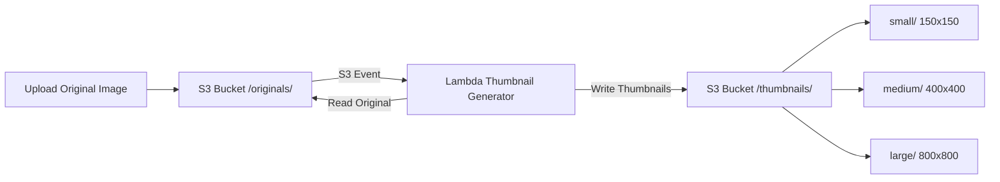

# How to Build a Serverless Thumbnail Generator with Lambda

Author: [nawazdhandala](https://github.com/nawazdhandala)

Tags: AWS, Lambda, S3, Image Processing, Thumbnails, Serverless

Description: Build an automatic thumbnail generator using AWS Lambda and S3 that processes images on upload with zero server management

---

Every application that handles images needs thumbnails. Profile pictures, product galleries, blog post covers - they all need multiple sizes. You could resize on the fly at request time, but that adds latency and CPU load to your web servers. A better approach is to generate thumbnails when the image is uploaded, so they are ready to serve instantly.

With Lambda and S3, you can build a thumbnail generator that automatically fires when an image is uploaded, creates multiple sizes, and stores them back in S3. No servers, no queues to manage, no capacity planning.

## Architecture



## Step 1: Create the Lambda Layer with Pillow

Lambda does not include image processing libraries by default. You need Pillow (Python Imaging Library) as a Lambda layer.

```bash
# Build the Pillow Lambda layer for Amazon Linux 2
mkdir -p python/lib/python3.12/site-packages
pip install Pillow -t python/lib/python3.12/site-packages/ --platform manylinux2014_x86_64 --only-binary=:all:
zip -r pillow-layer.zip python/

# Create the Lambda layer
aws lambda publish-layer-version \
  --layer-name pillow \
  --zip-file fileb://pillow-layer.zip \
  --compatible-runtimes python3.12 \
  --description "Pillow image processing library"
```

Alternatively, use the pre-built `Klayers` community project which provides popular Python packages as Lambda layers.

## Step 2: Build the Thumbnail Generator

```python
# Generates multiple thumbnail sizes from uploaded images
import boto3
from PIL import Image
import io
import os
from urllib.parse import unquote_plus

s3 = boto3.client('s3')

# Define thumbnail sizes
THUMBNAIL_SIZES = {
    'small': (150, 150),
    'medium': (400, 400),
    'large': (800, 800)
}

SUPPORTED_FORMATS = {'.jpg', '.jpeg', '.png', '.gif', '.bmp', '.tiff', '.webp'}
OUTPUT_BUCKET = os.environ.get('OUTPUT_BUCKET', 'my-thumbnails-bucket')

def handler(event, context):
    for record in event['Records']:
        source_bucket = record['s3']['bucket']['name']
        source_key = unquote_plus(record['s3']['object']['key'])

        # Check if the file is a supported image format
        file_ext = os.path.splitext(source_key)[1].lower()
        if file_ext not in SUPPORTED_FORMATS:
            print(f"Skipping unsupported format: {source_key}")
            continue

        print(f"Processing: s3://{source_bucket}/{source_key}")

        try:
            generate_thumbnails(source_bucket, source_key)
        except Exception as e:
            print(f"Error processing {source_key}: {e}")
            raise

    return {'statusCode': 200, 'message': 'Thumbnails generated'}

def generate_thumbnails(bucket, key):
    """Download the original image and create all thumbnail sizes."""
    # Download the original image
    response = s3.get_object(Bucket=bucket, Key=key)
    image_data = response['Body'].read()
    original_image = Image.open(io.BytesIO(image_data))

    # Get the filename without extension
    filename = os.path.basename(key)
    name_without_ext = os.path.splitext(filename)[0]

    # Handle animated GIFs - only thumbnail the first frame
    if hasattr(original_image, 'is_animated') and original_image.is_animated:
        original_image.seek(0)

    # Convert RGBA to RGB for JPEG output
    if original_image.mode in ('RGBA', 'P'):
        original_image = original_image.convert('RGB')

    for size_name, dimensions in THUMBNAIL_SIZES.items():
        create_thumbnail(original_image, name_without_ext, size_name, dimensions)

    print(f"Generated {len(THUMBNAIL_SIZES)} thumbnails for {key}")

def create_thumbnail(image, name, size_name, dimensions):
    """Create a single thumbnail and upload to S3."""
    # Copy the image so we do not modify the original
    thumb = image.copy()

    # Use thumbnail() which maintains aspect ratio
    thumb.thumbnail(dimensions, Image.LANCZOS)

    # Save to buffer as JPEG
    buffer = io.BytesIO()
    thumb.save(buffer, format='JPEG', quality=85, optimize=True)
    buffer.seek(0)

    # Upload to the output bucket organized by size
    output_key = f"thumbnails/{size_name}/{name}.jpg"

    s3.put_object(
        Bucket=OUTPUT_BUCKET,
        Key=output_key,
        Body=buffer.read(),
        ContentType='image/jpeg',
        CacheControl='public, max-age=31536000'
    )

    print(f"  Created {size_name}: {dimensions[0]}x{dimensions[1]} -> {output_key}")
```

## Step 3: Deploy the Lambda Function

```bash
# Create the Lambda function with Pillow layer
aws lambda create-function \
  --function-name thumbnail-generator \
  --runtime python3.12 \
  --handler thumbnail.handler \
  --role arn:aws:iam::123456789012:role/lambda-thumbnail-role \
  --zip-file fileb://thumbnail.zip \
  --layers arn:aws:lambda:us-east-1:123456789012:layer:pillow:1 \
  --timeout 60 \
  --memory-size 1536 \
  --environment 'Variables={OUTPUT_BUCKET=my-thumbnails-bucket}' \
  --ephemeral-storage '{"Size": 1024}'
```

Memory is important here. Image processing is CPU-intensive, and Lambda allocates CPU proportional to memory. 1536MB gives you roughly one full vCPU, which makes a noticeable difference for large images.

## Step 4: Set Up the S3 Trigger

```bash
# Allow S3 to invoke the Lambda function
aws lambda add-permission \
  --function-name thumbnail-generator \
  --statement-id s3-invoke-thumbnail \
  --action lambda:InvokeFunction \
  --principal s3.amazonaws.com \
  --source-arn arn:aws:s3:::my-images-bucket

# Configure S3 to trigger Lambda on image uploads
aws s3api put-bucket-notification-configuration \
  --bucket my-images-bucket \
  --notification-configuration '{
    "LambdaFunctionConfigurations": [
      {
        "LambdaFunctionArn": "arn:aws:lambda:us-east-1:123456789012:function:thumbnail-generator",
        "Events": ["s3:ObjectCreated:*"],
        "Filter": {
          "Key": {
            "FilterRules": [
              {"Name": "prefix", "Value": "originals/"}
            ]
          }
        }
      }
    ]
  }'
```

## Step 5: IAM Role

The Lambda function needs permissions to read from the source bucket and write to the output bucket:

```json
// IAM policy for the thumbnail generator Lambda
{
  "Version": "2012-10-17",
  "Statement": [
    {
      "Effect": "Allow",
      "Action": "s3:GetObject",
      "Resource": "arn:aws:s3:::my-images-bucket/originals/*"
    },
    {
      "Effect": "Allow",
      "Action": "s3:PutObject",
      "Resource": "arn:aws:s3:::my-thumbnails-bucket/thumbnails/*"
    },
    {
      "Effect": "Allow",
      "Action": [
        "logs:CreateLogGroup",
        "logs:CreateLogStream",
        "logs:PutLogEvents"
      ],
      "Resource": "arn:aws:logs:*:*:*"
    }
  ]
}
```

## Adding Smart Cropping

The basic `thumbnail()` method maintains aspect ratio but does not crop. For profile pictures that need exact square dimensions, use center cropping:

```python
# Smart crop to exact dimensions while keeping the most important area centered
def create_exact_thumbnail(image, name, size_name, dimensions):
    """Create a thumbnail with exact dimensions using center crop."""
    thumb = image.copy()
    target_width, target_height = dimensions

    # Calculate the crop box for center-cropping
    img_ratio = thumb.width / thumb.height
    target_ratio = target_width / target_height

    if img_ratio > target_ratio:
        # Image is wider than target - crop horizontally
        new_width = int(thumb.height * target_ratio)
        left = (thumb.width - new_width) // 2
        thumb = thumb.crop((left, 0, left + new_width, thumb.height))
    else:
        # Image is taller than target - crop vertically
        new_height = int(thumb.width / target_ratio)
        top = (thumb.height - new_height) // 2
        thumb = thumb.crop((0, top, thumb.width, top + new_height))

    # Resize to exact target dimensions
    thumb = thumb.resize(dimensions, Image.LANCZOS)

    buffer = io.BytesIO()
    thumb.save(buffer, format='JPEG', quality=85, optimize=True)
    buffer.seek(0)

    output_key = f"thumbnails/{size_name}/{name}.jpg"
    s3.put_object(
        Bucket=OUTPUT_BUCKET,
        Key=output_key,
        Body=buffer.read(),
        ContentType='image/jpeg',
        CacheControl='public, max-age=31536000'
    )
```

## Serving Thumbnails via CloudFront

Set up CloudFront in front of your thumbnails bucket for global edge caching:

```bash
# Create a CloudFront distribution for the thumbnails bucket
aws cloudfront create-distribution \
  --distribution-config '{
    "CallerReference": "thumbnails-dist-001",
    "Origins": {
      "Quantity": 1,
      "Items": [
        {
          "Id": "thumbnails-origin",
          "DomainName": "my-thumbnails-bucket.s3.amazonaws.com",
          "S3OriginConfig": {
            "OriginAccessIdentity": ""
          }
        }
      ]
    },
    "DefaultCacheBehavior": {
      "TargetOriginId": "thumbnails-origin",
      "ViewerProtocolPolicy": "redirect-to-https",
      "CachePolicyId": "658327ea-f89d-4fab-a63d-7e88639e58f6",
      "Compress": true
    },
    "Enabled": true,
    "Comment": "Thumbnail CDN"
  }'
```

With the `CacheControl: public, max-age=31536000` header set on the thumbnails, CloudFront caches them for a full year. Since thumbnails are immutable (same input always produces the same output), this is safe and keeps your S3 costs low.

## Handling Edge Cases

### Large Images

Images over 10-15MB can cause Lambda to run out of memory. Add a size check:

```python
# Skip images that are too large for Lambda processing
def handler(event, context):
    for record in event['Records']:
        file_size = record['s3']['object']['size']
        max_size = 20 * 1024 * 1024  # 20MB limit

        if file_size > max_size:
            print(f"File too large ({file_size} bytes), skipping")
            # Optionally send to SQS for ECS processing
            continue

        generate_thumbnails(
            record['s3']['bucket']['name'],
            unquote_plus(record['s3']['object']['key'])
        )
```

### Corrupted Images

Wrap the Image.open call to catch corrupted files:

```python
# Handle corrupted image files gracefully
try:
    original_image = Image.open(io.BytesIO(image_data))
    original_image.verify()  # Verify the image is not corrupted
    # Re-open after verify (verify closes the image)
    original_image = Image.open(io.BytesIO(image_data))
except Exception as e:
    print(f"Invalid image file: {e}")
    # Move to error prefix for review
    s3.copy_object(
        Bucket=OUTPUT_BUCKET,
        Key=f"errors/{key}",
        CopySource={'Bucket': bucket, 'Key': key}
    )
    return
```

### EXIF Orientation

Many phone photos have EXIF orientation data that makes them appear rotated. Pillow has a utility to fix this:

```python
# Fix image orientation based on EXIF data before generating thumbnails
from PIL import ImageOps

def fix_orientation(image):
    """Apply EXIF orientation data to the image pixels."""
    return ImageOps.exif_transpose(image)

# Use in the thumbnail generation pipeline
original_image = Image.open(io.BytesIO(image_data))
original_image = fix_orientation(original_image)
```

## Monitoring

Set up CloudWatch alarms for the thumbnail function:

```bash
# Alert when thumbnail generation errors spike
aws cloudwatch put-metric-alarm \
  --alarm-name thumbnail-errors \
  --namespace AWS/Lambda \
  --metric-name Errors \
  --dimensions Name=FunctionName,Value=thumbnail-generator \
  --statistic Sum \
  --period 300 \
  --evaluation-periods 2 \
  --threshold 5 \
  --comparison-operator GreaterThanThreshold \
  --alarm-actions arn:aws:sns:us-east-1:123456789012:ops-alerts
```

Also monitor duration. If thumbnails start taking longer than expected, it might indicate larger images being uploaded or Pillow performance issues.

## Wrapping Up

A serverless thumbnail generator is one of the most practical Lambda applications you can build. It processes images only when needed, scales automatically with upload volume, and costs pennies for most workloads. The combination of S3 events, Lambda for processing, and CloudFront for delivery gives you a production-ready image pipeline with minimal operational overhead.

For a more general file conversion pipeline that handles multiple formats, see our guide on [building a serverless file converter with Lambda and S3](https://oneuptime.com/blog/post/2026-02-12-build-a-serverless-file-converter-with-lambda-and-s3/view).
