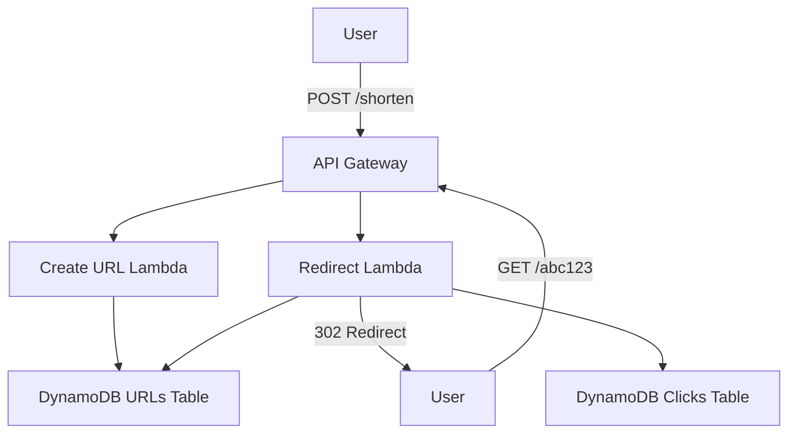

# How to Build a Serverless URL Shortener on AWS

Author: [nawazdhandala](https://github.com/nawazdhandala)

Tags: AWS, Lambda, DynamoDB, API Gateway, Serverless, URL Shortener

Description: Build a complete serverless URL shortener service using API Gateway, Lambda, and DynamoDB with click tracking and analytics

---

URL shorteners look simple on the surface. Take a long URL, give back a short one, redirect when someone clicks it. But building one that is fast, reliable, and scalable is a great exercise in serverless architecture. It touches API Gateway, Lambda, DynamoDB, and optionally CloudFront - all the core serverless building blocks.

In this guide, we will build a complete URL shortener with short code generation, redirect handling, and click analytics.

## Architecture



Two main flows:
1. **Create short URL** - POST with a long URL, get back a short code
2. **Redirect** - GET with the short code, get redirected to the original URL

## Step 1: Create the DynamoDB Tables

```bash
# URLs table - stores the mapping from short code to long URL
aws dynamodb create-table \
  --table-name url-shortener-urls \
  --attribute-definitions AttributeName=shortCode,AttributeType=S \
  --key-schema AttributeName=shortCode,KeyType=HASH \
  --billing-mode PAY_PER_REQUEST

# Clicks table - stores click analytics
aws dynamodb create-table \
  --table-name url-shortener-clicks \
  --attribute-definitions \
    AttributeName=shortCode,AttributeType=S \
    AttributeName=clickedAt,AttributeType=S \
  --key-schema \
    AttributeName=shortCode,KeyType=HASH \
    AttributeName=clickedAt,KeyType=RANGE \
  --billing-mode PAY_PER_REQUEST
```

## Step 2: Build the Create URL Lambda

```python
# Creates a short URL and stores the mapping in DynamoDB
import boto3
import json
import string
import random
import time
import os

dynamodb = boto3.resource('dynamodb')
table = dynamodb.Table('url-shortener-urls')

BASE_URL = os.environ.get('BASE_URL', 'https://short.example.com')
CODE_LENGTH = 6

def handler(event, context):
    # Parse the request body
    body = json.loads(event.get('body', '{}'))
    long_url = body.get('url')

    if not long_url:
        return response(400, {'error': 'Missing "url" field'})

    # Validate the URL format
    if not long_url.startswith(('http://', 'https://')):
        return response(400, {'error': 'URL must start with http:// or https://'})

    # Generate a unique short code
    short_code = generate_short_code()

    # Handle collisions by retrying with a new code
    max_attempts = 5
    for attempt in range(max_attempts):
        try:
            table.put_item(
                Item={
                    'shortCode': short_code,
                    'longUrl': long_url,
                    'createdAt': int(time.time()),
                    'clickCount': 0
                },
                ConditionExpression='attribute_not_exists(shortCode)'
            )
            break
        except dynamodb.meta.client.exceptions.ConditionalCheckFailedException:
            # Code already exists, generate a new one
            short_code = generate_short_code()
            if attempt == max_attempts - 1:
                return response(500, {'error': 'Could not generate unique code'})

    short_url = f"{BASE_URL}/{short_code}"

    return response(201, {
        'shortUrl': short_url,
        'shortCode': short_code,
        'longUrl': long_url
    })

def generate_short_code():
    """Generate a random alphanumeric short code."""
    chars = string.ascii_letters + string.digits
    return ''.join(random.choices(chars, k=CODE_LENGTH))

def response(status_code, body):
    return {
        'statusCode': status_code,
        'headers': {
            'Content-Type': 'application/json',
            'Access-Control-Allow-Origin': '*'
        },
        'body': json.dumps(body)
    }
```

## Step 3: Build the Redirect Lambda

The redirect handler needs to be fast. Every millisecond of latency is felt by the user clicking the link.

```python
# Looks up the short code and returns a 302 redirect to the original URL
import boto3
import json
import time
from datetime import datetime

dynamodb = boto3.resource('dynamodb')
urls_table = dynamodb.Table('url-shortener-urls')
clicks_table = dynamodb.Table('url-shortener-clicks')

def handler(event, context):
    # Extract the short code from the path
    short_code = event.get('pathParameters', {}).get('code')

    if not short_code:
        return {
            'statusCode': 400,
            'body': json.dumps({'error': 'Missing short code'})
        }

    # Look up the URL
    result = urls_table.get_item(Key={'shortCode': short_code})

    if 'Item' not in result:
        return {
            'statusCode': 404,
            'headers': {'Content-Type': 'text/html'},
            'body': '<html><body><h1>Link not found</h1></body></html>'
        }

    long_url = result['Item']['longUrl']

    # Record the click asynchronously (fire and forget)
    try:
        record_click(short_code, event)
    except Exception:
        pass  # Do not let analytics failures block the redirect

    # Return a 302 redirect
    return {
        'statusCode': 302,
        'headers': {
            'Location': long_url,
            'Cache-Control': 'no-cache'
        },
        'body': ''
    }

def record_click(short_code, event):
    """Record click analytics data."""
    now = datetime.utcnow().isoformat()

    # Extract visitor info from the request
    request_context = event.get('requestContext', {})
    identity = request_context.get('identity', {})

    clicks_table.put_item(Item={
        'shortCode': short_code,
        'clickedAt': now,
        'sourceIp': identity.get('sourceIp', 'unknown'),
        'userAgent': identity.get('userAgent', 'unknown'),
        'referer': event.get('headers', {}).get('Referer', 'direct')
    })

    # Increment the click counter on the URL record
    urls_table.update_item(
        Key={'shortCode': short_code},
        UpdateExpression='SET clickCount = clickCount + :inc',
        ExpressionAttributeValues={':inc': 1}
    )
```

## Step 4: Build the Analytics Lambda

```python
# Returns click analytics for a given short code
import boto3
import json
from boto3.dynamodb.conditions import Key

dynamodb = boto3.resource('dynamodb')
urls_table = dynamodb.Table('url-shortener-urls')
clicks_table = dynamodb.Table('url-shortener-clicks')

def handler(event, context):
    short_code = event.get('pathParameters', {}).get('code')

    if not short_code:
        return response(400, {'error': 'Missing short code'})

    # Get the URL record
    url_result = urls_table.get_item(Key={'shortCode': short_code})
    if 'Item' not in url_result:
        return response(404, {'error': 'Short URL not found'})

    url_item = url_result['Item']

    # Get recent clicks
    clicks_result = clicks_table.query(
        KeyConditionExpression=Key('shortCode').eq(short_code),
        ScanIndexForward=False,  # Most recent first
        Limit=100
    )

    return response(200, {
        'shortCode': short_code,
        'longUrl': url_item['longUrl'],
        'totalClicks': int(url_item.get('clickCount', 0)),
        'createdAt': int(url_item.get('createdAt', 0)),
        'recentClicks': [
            {
                'clickedAt': click['clickedAt'],
                'referer': click.get('referer', 'direct')
            }
            for click in clicks_result['Items']
        ]
    })

def response(status_code, body):
    return {
        'statusCode': status_code,
        'headers': {
            'Content-Type': 'application/json',
            'Access-Control-Allow-Origin': '*'
        },
        'body': json.dumps(body)
    }
```

## Step 5: Set Up API Gateway

```bash
# Create the REST API
API_ID=$(aws apigateway create-rest-api \
  --name url-shortener \
  --query 'id' --output text)

# Get the root resource ID
ROOT_ID=$(aws apigateway get-resources \
  --rest-api-id $API_ID \
  --query 'items[0].id' --output text)

# Create /shorten resource for creating short URLs
SHORTEN_ID=$(aws apigateway create-resource \
  --rest-api-id $API_ID \
  --parent-id $ROOT_ID \
  --path-part shorten \
  --query 'id' --output text)

# Create POST method on /shorten
aws apigateway put-method \
  --rest-api-id $API_ID \
  --resource-id $SHORTEN_ID \
  --http-method POST \
  --authorization-type NONE

# Create /{code} resource for redirects
CODE_ID=$(aws apigateway create-resource \
  --rest-api-id $API_ID \
  --parent-id $ROOT_ID \
  --path-part '{code}' \
  --query 'id' --output text)

# Create GET method on /{code}
aws apigateway put-method \
  --rest-api-id $API_ID \
  --resource-id $CODE_ID \
  --http-method GET \
  --authorization-type NONE \
  --request-parameters 'method.request.path.code=true'
```

## Step 6: Add Custom Domain

For a URL shortener, the domain is everything. Set up a short custom domain:

```bash
# Create a custom domain for the URL shortener
aws apigateway create-domain-name \
  --domain-name short.example.com \
  --regional-certificate-arn arn:aws:acm:us-east-1:123456789012:certificate/CERT_ID \
  --endpoint-configuration types=REGIONAL

# Map the domain to the API
aws apigateway create-base-path-mapping \
  --domain-name short.example.com \
  --rest-api-id $API_ID \
  --stage production
```

## Optimizing Redirect Latency

The redirect path is latency-sensitive. Every millisecond counts. Here are optimizations:

### Use DynamoDB DAX

Add DAX as a caching layer in front of DynamoDB for microsecond reads:

```python
# Use DAX for microsecond redirect lookups
import amazondax

dax_client = amazondax.AmazonDaxClient(
    endpoints=['my-dax-cluster.abc123.dax-clusters.us-east-1.amazonaws.com:8111']
)

def get_url(short_code):
    response = dax_client.get_item(
        TableName='url-shortener-urls',
        Key={'shortCode': {'S': short_code}}
    )
    return response.get('Item')
```

### Use Lambda SnapStart or Provisioned Concurrency

Cold starts add 100-500ms of latency. For a URL shortener, that is unacceptable. Use provisioned concurrency to keep instances warm:

```bash
# Keep 5 Lambda instances warm for instant redirect responses
aws lambda put-provisioned-concurrency-config \
  --function-name url-redirect \
  --qualifier production \
  --provisioned-concurrent-executions 5
```

### Async Click Tracking

Instead of writing click data synchronously, send it to an SQS queue and process it asynchronously:

```python
# Send click data to SQS for async processing
import boto3

sqs = boto3.client('sqs')
CLICKS_QUEUE_URL = os.environ['CLICKS_QUEUE_URL']

def record_click_async(short_code, event):
    sqs.send_message(
        QueueUrl=CLICKS_QUEUE_URL,
        MessageBody=json.dumps({
            'shortCode': short_code,
            'clickedAt': datetime.utcnow().isoformat(),
            'sourceIp': event.get('requestContext', {}).get('identity', {}).get('sourceIp'),
            'userAgent': event.get('headers', {}).get('User-Agent')
        })
    )
```

This removes the DynamoDB write from the redirect path, shaving 5-15ms off each redirect.

## Adding URL Expiration

Support URLs that automatically expire using DynamoDB TTL:

```python
# Create a short URL with an expiration time
def create_expiring_url(long_url, ttl_hours=24):
    short_code = generate_short_code()
    expire_at = int(time.time()) + (ttl_hours * 3600)

    table.put_item(Item={
        'shortCode': short_code,
        'longUrl': long_url,
        'createdAt': int(time.time()),
        'clickCount': 0,
        'ttl': expire_at  # DynamoDB TTL attribute
    })

    return short_code
```

Enable TTL on the table:

```bash
# Enable TTL on the urls table for automatic expiration
aws dynamodb update-time-to-live \
  --table-name url-shortener-urls \
  --time-to-live-specification 'Enabled=true,AttributeName=ttl'
```

## Wrapping Up

A serverless URL shortener on AWS demonstrates the power of combining API Gateway, Lambda, and DynamoDB. The architecture handles everything from URL creation to fast redirects to click analytics, all without managing a single server. For a production deployment, add DAX for microsecond reads, use provisioned concurrency for consistent cold start performance, and process analytics asynchronously to keep redirects fast.
