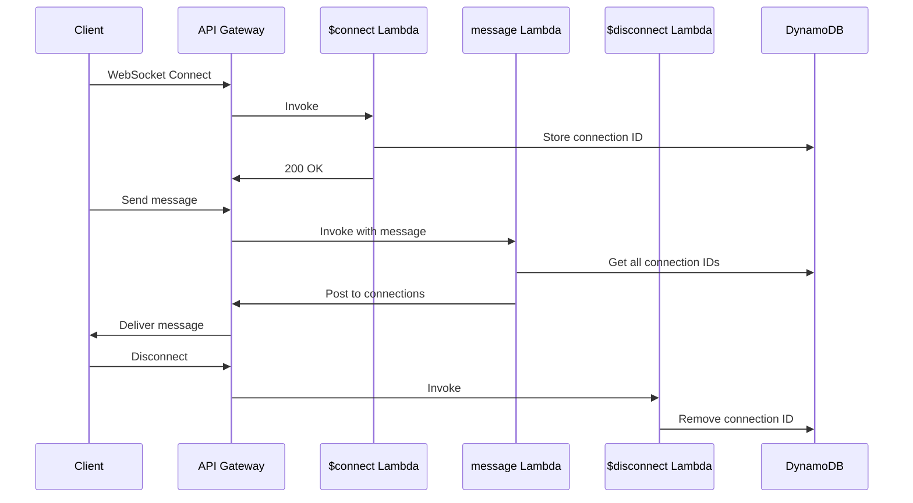

# How to Build a Serverless WebSocket API with API Gateway

Author: [nawazdhandala](https://github.com/nawazdhandala)

Tags: AWS, API Gateway, WebSocket, Lambda, Serverless, Real-Time

Description: Build a real-time serverless WebSocket API using Amazon API Gateway and Lambda for chat, notifications, and live updates

---

HTTP is request-response. The client asks, the server answers, and the connection closes. But for real-time features like chat, live notifications, collaborative editing, and dashboards, you need the server to push data to the client without being asked. That is what WebSockets are for.

Amazon API Gateway supports WebSocket APIs natively. Combined with Lambda for business logic and DynamoDB for connection tracking, you can build a fully serverless real-time system that scales automatically and costs nothing when idle.

## How WebSocket APIs Work on API Gateway

When a client connects, API Gateway establishes a persistent WebSocket connection and triggers your `$connect` route handler. When the client sends a message, API Gateway triggers the appropriate route handler based on the message content. When the client disconnects, the `$disconnect` route fires.



## Step 1: Create the WebSocket API

```bash
# Create a WebSocket API with selection expression for routing messages
aws apigatewayv2 create-api \
  --name my-websocket-api \
  --protocol-type WEBSOCKET \
  --route-selection-expression '$request.body.action'
```

The `route-selection-expression` tells API Gateway how to route incoming messages. With `$request.body.action`, a message like `{"action": "sendMessage", "content": "hello"}` routes to the `sendMessage` route.

## Step 2: Create the DynamoDB Connections Table

Track active WebSocket connections:

```bash
# Create table to track active WebSocket connections
aws dynamodb create-table \
  --table-name websocket-connections \
  --attribute-definitions AttributeName=connectionId,AttributeType=S \
  --key-schema AttributeName=connectionId,KeyType=HASH \
  --billing-mode PAY_PER_REQUEST
```

## Step 3: Build the Lambda Handlers

### $connect Handler

```python
# Handles new WebSocket connections by storing the connection ID
import boto3
import os

dynamodb = boto3.resource('dynamodb')
table = dynamodb.Table(os.environ['CONNECTIONS_TABLE'])

def handler(event, context):
    connection_id = event['requestContext']['connectionId']

    # Store connection with optional metadata
    table.put_item(Item={
        'connectionId': connection_id,
        'connectedAt': event['requestContext']['connectedAt'],
        'sourceIp': event['requestContext']['identity']['sourceIp']
    })

    return {'statusCode': 200, 'body': 'Connected'}
```

### $disconnect Handler

```python
# Cleans up connection records when a client disconnects
import boto3
import os

dynamodb = boto3.resource('dynamodb')
table = dynamodb.Table(os.environ['CONNECTIONS_TABLE'])

def handler(event, context):
    connection_id = event['requestContext']['connectionId']

    # Remove the connection record
    table.delete_item(Key={'connectionId': connection_id})

    return {'statusCode': 200, 'body': 'Disconnected'}
```

### sendMessage Handler

This is where the real work happens. When a client sends a message, broadcast it to all connected clients:

```python
# Broadcasts a message to all connected WebSocket clients
import boto3
import json
import os

dynamodb = boto3.resource('dynamodb')
table = dynamodb.Table(os.environ['CONNECTIONS_TABLE'])

def handler(event, context):
    # Extract the message and sender info
    connection_id = event['requestContext']['connectionId']
    body = json.loads(event['body'])
    message = body.get('content', '')

    # Get the API Gateway management endpoint
    domain = event['requestContext']['domainName']
    stage = event['requestContext']['stage']
    endpoint_url = f'https://{domain}/{stage}'

    # Create the API Gateway management client
    apigw = boto3.client(
        'apigatewaymanagementapi',
        endpoint_url=endpoint_url
    )

    # Get all active connections
    connections = table.scan()['Items']

    # Broadcast the message to all connected clients
    broadcast_payload = json.dumps({
        'action': 'message',
        'content': message,
        'sender': connection_id
    }).encode('utf-8')

    stale_connections = []

    for conn in connections:
        target_id = conn['connectionId']
        try:
            apigw.post_to_connection(
                ConnectionId=target_id,
                Data=broadcast_payload
            )
        except apigw.exceptions.GoneException:
            # Client disconnected without clean disconnect
            stale_connections.append(target_id)
        except Exception as e:
            print(f'Error sending to {target_id}: {e}')

    # Clean up stale connections
    for stale_id in stale_connections:
        table.delete_item(Key={'connectionId': stale_id})

    return {'statusCode': 200, 'body': 'Message sent'}
```

## Step 4: Create Routes and Integrations

```bash
# Create the $connect route integration
CONNECT_INTEGRATION=$(aws apigatewayv2 create-integration \
  --api-id YOUR_API_ID \
  --integration-type AWS_PROXY \
  --integration-uri arn:aws:lambda:us-east-1:123456789012:function:ws-connect \
  --query IntegrationId --output text)

aws apigatewayv2 create-route \
  --api-id YOUR_API_ID \
  --route-key '$connect' \
  --target "integrations/$CONNECT_INTEGRATION"

# Create the $disconnect route integration
DISCONNECT_INTEGRATION=$(aws apigatewayv2 create-integration \
  --api-id YOUR_API_ID \
  --integration-type AWS_PROXY \
  --integration-uri arn:aws:lambda:us-east-1:123456789012:function:ws-disconnect \
  --query IntegrationId --output text)

aws apigatewayv2 create-route \
  --api-id YOUR_API_ID \
  --route-key '$disconnect' \
  --target "integrations/$DISCONNECT_INTEGRATION"

# Create the sendMessage route integration
MESSAGE_INTEGRATION=$(aws apigatewayv2 create-integration \
  --api-id YOUR_API_ID \
  --integration-type AWS_PROXY \
  --integration-uri arn:aws:lambda:us-east-1:123456789012:function:ws-send-message \
  --query IntegrationId --output text)

aws apigatewayv2 create-route \
  --api-id YOUR_API_ID \
  --route-key 'sendMessage' \
  --target "integrations/$MESSAGE_INTEGRATION"
```

## Step 5: Deploy the API

```bash
# Create a deployment stage
aws apigatewayv2 create-stage \
  --api-id YOUR_API_ID \
  --stage-name production \
  --auto-deploy
```

Your WebSocket URL will be: `wss://YOUR_API_ID.execute-api.us-east-1.amazonaws.com/production`

## Step 6: Grant Lambda Permissions

The sendMessage Lambda needs permission to call the API Gateway management API:

```json
// IAM policy allowing Lambda to send messages to WebSocket connections
{
  "Version": "2012-10-17",
  "Statement": [
    {
      "Effect": "Allow",
      "Action": "execute-api:ManageConnections",
      "Resource": "arn:aws:execute-api:us-east-1:123456789012:YOUR_API_ID/production/POST/@connections/*"
    },
    {
      "Effect": "Allow",
      "Action": [
        "dynamodb:Scan",
        "dynamodb:PutItem",
        "dynamodb:DeleteItem"
      ],
      "Resource": "arn:aws:dynamodb:us-east-1:123456789012:table/websocket-connections"
    }
  ]
}
```

## Testing the WebSocket

Use `wscat` (install with `npm install -g wscat`):

```bash
# Connect to the WebSocket API
wscat -c wss://YOUR_API_ID.execute-api.us-east-1.amazonaws.com/production

# Send a message (in the wscat terminal)
> {"action": "sendMessage", "content": "Hello, WebSocket!"}
```

Open multiple terminals with `wscat` to see messages broadcast to all clients.

## Adding Authentication

For production, authenticate connections on the `$connect` route. API Gateway supports Lambda authorizers for WebSocket APIs:

```python
# Lambda authorizer for WebSocket API connections
def handler(event, context):
    # Extract token from query string or headers
    token = event.get('queryStringParameters', {}).get('token', '')

    try:
        # Validate the token (JWT, API key, etc.)
        user = validate_token(token)

        return {
            'principalId': user['userId'],
            'policyDocument': {
                'Version': '2012-10-17',
                'Statement': [{
                    'Action': 'execute-api:Invoke',
                    'Effect': 'Allow',
                    'Resource': event['methodArn']
                }]
            },
            'context': {
                'userId': user['userId'],
                'username': user['username']
            }
        }
    except Exception:
        raise Exception('Unauthorized')
```

Clients connect with: `wss://YOUR_API_ID.execute-api.us-east-1.amazonaws.com/production?token=YOUR_JWT_TOKEN`

## Scaling Considerations

For applications with thousands of connections, scanning the entire DynamoDB table to broadcast messages becomes slow. Use a GSI on a `room` or `channel` attribute to query only relevant connections:

```bash
# Add a GSI for room-based message routing
aws dynamodb update-table \
  --table-name websocket-connections \
  --attribute-definitions AttributeName=roomId,AttributeType=S \
  --global-secondary-index-updates '[{
    "Create": {
      "IndexName": "room-index",
      "KeySchema": [{"AttributeName": "roomId", "KeyType": "HASH"}],
      "Projection": {"ProjectionType": "ALL"}
    }
  }]'
```

Then query by room instead of scanning:

```python
# Query connections for a specific room instead of scanning all
connections = table.query(
    IndexName='room-index',
    KeyConditionExpression='roomId = :room',
    ExpressionAttributeValues={':room': room_id}
)['Items']
```

## Wrapping Up

Serverless WebSocket APIs on API Gateway give you real-time capabilities without managing any infrastructure. The combination of API Gateway for connection management, Lambda for business logic, and DynamoDB for connection state is a proven pattern used in production chat applications, live dashboards, and collaborative tools. Start simple with the broadcast pattern above and add rooms, authentication, and message history as your application grows.
