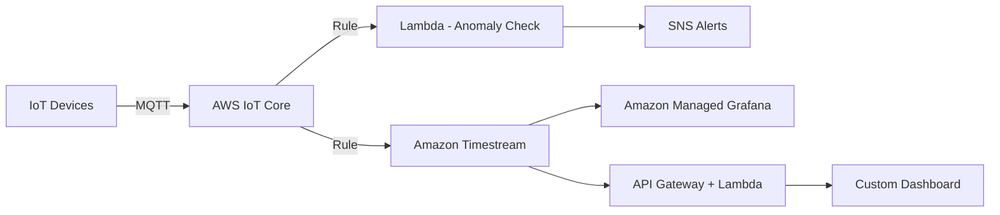

# How to Build a Time-Series Dashboard for IoT on AWS

Author: [nawazdhandala](https://github.com/nawazdhandala)

Tags: AWS, IoT Core, Timestream, Grafana, Lambda, Time-Series, Dashboard

Description: Learn how to build a real-time time-series dashboard for IoT data on AWS using IoT Core, Amazon Timestream, and Grafana for visualization.

---

IoT devices generate a relentless stream of time-stamped data. Temperature readings, pressure values, GPS coordinates, energy consumption - it all needs to go somewhere, and you need to be able to visualize it in near real-time. AWS has a purpose-built stack for this: IoT Core for ingestion, Amazon Timestream for storage, and Amazon Managed Grafana for visualization.

This guide covers how to wire these services together into a production-ready IoT time-series dashboard.

## Architecture Overview



Devices publish telemetry over MQTT to IoT Core. An IoT rule routes data directly into Timestream. Grafana connects to Timestream for visualization. Optionally, a Lambda function performs real-time anomaly detection and sends alerts through SNS.

## Setting Up Amazon Timestream

Timestream is AWS's serverless time-series database. It automatically manages data lifecycle by moving data between an in-memory store (fast queries on recent data) and a magnetic store (cheap queries on historical data).

Create a database and table:

```python
# Create Timestream database and table for IoT data
import boto3

timestream_write = boto3.client('timestream-write')

# Create database
timestream_write.create_database(
    DatabaseName='iot-telemetry'
)

# Create table with retention policies
timestream_write.create_table(
    DatabaseName='iot-telemetry',
    TableName='sensor-data',
    RetentionProperties={
        'MemoryStoreRetentionPeriodInHours': 24,      # Last 24 hours in memory
        'MagneticStoreRetentionPeriodInDays': 365      # 1 year on magnetic
    },
    MagneticStoreWriteProperties={
        'EnableMagneticStoreWrites': True
    }
)
```

The memory store gives you sub-millisecond query latency for recent data, which is exactly what you need for a real-time dashboard. Older data transitions to the magnetic store automatically.

## Configuring IoT Core

First, register your devices and set up the MQTT message format. A standard telemetry payload looks like:

```json
{
  "deviceId": "sensor-factory-A-001",
  "timestamp": 1707724800,
  "temperature": 72.5,
  "humidity": 45.2,
  "pressure": 1013.25,
  "batteryLevel": 87
}
```

## Creating the IoT Rule for Timestream

IoT Core rules can route MQTT messages directly into Timestream without any Lambda function in between. This is the most efficient path.

```json
{
  "sql": "SELECT * FROM 'sensors/+/telemetry'",
  "actions": [
    {
      "timestream": {
        "roleArn": "arn:aws:iam::123456789:role/IoTTimestreamRole",
        "databaseName": "iot-telemetry",
        "tableName": "sensor-data",
        "dimensions": [
          {
            "name": "deviceId",
            "value": "${deviceId}"
          }
        ],
        "timestamp": {
          "value": "${timestamp}",
          "unit": "SECONDS"
        }
      }
    }
  ]
}
```

This rule listens on the MQTT topic pattern `sensors/+/telemetry`, extracts the device ID as a dimension, and writes all numeric fields as measures into Timestream.

Here is the CloudFormation version for infrastructure as code:

```yaml
# IoT Rule to route telemetry to Timestream
IoTTimestreamRule:
  Type: AWS::IoT::TopicRule
  Properties:
    RuleName: SensorToTimestream
    TopicRulePayload:
      Sql: "SELECT * FROM 'sensors/+/telemetry'"
      Actions:
        - Timestream:
            RoleArn: !GetAtt IoTTimestreamRole.Arn
            DatabaseName: iot-telemetry
            TableName: sensor-data
            Dimensions:
              - Name: deviceId
                Value: "${deviceId}"
            Timestamp:
              Value: "${timestamp}"
              Unit: SECONDS
```

## Writing Data Programmatically

Sometimes you need to write data from a Lambda function or backend service rather than directly from IoT Core rules. Here is how to write records to Timestream:

```python
# Write multi-measure records to Timestream
import boto3
import time

timestream_write = boto3.client('timestream-write')

def write_sensor_data(device_id, temperature, humidity, pressure):
    current_time = str(int(time.time() * 1000))  # Milliseconds

    record = {
        'Dimensions': [
            {'Name': 'deviceId', 'Value': device_id, 'DimensionValueType': 'VARCHAR'}
        ],
        'MeasureName': 'sensor_readings',
        'MeasureValueType': 'MULTI',
        'MeasureValues': [
            {'Name': 'temperature', 'Value': str(temperature), 'Type': 'DOUBLE'},
            {'Name': 'humidity', 'Value': str(humidity), 'Type': 'DOUBLE'},
            {'Name': 'pressure', 'Value': str(pressure), 'Type': 'DOUBLE'}
        ],
        'Time': current_time,
        'TimeUnit': 'MILLISECONDS'
    }

    timestream_write.write_records(
        DatabaseName='iot-telemetry',
        TableName='sensor-data',
        Records=[record]
    )
```

Multi-measure records are more efficient than single-measure records because you write one row per timestamp instead of one row per metric.

## Querying Timestream Data

Timestream uses SQL with time-series extensions. Here are some useful queries for dashboards:

```sql
-- Latest reading per device
SELECT deviceId,
       max_by(temperature, time) as latest_temp,
       max_by(humidity, time) as latest_humidity
FROM "iot-telemetry"."sensor-data"
WHERE time > ago(1h)
GROUP BY deviceId

-- Hourly averages for a specific device
SELECT bin(time, 1h) as hour,
       avg(temperature) as avg_temp,
       min(temperature) as min_temp,
       max(temperature) as max_temp
FROM "iot-telemetry"."sensor-data"
WHERE deviceId = 'sensor-factory-A-001'
  AND time > ago(24h)
GROUP BY bin(time, 1h)
ORDER BY hour DESC

-- Detect readings outside normal range
SELECT deviceId, time, temperature
FROM "iot-telemetry"."sensor-data"
WHERE time > ago(1h)
  AND (temperature > 100 OR temperature < 30)
ORDER BY time DESC
```

## Setting Up Amazon Managed Grafana

Amazon Managed Grafana provides a fully managed Grafana instance with native Timestream support.

Create the workspace through CloudFormation or the console:

```yaml
# Managed Grafana workspace
GrafanaWorkspace:
  Type: AWS::Grafana::Workspace
  Properties:
    Name: iot-dashboard
    AccountAccessType: CURRENT_ACCOUNT
    AuthenticationProviders:
      - AWS_SSO
    PermissionType: SERVICE_MANAGED
    DataSources:
      - TIMESTREAM
    RoleArn: !GetAtt GrafanaRole.Arn
```

Once the workspace is running, add Timestream as a data source in the Grafana UI. The connection is straightforward since Grafana has a built-in Timestream plugin.

## Building Dashboard Panels

In Grafana, create panels using Timestream queries. A typical IoT dashboard includes:

1. **Current values panel** - Shows the latest reading from each sensor using a stat or gauge visualization
2. **Time-series graph** - Shows temperature, humidity, and pressure over time
3. **Heatmap** - Shows device activity patterns across the day
4. **Alert list** - Shows recent anomalous readings

For the time-series graph, use this query in Grafana:

```sql
-- Grafana time-series panel query
SELECT time, deviceId, temperature
FROM "iot-telemetry"."sensor-data"
WHERE deviceId IN ($devices)
  AND $__timeFilter
ORDER BY time
```

The `$__timeFilter` macro is a Grafana variable that automatically maps to the dashboard's selected time range. The `$devices` variable lets users filter by device.

## Adding Real-Time Anomaly Detection

A Lambda function triggered by IoT Core can check readings against thresholds and historical patterns:

```python
# Real-time anomaly detection on incoming sensor data
import boto3
import json

sns = boto3.client('sns')
timestream_query = boto3.client('timestream-query')

def handler(event, context):
    device_id = event['deviceId']
    temperature = event['temperature']

    # Get historical average for this device
    query = f"""
        SELECT avg(temperature) as avg_temp, stddev(temperature) as std_temp
        FROM "iot-telemetry"."sensor-data"
        WHERE deviceId = '{device_id}'
          AND time > ago(7d)
    """

    result = timestream_query.query(QueryString=query)
    rows = result['Rows']

    if rows:
        avg_temp = float(rows[0]['Data'][0]['ScalarValue'])
        std_temp = float(rows[0]['Data'][1]['ScalarValue'])

        # Alert if reading is more than 3 standard deviations from mean
        if abs(temperature - avg_temp) > 3 * std_temp:
            sns.publish(
                TopicArn='arn:aws:sns:us-east-1:123456789:iot-anomalies',
                Subject=f'Anomaly: {device_id}',
                Message=json.dumps({
                    'deviceId': device_id,
                    'temperature': temperature,
                    'expectedRange': f'{avg_temp - 3*std_temp:.1f} to {avg_temp + 3*std_temp:.1f}'
                })
            )
```

For a deeper dive into building anomaly detection pipelines on AWS, check out our guide on [building an anomaly detection system](https://oneuptime.com/blog/post/2026-02-12-build-an-anomaly-detection-system-on-aws/view).

## Cost Optimization Tips

Timestream pricing is based on writes, storage, and queries. Here is how to keep costs down:

- **Batch writes**: Send multiple records in a single write call (up to 100 records per request)
- **Use multi-measure records**: One row per timestamp instead of one row per metric reduces write costs
- **Set appropriate retention**: Keep memory store retention short (hours to days) and magnetic store retention based on actual needs
- **Optimize queries**: Avoid full table scans, always filter by time range, and use dimensions in WHERE clauses

## Wrapping Up

The combination of IoT Core, Timestream, and Managed Grafana gives you a complete IoT dashboard stack with minimal operational overhead. IoT Core handles device connectivity and message routing, Timestream provides a purpose-built time-series database that manages data lifecycle automatically, and Grafana gives you rich visualization out of the box.

The key to a good IoT dashboard is not just showing data but making it actionable. Add anomaly detection, set up alerts, and give operators the ability to drill down from overview dashboards to individual device metrics. Start simple and iterate based on what your users actually need to see.
