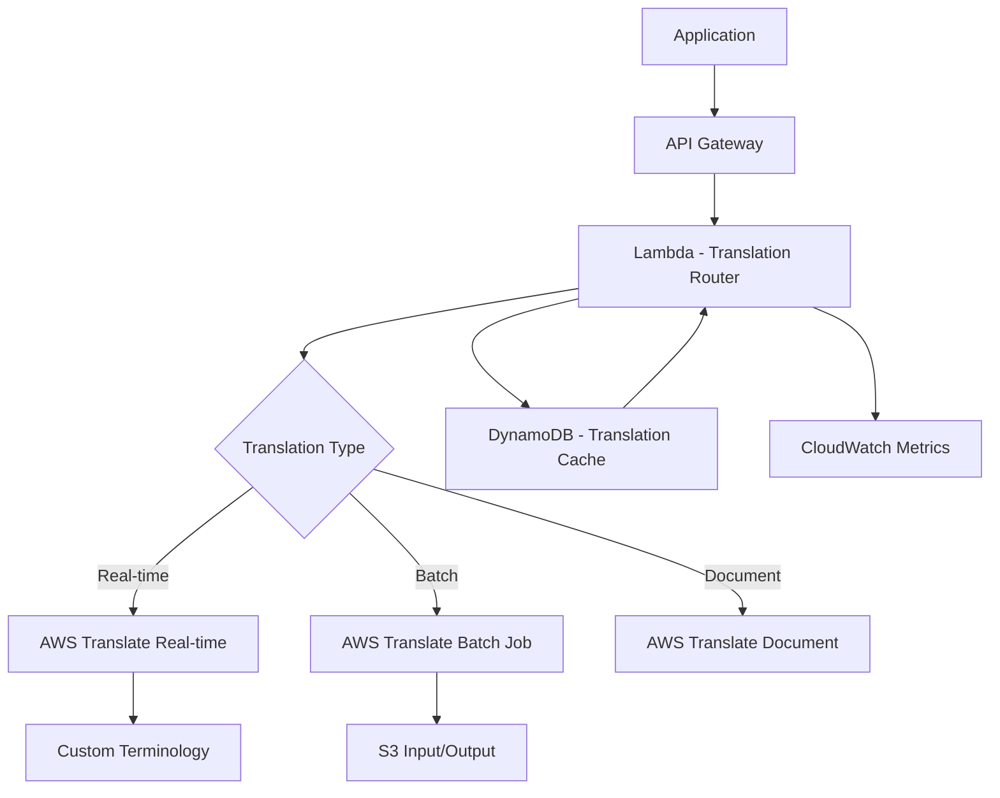

# How to Build a Translation Service with AWS Translate

Author: [nawazdhandala](https://github.com/nawazdhandala)

Tags: AWS, Translate, Lambda, Localization, NLP

Description: Build a real-time translation service using AWS Translate with custom terminology, batch processing, and automatic language detection for multilingual apps.

---

Going multilingual is no longer optional for products with global ambitions. But professional translation is expensive and slow. Machine translation has gotten good enough that for many use cases - customer support, user-generated content, internal documentation - it delivers usable results instantly.

AWS Translate supports 75+ languages with neural machine translation. It handles real-time translation, batch processing of documents, custom terminology for domain-specific terms, and automatic language detection. In this guide, we will build a translation service that covers all these scenarios.

## Architecture



## Real-Time Text Translation

The core functionality - translate text on the fly:

```python
# Lambda for real-time text translation
import boto3
import json
import hashlib

translate = boto3.client('translate')
comprehend = boto3.client('comprehend')
dynamodb = boto3.resource('dynamodb')
cache_table = dynamodb.Table('TranslationCache')

def handler(event, context):
    body = json.loads(event['body'])
    text = body['text']
    target_language = body['targetLanguage']
    source_language = body.get('sourceLanguage', 'auto')
    terminology_names = body.get('terminologyNames', [])

    # Check cache first
    cache_key = generate_cache_key(text, target_language, source_language)
    cached = get_cached_translation(cache_key)
    if cached:
        return respond(200, {
            'translatedText': cached['translatedText'],
            'sourceLanguage': cached['sourceLanguage'],
            'cached': True
        })

    # Auto-detect source language if not specified
    if source_language == 'auto':
        lang_response = comprehend.detect_dominant_language(Text=text[:500])
        source_language = lang_response['Languages'][0]['LanguageCode']

    # Skip translation if source and target are the same
    if source_language == target_language:
        return respond(200, {
            'translatedText': text,
            'sourceLanguage': source_language,
            'note': 'Source and target languages are the same'
        })

    # Translate the text
    params = {
        'Text': text,
        'SourceLanguageCode': source_language,
        'TargetLanguageCode': target_language
    }

    if terminology_names:
        params['TerminologyNames'] = terminology_names

    response = translate.translate_text(**params)

    result = {
        'translatedText': response['TranslatedText'],
        'sourceLanguage': response['SourceLanguageCode'],
        'targetLanguage': response['TargetLanguageCode'],
        'cached': False
    }

    # Cache the translation
    cache_translation(cache_key, result)

    return respond(200, result)

def generate_cache_key(text, target_lang, source_lang):
    """Generate a deterministic cache key for a translation request."""
    content = f'{source_lang}:{target_lang}:{text}'
    return hashlib.sha256(content.encode()).hexdigest()

def get_cached_translation(cache_key):
    """Look up a cached translation."""
    try:
        response = cache_table.get_item(Key={'cacheKey': cache_key})
        return response.get('Item')
    except Exception:
        return None

def cache_translation(cache_key, result):
    """Cache a translation result."""
    import time
    cache_table.put_item(Item={
        'cacheKey': cache_key,
        'translatedText': result['translatedText'],
        'sourceLanguage': result['sourceLanguage'],
        'targetLanguage': result['targetLanguage'],
        'ttl': int(time.time()) + (7 * 86400)  # Cache for 7 days
    })

def respond(status, body):
    return {
        'statusCode': status,
        'headers': {'Content-Type': 'application/json'},
        'body': json.dumps(body)
    }
```

## Custom Terminology

Custom terminology ensures that your brand names, product names, and domain-specific terms are translated correctly (or not translated at all):

```python
# Manage custom terminology for domain-specific translations
import boto3
import csv
import io

translate = boto3.client('translate')

def create_terminology(name, terms, source_language='en'):
    """Create a custom terminology with a list of term mappings."""
    # Build CSV format required by Translate
    output = io.StringIO()
    writer = csv.writer(output)

    # Header row: source language + target languages
    target_languages = set()
    for term in terms:
        target_languages.update(term['translations'].keys())

    header = [source_language] + sorted(target_languages)
    writer.writerow(header)

    # Data rows
    for term in terms:
        row = [term['source']]
        for lang in sorted(target_languages):
            row.append(term['translations'].get(lang, ''))
        writer.writerow(row)

    csv_content = output.getvalue()

    response = translate.import_terminology(
        Name=name,
        MergeStrategy='OVERWRITE',
        Description=f'Custom terminology for {name}',
        TerminologyData={
            'File': csv_content.encode('utf-8'),
            'Format': 'CSV'
        }
    )

    return response

# Example: Create terminology for a tech company
create_terminology('tech-product-terms', [
    {
        'source': 'OneUptime',
        'translations': {
            'es': 'OneUptime',
            'fr': 'OneUptime',
            'de': 'OneUptime',
            'ja': 'OneUptime'
        }
    },
    {
        'source': 'dashboard',
        'translations': {
            'es': 'panel de control',
            'fr': 'tableau de bord',
            'de': 'Dashboard',
            'ja': 'dashboard'
        }
    },
    {
        'source': 'uptime monitoring',
        'translations': {
            'es': 'monitoreo de tiempo de actividad',
            'fr': 'surveillance de disponibilite',
            'de': 'Verfuegbarkeitsueberwachung',
            'ja': 'uptime monitoring'
        }
    }
])
```

## Batch Translation for Large Volumes

For translating large volumes of content (like entire help center articles or product catalogs), use batch translation:

```python
# Lambda to start and manage batch translation jobs
import boto3
import json
from datetime import datetime

translate = boto3.client('translate')
s3 = boto3.client('s3')

def start_batch_translation(input_bucket, input_prefix, output_bucket, output_prefix,
                            source_language, target_languages, terminology_names=None):
    """Start an asynchronous batch translation job."""
    params = {
        'JobName': f'batch-{datetime.utcnow().strftime("%Y%m%d-%H%M%S")}',
        'InputDataConfig': {
            'S3Uri': f's3://{input_bucket}/{input_prefix}',
            'ContentType': 'text/plain'
        },
        'OutputDataConfig': {
            'S3Uri': f's3://{output_bucket}/{output_prefix}'
        },
        'DataAccessRoleArn': 'arn:aws:iam::123456789:role/TranslateBatchRole',
        'SourceLanguageCode': source_language,
        'TargetLanguageCodes': target_languages
    }

    if terminology_names:
        params['TerminologyNames'] = terminology_names

    response = translate.start_text_translation_job(**params)

    return {
        'jobId': response['JobId'],
        'status': response['JobStatus']
    }

def check_batch_status(job_id):
    """Check the status of a batch translation job."""
    response = translate.describe_text_translation_job(JobId=job_id)
    job = response['TextTranslationJobProperties']

    return {
        'jobId': job['JobId'],
        'status': job['JobStatus'],
        'sourceLanguage': job['SourceLanguageCode'],
        'targetLanguages': job['TargetLanguageCodes'],
        'submittedDocuments': job.get('InputDataConfig', {}),
        'outputConfig': job.get('OutputDataConfig', {}),
        'message': job.get('Message', '')
    }

# Example: Translate help center articles to 5 languages
start_batch_translation(
    input_bucket='content-bucket',
    input_prefix='help-center/en/',
    output_bucket='content-bucket',
    output_prefix='help-center/translated/',
    source_language='en',
    target_languages=['es', 'fr', 'de', 'ja', 'pt'],
    terminology_names=['tech-product-terms']
)
```

## Document Translation

Translate entire documents (Word, PowerPoint, Excel, HTML) while preserving formatting:

```python
# Lambda for document translation preserving formatting
import boto3
import base64

translate = boto3.client('translate')

def translate_document(event, context):
    """Translate a document while preserving its format."""
    body = json.loads(event['body'])

    # Document can come from S3 or as base64-encoded bytes
    if 's3Bucket' in body:
        s3 = boto3.client('s3')
        obj = s3.get_object(Bucket=body['s3Bucket'], Key=body['s3Key'])
        document_bytes = obj['Body'].read()
        content_type = body.get('contentType', 'text/html')
    else:
        document_bytes = base64.b64decode(body['documentBase64'])
        content_type = body['contentType']

    response = translate.translate_document(
        Document={
            'Content': document_bytes,
            'ContentType': content_type  # text/html, text/plain,
                                         # application/vnd.openxmlformats-officedocument.wordprocessingml.document
        },
        SourceLanguageCode=body.get('sourceLanguage', 'auto'),
        TargetLanguageCode=body['targetLanguage'],
        TerminologyNames=body.get('terminologyNames', [])
    )

    translated_doc = base64.b64encode(
        response['TranslatedDocument']['Content']
    ).decode('utf-8')

    return {
        'statusCode': 200,
        'body': json.dumps({
            'translatedDocument': translated_doc,
            'sourceLanguage': response['SourceLanguageCode'],
            'targetLanguage': response['TargetLanguageCode']
        })
    }
```

## Building a Translation API with Rate Limiting

Wrap everything in a clean API with rate limiting and usage tracking:

```python
# Translation API with rate limiting and usage tracking
import boto3
import json
import time

dynamodb = boto3.resource('dynamodb')
usage_table = dynamodb.Table('TranslationUsage')

# Rate limits per tier
RATE_LIMITS = {
    'free': {'chars_per_month': 100000, 'requests_per_minute': 10},
    'pro': {'chars_per_month': 5000000, 'requests_per_minute': 100},
    'enterprise': {'chars_per_month': 50000000, 'requests_per_minute': 1000}
}

def check_rate_limit(user_id, tier, char_count):
    """Check if the user is within their rate limits."""
    limits = RATE_LIMITS.get(tier, RATE_LIMITS['free'])
    month_key = time.strftime('%Y-%m')

    # Get current month usage
    response = usage_table.get_item(
        Key={'userId': user_id, 'period': month_key}
    )

    current_usage = response.get('Item', {})
    total_chars = int(current_usage.get('totalChars', 0))

    if total_chars + char_count > limits['chars_per_month']:
        return False, f'Monthly character limit exceeded ({total_chars}/{limits["chars_per_month"]})'

    return True, None

def track_usage(user_id, char_count, source_lang, target_lang):
    """Track translation usage for billing."""
    month_key = time.strftime('%Y-%m')

    usage_table.update_item(
        Key={'userId': user_id, 'period': month_key},
        UpdateExpression='ADD totalChars :chars, requestCount :one',
        ExpressionAttributeValues={
            ':chars': char_count,
            ':one': 1
        }
    )
```

## Monitoring Your Translation Service

Translation APIs are latency-sensitive - users expect near-instant results. Monitor API response times, translation quality feedback, cache hit rates, and Translate API throttling. If batch jobs fail silently, content stays untranslated. Track job completion rates and processing times with [OneUptime](https://oneuptime.com/blog/post/build-a-voice-enabled-app-with-aws-lex-and-polly/view) for full pipeline visibility.

## Wrapping Up

AWS Translate gives you production-grade machine translation without the complexity of training and hosting your own models. The custom terminology feature is the differentiator for enterprise use cases - it ensures your brand and domain-specific terms are handled correctly across all target languages.

Start with real-time translation for your highest-traffic language pairs. Add caching to reduce costs and latency. Then expand to batch translation for content catalogs and document translation for business documents. At $15 per million characters, the cost is a fraction of professional translation while delivering instant results.
