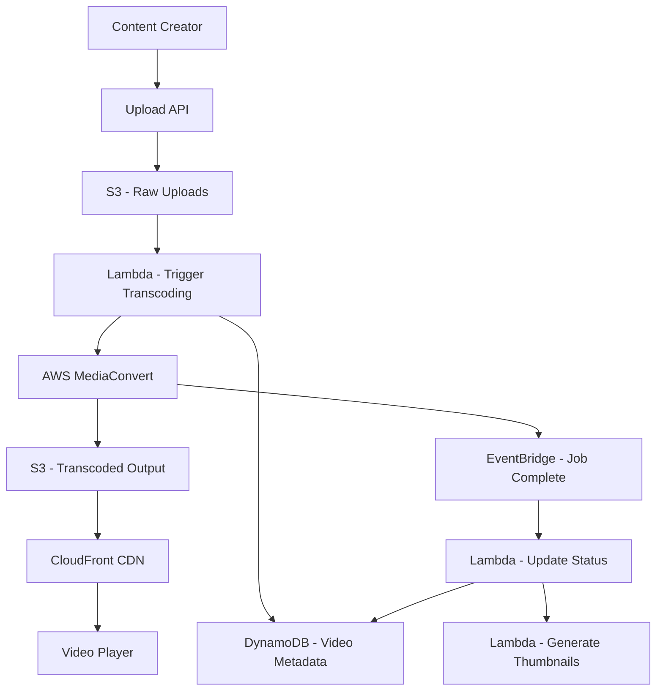

# How to Build a Video Streaming Platform on AWS

Author: [nawazdhandala](https://github.com/nawazdhandala)

Tags: AWS, Video Streaming, MediaConvert, CloudFront, S3, HLS, Transcoding

Description: Build a video streaming platform on AWS with upload, transcoding, adaptive bitrate streaming, and global content delivery

---

Video streaming is one of the most resource-intensive workloads in cloud computing. You need to accept uploads in various formats, transcode them into multiple resolutions and bitrates, store the output efficiently, and deliver it globally with minimal buffering. AWS has purpose-built services for every stage of this pipeline.

This guide walks through building a complete video streaming platform from upload to playback, using S3, MediaConvert, CloudFront, and DynamoDB.

## Architecture



## Step 1: Video Upload

Handle large file uploads using S3 presigned URLs for direct browser-to-S3 uploads:

```javascript
// upload-service/handler.js - Generate presigned upload URLs
const { S3Client, PutObjectCommand } = require('@aws-sdk/client-s3');
const { getSignedUrl } = require('@aws-sdk/s3-request-presigner');
const { v4: uuidv4 } = require('uuid');

const s3 = new S3Client({});
const RAW_BUCKET = process.env.RAW_BUCKET;

exports.getUploadUrl = async (event) => {
  const { filename, contentType, title, description } = JSON.parse(event.body);
  const userId = event.requestContext.authorizer.claims.sub;
  const videoId = uuidv4();

  // Generate a file extension from the content type
  const extension = contentType.split('/')[1] || 'mp4';
  const key = `uploads/${userId}/${videoId}.${extension}`;

  // Create presigned URL for direct upload to S3
  const command = new PutObjectCommand({
    Bucket: RAW_BUCKET,
    Key: key,
    ContentType: contentType,
    Metadata: {
      'video-id': videoId,
      'user-id': userId,
      'original-filename': filename,
    },
  });

  const uploadUrl = await getSignedUrl(s3, command, { expiresIn: 3600 });

  // Create video metadata record
  await docClient.send(new PutCommand({
    TableName: process.env.VIDEOS_TABLE,
    Item: {
      PK: `VIDEO#${videoId}`,
      SK: 'METADATA',
      videoId,
      userId,
      title,
      description,
      status: 'uploading',
      rawKey: key,
      createdAt: new Date().toISOString(),
      GSI1PK: `USER#${userId}`,
      GSI1SK: `VIDEO#${new Date().toISOString()}`,
    },
  }));

  return {
    statusCode: 200,
    body: JSON.stringify({ videoId, uploadUrl }),
  };
};
```

## Step 2: Trigger Transcoding

When a video lands in S3, trigger the transcoding pipeline:

```javascript
// transcoding/trigger.js - Start MediaConvert job when upload completes
const { MediaConvertClient, CreateJobCommand } = require('@aws-sdk/client-mediaconvert');

const mediaConvert = new MediaConvertClient({
  endpoint: process.env.MEDIACONVERT_ENDPOINT,
});

exports.handler = async (event) => {
  const bucket = event.Records[0].s3.bucket.name;
  const key = decodeURIComponent(event.Records[0].s3.object.key);
  const videoId = key.split('/').pop().split('.')[0];

  // Create MediaConvert job with multiple output resolutions
  const jobParams = {
    Role: process.env.MEDIACONVERT_ROLE,
    Settings: {
      Inputs: [{
        FileInput: `s3://${bucket}/${key}`,
        AudioSelectors: {
          'Audio Selector 1': { DefaultSelection: 'DEFAULT' },
        },
      }],
      OutputGroups: [
        // HLS adaptive bitrate output
        {
          Name: 'HLS Output',
          OutputGroupSettings: {
            Type: 'HLS_GROUP_SETTINGS',
            HlsGroupSettings: {
              Destination: `s3://${process.env.OUTPUT_BUCKET}/hls/${videoId}/`,
              SegmentLength: 6,
              MinSegmentLength: 0,
            },
          },
          Outputs: [
            // 1080p output
            createHlsOutput(1920, 1080, 5000000, 'high'),
            // 720p output
            createHlsOutput(1280, 720, 3000000, 'medium'),
            // 480p output
            createHlsOutput(854, 480, 1500000, 'low'),
            // 360p output for mobile
            createHlsOutput(640, 360, 800000, 'mobile'),
          ],
        },
        // Thumbnail output
        {
          Name: 'Thumbnails',
          OutputGroupSettings: {
            Type: 'FILE_GROUP_SETTINGS',
            FileGroupSettings: {
              Destination: `s3://${process.env.OUTPUT_BUCKET}/thumbnails/${videoId}/`,
            },
          },
          Outputs: [{
            ContainerSettings: { Container: 'RAW' },
            VideoDescription: {
              Width: 1280,
              Height: 720,
              CodecSettings: {
                Codec: 'FRAME_CAPTURE',
                FrameCaptureSettings: {
                  FramerateNumerator: 1,
                  FramerateDenominator: 10,
                  MaxCaptures: 10,
                  Quality: 80,
                },
              },
            },
          }],
        },
      ],
    },
  };

  const job = await mediaConvert.send(new CreateJobCommand(jobParams));

  // Update video status
  await updateVideoStatus(videoId, 'transcoding', { jobId: job.Job.Id });
};

// Helper to create an HLS output configuration
function createHlsOutput(width, height, bitrate, nameModifier) {
  return {
    NameModifier: `_${nameModifier}`,
    ContainerSettings: { Container: 'M3U8' },
    VideoDescription: {
      Width: width,
      Height: height,
      CodecSettings: {
        Codec: 'H_264',
        H264Settings: {
          RateControlMode: 'CBR',
          Bitrate: bitrate,
          GopSize: 2,
          GopSizeUnits: 'SECONDS',
        },
      },
    },
    AudioDescriptions: [{
      CodecSettings: {
        Codec: 'AAC',
        AacSettings: {
          Bitrate: 128000,
          CodingMode: 'CODING_MODE_2_0',
          SampleRate: 44100,
        },
      },
    }],
  };
}
```

## Step 3: Handle Transcoding Completion

MediaConvert sends events to EventBridge when jobs complete:

```javascript
// transcoding/complete.js - Handle transcoding completion
exports.handler = async (event) => {
  const detail = event.detail;
  const jobId = detail.jobId;
  const status = detail.status;

  // Find the video by job ID
  const video = await getVideoByJobId(jobId);

  if (status === 'COMPLETE') {
    const hlsUrl = `https://${process.env.CDN_DOMAIN}/hls/${video.videoId}/index.m3u8`;
    const thumbnailUrl = `https://${process.env.CDN_DOMAIN}/thumbnails/${video.videoId}/thumb.0000000.jpg`;

    await updateVideoStatus(video.videoId, 'ready', {
      hlsUrl,
      thumbnailUrl,
      duration: detail.outputGroupDetails[0].outputDetails[0].durationInMs / 1000,
    });

    // Notify the content creator
    await sendNotification(video.userId, {
      type: 'VIDEO_READY',
      videoId: video.videoId,
      title: video.title,
    });
  } else if (status === 'ERROR') {
    await updateVideoStatus(video.videoId, 'failed', {
      error: detail.errorMessage,
    });
  }
};
```

## Step 4: CloudFront Distribution for Streaming

Configure CloudFront for HLS streaming with signed URLs for access control:

```bash
# Create a CloudFront distribution for video delivery
aws cloudfront create-distribution \
  --distribution-config '{
    "Origins": {
      "Items": [{
        "DomainName": "video-output-bucket.s3.amazonaws.com",
        "Id": "S3Origin",
        "S3OriginConfig": {
          "OriginAccessIdentity": "origin-access-identity/cloudfront/EXAMPLE"
        }
      }]
    },
    "DefaultCacheBehavior": {
      "TargetOriginId": "S3Origin",
      "ViewerProtocolPolicy": "redirect-to-https",
      "TrustedKeyGroups": {
        "Enabled": true,
        "Quantity": 1,
        "Items": ["KEY_GROUP_ID"]
      },
      "CachePolicyId": "658327ea-f89d-4fab-a63d-7e88639e58f6"
    },
    "CacheBehaviors": {
      "Items": [{
        "PathPattern": "hls/*/*.m3u8",
        "TargetOriginId": "S3Origin",
        "ViewerProtocolPolicy": "redirect-to-https",
        "CachePolicyId": "CACHE_POLICY_SHORT_TTL"
      }]
    },
    "Enabled": true
  }'
```

Generate signed URLs for video access:

```javascript
// playback/handler.js - Generate signed playback URLs
const { getSignedUrl } = require('@aws-sdk/cloudfront-signer');

exports.getPlaybackUrl = async (event) => {
  const videoId = event.pathParameters.videoId;
  const video = await getVideo(videoId);

  if (video.status !== 'ready') {
    return { statusCode: 404, body: JSON.stringify({ error: 'Video not available' }) };
  }

  // Generate signed URL that expires in 4 hours
  const signedUrl = getSignedUrl({
    url: `https://${process.env.CDN_DOMAIN}/hls/${videoId}/index.m3u8`,
    keyPairId: process.env.CLOUDFRONT_KEY_PAIR_ID,
    privateKey: process.env.CLOUDFRONT_PRIVATE_KEY,
    dateLessThan: new Date(Date.now() + 4 * 60 * 60 * 1000).toISOString(),
  });

  return {
    statusCode: 200,
    body: JSON.stringify({
      playbackUrl: signedUrl,
      thumbnailUrl: video.thumbnailUrl,
      duration: video.duration,
    }),
  };
};
```

## Step 5: Video Player Integration

On the frontend, use HLS.js for cross-browser HLS playback:

```html
<!-- Simple video player with HLS.js -->
<video id="video-player" controls></video>

<script src="https://cdn.jsdelivr.net/npm/hls.js@latest"></script>
<script>
  // Initialize HLS.js player
  const video = document.getElementById('video-player');
  const hlsUrl = 'SIGNED_HLS_URL_HERE';

  if (Hls.isSupported()) {
    const hls = new Hls({
      // Start with the lowest quality for fast initial load
      startLevel: 0,
      // Auto quality switching based on bandwidth
      autoLevelEnabled: true,
    });
    hls.loadSource(hlsUrl);
    hls.attachMedia(video);
  } else if (video.canPlayType('application/vnd.apple.mpegurl')) {
    // Native HLS support (Safari)
    video.src = hlsUrl;
  }
</script>
```

## Step 6: Analytics and View Counting

Track video views and engagement:

```javascript
// analytics/handler.js - Video analytics via Kinesis Firehose
const { FirehoseClient, PutRecordCommand } = require('@aws-sdk/client-firehose');

const firehose = new FirehoseClient({});

exports.trackEvent = async (event) => {
  const { videoId, eventType, timestamp, position, quality } = JSON.parse(event.body);
  const userId = event.requestContext.authorizer?.claims?.sub || 'anonymous';

  await firehose.send(new PutRecordCommand({
    DeliveryStreamName: process.env.ANALYTICS_STREAM,
    Record: {
      Data: Buffer.from(JSON.stringify({
        videoId,
        userId,
        eventType,  // 'play', 'pause', 'seek', 'quality_change', 'buffer', 'complete'
        timestamp,
        position,   // Current playback position in seconds
        quality,    // Current quality level
        userAgent: event.headers['user-agent'],
      }) + '\n'),
    },
  }));

  // Update view count atomically
  if (eventType === 'play') {
    await docClient.send(new UpdateCommand({
      TableName: process.env.VIDEOS_TABLE,
      Key: { PK: `VIDEO#${videoId}`, SK: 'METADATA' },
      UpdateExpression: 'ADD viewCount :one',
      ExpressionAttributeValues: { ':one': 1 },
    }));
  }

  return { statusCode: 200, body: 'OK' };
};
```

## Cost Optimization

Video streaming costs can spiral quickly. Key optimizations:

- **Transcode once, cache forever**: Set long cache TTLs on transcoded segments since they never change
- **Use MediaConvert reserved pricing**: If you transcode more than 100 hours/month, reserved pricing saves 50%+
- **Clean up raw uploads**: Delete the original upload from S3 after transcoding completes
- **Use S3 Intelligent-Tiering**: Older videos that are rarely watched automatically move to cheaper storage

## Monitoring

Track these metrics for your streaming platform:

- Transcoding success/failure rates
- Average transcoding time per resolution
- Video start time (time from click to first frame)
- Rebuffering ratio
- CDN cache hit rate
- Storage costs per video

For a comprehensive monitoring setup, see our guide on [building a metrics collection system on AWS](https://oneuptime.com/blog/post/build-a-metrics-collection-system-on-aws/view).

## Wrapping Up

Building a video streaming platform on AWS requires coordinating several services, but each service does its part well. S3 handles storage, MediaConvert handles transcoding, CloudFront handles delivery, and DynamoDB handles metadata. The result is a platform that can scale from a handful of videos to millions, with costs that scale proportionally. Start with the basic pipeline of upload, transcode, and deliver, then add features like analytics, comments, and recommendations as your platform grows.
