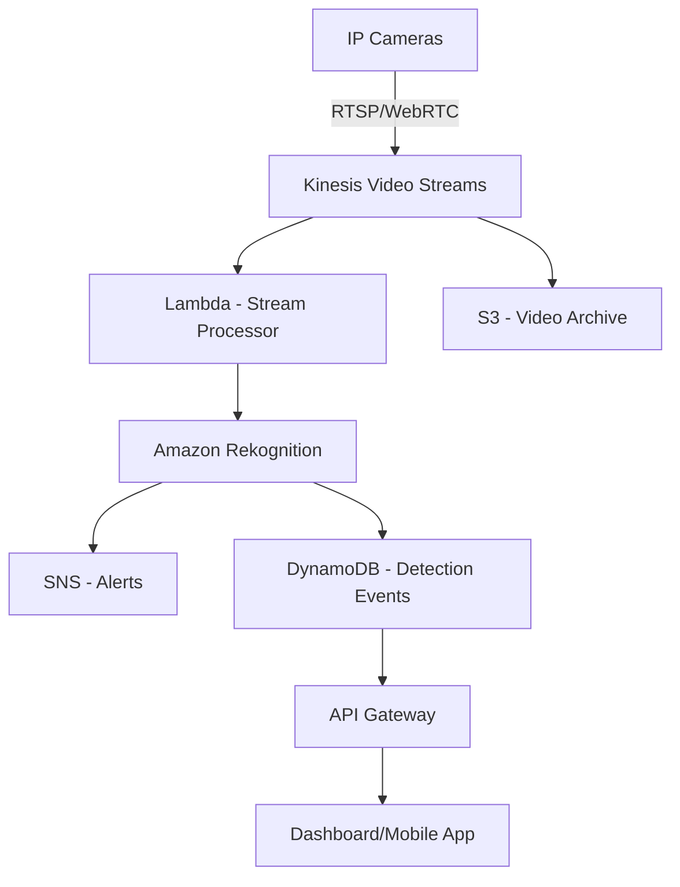

# How to Build a Video Surveillance System on AWS

Author: [nawazdhandala](https://github.com/nawazdhandala)

Tags: AWS, Kinesis Video Streams, Rekognition, IoT, Lambda, S3, Video Surveillance

Description: Learn how to build a scalable video surveillance system on AWS using Kinesis Video Streams, Amazon Rekognition, and S3 for storage and analysis.

---

Video surveillance systems have traditionally been expensive, hardware-heavy installations that require on-premises servers and custom software. AWS changes that equation entirely. With services like Kinesis Video Streams, Amazon Rekognition, and S3, you can build a cloud-native surveillance system that scales from a single camera to thousands without managing any video processing infrastructure.

This guide walks through building a production-ready video surveillance system on AWS.

## Architecture Overview



Cameras send video to Kinesis Video Streams. A Lambda function processes the stream, sending frames to Rekognition for face detection, object detection, or person tracking. Results go to DynamoDB for querying, and SNS handles real-time alerts. Archived video lives in S3.

## Setting Up Kinesis Video Streams

Kinesis Video Streams is the ingestion layer. It handles the complexity of receiving, storing, and making video data available for processing.

Create a stream for each camera:

```python
# Create a Kinesis Video Stream for a camera
import boto3

kvs = boto3.client('kinesisvideo')

response = kvs.create_stream(
    StreamName='camera-lobby-01',
    DataRetentionInHours=168,  # 7 days retention
    MediaType='video/h264',
    Tags={
        'Location': 'Building-A-Lobby',
        'CameraType': 'Indoor'
    }
)

stream_arn = response['StreamARN']
print(f"Stream created: {stream_arn}")
```

The `DataRetentionInHours` parameter controls how long Kinesis keeps the video. After that, video is gone unless you archive it to S3.

## Connecting Cameras

Most modern IP cameras support RTSP. AWS provides a producer SDK that you can run on edge devices to push RTSP streams into Kinesis Video Streams.

For a typical setup, you would run the GStreamer-based producer on a small edge device like a Raspberry Pi or an AWS IoT Greengrass core device:

```bash
# Install and run the Kinesis Video Streams producer
# This runs on the edge device near the camera
export AWS_DEFAULT_REGION=us-east-1
export STREAM_NAME=camera-lobby-01

# GStreamer pipeline to capture RTSP and send to KVS
gst-launch-1.0 rtspsrc location="rtsp://camera-ip:554/stream" \
  short-header=TRUE ! rtph264depay ! h264parse \
  ! kvssink stream-name="$STREAM_NAME" \
  storage-size=512 \
  access-key="$AWS_ACCESS_KEY_ID" \
  secret-key="$AWS_SECRET_ACCESS_KEY"
```

For production deployments, use IoT Greengrass with proper IAM role-based authentication instead of hardcoded credentials.

## Processing Video with Rekognition

Amazon Rekognition Video can process Kinesis Video Streams directly. You create a stream processor that connects a Kinesis Video Stream to Rekognition.

```python
# Create a Rekognition stream processor for face detection
import boto3

rekognition = boto3.client('rekognition')

response = rekognition.create_stream_processor(
    Input={
        'KinesisVideoStream': {
            'Arn': 'arn:aws:kinesisvideo:us-east-1:123456789:stream/camera-lobby-01/1234567890'
        }
    },
    Output={
        'KinesisDataStream': {
            'Arn': 'arn:aws:kinesis:us-east-1:123456789:stream/rekognition-results'
        }
    },
    Name='lobby-face-detector',
    Settings={
        'FaceSearch': {
            'CollectionId': 'authorized-personnel',
            'FaceMatchThreshold': 85.0
        }
    },
    RoleArn='arn:aws:iam::123456789:role/RekognitionStreamProcessorRole'
)

# Start the processor
rekognition.start_stream_processor(Name='lobby-face-detector')
```

This stream processor continuously analyzes the video for faces and matches them against a collection of known faces. Results are pushed to a Kinesis Data Stream.

## Building a Face Collection

Before Rekognition can match faces, you need to index known faces into a collection.

```python
# Index faces into a Rekognition collection
import boto3

rekognition = boto3.client('rekognition')

# Create the collection
rekognition.create_collection(CollectionId='authorized-personnel')

# Index a face from S3
response = rekognition.index_faces(
    CollectionId='authorized-personnel',
    Image={
        'S3Object': {
            'Bucket': 'employee-photos',
            'Name': 'john-doe.jpg'
        }
    },
    ExternalImageId='john-doe-employee-1234',
    DetectionAttributes=['ALL'],
    MaxFaces=1,
    QualityFilter='AUTO'
)

for face in response['FaceRecords']:
    print(f"Indexed face: {face['Face']['FaceId']}")
```

## Processing Detection Results

A Lambda function consumes the Kinesis Data Stream output from Rekognition and takes action on detections.

```python
# Process Rekognition results from Kinesis Data Stream
import boto3
import json
import base64
from datetime import datetime

dynamodb = boto3.resource('dynamodb')
sns = boto3.client('sns')
events_table = dynamodb.Table('SurveillanceEvents')

def handler(event, context):
    for record in event['Records']:
        payload = json.loads(base64.b64decode(record['kinesis']['data']))

        if 'FaceSearchResponse' not in payload:
            continue

        for face_search in payload['FaceSearchResponse']:
            detected_face = face_search.get('DetectedFace', {})
            matched_faces = face_search.get('MatchedFaces', [])

            if matched_faces:
                # Known person detected
                best_match = matched_faces[0]
                person_id = best_match['Face']['ExternalImageId']
                confidence = best_match['Similarity']

                events_table.put_item(Item={
                    'eventId': context.aws_request_id,
                    'timestamp': int(datetime.now().timestamp()),
                    'camera': payload.get('InputInformation', {}).get('KinesisVideo', {}).get('StreamName', 'unknown'),
                    'eventType': 'KNOWN_PERSON',
                    'personId': person_id,
                    'confidence': str(confidence)
                })
            else:
                # Unknown person detected - send alert
                sns.publish(
                    TopicArn='arn:aws:sns:us-east-1:123456789:surveillance-alerts',
                    Subject='Unknown Person Detected',
                    Message=json.dumps({
                        'camera': payload.get('InputInformation', {}).get('KinesisVideo', {}).get('StreamName'),
                        'timestamp': datetime.now().isoformat(),
                        'boundingBox': detected_face.get('BoundingBox', {})
                    })
                )

    return {'statusCode': 200}
```

## Archiving Video to S3

Kinesis Video Streams retention is limited and expensive for long-term storage. Archiving to S3 with lifecycle policies is the cost-effective approach.

```python
# Archive video clips from Kinesis Video Streams to S3
import boto3
from datetime import datetime, timedelta

kvs = boto3.client('kinesisvideo')
s3 = boto3.client('s3')

def archive_clip(stream_name, start_time, end_time, bucket):
    # Get the data endpoint for the stream
    endpoint = kvs.get_data_endpoint(
        StreamName=stream_name,
        APIName='GET_CLIP'
    )['DataEndpoint']

    # Create archived media client with the endpoint
    kvam = boto3.client('kinesis-video-archived-media',
                         endpoint_url=endpoint)

    # Get the clip
    response = kvam.get_clip(
        StreamName=stream_name,
        ClipFragmentSelector={
            'FragmentSelectorType': 'SERVER_TIMESTAMP',
            'TimestampRange': {
                'StartTimestamp': start_time,
                'EndTimestamp': end_time
            }
        }
    )

    # Upload to S3
    key = f"archive/{stream_name}/{start_time.strftime('%Y/%m/%d/%H-%M-%S')}.mp4"
    s3.upload_fileobj(response['Payload'], bucket, key)

    return key
```

Set up S3 lifecycle policies to move old footage to Glacier or Glacier Deep Archive:

```json
{
  "Rules": [
    {
      "ID": "ArchiveOldFootage",
      "Status": "Enabled",
      "Transitions": [
        {
          "Days": 30,
          "StorageClass": "GLACIER"
        },
        {
          "Days": 90,
          "StorageClass": "DEEP_ARCHIVE"
        }
      ]
    }
  ]
}
```

## Building a Dashboard API

An API Gateway backed by Lambda gives you endpoints to query detection events and request video clips.

```python
# API endpoint to query surveillance events
import boto3
import json
from boto3.dynamodb.conditions import Key

dynamodb = boto3.resource('dynamodb')
table = dynamodb.Table('SurveillanceEvents')

def handler(event, context):
    params = event.get('queryStringParameters', {})
    camera = params.get('camera', 'camera-lobby-01')
    hours = int(params.get('hours', '24'))

    # Calculate time range
    from datetime import datetime, timedelta
    end_time = int(datetime.now().timestamp())
    start_time = int((datetime.now() - timedelta(hours=hours)).timestamp())

    # Query events
    response = table.query(
        KeyConditionExpression=Key('camera').eq(camera) &
                              Key('timestamp').between(start_time, end_time)
    )

    return {
        'statusCode': 200,
        'headers': {'Content-Type': 'application/json'},
        'body': json.dumps(response['Items'])
    }
```

## Cost Management

Video processing is not cheap. Here are the main cost drivers:

- **Kinesis Video Streams**: Charges per GB ingested and per GB consumed. A single 1080p camera at 2 Mbps generates about 21 GB per day.
- **Rekognition Video**: Charges per minute of video processed. Continuous processing of a single stream runs about $0.12 per minute.
- **S3 Storage**: Standard storage for recent footage, Glacier for archives.

To reduce costs, consider processing video only during specific hours, using motion detection at the edge to reduce unnecessary streaming, and keeping Kinesis retention short while archiving important clips to S3.

Setting up proper monitoring for your infrastructure costs is critical. You can track spending with tools like [OneUptime](https://oneuptime.com/blog/post/build-a-time-series-dashboard-for-iot-on-aws/view) to get alerts before bills spiral out of control.

## Security Considerations

Video surveillance data is sensitive. Lock it down:

- Encrypt Kinesis Video Streams with AWS KMS
- Encrypt S3 buckets with SSE-KMS
- Use VPC endpoints for all service-to-service communication
- Enable CloudTrail for audit logging
- Restrict access to Rekognition face collections with fine-grained IAM policies
- Enable S3 Object Lock for compliance requirements

## Wrapping Up

Building a video surveillance system on AWS lets you skip the traditional headaches of managing video storage servers, GPU-based processing hardware, and custom computer vision software. Kinesis Video Streams handles ingestion, Rekognition handles the analysis, and S3 handles long-term storage. The whole system scales automatically and you only pay for what you use.

Start with a single camera to validate the pipeline, then expand from there. The architecture we have covered here can grow from one camera to thousands without any fundamental changes.
