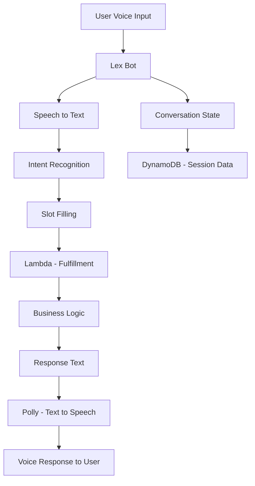

# How to Build a Voice-Enabled App with AWS Lex and Polly

Author: [nawazdhandala](https://github.com/nawazdhandala)

Tags: AWS, Lex, Polly, Voice, Lambda, Conversational AI

Description: Build a voice-enabled application using AWS Lex for speech recognition and intent handling, and Polly for natural text-to-speech responses.

---

Voice interfaces are everywhere now - smart speakers, phone systems, drive-through ordering, and in-app voice commands. Building one from scratch means dealing with speech recognition, natural language understanding, dialog management, and speech synthesis. That is a lot of moving parts.

AWS Lex handles the speech recognition and natural language understanding side (it is the same technology behind Alexa), while Polly converts text responses back to natural-sounding speech. Together, they give you a complete voice interface with minimal ML expertise required.

## Architecture



## Creating the Lex Bot

Let us build a restaurant reservation bot as an example. It needs to understand booking requests, capture the date, time, party size, and cuisine preference.

```yaml
# CloudFormation for Lex V2 bot
AWSTemplateFormatVersion: '2010-09-09'
Resources:
  RestaurantBot:
    Type: AWS::Lex::Bot
    Properties:
      Name: RestaurantReservationBot
      Description: Voice-enabled restaurant reservation assistant
      RoleArn: !GetAtt BotRole.Arn
      DataPrivacy:
        ChildDirected: false
      IdleSessionTTLInSeconds: 300
      BotLocales:
        - LocaleId: en_US
          NluConfidenceThreshold: 0.70
          Intents:
            - Name: MakeReservation
              Description: Book a table at a restaurant
              SampleUtterances:
                - Utterance: "I'd like to make a reservation"
                - Utterance: "Book a table for {PartySize} people"
                - Utterance: "Reserve a table for {Date} at {Time}"
                - Utterance: "I want to eat {Cuisine} food on {Date}"
                - Utterance: "Table for {PartySize} on {Date} at {Time}"
                - Utterance: "Can I book a {Cuisine} restaurant"
              Slots:
                - Name: Date
                  SlotTypeName: AMAZON.Date
                  ValueElicitationSetting:
                    PromptSpecification:
                      MessageGroups:
                        - Message:
                            PlainTextMessage:
                              Value: "What date would you like to dine?"
                      MaxRetries: 3
                - Name: Time
                  SlotTypeName: AMAZON.Time
                  ValueElicitationSetting:
                    PromptSpecification:
                      MessageGroups:
                        - Message:
                            PlainTextMessage:
                              Value: "What time works for you?"
                      MaxRetries: 3
                - Name: PartySize
                  SlotTypeName: AMAZON.Number
                  ValueElicitationSetting:
                    PromptSpecification:
                      MessageGroups:
                        - Message:
                            PlainTextMessage:
                              Value: "How many people will be dining?"
                      MaxRetries: 3
                - Name: Cuisine
                  SlotTypeName: CuisineType
                  ValueElicitationSetting:
                    PromptSpecification:
                      MessageGroups:
                        - Message:
                            PlainTextMessage:
                              Value: "What type of cuisine do you prefer?"
                      MaxRetries: 3
              SlotPriorities:
                - Priority: 1
                  SlotName: Date
                - Priority: 2
                  SlotName: Time
                - Priority: 3
                  SlotName: PartySize
                - Priority: 4
                  SlotName: Cuisine
            - Name: CheckReservation
              Description: Check existing reservation status
              SampleUtterances:
                - Utterance: "Check my reservation"
                - Utterance: "What is the status of my booking"
                - Utterance: "Do I have a reservation"
            - Name: CancelReservation
              Description: Cancel an existing reservation
              SampleUtterances:
                - Utterance: "Cancel my reservation"
                - Utterance: "I need to cancel my booking"
            - Name: FallbackIntent
              Description: Default intent when nothing matches
              ParentIntentSignature: AMAZON.FallbackIntent
          SlotTypes:
            - Name: CuisineType
              ValueSelectionSetting:
                ResolutionStrategy: ORIGINAL_VALUE
              SlotTypeValues:
                - SampleValue: {Value: "Italian"}
                - SampleValue: {Value: "Chinese"}
                - SampleValue: {Value: "Japanese"}
                - SampleValue: {Value: "Mexican"}
                - SampleValue: {Value: "Indian"}
                - SampleValue: {Value: "Thai"}
                - SampleValue: {Value: "French"}
                - SampleValue: {Value: "American"}
```

## Building the Fulfillment Lambda

When Lex has gathered all the required information, it calls your Lambda function to fulfill the intent:

```python
# Lambda - Lex bot fulfillment handler
import boto3
import json
import uuid
from datetime import datetime

dynamodb = boto3.resource('dynamodb')
reservations_table = dynamodb.Table('Reservations')

def handler(event, context):
    intent_name = event['sessionState']['intent']['name']
    slots = event['sessionState']['intent']['slots']
    session_id = event['sessionId']

    if intent_name == 'MakeReservation':
        return handle_make_reservation(event, slots)
    elif intent_name == 'CheckReservation':
        return handle_check_reservation(event, session_id)
    elif intent_name == 'CancelReservation':
        return handle_cancel_reservation(event, session_id)
    elif intent_name == 'FallbackIntent':
        return build_response(
            event,
            "I'm sorry, I did not understand that. I can help you make, check, or cancel a restaurant reservation. What would you like to do?",
            'Close',
            'Failed'
        )

def handle_make_reservation(event, slots):
    """Process a reservation request."""
    # Extract slot values
    date = get_slot_value(slots, 'Date')
    time_slot = get_slot_value(slots, 'Time')
    party_size = get_slot_value(slots, 'PartySize')
    cuisine = get_slot_value(slots, 'Cuisine')

    # Validate the reservation
    validation = validate_reservation(date, time_slot, party_size)
    if validation['isValid'] is False:
        return build_elicit_response(
            event,
            validation['violatedSlot'],
            validation['message']
        )

    # All slots filled and valid - make the reservation
    reservation_id = str(uuid.uuid4())[:8].upper()

    reservations_table.put_item(Item={
        'reservationId': reservation_id,
        'sessionId': event['sessionId'],
        'date': date,
        'time': time_slot,
        'partySize': int(party_size),
        'cuisine': cuisine,
        'status': 'CONFIRMED',
        'createdAt': datetime.utcnow().isoformat()
    })

    message = (
        f"Your reservation is confirmed. "
        f"Reservation ID: {reservation_id}. "
        f"Table for {party_size} people on {date} at {time_slot} "
        f"for {cuisine} cuisine. "
        f"Is there anything else I can help you with?"
    )

    return build_response(event, message, 'Close', 'Fulfilled')

def validate_reservation(date, time_slot, party_size):
    """Validate reservation details."""
    if party_size:
        size = int(party_size)
        if size < 1 or size > 20:
            return {
                'isValid': False,
                'violatedSlot': 'PartySize',
                'message': 'We can accommodate parties between 1 and 20 people. How many will be dining?'
            }

    return {'isValid': True}

def handle_check_reservation(event, session_id):
    """Look up existing reservations."""
    response = reservations_table.query(
        IndexName='SessionIndex',
        KeyConditionExpression='sessionId = :sid',
        ExpressionAttributeValues={':sid': session_id}
    )

    if response['Items']:
        res = response['Items'][0]
        message = (
            f"I found your reservation. "
            f"Reservation {res['reservationId']}: "
            f"Table for {res['partySize']} on {res['date']} at {res['time']}. "
            f"Status: {res['status']}."
        )
    else:
        message = "I could not find any reservations for you. Would you like to make one?"

    return build_response(event, message, 'Close', 'Fulfilled')

def get_slot_value(slots, slot_name):
    """Extract the interpreted value from a slot."""
    slot = slots.get(slot_name)
    if slot and slot.get('value'):
        return slot['value'].get('interpretedValue')
    return None

def build_response(event, message, dialog_action, fulfillment_state):
    """Build a Lex response."""
    return {
        'sessionState': {
            'dialogAction': {
                'type': dialog_action
            },
            'intent': {
                'name': event['sessionState']['intent']['name'],
                'state': fulfillment_state
            }
        },
        'messages': [{
            'contentType': 'PlainText',
            'content': message
        }]
    }

def build_elicit_response(event, slot_to_elicit, message):
    """Build a response that asks for a specific slot value."""
    return {
        'sessionState': {
            'dialogAction': {
                'type': 'ElicitSlot',
                'slotToElicit': slot_to_elicit
            },
            'intent': event['sessionState']['intent']
        },
        'messages': [{
            'contentType': 'PlainText',
            'content': message
        }]
    }
```

## Adding Voice with Polly

Polly converts the text responses to speech. For a more natural experience, use SSML (Speech Synthesis Markup Language) to control pronunciation, pauses, and emphasis:

```python
# Lambda - Convert text responses to speech using Polly
import boto3
import json
import base64

polly = boto3.client('polly')

def text_to_speech(text, voice_id='Joanna', engine='neural'):
    """Convert text to speech using Polly."""
    # Use SSML for more natural speech
    ssml_text = convert_to_ssml(text)

    response = polly.synthesize_speech(
        Text=ssml_text,
        TextType='ssml',
        OutputFormat='mp3',
        VoiceId=voice_id,
        Engine=engine  # 'neural' for more natural sounding
    )

    audio_data = response['AudioStream'].read()
    return base64.b64encode(audio_data).decode('utf-8')

def convert_to_ssml(text):
    """Convert plain text to SSML with natural speech patterns."""
    ssml = '<speak>'

    # Add a brief pause after greetings
    text = text.replace('. ', '.<break time="300ms"/> ')

    # Emphasize reservation IDs
    import re
    text = re.sub(
        r'Reservation ID: (\w+)',
        r'Reservation ID: <emphasis level="moderate">\1</emphasis>',
        text
    )

    # Slow down for numbers (dates, times, party size)
    text = re.sub(
        r'(\d+ people)',
        r'<prosody rate="slow">\1</prosody>',
        text
    )

    ssml += text + '</speak>'
    return ssml

def list_available_voices(language_code='en-US'):
    """List available Polly voices for a language."""
    response = polly.describe_voices(LanguageCode=language_code)

    voices = []
    for voice in response['Voices']:
        voices.append({
            'id': voice['Id'],
            'name': voice['Name'],
            'gender': voice['Gender'],
            'engine': voice.get('SupportedEngines', [])
        })

    return voices
```

## Integrating Voice with a Web Application

Connect the Lex bot and Polly to a web frontend:

```python
# Lambda - WebSocket handler for real-time voice interaction
import boto3
import json
import base64

lex = boto3.client('lexv2-runtime')
polly = boto3.client('polly')

def handler(event, context):
    body = json.loads(event['body'])
    action = body['action']
    session_id = body['sessionId']

    if action == 'text':
        # Handle text input
        response = lex.recognize_text(
            botId='BOT_ID',
            botAliasId='BOT_ALIAS_ID',
            localeId='en_US',
            sessionId=session_id,
            text=body['text']
        )
    elif action == 'audio':
        # Handle voice input (audio bytes)
        audio_bytes = base64.b64decode(body['audio'])
        response = lex.recognize_utterance(
            botId='BOT_ID',
            botAliasId='BOT_ALIAS_ID',
            localeId='en_US',
            sessionId=session_id,
            requestContentType='audio/l16; rate=16000; channels=1',
            inputStream=audio_bytes
        )

    # Extract the text response from Lex
    messages = response.get('messages', [])
    response_text = messages[0]['content'] if messages else 'I did not catch that.'

    # Convert response to speech
    speech = polly.synthesize_speech(
        Text=response_text,
        OutputFormat='mp3',
        VoiceId='Joanna',
        Engine='neural'
    )

    audio_response = base64.b64encode(speech['AudioStream'].read()).decode()

    return {
        'statusCode': 200,
        'body': json.dumps({
            'text': response_text,
            'audio': audio_response,
            'sessionState': response.get('sessionState', {})
        })
    }
```

## Multi-Language Support

Lex and Polly both support multiple languages. Here is how to add multi-language support:

```python
# Multi-language voice interaction
LANGUAGE_MAP = {
    'en': {'lexLocale': 'en_US', 'pollyVoice': 'Joanna', 'comprehendLang': 'en'},
    'es': {'lexLocale': 'es_US', 'pollyVoice': 'Lupe', 'comprehendLang': 'es'},
    'fr': {'lexLocale': 'fr_FR', 'pollyVoice': 'Lea', 'comprehendLang': 'fr'},
    'de': {'lexLocale': 'de_DE', 'pollyVoice': 'Vicki', 'comprehendLang': 'de'},
    'ja': {'lexLocale': 'ja_JP', 'pollyVoice': 'Takumi', 'comprehendLang': 'ja'}
}

def detect_and_respond(text, session_id):
    """Detect the user's language and respond appropriately."""
    comprehend = boto3.client('comprehend')

    # Detect language
    lang_response = comprehend.detect_dominant_language(Text=text)
    detected_lang = lang_response['Languages'][0]['LanguageCode']

    config = LANGUAGE_MAP.get(detected_lang, LANGUAGE_MAP['en'])

    # Send to Lex in the detected language
    lex_response = lex.recognize_text(
        botId='BOT_ID',
        botAliasId='BOT_ALIAS_ID',
        localeId=config['lexLocale'],
        sessionId=session_id,
        text=text
    )

    response_text = lex_response['messages'][0]['content']

    # Generate speech in the same language
    speech = polly.synthesize_speech(
        Text=response_text,
        OutputFormat='mp3',
        VoiceId=config['pollyVoice'],
        Engine='neural'
    )

    return {
        'text': response_text,
        'language': detected_lang,
        'audio': base64.b64encode(speech['AudioStream'].read()).decode()
    }
```

## Monitoring the Voice Application

Voice applications have unique monitoring needs. Track Lex intent recognition accuracy (how often FallbackIntent fires), conversation completion rates, and Polly synthesis latency. High fallback rates mean your bot needs more training utterances. Monitor these metrics with [OneUptime](https://oneuptime.com/blog/post/2026-02-12-build-a-translation-service-with-aws-translate/view) to ensure a smooth voice experience for users.

## Wrapping Up

Building a voice-enabled application with Lex and Polly is surprisingly approachable. Lex handles the hard parts of speech recognition and intent classification, while Polly generates natural-sounding responses. The Lambda fulfillment layer is where your business logic lives, and it is just regular code.

Start with a narrow set of intents - three to five is plenty. Train each intent with at least 10-15 sample utterances. Test with real users early, and use the Lex conversation logs to find utterances the bot misunderstands. Adding those utterances to your training data is how you continuously improve the experience.
