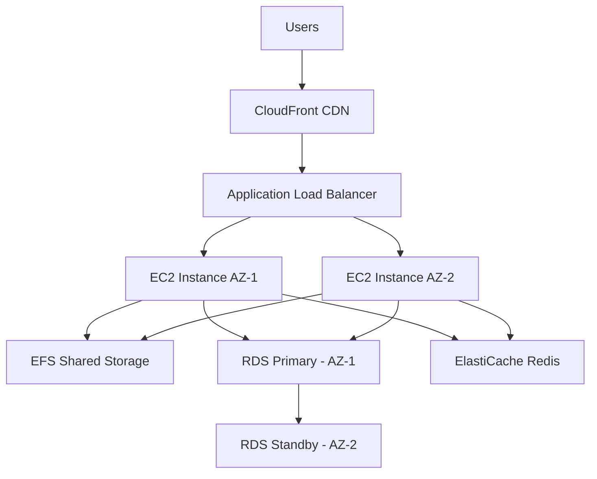

# How to Build a WordPress Site on AWS with High Availability

Author: [nawazdhandala](https://github.com/nawazdhandala)

Tags: AWS, WordPress, High Availability, EC2, RDS, EFS, CloudFront, Auto Scaling

Description: Deploy a production-grade WordPress site on AWS with auto scaling, managed database, shared storage, and CDN for high availability

---

WordPress powers over 40% of the web, but most WordPress installations run on a single server with no redundancy. When that server goes down, your site goes down with it. Running WordPress on AWS with high availability means your site stays up even when individual servers fail, scales automatically during traffic spikes, and recovers without manual intervention.

This guide walks through building a fully redundant WordPress deployment on AWS using EC2 Auto Scaling, RDS Multi-AZ, EFS for shared storage, and CloudFront for global content delivery.

## Architecture Overview

A highly available WordPress setup on AWS uses multiple layers of redundancy:



Each component serves a specific purpose:
- **CloudFront** caches static assets at edge locations worldwide
- **Application Load Balancer** distributes traffic across healthy EC2 instances
- **EC2 Auto Scaling** adds or removes instances based on load
- **EFS** provides shared file storage so all instances see the same WordPress uploads
- **RDS Multi-AZ** provides automatic database failover
- **ElastiCache** handles session storage and object caching

## Step 1: Set Up the VPC

Start with a VPC that spans multiple availability zones:

```bash
# Create a VPC with public and private subnets in two AZs
aws ec2 create-vpc --cidr-block 10.0.0.0/16

# Create subnets
# Public subnets for the load balancer
aws ec2 create-subnet --vpc-id vpc-xxx --cidr-block 10.0.1.0/24 --availability-zone us-east-1a
aws ec2 create-subnet --vpc-id vpc-xxx --cidr-block 10.0.2.0/24 --availability-zone us-east-1b

# Private subnets for EC2 instances
aws ec2 create-subnet --vpc-id vpc-xxx --cidr-block 10.0.3.0/24 --availability-zone us-east-1a
aws ec2 create-subnet --vpc-id vpc-xxx --cidr-block 10.0.4.0/24 --availability-zone us-east-1b

# Private subnets for RDS
aws ec2 create-subnet --vpc-id vpc-xxx --cidr-block 10.0.5.0/24 --availability-zone us-east-1a
aws ec2 create-subnet --vpc-id vpc-xxx --cidr-block 10.0.6.0/24 --availability-zone us-east-1b
```

## Step 2: Create the RDS MySQL Database

Use RDS Multi-AZ for automatic database failover:

```bash
# Create a DB subnet group
aws rds create-db-subnet-group \
  --db-subnet-group-name wordpress-db \
  --db-subnet-group-description "WordPress DB subnets" \
  --subnet-ids subnet-private-1 subnet-private-2

# Create the Multi-AZ RDS instance
aws rds create-db-instance \
  --db-instance-identifier wordpress-db \
  --db-instance-class db.r6g.large \
  --engine mysql \
  --engine-version 8.0 \
  --master-username admin \
  --master-user-password YourSecurePassword123 \
  --allocated-storage 100 \
  --storage-type gp3 \
  --multi-az \
  --db-subnet-group-name wordpress-db \
  --vpc-security-group-ids sg-database \
  --backup-retention-period 7 \
  --storage-encrypted \
  --deletion-protection
```

Multi-AZ means AWS maintains a synchronous standby replica in a different availability zone. If the primary fails, RDS automatically promotes the standby within about 60 seconds.

## Step 3: Create the EFS File System

EFS provides shared storage for WordPress uploads, themes, and plugins across all EC2 instances:

```bash
# Create the EFS file system
aws efs create-file-system \
  --performance-mode generalPurpose \
  --throughput-mode bursting \
  --encrypted \
  --tags Key=Name,Value=wordpress-efs

# Create mount targets in each AZ
aws efs create-mount-target \
  --file-system-id fs-xxx \
  --subnet-id subnet-private-1 \
  --security-groups sg-efs

aws efs create-mount-target \
  --file-system-id fs-xxx \
  --subnet-id subnet-private-2 \
  --security-groups sg-efs
```

## Step 4: Set Up ElastiCache for Sessions

Without shared session storage, users get logged out when the load balancer routes them to a different instance:

```bash
# Create an ElastiCache Redis cluster
aws elasticache create-replication-group \
  --replication-group-id wordpress-sessions \
  --replication-group-description "WordPress session storage" \
  --engine redis \
  --cache-node-type cache.r6g.large \
  --num-cache-clusters 2 \
  --automatic-failover-enabled \
  --cache-subnet-group-name wordpress-cache \
  --security-group-ids sg-cache \
  --at-rest-encryption-enabled \
  --transit-encryption-enabled
```

## Step 5: Create the EC2 Launch Template

The launch template defines how new WordPress instances are configured:

```bash
# User data script for WordPress EC2 instances
#!/bin/bash
set -e

# Install required packages
yum update -y
yum install -y httpd php8.2 php8.2-mysqlnd php8.2-fpm php8.2-gd \
  php8.2-xml php8.2-mbstring php8.2-intl amazon-efs-utils

# Mount EFS for WordPress files
mkdir -p /var/www/html
mount -t efs fs-xxx:/ /var/www/html

# Add to fstab for persistence
echo "fs-xxx:/ /var/www/html efs defaults,_netdev 0 0" >> /etc/fstab

# Install WordPress if not already present on EFS
if [ ! -f /var/www/html/wp-config.php ]; then
  cd /tmp
  wget https://wordpress.org/latest.tar.gz
  tar -xzf latest.tar.gz
  cp -r wordpress/* /var/www/html/
  chown -R apache:apache /var/www/html/
fi

# Configure PHP for Redis sessions
echo "extension=redis.so" >> /etc/php.ini
echo "session.save_handler = redis" >> /etc/php.ini
echo "session.save_path = 'tcp://wordpress-sessions.xxx.cache.amazonaws.com:6379'" >> /etc/php.ini

# Start Apache
systemctl enable httpd
systemctl start httpd
```

Create the launch template:

```bash
aws ec2 create-launch-template \
  --launch-template-name wordpress-lt \
  --launch-template-data '{
    "ImageId": "ami-0abcdef1234567890",
    "InstanceType": "c6g.large",
    "SecurityGroupIds": ["sg-web"],
    "IamInstanceProfile": {
      "Name": "wordpress-ec2-role"
    },
    "UserData": "BASE64_ENCODED_USER_DATA"
  }'
```

## Step 6: Configure the Application Load Balancer

```bash
# Create the ALB
aws elbv2 create-load-balancer \
  --name wordpress-alb \
  --subnets subnet-public-1 subnet-public-2 \
  --security-groups sg-alb \
  --scheme internet-facing

# Create target group with health checks
aws elbv2 create-target-group \
  --name wordpress-tg \
  --protocol HTTP \
  --port 80 \
  --vpc-id vpc-xxx \
  --health-check-path /wp-login.php \
  --health-check-interval-seconds 30 \
  --healthy-threshold-count 2 \
  --unhealthy-threshold-count 3

# Create HTTPS listener (requires ACM certificate)
aws elbv2 create-listener \
  --load-balancer-arn arn:aws:elasticloadbalancing:... \
  --protocol HTTPS \
  --port 443 \
  --certificates CertificateArn=arn:aws:acm:... \
  --default-actions Type=forward,TargetGroupArn=arn:aws:elasticloadbalancing:...
```

## Step 7: Set Up Auto Scaling

```bash
# Create the Auto Scaling group
aws autoscaling create-auto-scaling-group \
  --auto-scaling-group-name wordpress-asg \
  --launch-template LaunchTemplateName=wordpress-lt,Version='$Latest' \
  --min-size 2 \
  --max-size 10 \
  --desired-capacity 2 \
  --vpc-zone-identifier "subnet-private-1,subnet-private-2" \
  --target-group-arns arn:aws:elasticloadbalancing:... \
  --health-check-type ELB \
  --health-check-grace-period 300

# Create scaling policy based on CPU
aws autoscaling put-scaling-policy \
  --auto-scaling-group-name wordpress-asg \
  --policy-name cpu-scaling \
  --policy-type TargetTrackingScaling \
  --target-tracking-configuration '{
    "PredefinedMetricSpecification": {
      "PredefinedMetricType": "ASGAverageCPUUtilization"
    },
    "TargetValue": 70.0
  }'
```

## Step 8: Configure CloudFront

Place CloudFront in front of the ALB for caching and global distribution:

```bash
# Create CloudFront distribution
aws cloudfront create-distribution \
  --distribution-config '{
    "Origins": {
      "Items": [{
        "DomainName": "wordpress-alb-xxx.us-east-1.elb.amazonaws.com",
        "Id": "wordpress-alb",
        "CustomOriginConfig": {
          "HTTPPort": 80,
          "HTTPSPort": 443,
          "OriginProtocolPolicy": "https-only"
        }
      }]
    },
    "DefaultCacheBehavior": {
      "TargetOriginId": "wordpress-alb",
      "ViewerProtocolPolicy": "redirect-to-https",
      "CachePolicyId": "658327ea-f89d-4fab-a63d-7e88639e58f6",
      "AllowedMethods": ["GET", "HEAD", "OPTIONS", "PUT", "POST", "PATCH", "DELETE"]
    },
    "CacheBehaviors": {
      "Items": [{
        "PathPattern": "/wp-admin/*",
        "TargetOriginId": "wordpress-alb",
        "ViewerProtocolPolicy": "redirect-to-https",
        "CachePolicyId": "4135ea2d-6df8-44a3-9df3-4b5a84be39ad"
      }]
    },
    "Enabled": true
  }'
```

Make sure to bypass the cache for the WordPress admin area (`/wp-admin/*`) and login page (`/wp-login.php`).

## Step 9: Configure wp-config.php

Update your WordPress configuration for the HA setup:

```php
// wp-config.php - High availability configuration

// Database settings - use the RDS endpoint
define('DB_NAME', 'wordpress');
define('DB_USER', 'admin');
define('DB_PASSWORD', 'YourSecurePassword123');
define('DB_HOST', 'wordpress-db.xxx.us-east-1.rds.amazonaws.com');

// Force HTTPS since CloudFront terminates SSL
define('FORCE_SSL_ADMIN', true);

// Handle CloudFront / ALB forwarded headers
if (isset($_SERVER['HTTP_X_FORWARDED_PROTO']) && $_SERVER['HTTP_X_FORWARDED_PROTO'] === 'https') {
    $_SERVER['HTTPS'] = 'on';
}

// Set the site URL
define('WP_HOME', 'https://www.example.com');
define('WP_SITEURL', 'https://www.example.com');

// Disable file editing in the admin panel for security
define('DISALLOW_FILE_EDIT', true);
```

## Monitoring

Monitor your WordPress HA setup with CloudWatch alarms:

- ALB healthy host count (alert if below 2)
- RDS CPU utilization (alert above 80%)
- EFS burst credit balance (alert if approaching zero)
- ElastiCache evictions (alert if increasing)
- Auto Scaling group size (alert if at max capacity)

For a detailed guide on setting up monitoring, check out our post on [building a metrics collection system on AWS](https://oneuptime.com/blog/post/2026-02-12-build-a-metrics-collection-system-on-aws/view).

## Cost Estimates

A basic HA WordPress setup costs roughly:
- 2x c6g.large EC2 instances: ~$100/month
- RDS Multi-AZ db.r6g.large: ~$350/month
- EFS storage: ~$30/month for 100GB
- ElastiCache: ~$150/month
- CloudFront: ~$50/month for moderate traffic
- ALB: ~$25/month

Total: approximately $700/month for a production-grade, highly available WordPress site.

## Wrapping Up

Running WordPress on a single server is fine for a personal blog, but for business-critical sites you need redundancy at every layer. The architecture in this guide eliminates every single point of failure: database failover with RDS Multi-AZ, shared storage with EFS, session persistence with ElastiCache, and automatic instance replacement with Auto Scaling. It costs more than a $5 shared hosting plan, but when your site handles real traffic and real revenue, the investment in availability pays for itself quickly.
