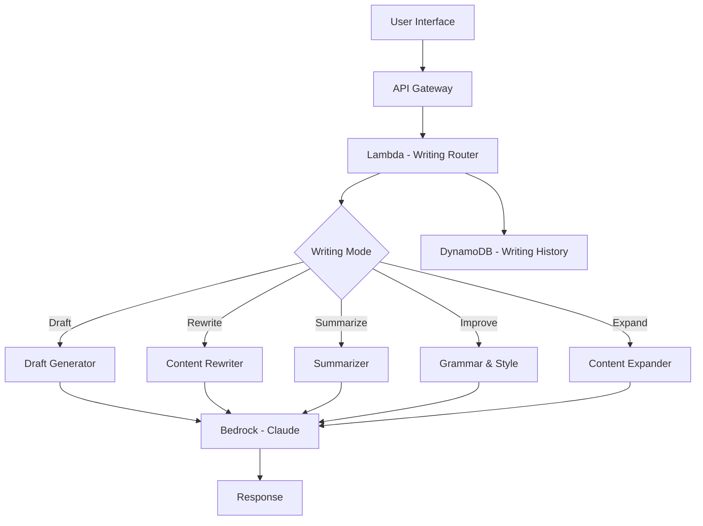

# How to Build an AI Writing Assistant with Amazon Bedrock

Author: [nawazdhandala](https://github.com/nawazdhandala)

Tags: AWS, Bedrock, AI, Writing, Lambda, NLP

Description: Build an AI writing assistant using Amazon Bedrock with features like drafting, rewriting, tone adjustment, grammar checking, and content summarization.

---

Writing takes time. Drafting emails, blog posts, documentation, marketing copy, and internal memos eats up hours that could be spent on higher-value work. An AI writing assistant does not replace the writer - it accelerates them. It generates first drafts, rewrites content for different audiences, checks grammar and tone, and summarizes long documents.

Amazon Bedrock gives you access to powerful foundation models that excel at text generation and manipulation. In this guide, we will build a writing assistant API with multiple writing modes, style controls, and content management.

## Architecture



## The Writing Assistant API

The core Lambda handles different writing modes through a single endpoint:

```python
# Lambda - AI Writing Assistant with multiple modes
import boto3
import json
import uuid
from datetime import datetime

bedrock = boto3.client('bedrock-runtime')
dynamodb = boto3.resource('dynamodb')
history_table = dynamodb.Table('WritingHistory')

MODEL_ID = 'anthropic.claude-3-sonnet-20240229-v1:0'

def handler(event, context):
    body = json.loads(event['body'])
    mode = body['mode']
    user_id = body.get('userId', 'anonymous')

    # Route to the appropriate writing function
    handlers = {
        'draft': handle_draft,
        'rewrite': handle_rewrite,
        'summarize': handle_summarize,
        'improve': handle_improve,
        'expand': handle_expand,
        'tone': handle_tone_change,
        'email': handle_email_draft,
        'outline': handle_outline
    }

    if mode not in handlers:
        return respond(400, {'error': f'Unknown mode: {mode}'})

    result = handlers[mode](body)

    # Save to writing history
    save_history(user_id, mode, body, result)

    return respond(200, result)

def handle_draft(body):
    """Generate a first draft based on a brief."""
    topic = body['topic']
    content_type = body.get('contentType', 'blog post')
    target_length = body.get('targetLength', 'medium')
    audience = body.get('audience', 'general')
    key_points = body.get('keyPoints', [])

    length_guidance = {
        'short': '200-300 words',
        'medium': '500-800 words',
        'long': '1000-1500 words'
    }

    points_text = '\n'.join(f'- {point}' for point in key_points) if key_points else 'No specific points provided.'

    prompt = f"""Write a {content_type} about: {topic}

Target audience: {audience}
Target length: {length_guidance.get(target_length, '500-800 words')}

Key points to cover:
{points_text}

Write in a clear, engaging style. Use concrete examples where helpful.
Include appropriate headings if the content is long enough to warrant them.
Do not use filler phrases or unnecessary padding."""

    response = call_bedrock(prompt, max_tokens=2048, temperature=0.7)

    return {
        'content': response,
        'mode': 'draft',
        'topic': topic,
        'wordCount': len(response.split())
    }

def handle_rewrite(body):
    """Rewrite existing content for a different purpose or audience."""
    original = body['content']
    purpose = body.get('purpose', 'clarity')
    audience = body.get('targetAudience', 'general')

    purpose_instructions = {
        'clarity': 'Rewrite for maximum clarity. Simplify complex sentences. Remove jargon.',
        'professional': 'Rewrite in a formal, professional tone suitable for business communication.',
        'casual': 'Rewrite in a casual, conversational tone as if talking to a friend.',
        'technical': 'Rewrite for a technical audience. Be precise with terminology.',
        'executive': 'Rewrite as an executive summary. Focus on key decisions and outcomes.',
        'marketing': 'Rewrite as marketing copy. Be persuasive and benefit-focused.'
    }

    instruction = purpose_instructions.get(purpose, purpose)

    prompt = f"""Original content:
{original}

Task: {instruction}
Target audience: {audience}

Rewrite the content while preserving all factual information. Do not add new facts.
Maintain the same general structure unless restructuring significantly improves readability."""

    response = call_bedrock(prompt, max_tokens=2048, temperature=0.5)

    return {
        'content': response,
        'mode': 'rewrite',
        'purpose': purpose,
        'originalWordCount': len(original.split()),
        'newWordCount': len(response.split())
    }

def handle_summarize(body):
    """Summarize long content into key points or a shorter version."""
    content = body['content']
    summary_type = body.get('type', 'paragraph')
    max_length = body.get('maxLength', 200)

    type_instructions = {
        'paragraph': f'Write a concise summary paragraph of no more than {max_length} words.',
        'bullets': 'Summarize as a bulleted list of key points. Maximum 10 bullets.',
        'one_sentence': 'Summarize in a single sentence.',
        'tldr': 'Write a TL;DR summary in 2-3 sentences.',
        'key_takeaways': 'Extract the 3-5 most important takeaways as numbered points.'
    }

    prompt = f"""Content to summarize:
{content}

Task: {type_instructions.get(summary_type, type_instructions['paragraph'])}

Focus on the most important information. Do not add opinions or information not present in the original."""

    response = call_bedrock(prompt, max_tokens=500, temperature=0.3)

    return {
        'content': response,
        'mode': 'summarize',
        'summaryType': summary_type,
        'originalWordCount': len(content.split()),
        'summaryWordCount': len(response.split()),
        'compressionRatio': round(len(response.split()) / max(len(content.split()), 1), 2)
    }

def handle_improve(body):
    """Improve grammar, style, and readability of existing content."""
    content = body['content']
    focus_areas = body.get('focus', ['grammar', 'clarity', 'flow'])

    prompt = f"""Review and improve the following content. Focus on: {', '.join(focus_areas)}.

Content:
{content}

Provide:
1. The improved version of the content
2. A list of changes made and why

Format your response as:
IMPROVED VERSION:
[improved content here]

CHANGES MADE:
[list of changes]"""

    response = call_bedrock(prompt, max_tokens=2048, temperature=0.3)

    # Parse the response to separate improved content from changes
    parts = response.split('CHANGES MADE:')
    improved = parts[0].replace('IMPROVED VERSION:', '').strip()
    changes = parts[1].strip() if len(parts) > 1 else 'No changes listed.'

    return {
        'content': improved,
        'changes': changes,
        'mode': 'improve',
        'focusAreas': focus_areas
    }

def handle_expand(body):
    """Expand a brief outline or notes into full content."""
    notes = body['content']
    content_type = body.get('contentType', 'article')

    prompt = f"""Expand the following notes/outline into a complete {content_type}.

Notes:
{notes}

Write naturally and add relevant details, examples, and transitions.
Each point in the notes should become a well-developed paragraph or section.
Maintain the order and structure suggested by the notes."""

    response = call_bedrock(prompt, max_tokens=3000, temperature=0.7)

    return {
        'content': response,
        'mode': 'expand',
        'inputWordCount': len(notes.split()),
        'outputWordCount': len(response.split())
    }

def handle_tone_change(body):
    """Change the tone of content while preserving meaning."""
    content = body['content']
    target_tone = body['targetTone']

    prompt = f"""Change the tone of the following content to be {target_tone}.
Preserve all factual information and the overall message.

Content:
{content}

Rewrite with a {target_tone} tone:"""

    response = call_bedrock(prompt, max_tokens=2048, temperature=0.5)

    return {
        'content': response,
        'mode': 'tone',
        'targetTone': target_tone
    }

def handle_email_draft(body):
    """Draft a professional email."""
    purpose = body['purpose']
    recipient = body.get('recipient', 'colleague')
    key_points = body.get('keyPoints', [])
    tone = body.get('tone', 'professional')

    points_text = '\n'.join(f'- {p}' for p in key_points) if key_points else ''

    prompt = f"""Draft a {tone} email to a {recipient}.

Purpose: {purpose}
Key points to include:
{points_text}

Write a complete email with subject line, greeting, body, and sign-off.
Be concise and direct. Format as:
Subject: [subject line]

[email body]"""

    response = call_bedrock(prompt, max_tokens=1000, temperature=0.5)

    return {
        'content': response,
        'mode': 'email',
        'purpose': purpose
    }

def handle_outline(body):
    """Generate a structured outline for a topic."""
    topic = body['topic']
    content_type = body.get('contentType', 'article')
    depth = body.get('depth', 'detailed')

    prompt = f"""Create a {depth} outline for a {content_type} about: {topic}

Use hierarchical numbering (1, 1.1, 1.1.1) for the structure.
Include brief notes about what each section should cover.
The outline should be comprehensive enough that a writer could draft the full content from it."""

    response = call_bedrock(prompt, max_tokens=1000, temperature=0.5)

    return {
        'content': response,
        'mode': 'outline',
        'topic': topic
    }

def call_bedrock(prompt, max_tokens=1024, temperature=0.5):
    """Call Amazon Bedrock with the given prompt."""
    response = bedrock.invoke_model(
        modelId=MODEL_ID,
        contentType='application/json',
        accept='application/json',
        body=json.dumps({
            'anthropic_version': 'bedrock-2023-05-31',
            'messages': [{'role': 'user', 'content': prompt}],
            'max_tokens': max_tokens,
            'temperature': temperature
        })
    )

    result = json.loads(response['body'].read())
    return result['content'][0]['text']

def save_history(user_id, mode, request, result):
    """Save writing history for the user."""
    history_table.put_item(Item={
        'historyId': str(uuid.uuid4()),
        'userId': user_id,
        'mode': mode,
        'request': json.dumps(request, default=str)[:5000],
        'result': json.dumps(result, default=str)[:10000],
        'timestamp': datetime.utcnow().isoformat(),
        'ttl': int(datetime.utcnow().timestamp()) + (90 * 86400)
    })

def respond(status, body):
    return {
        'statusCode': status,
        'headers': {'Content-Type': 'application/json'},
        'body': json.dumps(body, default=str)
    }
```

## Style Templates

Let users save and apply custom writing style templates:

```python
# Manage reusable writing style templates
import boto3
import json

dynamodb = boto3.resource('dynamodb')
templates_table = dynamodb.Table('WritingTemplates')

BUILT_IN_TEMPLATES = {
    'hemingway': {
        'name': 'Hemingway',
        'instructions': 'Write in short, declarative sentences. Avoid adverbs. Use simple words. Be direct.'
    },
    'academic': {
        'name': 'Academic',
        'instructions': 'Write in formal academic style. Cite reasoning. Use hedging language where appropriate. Maintain objectivity.'
    },
    'startup': {
        'name': 'Startup',
        'instructions': 'Write with energy and conviction. Use active voice. Focus on outcomes and impact. Keep it punchy.'
    },
    'technical_doc': {
        'name': 'Technical Documentation',
        'instructions': 'Write clear, precise technical documentation. Use consistent terminology. Include code examples where relevant. Structure with headers.'
    }
}

def apply_template(content, template_id, user_id=None):
    """Apply a writing style template to content."""
    # Check built-in templates first
    if template_id in BUILT_IN_TEMPLATES:
        template = BUILT_IN_TEMPLATES[template_id]
    else:
        # Look up user's custom template
        response = templates_table.get_item(Key={'templateId': template_id})
        template = response.get('Item')
        if not template or template.get('userId') != user_id:
            return None

    prompt = f"""Rewrite the following content in this style:
Style: {template['name']}
Instructions: {template['instructions']}

Content:
{content}

Rewritten content:"""

    return call_bedrock(prompt, max_tokens=2048, temperature=0.5)
```

## Monitoring the Writing Assistant

Track API latency (writers expect fast responses), error rates, usage per writing mode (which features are most popular), and token consumption for cost management. If Bedrock throttles your requests during peak hours, users get a degraded experience. Monitor with [OneUptime](https://oneuptime.com/blog/post/2026-02-12-build-a-code-review-bot-with-amazon-bedrock/view) to catch performance issues before they impact users.

## Wrapping Up

An AI writing assistant built on Bedrock handles the tedious parts of writing - first drafts, rewrites, grammar fixes, and summarization - so writers can focus on ideas and strategy. The multi-mode approach means the same backend serves different use cases, from email drafting to technical documentation.

The key to a good writing assistant is prompt engineering. Spend time refining the prompts for each mode. Test with real content from your domain. The difference between a generic assistant and a great one is in the quality of the instructions you give the model.
