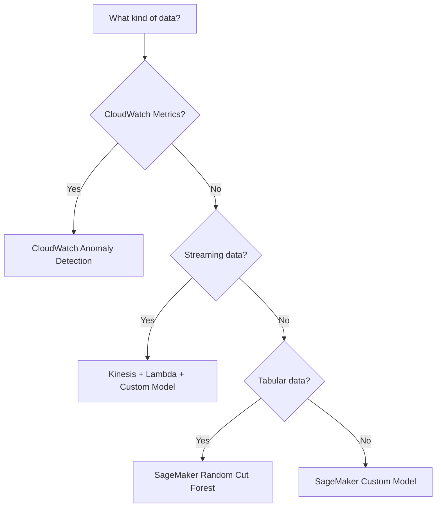
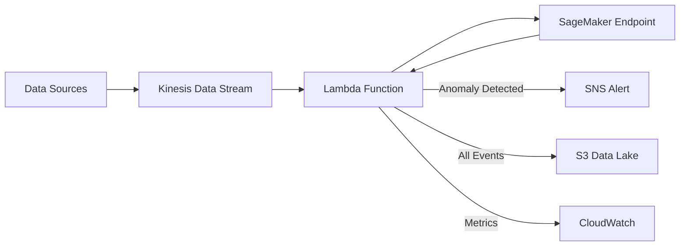

# How to Build an Anomaly Detection System on AWS

Author: [nawazdhandala](https://github.com/nawazdhandala)

Tags: AWS, SageMaker, CloudWatch, Lambda, Anomaly Detection, Machine Learning, Kinesis

Description: Learn how to build a scalable anomaly detection system on AWS using SageMaker, CloudWatch Anomaly Detection, Kinesis, and Lambda for real-time monitoring.

---

Anomaly detection is one of those things that sounds simple but gets complicated fast. You need to figure out what "normal" looks like, then flag anything that deviates from it, and do all of this in real-time without drowning in false positives. AWS provides several paths to get there, ranging from no-code options like CloudWatch Anomaly Detection to fully custom models on SageMaker.

This guide covers how to build an anomaly detection system on AWS that works across different data sources and use cases.

## Choosing Your Approach

AWS gives you three main options for anomaly detection, and the right choice depends on your data and requirements:



- **CloudWatch Anomaly Detection**: Zero-code option for CloudWatch metrics. AWS trains the model for you.
- **Amazon Lookout for Metrics**: Managed anomaly detection for business metrics from various sources.
- **SageMaker with Random Cut Forest**: The built-in algorithm for time-series and tabular anomaly detection.
- **Custom models on SageMaker**: Full control when the built-in options do not fit.

## CloudWatch Anomaly Detection

If your anomaly detection target is infrastructure metrics already in CloudWatch, this is the fastest path. CloudWatch uses machine learning to establish a baseline and creates a band of expected values.

```python
# Enable anomaly detection on a CloudWatch metric
import boto3

cloudwatch = boto3.client('cloudwatch')

# Create an anomaly detector for CPU utilization
cloudwatch.put_anomaly_detector(
    Namespace='AWS/EC2',
    MetricName='CPUUtilization',
    Dimensions=[
        {
            'Name': 'InstanceId',
            'Value': 'i-0123456789abcdef0'
        }
    ],
    Stat='Average',
    Configuration={
        'ExcludedTimeRanges': [],
        'MetricTimezone': 'UTC'
    }
)
```

Then create an alarm that triggers when the metric goes outside the anomaly band:

```python
# Create alarm based on anomaly detection band
cloudwatch.put_metric_alarm(
    AlarmName='CPU-Anomaly-Alert',
    ComparisonOperator='LessThanLowerOrGreaterThanUpperThreshold',
    EvaluationPeriods=3,
    Metrics=[
        {
            'Id': 'cpu',
            'MetricStat': {
                'Metric': {
                    'Namespace': 'AWS/EC2',
                    'MetricName': 'CPUUtilization',
                    'Dimensions': [
                        {'Name': 'InstanceId', 'Value': 'i-0123456789abcdef0'}
                    ]
                },
                'Period': 300,
                'Stat': 'Average'
            },
            'ReturnData': True
        },
        {
            'Id': 'anomaly_band',
            'Expression': 'ANOMALY_DETECTION_BAND(cpu, 2)'
        }
    ],
    ThresholdMetricId='anomaly_band',
    AlarmActions=[
        'arn:aws:sns:us-east-1:123456789:anomaly-alerts'
    ]
)
```

The `2` in `ANOMALY_DETECTION_BAND(cpu, 2)` controls the band width. Higher values mean fewer false positives but potentially missed anomalies. Start with 2 and tune from there.

## Building a Custom System with SageMaker Random Cut Forest

Random Cut Forest (RCF) is an unsupervised algorithm built into SageMaker that is specifically designed for anomaly detection in streaming data. It assigns an anomaly score to each data point - the higher the score, the more anomalous.

### Preparing Training Data

```python
# Prepare time-series data for RCF training
import pandas as pd
import numpy as np
import sagemaker
from sagemaker import RandomCutForest

# Load your historical data
df = pd.read_csv('sensor_readings.csv')

# RCF expects numeric data without timestamps
# Select the features you want to monitor
features = df[['temperature', 'pressure', 'vibration']].values

# Convert to RecordSet format for SageMaker
session = sagemaker.Session()
bucket = session.default_bucket()

# Upload training data
train_data = features.astype('float32')
```

### Training the Model

```python
# Train Random Cut Forest model
rcf = RandomCutForest(
    role=sagemaker.get_execution_role(),
    instance_count=1,
    instance_type='ml.m5.large',
    num_samples_per_tree=256,
    num_trees=100,
    output_path=f's3://{bucket}/rcf-output'
)

# Create a RecordSet from the training data
record_set = rcf.record_set(train_data, channel='train')

# Train
rcf.fit(record_set)
```

### Deploying for Real-Time Inference

```python
# Deploy the model as a real-time endpoint
predictor = rcf.deploy(
    initial_instance_count=1,
    instance_type='ml.t2.medium',
    serializer=sagemaker.serializers.CSVSerializer(),
    deserializer=sagemaker.deserializers.JSONDeserializer()
)

# Test with a sample data point
result = predictor.predict([[75.2, 1013.5, 0.003]])
anomaly_score = result['scores'][0]['score']
print(f"Anomaly score: {anomaly_score}")
```

## Real-Time Pipeline with Kinesis

For real-time anomaly detection on streaming data, you need a pipeline that can process events as they arrive.



The Lambda function consumes from Kinesis, calls the SageMaker endpoint for scoring, and routes results based on the anomaly score.

```python
# Lambda function for real-time anomaly detection via Kinesis
import boto3
import json
import base64
import os

sagemaker_runtime = boto3.client('sagemaker-runtime')
sns = boto3.client('sns')
cloudwatch = boto3.client('cloudwatch')

ENDPOINT_NAME = os.environ['SAGEMAKER_ENDPOINT']
ANOMALY_THRESHOLD = float(os.environ.get('ANOMALY_THRESHOLD', '3.0'))

def handler(event, context):
    anomalies = []

    for record in event['Records']:
        payload = json.loads(base64.b64decode(record['kinesis']['data']))

        # Extract features for scoring
        features = f"{payload['temperature']},{payload['pressure']},{payload['vibration']}"

        # Call SageMaker endpoint
        response = sagemaker_runtime.invoke_endpoint(
            EndpointName=ENDPOINT_NAME,
            ContentType='text/csv',
            Body=features
        )

        result = json.loads(response['Body'].read())
        score = result['scores'][0]['score']

        # Publish metric for monitoring
        cloudwatch.put_metric_data(
            Namespace='AnomalyDetection',
            MetricData=[{
                'MetricName': 'AnomalyScore',
                'Dimensions': [
                    {'Name': 'DeviceId', 'Value': payload['deviceId']}
                ],
                'Value': score,
                'Unit': 'None'
            }]
        )

        # Check threshold
        if score > ANOMALY_THRESHOLD:
            anomalies.append({
                'deviceId': payload['deviceId'],
                'score': score,
                'data': payload,
                'timestamp': payload.get('timestamp')
            })

    # Send alert for anomalies
    if anomalies:
        sns.publish(
            TopicArn=os.environ['ALERT_TOPIC_ARN'],
            Subject=f'{len(anomalies)} Anomalies Detected',
            Message=json.dumps(anomalies, indent=2)
        )

    return {'statusCode': 200, 'anomaliesDetected': len(anomalies)}
```

## Setting the Right Threshold

The anomaly threshold is the most critical tuning parameter. Too low and you get alert fatigue. Too high and you miss real problems.

A practical approach:

1. Run the model on historical data with known anomalies
2. Plot the distribution of anomaly scores
3. Find the score that separates normal from anomalous with acceptable false positive rate
4. Start conservative (higher threshold) and lower it over time

```python
# Analyze anomaly score distribution to set threshold
import numpy as np

# Score all historical data
scores = []
for batch in np.array_split(historical_data, 100):
    result = predictor.predict(batch.tolist())
    batch_scores = [r['score'] for r in result['scores']]
    scores.extend(batch_scores)

scores = np.array(scores)
print(f"Mean score: {scores.mean():.2f}")
print(f"Std score: {scores.std():.2f}")
print(f"95th percentile: {np.percentile(scores, 95):.2f}")
print(f"99th percentile: {np.percentile(scores, 99):.2f}")

# A common starting threshold is mean + 3*std
threshold = scores.mean() + 3 * scores.std()
print(f"Suggested threshold: {threshold:.2f}")
```

## Handling Multi-Dimensional Anomalies

Sometimes individual metrics look normal but their combination is anomalous. For example, high temperature and low pressure might be fine individually but dangerous together. RCF handles this naturally because it considers all dimensions simultaneously.

For more complex relationships, consider training a SageMaker model using an autoencoder approach, where the reconstruction error serves as the anomaly score.

## Feedback Loop for Continuous Improvement

The best anomaly detection systems learn from operator feedback. When an alert fires and an operator marks it as a false positive or confirms it as a real issue, feed that information back into the system.

```python
# Store operator feedback for model retraining
import boto3
from datetime import datetime

dynamodb = boto3.resource('dynamodb')
feedback_table = dynamodb.Table('AnomalyFeedback')

def record_feedback(event_id, is_anomaly, operator_notes):
    feedback_table.put_item(Item={
        'eventId': event_id,
        'isAnomaly': is_anomaly,
        'operatorNotes': operator_notes,
        'timestamp': datetime.now().isoformat()
    })
```

Use this feedback data during periodic model retraining to improve accuracy over time.

## Monitoring the Anomaly Detector Itself

Your anomaly detection system is infrastructure too, and it needs monitoring. Track these metrics:

- Inference latency from SageMaker endpoints
- Number of anomalies detected per hour (sudden drops may indicate model issues)
- Lambda function errors and timeouts
- Kinesis iterator age (lag in processing)

For comprehensive monitoring of your anomaly detection pipeline and the broader infrastructure it runs on, check out our post on [building a time-series dashboard for IoT](https://oneuptime.com/blog/post/2026-02-12-build-a-time-series-dashboard-for-iot-on-aws/view) that covers visualization of exactly these kinds of operational metrics.

## Wrapping Up

Building anomaly detection on AWS comes down to picking the right level of abstraction. CloudWatch Anomaly Detection is trivial to set up for infrastructure metrics. SageMaker Random Cut Forest handles most time-series and streaming use cases out of the box. And when you need something more specialized, SageMaker gives you the infrastructure to train and deploy custom models.

The hardest part is not the technology - it is tuning the thresholds and building the feedback loops that make the system useful over time. Start simple, measure your false positive rate, and iterate.
