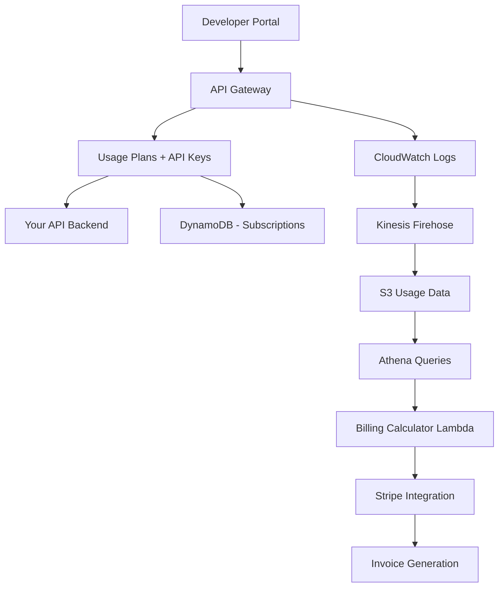

# How to Build an API Monetization Platform on AWS

Author: [nawazdhandala](https://github.com/nawazdhandala)

Tags: AWS, API Gateway, Monetization, Usage Plans, Lambda, DynamoDB

Description: Build an API monetization platform on AWS with usage tracking, tiered pricing, billing integration, and developer portal using API Gateway and Lambda.

---

You have built an API. Now you want to charge for it. Whether it is a data API, a machine learning inference endpoint, or a SaaS platform API, monetizing it requires more than just slapping a price tag on it. You need usage tracking, rate limiting, tiered pricing plans, billing integration, and a developer portal where customers can sign up and manage their API keys.

AWS API Gateway has built-in support for usage plans and API keys, which gives you a solid foundation. In this guide, we will build a complete API monetization platform on top of it.

## Architecture



## Setting Up API Gateway with Usage Plans

Usage plans in API Gateway let you define rate limits, burst limits, and monthly quotas per tier. Here is the CloudFormation for a three-tier pricing model:

```yaml
# API Gateway with tiered usage plans
AWSTemplateFormatVersion: '2010-09-09'
Resources:
  MonetizedAPI:
    Type: AWS::ApiGateway::RestApi
    Properties:
      Name: MonetizedAPI
      Description: API with usage-based pricing

  # Free tier - limited access
  FreePlan:
    Type: AWS::ApiGateway::UsagePlan
    Properties:
      UsagePlanName: Free
      Description: Free tier with limited access
      Throttle:
        RateLimit: 10        # 10 requests per second
        BurstLimit: 20
      Quota:
        Limit: 1000          # 1000 requests per month
        Period: MONTH
      ApiStages:
        - ApiId: !Ref MonetizedAPI
          Stage: prod

  # Pro tier - higher limits
  ProPlan:
    Type: AWS::ApiGateway::UsagePlan
    Properties:
      UsagePlanName: Pro
      Description: Pro tier for growing businesses
      Throttle:
        RateLimit: 100
        BurstLimit: 200
      Quota:
        Limit: 100000         # 100k requests per month
        Period: MONTH
      ApiStages:
        - ApiId: !Ref MonetizedAPI
          Stage: prod

  # Enterprise tier - highest limits
  EnterprisePlan:
    Type: AWS::ApiGateway::UsagePlan
    Properties:
      UsagePlanName: Enterprise
      Description: Enterprise tier with high volume access
      Throttle:
        RateLimit: 1000
        BurstLimit: 2000
      Quota:
        Limit: 10000000       # 10M requests per month
        Period: MONTH
      ApiStages:
        - ApiId: !Ref MonetizedAPI
          Stage: prod
```

## Developer Signup and API Key Management

Build a signup flow that creates API keys and associates them with usage plans:

```python
# Lambda function for developer signup and API key provisioning
import boto3
import json
import uuid
from datetime import datetime

apigw = boto3.client('apigateway')
dynamodb = boto3.resource('dynamodb')
ses = boto3.client('ses')

subscriptions_table = dynamodb.Table('APISubscriptions')

PLAN_IDS = {
    'free': 'usage-plan-free-id',
    'pro': 'usage-plan-pro-id',
    'enterprise': 'usage-plan-enterprise-id'
}

PLAN_PRICING = {
    'free': 0,
    'pro': 49.99,
    'enterprise': 499.99
}

def signup(event, context):
    body = json.loads(event['body'])
    email = body['email']
    company = body['company']
    plan = body.get('plan', 'free')

    if plan not in PLAN_IDS:
        return respond(400, {'error': 'Invalid plan'})

    # Create API key
    api_key = apigw.create_api_key(
        name=f'{company}-{uuid.uuid4().hex[:8]}',
        description=f'API key for {company} ({email})',
        enabled=True,
        tags={
            'email': email,
            'company': company,
            'plan': plan
        }
    )

    # Associate key with usage plan
    apigw.create_usage_plan_key(
        usagePlanId=PLAN_IDS[plan],
        keyId=api_key['id'],
        keyType='API_KEY'
    )

    # Store subscription details
    subscription_id = str(uuid.uuid4())
    subscriptions_table.put_item(Item={
        'subscriptionId': subscription_id,
        'email': email,
        'company': company,
        'plan': plan,
        'apiKeyId': api_key['id'],
        'apiKeyValue': api_key['value'],
        'monthlyPrice': str(PLAN_PRICING[plan]),
        'status': 'ACTIVE',
        'createdAt': datetime.utcnow().isoformat()
    })

    # Send welcome email with API key
    ses.send_email(
        Source='api@company.com',
        Destination={'ToAddresses': [email]},
        Message={
            'Subject': {'Data': 'Your API Key is Ready'},
            'Body': {'Text': {'Data': (
                f'Welcome to our API!\n\n'
                f'Your API key: {api_key["value"]}\n'
                f'Plan: {plan.capitalize()}\n\n'
                f'Include this key in the x-api-key header with every request.\n'
                f'Documentation: https://api.company.com/docs'
            )}}
        }
    )

    return respond(201, {
        'subscriptionId': subscription_id,
        'apiKey': api_key['value'],
        'plan': plan
    })

def respond(status, body):
    return {
        'statusCode': status,
        'headers': {'Content-Type': 'application/json'},
        'body': json.dumps(body)
    }
```

## Usage Tracking and Metering

API Gateway logs usage data automatically, but for detailed billing, you need more granular tracking. Log every request through a custom authorizer or request interceptor:

```python
# Custom Lambda authorizer that also tracks usage
import boto3
import json
import time

dynamodb = boto3.resource('dynamodb')
usage_table = dynamodb.Table('APIUsage')

def authorizer(event, context):
    api_key = event['headers'].get('x-api-key', '')
    resource_path = event['resource']
    method = event['httpMethod']

    # Validate the API key (API Gateway handles this too,
    # but we need the key for usage tracking)
    if not api_key:
        raise Exception('Unauthorized')

    # Track this request
    timestamp = int(time.time())
    hour_bucket = timestamp - (timestamp % 3600)  # Round to hour

    usage_table.update_item(
        Key={
            'pk': f'KEY#{api_key[:16]}',
            'sk': f'HOUR#{hour_bucket}#PATH#{resource_path}'
        },
        UpdateExpression='ADD requestCount :one SET #m = :method, apiKey = :key',
        ExpressionAttributeNames={'#m': 'method'},
        ExpressionAttributeValues={
            ':one': 1,
            ':method': method,
            ':key': api_key[:16]
        }
    )

    # Return the authorization policy
    return generate_policy('Allow', event['methodArn'])

def generate_policy(effect, resource):
    return {
        'principalId': 'api-user',
        'policyDocument': {
            'Version': '2012-10-17',
            'Statement': [{
                'Action': 'execute-api:Invoke',
                'Effect': effect,
                'Resource': resource
            }]
        }
    }
```

## Billing Calculation

Run a monthly billing job that calculates charges based on usage:

```python
# Monthly billing calculator Lambda
import boto3
import json
from datetime import datetime, timedelta
from decimal import Decimal

dynamodb = boto3.resource('dynamodb')
usage_table = dynamodb.Table('APIUsage')
subscriptions_table = dynamodb.Table('APISubscriptions')
invoices_table = dynamodb.Table('Invoices')

# Overage pricing per 1000 requests beyond plan limit
OVERAGE_PRICING = {
    'free': Decimal('0'),    # No overage allowed on free
    'pro': Decimal('0.50'),       # $0.50 per 1000 extra requests
    'enterprise': Decimal('0.25') # $0.25 per 1000 extra requests
}

PLAN_LIMITS = {
    'free': 1000,
    'pro': 100000,
    'enterprise': 10000000
}

def handler(event, context):
    # Calculate billing for the previous month
    now = datetime.utcnow()
    month_start = now.replace(day=1, hour=0, minute=0, second=0) - timedelta(days=1)
    month_start = month_start.replace(day=1)
    month_end = now.replace(day=1)

    # Get all active subscriptions
    subscriptions = subscriptions_table.scan(
        FilterExpression='#s = :active',
        ExpressionAttributeNames={'#s': 'status'},
        ExpressionAttributeValues={':active': 'ACTIVE'}
    )

    for sub in subscriptions['Items']:
        api_key_prefix = sub['apiKeyValue'][:16]
        plan = sub['plan']

        # Count total requests for the month
        total_requests = count_requests(
            api_key_prefix,
            int(month_start.timestamp()),
            int(month_end.timestamp())
        )

        # Calculate the bill
        base_price = Decimal(sub['monthlyPrice'])
        plan_limit = PLAN_LIMITS[plan]
        overage_requests = max(0, total_requests - plan_limit)
        overage_cost = (Decimal(overage_requests) / 1000) * OVERAGE_PRICING[plan]
        total_bill = base_price + overage_cost

        # Create invoice
        invoices_table.put_item(Item={
            'invoiceId': f'{sub["subscriptionId"]}-{month_start.strftime("%Y-%m")}',
            'subscriptionId': sub['subscriptionId'],
            'email': sub['email'],
            'period': month_start.strftime('%Y-%m'),
            'totalRequests': total_requests,
            'planLimit': plan_limit,
            'overageRequests': overage_requests,
            'baseCost': str(base_price),
            'overageCost': str(overage_cost),
            'totalCost': str(total_bill),
            'status': 'PENDING',
            'createdAt': datetime.utcnow().isoformat()
        })

def count_requests(api_key_prefix, start_ts, end_ts):
    """Count total requests for an API key in a time range."""
    total = 0
    response = usage_table.query(
        KeyConditionExpression='pk = :pk AND sk BETWEEN :start AND :end',
        ExpressionAttributeValues={
            ':pk': f'KEY#{api_key_prefix}',
            ':start': f'HOUR#{start_ts}',
            ':end': f'HOUR#{end_ts}'
        }
    )
    for item in response['Items']:
        total += item.get('requestCount', 0)
    return total
```

## Stripe Integration for Payment

Connect your billing to Stripe for payment processing:

```python
# Lambda to process payments through Stripe
import boto3
import json
import stripe

secrets = boto3.client('secretsmanager')
dynamodb = boto3.resource('dynamodb')
invoices_table = dynamodb.Table('Invoices')

# Get Stripe key from Secrets Manager
stripe_secret = secrets.get_secret_value(SecretId='stripe-api-key')
stripe.api_key = json.loads(stripe_secret['SecretString'])['key']

def process_invoices(event, context):
    """Process pending invoices through Stripe."""
    pending = invoices_table.scan(
        FilterExpression='#s = :pending',
        ExpressionAttributeNames={'#s': 'status'},
        ExpressionAttributeValues={':pending': 'PENDING'}
    )

    for invoice in pending['Items']:
        total = float(invoice['totalCost'])

        if total <= 0:
            # Free plan with no overage
            invoices_table.update_item(
                Key={'invoiceId': invoice['invoiceId']},
                UpdateExpression='SET #s = :paid',
                ExpressionAttributeNames={'#s': 'status'},
                ExpressionAttributeValues={':paid': 'PAID_FREE'}
            )
            continue

        try:
            # Create Stripe invoice
            stripe_invoice = stripe.Invoice.create(
                customer=get_stripe_customer_id(invoice['email']),
                auto_advance=True
            )

            stripe.InvoiceItem.create(
                customer=get_stripe_customer_id(invoice['email']),
                invoice=stripe_invoice.id,
                amount=int(total * 100),  # Stripe uses cents
                currency='usd',
                description=f'API usage for {invoice["period"]}'
            )

            stripe_invoice.finalize_invoice()

            invoices_table.update_item(
                Key={'invoiceId': invoice['invoiceId']},
                UpdateExpression='SET #s = :processing, stripeInvoiceId = :sid',
                ExpressionAttributeNames={'#s': 'status'},
                ExpressionAttributeValues={
                    ':processing': 'PROCESSING',
                    ':sid': stripe_invoice.id
                }
            )

        except Exception as e:
            print(f'Failed to process invoice {invoice["invoiceId"]}: {str(e)}')

def get_stripe_customer_id(email):
    """Look up or create a Stripe customer by email."""
    customers = stripe.Customer.list(email=email, limit=1)
    if customers.data:
        return customers.data[0].id
    customer = stripe.Customer.create(email=email)
    return customer.id
```

## Developer Portal API

Give developers a way to check their usage and manage their subscription:

```python
# API endpoints for the developer portal
import boto3
import json
from datetime import datetime

apigw = boto3.client('apigateway')
dynamodb = boto3.resource('dynamodb')

def get_usage(event, context):
    """Get usage statistics for the authenticated developer."""
    email = event['requestContext']['authorizer']['claims']['email']

    # Look up their subscription
    subs_table = dynamodb.Table('APISubscriptions')
    result = subs_table.query(
        IndexName='EmailIndex',
        KeyConditionExpression='email = :email',
        ExpressionAttributeValues={':email': email}
    )

    if not result['Items']:
        return respond(404, {'error': 'No subscription found'})

    sub = result['Items'][0]

    # Get usage from API Gateway
    usage = apigw.get_usage(
        usagePlanId=sub['usagePlanId'],
        keyId=sub['apiKeyId'],
        startDate=datetime.utcnow().replace(day=1).strftime('%Y-%m-%d'),
        endDate=datetime.utcnow().strftime('%Y-%m-%d')
    )

    return respond(200, {
        'plan': sub['plan'],
        'usage': usage.get('items', {}),
        'monthlyLimit': sub.get('monthlyLimit'),
        'status': sub['status']
    })
```

## Monitoring Your API Platform

When your API is generating revenue, downtime directly impacts your bottom line. Monitor API availability, latency, error rates, and usage plan limits. Use [OneUptime](https://oneuptime.com/blog/post/2026-02-12-build-a-real-time-leaderboard-on-aws/view) to set up external uptime monitoring for your API endpoints so you catch outages before your paying customers do.

## Wrapping Up

API monetization on AWS is achievable with the services that are already there. API Gateway handles rate limiting and API key management, DynamoDB tracks granular usage, and Lambda ties it all together with billing logic and Stripe integration. The main effort is in the billing calculation and developer experience.

Start with a simple free/pro model. Get the usage tracking right. Add enterprise plans and overage billing once you have paying customers. The infrastructure scales automatically, so your API monetization platform grows right alongside your customer base.
