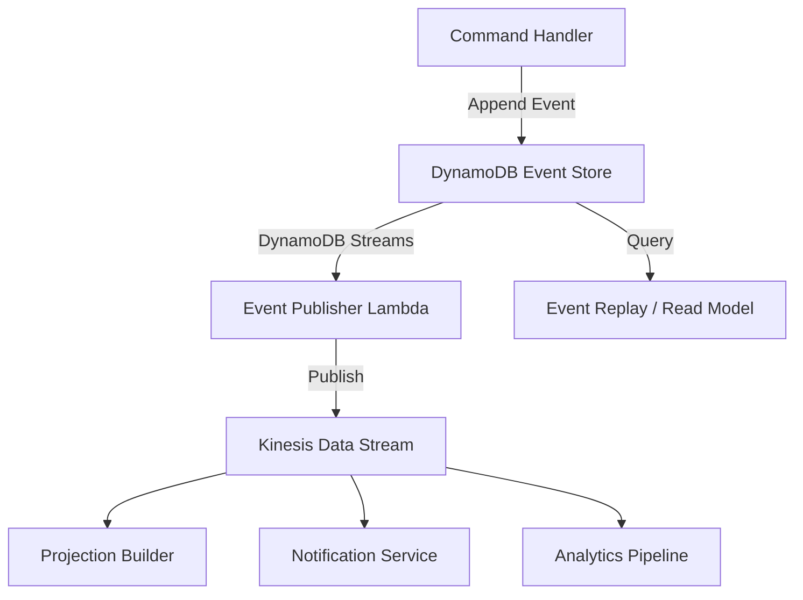

# How to Build an Event Store Pattern on AWS

Author: [nawazdhandala](https://github.com/nawazdhandala)

Tags: AWS, Event Sourcing, DynamoDB, Kinesis, Event Store, Architecture

Description: Learn how to implement the event store pattern on AWS using DynamoDB and Kinesis for building event-sourced applications at scale

---

Event sourcing is a design pattern where every change to application state is captured as an immutable event. Instead of storing just the current state of an entity, you store the complete sequence of events that led to that state. Need to know what happened to an order? Replay its events. Need to debug a bug? Look at the exact sequence of state changes.

The event store is the backbone of this pattern. It is an append-only database that stores events in order, supports efficient retrieval by entity, and publishes events for downstream consumers.

On AWS, DynamoDB and Kinesis together form a solid foundation for an event store. DynamoDB provides the durable, ordered storage. Kinesis (or DynamoDB Streams) broadcasts events to consumers. This guide walks through building a production-ready event store.

## Event Store Architecture



Commands come in, get validated, and produce events that are appended to the store. DynamoDB Streams picks up new events and publishes them to Kinesis for fan-out to multiple consumers. Consumers build read models (projections) from the event stream.

## Step 1: Design the Event Store Table

The DynamoDB table design is critical. You need to support two access patterns:

1. **Get all events for an entity** (e.g., all events for order-123)
2. **Append a new event with optimistic locking** (prevent concurrent writes from creating conflicts)

```bash
# Create the event store table
aws dynamodb create-table \
  --table-name EventStore \
  --attribute-definitions \
    AttributeName=entityId,AttributeType=S \
    AttributeName=version,AttributeType=N \
    AttributeName=eventTimestamp,AttributeType=S \
  --key-schema \
    AttributeName=entityId,KeyType=HASH \
    AttributeName=version,KeyType=RANGE \
  --global-secondary-indexes '[
    {
      "IndexName": "by-timestamp",
      "KeySchema": [
        {"AttributeName": "entityId", "KeyType": "HASH"},
        {"AttributeName": "eventTimestamp", "KeyType": "RANGE"}
      ],
      "Projection": {"ProjectionType": "ALL"}
    }
  ]' \
  --billing-mode PAY_PER_REQUEST \
  --stream-specification StreamEnabled=true,StreamViewType=NEW_IMAGE
```

The primary key is `entityId` (partition key) and `version` (sort key). Each event for an entity gets an incrementing version number. This makes it easy to fetch all events in order and to implement optimistic concurrency control.

## Step 2: Define Event Models

Events should be self-describing. Each event includes the entity it belongs to, what happened, and the data associated with the change.

```python
# events.py - Event model definitions
from dataclasses import dataclass, asdict
from datetime import datetime
from typing import Any, Dict
import json
import uuid

@dataclass
class Event:
    """Base event structure for the event store."""
    event_id: str
    entity_id: str
    entity_type: str
    event_type: str
    version: int
    timestamp: str
    data: Dict[str, Any]
    metadata: Dict[str, Any]

    @staticmethod
    def create(entity_id, entity_type, event_type, version, data, metadata=None):
        return Event(
            event_id=str(uuid.uuid4()),
            entity_id=entity_id,
            entity_type=entity_type,
            event_type=event_type,
            version=version,
            timestamp=datetime.utcnow().isoformat(),
            data=data,
            metadata=metadata or {}
        )

    def to_dynamodb_item(self):
        return {
            'entityId': self.entity_id,
            'version': self.version,
            'eventId': self.event_id,
            'entityType': self.entity_type,
            'eventType': self.event_type,
            'eventTimestamp': self.timestamp,
            'data': json.dumps(self.data),
            'metadata': json.dumps(self.metadata),
        }
```

## Step 3: Implement the Event Store

The event store class handles appending events with optimistic concurrency and reading event streams.

```python
# event_store.py - Core event store operations
import boto3
from boto3.dynamodb.conditions import Key
from botocore.exceptions import ClientError
import json

class EventStore:
    """DynamoDB-backed event store with optimistic concurrency."""

    def __init__(self, table_name='EventStore'):
        dynamodb = boto3.resource('dynamodb')
        self.table = dynamodb.Table(table_name)

    def append(self, event):
        """
        Append an event to the store.
        Uses a condition expression to ensure the version does not already exist,
        providing optimistic concurrency control.
        """
        try:
            self.table.put_item(
                Item=event.to_dynamodb_item(),
                ConditionExpression='attribute_not_exists(entityId) AND attribute_not_exists(version)'
            )
            return True
        except ClientError as e:
            if e.response['Error']['Code'] == 'ConditionalCheckFailedException':
                raise ConcurrencyError(
                    f"Event version {event.version} already exists for entity {event.entity_id}"
                )
            raise

    def append_batch(self, events):
        """
        Append multiple events atomically using a transaction.
        All events must be for the same entity.
        """
        if not events:
            return

        # Use DynamoDB transactions for atomic multi-event appends
        client = boto3.client('dynamodb')

        transact_items = []
        for event in events:
            item = event.to_dynamodb_item()
            transact_items.append({
                'Put': {
                    'TableName': 'EventStore',
                    'Item': self._serialize_for_transaction(item),
                    'ConditionExpression': 'attribute_not_exists(entityId) AND attribute_not_exists(version)',
                }
            })

        try:
            client.transact_write_items(TransactItems=transact_items)
        except ClientError as e:
            if 'TransactionCanceledException' in str(e):
                raise ConcurrencyError("Concurrent modification detected")
            raise

    def get_events(self, entity_id, from_version=0):
        """Retrieve all events for an entity, optionally from a specific version."""
        response = self.table.query(
            KeyConditionExpression=Key('entityId').eq(entity_id) & Key('version').gte(from_version),
            ScanIndexForward=True  # Ascending order by version
        )

        events = []
        for item in response['Items']:
            events.append({
                'entityId': item['entityId'],
                'version': item['version'],
                'eventType': item['eventType'],
                'timestamp': item['eventTimestamp'],
                'data': json.loads(item['data']),
                'metadata': json.loads(item.get('metadata', '{}')),
            })

        return events

    def get_current_version(self, entity_id):
        """Get the latest version number for an entity."""
        response = self.table.query(
            KeyConditionExpression=Key('entityId').eq(entity_id),
            ScanIndexForward=False,  # Descending to get latest first
            Limit=1,
            ProjectionExpression='version'
        )

        items = response.get('Items', [])
        return items[0]['version'] if items else 0

    def _serialize_for_transaction(self, item):
        """Convert item to DynamoDB JSON format for transactions."""
        serialized = {}
        for key, value in item.items():
            if isinstance(value, str):
                serialized[key] = {'S': value}
            elif isinstance(value, (int, float)):
                serialized[key] = {'N': str(value)}
        return serialized


class ConcurrencyError(Exception):
    """Raised when a concurrent modification is detected."""
    pass
```

## Step 4: Build an Aggregate

Aggregates are entities that are rebuilt from their event stream. Here is an example Order aggregate.

```python
# order_aggregate.py - Rebuild order state from events
from event_store import EventStore
from events import Event

class Order:
    """Order aggregate rebuilt from events."""

    def __init__(self, order_id):
        self.order_id = order_id
        self.status = None
        self.items = []
        self.total = 0
        self.customer_id = None
        self.version = 0

    @staticmethod
    def load(order_id):
        """Load an order by replaying its events."""
        store = EventStore()
        events = store.get_events(order_id)

        order = Order(order_id)
        for event in events:
            order._apply(event)

        return order

    def place(self, customer_id, items):
        """Place a new order (produces an OrderPlaced event)."""
        total = sum(item['price'] * item['quantity'] for item in items)

        event = Event.create(
            entity_id=self.order_id,
            entity_type='Order',
            event_type='OrderPlaced',
            version=self.version + 1,
            data={
                'customerId': customer_id,
                'items': items,
                'total': total,
            }
        )

        store = EventStore()
        store.append(event)
        self._apply_event_data('OrderPlaced', event.data)

    def cancel(self, reason):
        """Cancel the order (produces an OrderCancelled event)."""
        if self.status != 'placed':
            raise ValueError(f"Cannot cancel order in status: {self.status}")

        event = Event.create(
            entity_id=self.order_id,
            entity_type='Order',
            event_type='OrderCancelled',
            version=self.version + 1,
            data={'reason': reason}
        )

        store = EventStore()
        store.append(event)
        self._apply_event_data('OrderCancelled', event.data)

    def _apply(self, event):
        """Apply an event to update the aggregate state."""
        self._apply_event_data(event['eventType'], event['data'])
        self.version = event['version']

    def _apply_event_data(self, event_type, data):
        """Update state based on event type."""
        if event_type == 'OrderPlaced':
            self.status = 'placed'
            self.customer_id = data['customerId']
            self.items = data['items']
            self.total = data['total']
        elif event_type == 'OrderCancelled':
            self.status = 'cancelled'
        elif event_type == 'OrderShipped':
            self.status = 'shipped'
```

## Step 5: Publish Events to Kinesis

DynamoDB Streams captures new events automatically. A Lambda function reads the stream and publishes events to Kinesis for broader consumption.

```python
# stream_publisher.py - Publish DynamoDB Stream events to Kinesis
import boto3
import json

kinesis = boto3.client('kinesis')

STREAM_NAME = 'domain-events'

def lambda_handler(event, context):
    """Forward new events from DynamoDB Streams to Kinesis."""

    for record in event['Records']:
        if record['eventName'] != 'INSERT':
            continue

        new_image = record['dynamodb']['NewImage']

        # Build the Kinesis record
        kinesis_record = {
            'entityId': new_image['entityId']['S'],
            'eventType': new_image['eventType']['S'],
            'version': int(new_image['version']['N']),
            'timestamp': new_image['eventTimestamp']['S'],
            'data': new_image['data']['S'],
        }

        # Use entityId as partition key for ordering
        kinesis.put_record(
            StreamName=STREAM_NAME,
            Data=json.dumps(kinesis_record),
            PartitionKey=kinesis_record['entityId']
        )

    return {'statusCode': 200}
```

## Step 6: Build Projections

Projections (read models) are optimized views built from the event stream.

```python
# order_projection.py - Build a read model from order events
import boto3
import json

dynamodb = boto3.resource('dynamodb')
projection_table = dynamodb.Table('OrderReadModel')

def lambda_handler(event, context):
    """Build order read model from Kinesis events."""

    for record in event['Records']:
        import base64
        payload = json.loads(base64.b64decode(record['kinesis']['data']))

        entity_id = payload['entityId']
        event_type = payload['eventType']
        data = json.loads(payload['data'])

        if event_type == 'OrderPlaced':
            projection_table.put_item(Item={
                'orderId': entity_id,
                'customerId': data['customerId'],
                'status': 'placed',
                'total': str(data['total']),
                'itemCount': len(data['items']),
                'lastUpdated': payload['timestamp'],
            })
        elif event_type == 'OrderCancelled':
            projection_table.update_item(
                Key={'orderId': entity_id},
                UpdateExpression='SET #s = :s, lastUpdated = :t',
                ExpressionAttributeNames={'#s': 'status'},
                ExpressionAttributeValues={
                    ':s': 'cancelled',
                    ':t': payload['timestamp']
                }
            )
```

For publishing events to multiple consumers, see our guide on [implementing parallel fan-out with SNS and SQS](https://oneuptime.com/blog/post/implement-parallel-fan-out-with-sns-and-sqs/view).

## Snapshotting for Performance

As an entity accumulates hundreds or thousands of events, replaying them all becomes slow. Snapshots solve this by periodically saving the current state.

```python
# Take a snapshot every 100 events
def load_with_snapshot(entity_id):
    """Load an entity using the latest snapshot plus recent events."""
    snapshot = get_latest_snapshot(entity_id)

    if snapshot:
        entity = rebuild_from_snapshot(snapshot)
        events = store.get_events(entity_id, from_version=snapshot['version'] + 1)
    else:
        entity = Order(entity_id)
        events = store.get_events(entity_id)

    for event in events:
        entity._apply(event)

    # Save a new snapshot if we have replayed many events
    if len(events) > 100:
        save_snapshot(entity)

    return entity
```

## Wrapping Up

The event store pattern on AWS gives you a complete audit trail, temporal queries, and the ability to rebuild state at any point in time. DynamoDB provides the durable, scalable storage with built-in optimistic concurrency through condition expressions. DynamoDB Streams and Kinesis handle event distribution to consumers. The pattern takes more upfront design than a traditional CRUD approach, but for domains where the history of state changes matters - financial systems, order management, compliance-heavy applications - it is worth the investment.
