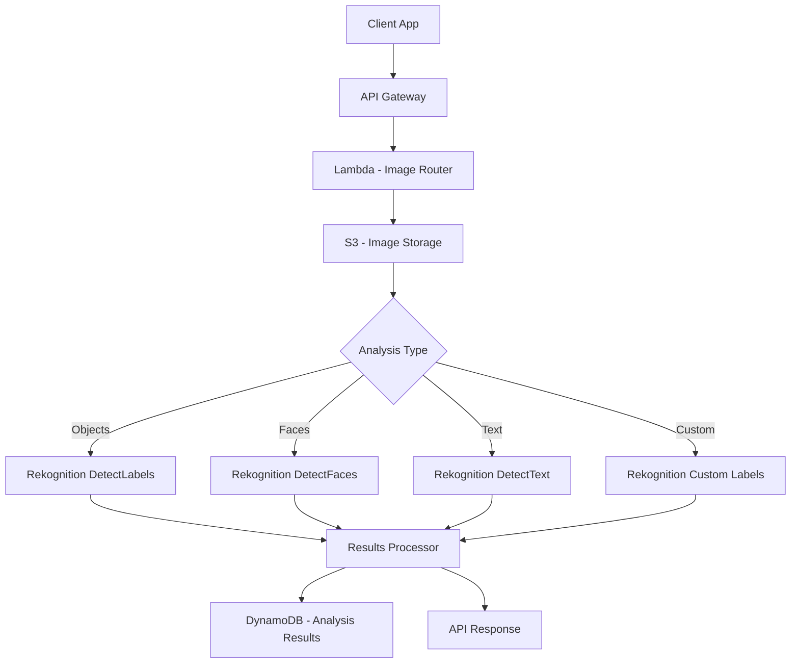

# How to Build an Image Recognition App with AWS Rekognition

Author: [nawazdhandala](https://github.com/nawazdhandala)

Tags: AWS, Rekognition, Image Recognition, Lambda, Machine Learning

Description: Build an image recognition application using AWS Rekognition for object detection, face analysis, text extraction, and custom label training.

---

Image recognition used to require a team of ML engineers, months of model training, and expensive GPU infrastructure. AWS Rekognition flips that on its head. It provides pre-trained models for object detection, face analysis, text in images, celebrity recognition, and more - all through a simple API call. For domain-specific needs, Custom Labels lets you train your own models without any ML expertise.

In this guide, we will build an image recognition application that handles multiple use cases: product identification, face analysis, text extraction from images, and custom object detection.

## Architecture



## Setting Up the Infrastructure

```yaml
# CloudFormation for the image recognition application
AWSTemplateFormatVersion: '2010-09-09'
Resources:
  ImageBucket:
    Type: AWS::S3::Bucket
    Properties:
      BucketName: image-recognition-uploads
      CorsConfiguration:
        CorsRules:
          - AllowedHeaders: ['*']
            AllowedMethods: [PUT, GET]
            AllowedOrigins: ['*']
            MaxAge: 3600

  ResultsTable:
    Type: AWS::DynamoDB::Table
    Properties:
      TableName: ImageAnalysisResults
      BillingMode: PAY_PER_REQUEST
      AttributeDefinitions:
        - AttributeName: imageId
          AttributeType: S
      KeySchema:
        - AttributeName: imageId
          KeyType: HASH
```

## Object and Scene Detection

The most common use case - identify objects, scenes, and activities in images:

```python
# Lambda for object and scene detection
import boto3
import json

rekognition = boto3.client('rekognition')

def detect_objects(bucket, key, min_confidence=70):
    """Detect objects, scenes, and activities in an image."""
    response = rekognition.detect_labels(
        Image={
            'S3Object': {'Bucket': bucket, 'Name': key}
        },
        MaxLabels=30,
        MinConfidence=min_confidence,
        Features=['GENERAL_LABELS', 'IMAGE_PROPERTIES']
    )

    # Organize labels by category
    categories = {}
    for label in response['Labels']:
        # Get the parent categories
        parents = [p['Name'] for p in label.get('Parents', [])]
        category = parents[0] if parents else 'General'

        if category not in categories:
            categories[category] = []

        label_info = {
            'name': label['Name'],
            'confidence': round(label['Confidence'], 2)
        }

        # Include bounding boxes if available (for specific objects)
        if label.get('Instances'):
            label_info['instances'] = []
            for instance in label['Instances']:
                bbox = instance['BoundingBox']
                label_info['instances'].append({
                    'boundingBox': {
                        'left': round(bbox['Left'], 4),
                        'top': round(bbox['Top'], 4),
                        'width': round(bbox['Width'], 4),
                        'height': round(bbox['Height'], 4)
                    },
                    'confidence': round(instance['Confidence'], 2)
                })

        categories[category].append(label_info)

    # Extract image properties (dominant colors, quality, etc.)
    image_props = {}
    if 'ImageProperties' in response:
        props = response['ImageProperties']
        if 'DominantColors' in props:
            image_props['dominantColors'] = [
                {
                    'color': f"rgb({c['Red']},{c['Green']},{c['Blue']})",
                    'hex': c.get('HexCode', ''),
                    'percentage': round(c['PixelPercent'], 2)
                }
                for c in props['DominantColors'][:5]
            ]

    return {
        'labels': response['Labels'],
        'categories': categories,
        'imageProperties': image_props,
        'labelCount': len(response['Labels'])
    }
```

## Face Analysis

Detect faces and analyze attributes like age range, emotions, and whether the person is wearing glasses or smiling:

```python
# Lambda for face detection and analysis
import boto3
import json

rekognition = boto3.client('rekognition')

def analyze_faces(bucket, key):
    """Detect and analyze faces in an image."""
    response = rekognition.detect_faces(
        Image={
            'S3Object': {'Bucket': bucket, 'Name': key}
        },
        Attributes=['ALL']  # Get all face attributes
    )

    faces = []
    for face in response['FaceDetails']:
        face_info = {
            'boundingBox': face['BoundingBox'],
            'confidence': round(face['Confidence'], 2),
            'ageRange': {
                'low': face['AgeRange']['Low'],
                'high': face['AgeRange']['High']
            },
            'gender': {
                'value': face['Gender']['Value'],
                'confidence': round(face['Gender']['Confidence'], 2)
            },
            'emotions': sorted(
                [
                    {'type': e['Type'], 'confidence': round(e['Confidence'], 2)}
                    for e in face['Emotions']
                ],
                key=lambda x: x['confidence'],
                reverse=True
            )[:3],  # Top 3 emotions
            'smile': face['Smile']['Value'],
            'eyeglasses': face['Eyeglasses']['Value'],
            'sunglasses': face['Sunglasses']['Value'],
            'beard': face['Beard']['Value'],
            'mustache': face['Mustache']['Value'],
            'eyesOpen': face['EyesOpen']['Value'],
            'mouthOpen': face['MouthOpen']['Value'],
            'pose': {
                'roll': round(face['Pose']['Roll'], 2),
                'yaw': round(face['Pose']['Yaw'], 2),
                'pitch': round(face['Pose']['Pitch'], 2)
            },
            'quality': {
                'brightness': round(face['Quality']['Brightness'], 2),
                'sharpness': round(face['Quality']['Sharpness'], 2)
            }
        }
        faces.append(face_info)

    return {
        'faceCount': len(faces),
        'faces': faces
    }
```

## Text Detection in Images

Extract text from photos of signs, documents, license plates, or any image containing text:

```python
# Lambda for text detection in images
import boto3

rekognition = boto3.client('rekognition')

def detect_text(bucket, key):
    """Detect and extract text from an image."""
    response = rekognition.detect_text(
        Image={
            'S3Object': {'Bucket': bucket, 'Name': key}
        },
        Filters={
            'WordFilter': {
                'MinConfidence': 70
            }
        }
    )

    # Separate lines from words for structured output
    lines = []
    words = []

    for detection in response['TextDetections']:
        item = {
            'text': detection['DetectedText'],
            'confidence': round(detection['Confidence'], 2),
            'boundingBox': detection['Geometry']['BoundingBox']
        }

        if detection['Type'] == 'LINE':
            lines.append(item)
        elif detection['Type'] == 'WORD':
            words.append(item)

    # Reconstruct full text from lines
    full_text = '\n'.join(line['text'] for line in lines)

    return {
        'fullText': full_text,
        'lines': lines,
        'words': words,
        'detectionCount': len(response['TextDetections'])
    }
```

## Face Comparison

Compare two faces to determine if they are the same person - useful for identity verification:

```python
# Lambda for face comparison between two images
import boto3

rekognition = boto3.client('rekognition')

def compare_faces(source_bucket, source_key, target_bucket, target_key, threshold=80):
    """Compare faces in two images to check if they match."""
    response = rekognition.compare_faces(
        SourceImage={
            'S3Object': {'Bucket': source_bucket, 'Name': source_key}
        },
        TargetImage={
            'S3Object': {'Bucket': target_bucket, 'Name': target_key}
        },
        SimilarityThreshold=threshold
    )

    matches = []
    for match in response['FaceMatches']:
        matches.append({
            'similarity': round(match['Similarity'], 2),
            'boundingBox': match['Face']['BoundingBox'],
            'confidence': round(match['Face']['Confidence'], 2)
        })

    unmatched = len(response.get('UnmatchedFaces', []))

    return {
        'isMatch': len(matches) > 0,
        'matches': matches,
        'unmatchedFaces': unmatched,
        'sourceImageFace': response.get('SourceImageFace', {})
    }
```

## Custom Labels for Domain-Specific Detection

When you need to detect things that Rekognition's pre-trained models do not cover (like specific product defects, brand logos, or plant diseases), use Custom Labels:

```python
# Training and using Rekognition Custom Labels
import boto3
import time

rekognition = boto3.client('rekognition')

def create_custom_labels_project(project_name):
    """Create a Custom Labels project for training."""
    response = rekognition.create_project(ProjectName=project_name)
    return response['ProjectArn']

def train_model(project_arn, training_data_bucket, training_data_prefix, output_bucket):
    """Start training a Custom Labels model."""
    response = rekognition.create_project_version(
        ProjectArn=project_arn,
        VersionName='v1',
        OutputConfig={
            'S3Bucket': output_bucket,
            'S3KeyPrefix': 'training-output/'
        },
        TrainingData={
            'Assets': [{
                'GroundTruthManifest': {
                    'S3Object': {
                        'Bucket': training_data_bucket,
                        'Name': f'{training_data_prefix}/manifest.json'
                    }
                }
            }]
        },
        TestingData={
            'AutoCreate': True  # Auto-split for testing
        }
    )
    return response['ProjectVersionArn']

def detect_custom_labels(project_version_arn, bucket, key, min_confidence=60):
    """Detect custom labels in an image using a trained model."""
    response = rekognition.detect_custom_labels(
        ProjectVersionArn=project_version_arn,
        Image={
            'S3Object': {'Bucket': bucket, 'Name': key}
        },
        MinConfidence=min_confidence
    )

    labels = []
    for label in response['CustomLabels']:
        label_info = {
            'name': label['Name'],
            'confidence': round(label['Confidence'], 2)
        }
        if 'Geometry' in label:
            label_info['boundingBox'] = label['Geometry']['BoundingBox']
        labels.append(label_info)

    return {'customLabels': labels}
```

## The Main Image Router

Tie everything together with a single API endpoint:

```python
# Lambda - Main image analysis router
import boto3
import json
import uuid
from datetime import datetime

dynamodb = boto3.resource('dynamodb')
results_table = dynamodb.Table('ImageAnalysisResults')

def handler(event, context):
    body = json.loads(event['body'])
    analysis_type = body['analysisType']
    bucket = body['bucket']
    key = body['key']
    image_id = str(uuid.uuid4())

    # Route to the appropriate analysis function
    if analysis_type == 'objects':
        result = detect_objects(bucket, key)
    elif analysis_type == 'faces':
        result = analyze_faces(bucket, key)
    elif analysis_type == 'text':
        result = detect_text(bucket, key)
    elif analysis_type == 'compare':
        result = compare_faces(bucket, key, body['targetBucket'], body['targetKey'])
    elif analysis_type == 'custom':
        result = detect_custom_labels(body['modelArn'], bucket, key)
    else:
        return respond(400, {'error': f'Unknown analysis type: {analysis_type}'})

    # Store results
    results_table.put_item(Item={
        'imageId': image_id,
        'analysisType': analysis_type,
        'source': f's3://{bucket}/{key}',
        'results': json.dumps(result, default=str),
        'analyzedAt': datetime.utcnow().isoformat()
    })

    result['imageId'] = image_id
    return respond(200, result)

def respond(status, body):
    return {
        'statusCode': status,
        'headers': {'Content-Type': 'application/json'},
        'body': json.dumps(body, default=str)
    }
```

## Monitoring Your Image Recognition Pipeline

Rekognition API calls can fail due to throttling, image format issues, or service disruptions. Monitor API error rates, response times, and processing costs. For applications where image analysis is user-facing, set up uptime monitoring with [OneUptime](https://oneuptime.com/blog/post/build-a-content-moderation-system-on-aws/view) to ensure the analysis pipeline stays responsive.

## Wrapping Up

AWS Rekognition removes the ML infrastructure burden from image recognition. The pre-trained models handle common use cases like object detection, face analysis, and text extraction without any setup. Custom Labels extends this to domain-specific detection needs with minimal training data.

The key consideration is cost. Rekognition charges per image analyzed, typically $0.001 to $0.004 per image depending on the feature. At high volumes, this adds up, so cache results for frequently analyzed images and use S3 event triggers instead of real-time API calls where possible.
