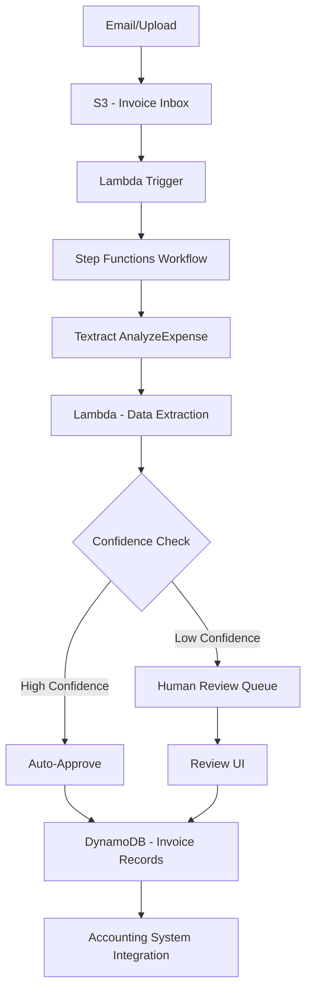

# How to Build an Invoice Processing System with AWS Textract

Author: [nawazdhandala](https://github.com/nawazdhandala)

Tags: AWS, Textract, Invoice Processing, Lambda, Document AI

Description: Build an automated invoice processing system using AWS Textract AnalyzeExpense API, Lambda, and Step Functions for accounts payable automation.

---

Manual invoice processing is slow, error-prone, and expensive. An accounts payable clerk spending 15 minutes per invoice adds up fast when you are processing hundreds per month. The data entry errors compound into payment disputes, late fees, and reconciliation headaches.

AWS Textract has a specialized AnalyzeExpense API designed specifically for invoices and receipts. It does not just extract text - it understands invoice structure, identifying vendor names, line items, totals, tax amounts, and payment terms. In this guide, we will build a complete invoice processing pipeline around it.

## Architecture



## Setting Up the Invoice Inbox

Invoices come from multiple sources - email attachments, supplier portals, and manual uploads. Route them all to S3:

```yaml
# CloudFormation for invoice processing infrastructure
AWSTemplateFormatVersion: '2010-09-09'
Resources:
  InvoiceBucket:
    Type: AWS::S3::Bucket
    Properties:
      BucketName: invoice-inbox
      NotificationConfiguration:
        LambdaConfigurations:
          - Event: s3:ObjectCreated:*
            Filter:
              S3Key:
                Rules:
                  - Name: prefix
                    Value: incoming/
            Function: !GetAtt InvoiceTriggerLambda.Arn

  InvoiceTable:
    Type: AWS::DynamoDB::Table
    Properties:
      TableName: Invoices
      BillingMode: PAY_PER_REQUEST
      AttributeDefinitions:
        - AttributeName: invoiceId
          AttributeType: S
        - AttributeName: vendorName
          AttributeType: S
        - AttributeName: status
          AttributeType: S
      KeySchema:
        - AttributeName: invoiceId
          KeyType: HASH
      GlobalSecondaryIndexes:
        - IndexName: VendorIndex
          KeySchema:
            - AttributeName: vendorName
              KeyType: HASH
          Projection:
            ProjectionType: ALL
        - IndexName: StatusIndex
          KeySchema:
            - AttributeName: status
              KeyType: HASH
          Projection:
            ProjectionType: ALL
```

## Extracting Invoice Data with Textract

The AnalyzeExpense API is purpose-built for invoices. It returns structured fields like vendor name, invoice number, date, and line items:

```python
# Lambda to extract structured data from invoice using Textract AnalyzeExpense
import boto3
import json

textract = boto3.client('textract')

def extract_invoice_data(bucket, key):
    """Extract structured invoice data using Textract AnalyzeExpense."""
    response = textract.analyze_expense(
        Document={
            'S3Object': {'Bucket': bucket, 'Name': key}
        }
    )

    invoice_data = {
        'summary_fields': {},
        'line_items': [],
        'raw_confidence': []
    }

    for doc in response['ExpenseDocuments']:
        # Extract summary fields (vendor, date, total, etc.)
        for field in doc.get('SummaryFields', []):
            field_type = field.get('Type', {}).get('Text', 'UNKNOWN')
            value = field.get('ValueDetection', {}).get('Text', '')
            confidence = field.get('ValueDetection', {}).get('Confidence', 0)

            invoice_data['summary_fields'][field_type] = {
                'value': value,
                'confidence': confidence
            }
            invoice_data['raw_confidence'].append(confidence)

        # Extract line items
        for line_item_group in doc.get('LineItemGroups', []):
            for line_item in line_item_group.get('LineItems', []):
                item = {}
                for field in line_item.get('LineItemExpenseFields', []):
                    field_type = field.get('Type', {}).get('Text', '')
                    value = field.get('ValueDetection', {}).get('Text', '')
                    confidence = field.get('ValueDetection', {}).get('Confidence', 0)
                    item[field_type] = {
                        'value': value,
                        'confidence': confidence
                    }
                invoice_data['line_items'].append(item)

    return invoice_data
```

## Normalizing and Validating Extracted Data

Raw Textract output needs cleaning. Amounts might have currency symbols, dates are in various formats, and vendor names might be partial:

```python
# Normalize and validate extracted invoice data
import re
from datetime import datetime
from decimal import Decimal

def normalize_invoice(raw_data):
    """Clean and structure the raw Textract output into a standard format."""
    summary = raw_data['summary_fields']

    # Extract and normalize key fields
    invoice = {
        'vendorName': clean_text(get_field(summary, 'VENDOR_NAME')),
        'vendorAddress': clean_text(get_field(summary, 'VENDOR_ADDRESS')),
        'invoiceNumber': clean_text(get_field(summary, 'INVOICE_RECEIPT_ID')),
        'invoiceDate': parse_date(get_field(summary, 'INVOICE_RECEIPT_DATE')),
        'dueDate': parse_date(get_field(summary, 'DUE_DATE')),
        'subtotal': parse_amount(get_field(summary, 'SUBTOTAL')),
        'tax': parse_amount(get_field(summary, 'TAX')),
        'total': parse_amount(get_field(summary, 'TOTAL')),
        'currency': detect_currency(get_field(summary, 'TOTAL')),
        'paymentTerms': clean_text(get_field(summary, 'PAYMENT_TERMS')),
    }

    # Normalize line items
    invoice['lineItems'] = []
    for raw_item in raw_data['line_items']:
        item = {
            'description': clean_text(get_field(raw_item, 'ITEM')),
            'quantity': parse_number(get_field(raw_item, 'QUANTITY')),
            'unitPrice': parse_amount(get_field(raw_item, 'PRICE')),
            'amount': parse_amount(get_field(raw_item, 'EXPENSE_ROW_AMOUNT'))
        }
        if item['description']:  # Skip empty rows
            invoice['lineItems'].append(item)

    # Calculate overall confidence score
    confidences = raw_data['raw_confidence']
    invoice['avgConfidence'] = sum(confidences) / len(confidences) if confidences else 0

    # Run validation checks
    invoice['validationErrors'] = validate_invoice(invoice)

    return invoice

def get_field(fields, field_name):
    """Get a field value from the summary fields dict."""
    field = fields.get(field_name, {})
    return field.get('value', '') if isinstance(field, dict) else ''

def parse_amount(text):
    """Extract a numeric amount from text like '$1,234.56'."""
    if not text:
        return None
    cleaned = re.sub(r'[^0-9.]', '', text.replace(',', ''))
    try:
        return float(Decimal(cleaned))
    except Exception:
        return None

def parse_date(text):
    """Try multiple date formats to parse a date string."""
    if not text:
        return None
    formats = ['%m/%d/%Y', '%d/%m/%Y', '%Y-%m-%d', '%B %d, %Y', '%b %d, %Y', '%m-%d-%Y']
    for fmt in formats:
        try:
            return datetime.strptime(text.strip(), fmt).strftime('%Y-%m-%d')
        except ValueError:
            continue
    return text  # Return raw if no format matches

def parse_number(text):
    """Parse a quantity number."""
    if not text:
        return None
    cleaned = re.sub(r'[^0-9.]', '', text)
    try:
        return float(cleaned)
    except ValueError:
        return None

def clean_text(text):
    """Basic text cleaning."""
    if not text:
        return ''
    return ' '.join(text.split()).strip()

def detect_currency(amount_text):
    """Detect currency from amount text."""
    if not amount_text:
        return 'USD'
    if '$' in amount_text:
        return 'USD'
    if 'EUR' in amount_text.upper():
        return 'EUR'
    if 'GBP' in amount_text.upper():
        return 'GBP'
    return 'USD'

def validate_invoice(invoice):
    """Run validation checks on the extracted data."""
    errors = []

    if not invoice['vendorName']:
        errors.append('Missing vendor name')
    if not invoice['invoiceNumber']:
        errors.append('Missing invoice number')
    if not invoice['total']:
        errors.append('Missing total amount')

    # Check if line items sum to subtotal
    if invoice['lineItems'] and invoice['subtotal']:
        line_total = sum(i['amount'] or 0 for i in invoice['lineItems'])
        if abs(line_total - invoice['subtotal']) > 0.01:
            errors.append(f'Line items sum ({line_total}) does not match subtotal ({invoice["subtotal"]})')

    # Check if subtotal + tax = total
    if invoice['subtotal'] and invoice['tax'] and invoice['total']:
        expected = invoice['subtotal'] + invoice['tax']
        if abs(expected - invoice['total']) > 0.01:
            errors.append(f'Subtotal + tax ({expected}) does not match total ({invoice["total"]})')

    return errors
```

## The Processing Workflow with Step Functions

Orchestrate the full pipeline with Step Functions:

```json
{
  "Comment": "Invoice processing workflow",
  "StartAt": "ExtractData",
  "States": {
    "ExtractData": {
      "Type": "Task",
      "Resource": "arn:aws:lambda:us-east-1:123456789:function:extract-invoice",
      "ResultPath": "$.extractedData",
      "Next": "NormalizeData",
      "Retry": [{"ErrorEquals": ["States.TaskFailed"], "MaxAttempts": 2}]
    },
    "NormalizeData": {
      "Type": "Task",
      "Resource": "arn:aws:lambda:us-east-1:123456789:function:normalize-invoice",
      "ResultPath": "$.normalizedData",
      "Next": "CheckConfidence"
    },
    "CheckConfidence": {
      "Type": "Choice",
      "Choices": [
        {
          "And": [
            {"Variable": "$.normalizedData.avgConfidence", "NumericGreaterThan": 95},
            {"Variable": "$.normalizedData.validationErrors", "IsPresent": true},
            {"Variable": "$.normalizedData.validationErrors", "StringEquals": "[]"}
          ],
          "Next": "AutoApprove"
        }
      ],
      "Default": "SendToReview"
    },
    "AutoApprove": {
      "Type": "Task",
      "Resource": "arn:aws:lambda:us-east-1:123456789:function:store-invoice",
      "Parameters": {
        "invoice.$": "$.normalizedData",
        "status": "APPROVED",
        "approvedBy": "AUTO"
      },
      "Next": "CheckDuplicate"
    },
    "SendToReview": {
      "Type": "Task",
      "Resource": "arn:aws:lambda:us-east-1:123456789:function:queue-for-review",
      "End": true
    },
    "CheckDuplicate": {
      "Type": "Task",
      "Resource": "arn:aws:lambda:us-east-1:123456789:function:check-duplicate",
      "End": true
    }
  }
}
```

## Duplicate Detection

Invoices get submitted twice more often than you would think. Check for duplicates before processing payment:

```python
# Lambda to detect duplicate invoices
import boto3
from boto3.dynamodb.conditions import Key

dynamodb = boto3.resource('dynamodb')
table = dynamodb.Table('Invoices')

def handler(event, context):
    invoice = event['invoice']
    vendor = invoice['vendorName']
    invoice_num = invoice['invoiceNumber']
    total = invoice['total']

    # Check for exact match on vendor + invoice number
    response = table.query(
        IndexName='VendorIndex',
        KeyConditionExpression=Key('vendorName').eq(vendor)
    )

    for existing in response['Items']:
        if existing['invoiceNumber'] == invoice_num:
            return {
                'isDuplicate': True,
                'matchedInvoiceId': existing['invoiceId'],
                'matchType': 'exact_invoice_number'
            }

        # Fuzzy match: same vendor, same amount, within 7 days
        if (existing.get('total') == total and
            abs_date_diff(existing.get('invoiceDate'), invoice.get('invoiceDate')) <= 7):
            return {
                'isDuplicate': True,
                'matchedInvoiceId': existing['invoiceId'],
                'matchType': 'fuzzy_amount_date'
            }

    return {'isDuplicate': False}
```

## Monitoring Invoice Processing

Accounts payable is a critical business function. If invoices stop processing, vendors do not get paid and relationships suffer. Monitor the pipeline end-to-end: upload-to-extraction time, extraction confidence scores, human review queue depth, and processing success rates. [OneUptime](https://oneuptime.com/blog/post/2026-02-12-build-a-resume-cv-parser-with-aws-textract-and-lambda/view) can track the health of each processing stage and alert you to slowdowns.

## Wrapping Up

Automating invoice processing with Textract saves hours of manual data entry and reduces errors. The AnalyzeExpense API understands invoice structure out of the box, so you do not need to train a custom model. The Step Functions workflow gives you a clear path for high-confidence auto-approval and human review for edge cases.

Start by running a batch of historical invoices through the pipeline to calibrate your confidence thresholds. Most organizations find that 60-70% of invoices can be auto-approved once the thresholds are tuned correctly, with the remaining 30-40% needing a quick human review.
