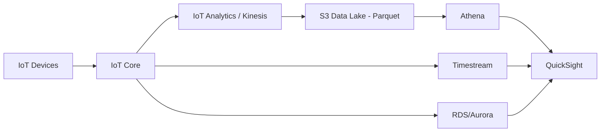
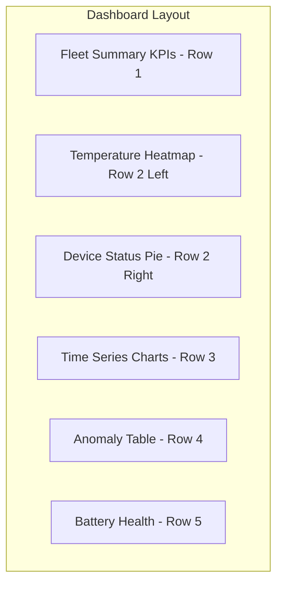

# How to Build an IoT Dashboard with QuickSight

Author: [nawazdhandala](https://github.com/nawazdhandala)

Tags: AWS, IoT, QuickSight, Dashboard, Data Visualization, Analytics

Description: Build interactive IoT dashboards with Amazon QuickSight to visualize device telemetry, fleet health, and operational metrics from your connected devices.

---

Data from IoT devices is only useful if someone can look at it and make decisions. Raw JSON messages in S3 or rows in a database do not tell a story on their own. You need dashboards that turn device telemetry into visual patterns, trends, and anomalies that humans can act on.

Amazon QuickSight is AWS's managed business intelligence service, and it integrates well with the data stores commonly used in IoT architectures - S3, Athena, Timestream, RDS, and more. In this guide, we will walk through building an IoT dashboard from scratch.

## Data Architecture for IoT Dashboards

Before you build the dashboard, you need to make sure your data is in a queryable format. Here is a typical architecture:



The most common patterns are:

1. **S3 + Athena** - best for historical analysis of large datasets stored in Parquet format
2. **Amazon Timestream** - best for time-series queries on recent data
3. **RDS/Aurora** - best when IoT data is combined with relational business data

For this walkthrough, we will use the S3 + Athena path since it is the most common for IoT Analytics pipelines. If you are using IoT Analytics, see our guide on [using IoT Analytics for IoT data processing](https://oneuptime.com/blog/post/2026-02-12-use-iot-analytics-for-iot-data-processing/view) to get your data into S3.

## Step 1: Set Up Athena for Your IoT Data

First, create a Glue table that maps to your IoT data in S3:

```sql
-- Create a database for IoT data
CREATE DATABASE IF NOT EXISTS iot_analytics;

-- Create a table pointing at your IoT data in S3
CREATE EXTERNAL TABLE iot_analytics.sensor_readings (
  device_id STRING,
  device_type STRING,
  temperature DOUBLE,
  humidity DOUBLE,
  pressure DOUBLE,
  battery_level DOUBLE,
  signal_strength INT,
  location_lat DOUBLE,
  location_lon DOUBLE,
  anomaly_score INT,
  reading_timestamp TIMESTAMP
)
PARTITIONED BY (year INT, month INT, day INT)
STORED AS PARQUET
LOCATION 's3://my-iot-data-lake/processed/sensors/'
TBLPROPERTIES ('parquet.compression'='SNAPPY');

-- Load partitions
MSCK REPAIR TABLE iot_analytics.sensor_readings;
```

Run a quick test query to make sure data is accessible:

```sql
-- Verify data is queryable
SELECT device_id,
       AVG(temperature) as avg_temp,
       COUNT(*) as reading_count
FROM iot_analytics.sensor_readings
WHERE year = 2026 AND month = 2
GROUP BY device_id
ORDER BY reading_count DESC
LIMIT 10;
```

## Step 2: Create a QuickSight Dataset

Now connect QuickSight to your Athena data. You can do this through the QuickSight console or CLI.

```bash
# Create a QuickSight data source pointing to Athena
aws quicksight create-data-source \
  --aws-account-id "123456789012" \
  --data-source-id "iot-athena-source" \
  --name "IoT Athena Data" \
  --type "ATHENA" \
  --data-source-parameters '{
    "AthenaParameters": {
      "WorkGroup": "primary"
    }
  }' \
  --permissions '[
    {
      "Principal": "arn:aws:quicksight:us-east-1:123456789012:user/default/admin",
      "Actions": [
        "quicksight:DescribeDataSource",
        "quicksight:DescribeDataSourcePermissions",
        "quicksight:PassDataSource",
        "quicksight:UpdateDataSource",
        "quicksight:DeleteDataSource",
        "quicksight:UpdateDataSourcePermissions"
      ]
    }
  ]'
```

Next, create a dataset with a custom SQL query optimized for dashboard use:

```bash
# Create a QuickSight dataset with a custom query
aws quicksight create-data-set \
  --aws-account-id "123456789012" \
  --data-set-id "iot-sensor-dashboard-data" \
  --name "IoT Sensor Dashboard Data" \
  --import-mode "SPICE" \
  --physical-table-map '{
    "IoTSensorData": {
      "CustomSql": {
        "DataSourceArn": "arn:aws:quicksight:us-east-1:123456789012:datasource/iot-athena-source",
        "Name": "SensorDashboardQuery",
        "SqlQuery": "SELECT device_id, device_type, temperature, humidity, pressure, battery_level, signal_strength, anomaly_score, reading_timestamp, date_trunc('"'"'hour'"'"', reading_timestamp) as hour_bucket FROM iot_analytics.sensor_readings WHERE year >= 2026",
        "Columns": [
          {"Name": "device_id", "Type": "STRING"},
          {"Name": "device_type", "Type": "STRING"},
          {"Name": "temperature", "Type": "DECIMAL"},
          {"Name": "humidity", "Type": "DECIMAL"},
          {"Name": "pressure", "Type": "DECIMAL"},
          {"Name": "battery_level", "Type": "DECIMAL"},
          {"Name": "signal_strength", "Type": "INTEGER"},
          {"Name": "anomaly_score", "Type": "INTEGER"},
          {"Name": "reading_timestamp", "Type": "DATETIME"},
          {"Name": "hour_bucket", "Type": "DATETIME"}
        ]
      }
    }
  }'
```

Using SPICE (Super-fast, Parallel, In-memory Calculation Engine) import mode is recommended for IoT dashboards. It caches the data in memory so dashboards load instantly even when querying millions of rows.

## Step 3: Design the Dashboard

A good IoT dashboard answers these questions at a glance:

- Is my fleet healthy right now?
- Are there any anomalies I need to investigate?
- What are the trends over time?
- Which devices need attention?

Here is a recommended layout:



### Row 1: Fleet Summary KPIs

Create calculated fields for key metrics:

- **Active Devices** - count of distinct device_id where reading_timestamp is within last hour
- **Average Temperature** - mean temperature across fleet
- **Low Battery Count** - count of devices where battery_level is below 20%
- **Anomaly Count** - count of readings where anomaly_score is greater than 0

### Row 2: Heatmap and Status Distribution

A **heatmap** showing temperature by device over time is excellent for spotting patterns. Devices running hot will stand out visually.

A **pie chart** or **donut chart** showing the distribution of device types or device statuses gives a quick fleet composition view.

### Row 3: Time Series

Line charts showing temperature, humidity, and other key metrics over time. Use the hour_bucket field for aggregation to keep the charts readable. Add filters so users can drill down to specific device types or individual devices.

### Row 4: Anomaly Table

A table listing recent readings with anomaly_score greater than zero, sorted by timestamp descending. Include device_id, all sensor readings, and the anomaly score. This gives operators a quick list of things to investigate.

### Row 5: Battery Health

A bar chart showing battery levels across devices, sorted from lowest to highest. This helps operations teams plan maintenance visits.

## Step 4: Set Up SPICE Refresh Schedule

Your dashboard data needs to stay current. Set up a SPICE refresh schedule:

```bash
# Create a refresh schedule that runs every hour
aws quicksight create-refresh-schedule \
  --aws-account-id "123456789012" \
  --data-set-id "iot-sensor-dashboard-data" \
  --schedule '{
    "ScheduleId": "hourly-refresh",
    "ScheduleFrequency": {
      "Interval": "HOURLY"
    },
    "RefreshType": "FULL_REFRESH"
  }'
```

For near-real-time dashboards, consider using Timestream as your data source instead of S3+Athena. Timestream supports direct query mode in QuickSight (not SPICE), which means every dashboard load runs a live query against your time-series database.

## Step 5: Add Interactivity with Parameters and Filters

Make your dashboard interactive so users can explore the data:

```bash
# Parameters let users select date ranges, device types, etc.
# These are defined in the dashboard template
# Example parameter definition for date range filtering
```

Add these interactive elements:

- **Date range picker** - filter all visuals to a specific time window
- **Device type dropdown** - filter by sensor type (temperature, humidity, etc.)
- **Device ID search** - look up a specific device
- **Anomaly score threshold slider** - adjust sensitivity

## Step 6: Share the Dashboard

Once your dashboard is built, share it with your team:

```bash
# Share the dashboard with specific users
aws quicksight update-dashboard-permissions \
  --aws-account-id "123456789012" \
  --dashboard-id "iot-fleet-dashboard" \
  --grant-permissions '[
    {
      "Principal": "arn:aws:quicksight:us-east-1:123456789012:group/default/IoTOperators",
      "Actions": [
        "quicksight:DescribeDashboard",
        "quicksight:ListDashboardVersions",
        "quicksight:QueryDashboard"
      ]
    }
  ]'
```

You can also embed QuickSight dashboards into your own web applications using the embedding SDK, which is great for building customer-facing IoT portals.

## Cost Optimization

QuickSight pricing has two components: per-user fees and SPICE capacity. For IoT dashboards:

- Use **Reader** accounts ($5/month per user with session pricing) for users who only view dashboards
- Right-size your SPICE capacity based on actual data volume
- Use incremental SPICE refreshes when possible to reduce refresh costs
- Consider direct query mode for dashboards that need real-time data but are not accessed frequently

## Wrapping Up

Building an IoT dashboard with QuickSight is straightforward once your data is in the right shape. The key is getting your data pipeline right - clean data in Parquet format, accessible through Athena, with sensible partitioning. From there, QuickSight's visualization capabilities and SPICE engine make it easy to build dashboards that load quickly even over large IoT datasets. Start with the core metrics that matter to your operations team and expand from there.
