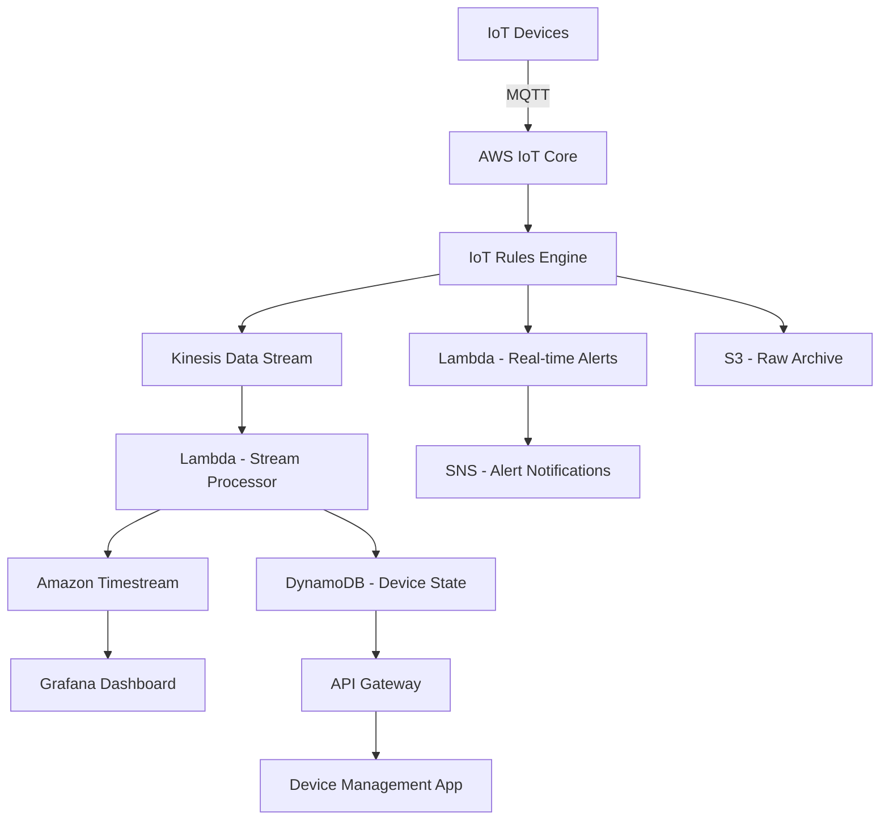

# How to Build an IoT Data Pipeline on AWS

Author: [nawazdhandala](https://github.com/nawazdhandala)

Tags: AWS, IoT, Data Pipeline, IoT Core, Kinesis, Timestream, Lambda, MQTT

Description: Build a scalable IoT data pipeline on AWS that ingests, processes, stores, and analyzes data from thousands of connected devices

---

IoT devices generate data continuously. Temperature sensors, fleet trackers, industrial machines, and smart home devices all need a reliable pipeline to ingest their data, process it in real time, store it for analysis, and trigger actions when thresholds are exceeded. AWS provides a purpose-built IoT stack that scales from a handful of devices to millions.

This guide covers building an end-to-end IoT data pipeline using IoT Core for device connectivity, Kinesis for stream processing, Timestream for time-series storage, and Lambda for real-time alerting.

## Architecture



## Step 1: Set Up IoT Core

IoT Core is the MQTT broker that devices connect to. Each device needs a certificate for authentication:

```bash
# Create an IoT Thing (device representation)
aws iot create-thing --thing-name "sensor-001"

# Create a certificate for the device
aws iot create-keys-and-certificate \
  --set-as-active \
  --certificate-pem-outfile cert.pem \
  --public-key-outfile public.key \
  --private-key-outfile private.key

# Attach a policy to the certificate
aws iot attach-policy \
  --policy-name "SensorPolicy" \
  --target "arn:aws:iot:us-east-1:123456789:cert/abc123"

# Attach the certificate to the thing
aws iot attach-thing-principal \
  --thing-name "sensor-001" \
  --principal "arn:aws:iot:us-east-1:123456789:cert/abc123"
```

Create the IoT policy:

```json
{
  "Version": "2012-10-17",
  "Statement": [
    {
      "Effect": "Allow",
      "Action": "iot:Connect",
      "Resource": "arn:aws:iot:us-east-1:123456789:client/${iot:Connection.Thing.ThingName}"
    },
    {
      "Effect": "Allow",
      "Action": "iot:Publish",
      "Resource": [
        "arn:aws:iot:us-east-1:123456789:topic/devices/${iot:Connection.Thing.ThingName}/telemetry",
        "arn:aws:iot:us-east-1:123456789:topic/devices/${iot:Connection.Thing.ThingName}/status"
      ]
    },
    {
      "Effect": "Allow",
      "Action": "iot:Subscribe",
      "Resource": "arn:aws:iot:us-east-1:123456789:topicfilter/devices/${iot:Connection.Thing.ThingName}/commands"
    },
    {
      "Effect": "Allow",
      "Action": "iot:Receive",
      "Resource": "arn:aws:iot:us-east-1:123456789:topic/devices/${iot:Connection.Thing.ThingName}/commands"
    }
  ]
}
```

## Step 2: Device Firmware

Here is a minimal device firmware example using MQTT to send telemetry data:

```python
# device_firmware.py - Minimal IoT device code
import json
import time
import ssl
from paho.mqtt import client as mqtt_client

# Device configuration
DEVICE_ID = "sensor-001"
IOT_ENDPOINT = "abc123-ats.iot.us-east-1.amazonaws.com"
CERT_PATH = "/certs/cert.pem"
KEY_PATH = "/certs/private.key"
CA_PATH = "/certs/AmazonRootCA1.pem"

# MQTT topics
TELEMETRY_TOPIC = f"devices/{DEVICE_ID}/telemetry"
STATUS_TOPIC = f"devices/{DEVICE_ID}/status"
COMMANDS_TOPIC = f"devices/{DEVICE_ID}/commands"

def on_connect(client, userdata, flags, rc):
    """Called when device connects to IoT Core."""
    print(f"Connected with result code {rc}")
    # Subscribe to commands from the cloud
    client.subscribe(COMMANDS_TOPIC)
    # Report online status
    client.publish(STATUS_TOPIC, json.dumps({"status": "online", "timestamp": time.time()}))

def on_message(client, userdata, msg):
    """Handle commands from the cloud."""
    command = json.loads(msg.payload)
    print(f"Received command: {command}")

    if command.get("action") == "reboot":
        # Handle reboot command
        pass
    elif command.get("action") == "update_interval":
        # Change reporting interval
        global reporting_interval
        reporting_interval = command.get("interval", 60)

def read_sensor_data():
    """Read data from sensors (simulated here)."""
    import random
    return {
        "temperature": round(20 + random.uniform(-5, 10), 2),
        "humidity": round(50 + random.uniform(-20, 30), 2),
        "pressure": round(1013 + random.uniform(-10, 10), 2),
        "battery_pct": round(random.uniform(20, 100), 1),
    }

# Set up MQTT client with TLS
client = mqtt_client.Client(client_id=DEVICE_ID)
client.tls_set(
    ca_certs=CA_PATH,
    certfile=CERT_PATH,
    keyfile=KEY_PATH,
    tls_version=ssl.PROTOCOL_TLSv1_2,
)
client.on_connect = on_connect
client.on_message = on_message

# Connect and start the loop
client.connect(IOT_ENDPOINT, 8883, keepalive=60)
client.loop_start()

reporting_interval = 60  # seconds

# Main telemetry loop
while True:
    sensor_data = read_sensor_data()
    payload = {
        "deviceId": DEVICE_ID,
        "timestamp": int(time.time() * 1000),
        "data": sensor_data,
    }
    client.publish(TELEMETRY_TOPIC, json.dumps(payload), qos=1)
    print(f"Published: {payload}")
    time.sleep(reporting_interval)
```

## Step 3: IoT Rules for Data Routing

IoT Rules Engine routes messages to different AWS services based on SQL-like queries:

```bash
# Rule 1: Send all telemetry to Kinesis for processing
aws iot create-topic-rule \
  --rule-name "TelemetryToKinesis" \
  --topic-rule-payload '{
    "sql": "SELECT * FROM '\''devices/+/telemetry'\''",
    "actions": [{
      "kinesis": {
        "streamName": "iot-telemetry",
        "partitionKey": "${deviceId}",
        "roleArn": "arn:aws:iam::123456789:role/iot-rules-role"
      }
    }],
    "ruleDisabled": false,
    "awsIotSqlVersion": "2016-03-23"
  }'

# Rule 2: Alert on high temperature readings
aws iot create-topic-rule \
  --rule-name "HighTemperatureAlert" \
  --topic-rule-payload '{
    "sql": "SELECT * FROM '\''devices/+/telemetry'\'' WHERE data.temperature > 40",
    "actions": [{
      "lambda": {
        "functionArn": "arn:aws:lambda:us-east-1:123456789:function:iot-alert-handler"
      }
    }],
    "ruleDisabled": false,
    "awsIotSqlVersion": "2016-03-23"
  }'

# Rule 3: Archive all raw messages to S3
aws iot create-topic-rule \
  --rule-name "ArchiveToS3" \
  --topic-rule-payload '{
    "sql": "SELECT * FROM '\''devices/+/telemetry'\''",
    "actions": [{
      "s3": {
        "bucketName": "iot-raw-archive",
        "key": "${topic()}/${timestamp()}",
        "roleArn": "arn:aws:iam::123456789:role/iot-rules-role"
      }
    }],
    "ruleDisabled": false,
    "awsIotSqlVersion": "2016-03-23"
  }'
```

## Step 4: Stream Processing

The Lambda stream processor transforms and enriches IoT data before storing it:

```javascript
// stream-processor/handler.js - Process IoT telemetry from Kinesis
const { TimestreamWriteClient, WriteRecordsCommand } = require('@aws-sdk/client-timestream-write');
const { DynamoDBDocumentClient, UpdateCommand } = require('@aws-sdk/lib-dynamodb');

const timestream = new TimestreamWriteClient({});

exports.handler = async (event) => {
  const timestreamRecords = [];
  const deviceUpdates = {};

  for (const record of event.Records) {
    const payload = JSON.parse(Buffer.from(record.kinesis.data, 'base64').toString());
    const { deviceId, timestamp, data } = payload;

    // Create Timestream records for each metric
    for (const [metric, value] of Object.entries(data)) {
      timestreamRecords.push({
        Dimensions: [
          { Name: 'device_id', Value: deviceId },
          { Name: 'metric', Value: metric },
        ],
        MeasureName: metric,
        MeasureValue: String(value),
        MeasureValueType: 'DOUBLE',
        Time: String(timestamp),
        TimeUnit: 'MILLISECONDS',
      });
    }

    // Track latest device state for quick access
    deviceUpdates[deviceId] = {
      ...data,
      lastSeen: new Date(timestamp).toISOString(),
    };
  }

  // Write to Timestream in batches of 100
  for (let i = 0; i < timestreamRecords.length; i += 100) {
    const batch = timestreamRecords.slice(i, i + 100);
    await timestream.send(new WriteRecordsCommand({
      DatabaseName: process.env.TIMESTREAM_DATABASE,
      TableName: process.env.TIMESTREAM_TABLE,
      Records: batch,
    }));
  }

  // Update device shadow/state in DynamoDB
  for (const [deviceId, state] of Object.entries(deviceUpdates)) {
    await docClient.send(new UpdateCommand({
      TableName: process.env.DEVICE_TABLE,
      Key: { PK: `DEVICE#${deviceId}`, SK: 'STATE' },
      UpdateExpression: 'SET #data = :data, lastSeen = :lastSeen',
      ExpressionAttributeNames: { '#data': 'data' },
      ExpressionAttributeValues: {
        ':data': state,
        ':lastSeen': state.lastSeen,
      },
    }));
  }
};
```

## Step 5: Real-Time Alerting

Handle alerts when sensor readings exceed thresholds:

```javascript
// alert-handler/handler.js - Real-time IoT alerting
const { SNSClient, PublishCommand } = require('@aws-sdk/client-sns');
const { IoTDataPlaneClient, PublishCommand: IoTPublishCommand } = require('@aws-sdk/client-iot-data-plane');

const sns = new SNSClient({});
const iotData = new IoTDataPlaneClient({});

exports.handler = async (event) => {
  const { deviceId, data, timestamp } = event;

  // Determine alert severity
  let severity = 'INFO';
  let message = '';

  if (data.temperature > 50) {
    severity = 'CRITICAL';
    message = `Device ${deviceId}: Temperature critically high at ${data.temperature} C`;
  } else if (data.temperature > 40) {
    severity = 'WARNING';
    message = `Device ${deviceId}: Temperature elevated at ${data.temperature} C`;
  }

  if (data.battery_pct < 10) {
    severity = 'WARNING';
    message += ` | Battery critically low at ${data.battery_pct}%`;
  }

  // Send alert notification
  await sns.send(new PublishCommand({
    TopicArn: process.env.ALERT_TOPIC,
    Subject: `IoT Alert [${severity}]: ${deviceId}`,
    Message: JSON.stringify({
      severity,
      deviceId,
      message,
      data,
      timestamp: new Date(timestamp).toISOString(),
    }),
  }));

  // Optionally send a command back to the device
  if (severity === 'CRITICAL') {
    await iotData.send(new IoTPublishCommand({
      topic: `devices/${deviceId}/commands`,
      payload: JSON.stringify({
        action: 'enter_safe_mode',
        reason: 'Temperature exceeded critical threshold',
      }),
    }));
  }
};
```

## Step 6: Query and Visualize

Query historical IoT data with Timestream:

```sql
-- Average temperature per device over the last 24 hours, grouped by hour
SELECT
  device_id,
  BIN(time, 1h) as hour,
  AVG(measure_value::double) as avg_temperature,
  MAX(measure_value::double) as max_temperature,
  MIN(measure_value::double) as min_temperature
FROM "iot-data"."telemetry"
WHERE measure_name = 'temperature'
  AND time > ago(24h)
GROUP BY device_id, BIN(time, 1h)
ORDER BY hour DESC

-- Detect devices that have gone offline (no data in 10 minutes)
SELECT device_id, MAX(time) as last_seen
FROM "iot-data"."telemetry"
WHERE time > ago(1h)
GROUP BY device_id
HAVING MAX(time) < ago(10m)
```

Connect Timestream to Grafana for real-time dashboards showing device health, telemetry trends, and alert history.

## Device Management API

Expose device state through an API for management applications:

```javascript
// device-api/handler.js - Device management endpoints
exports.getDeviceStatus = async (event) => {
  const { deviceId } = event.pathParameters;

  const state = await docClient.send(new GetCommand({
    TableName: process.env.DEVICE_TABLE,
    Key: { PK: `DEVICE#${deviceId}`, SK: 'STATE' },
  }));

  return {
    statusCode: 200,
    body: JSON.stringify(state.Item || { error: 'Device not found' }),
  };
};

// List all devices with optional filtering
exports.listDevices = async (event) => {
  const { status } = event.queryStringParameters || {};

  const result = await docClient.send(new QueryCommand({
    TableName: process.env.DEVICE_TABLE,
    IndexName: 'StatusIndex',
    KeyConditionExpression: 'GSI1PK = :status',
    ExpressionAttributeValues: {
      ':status': `STATUS#${status || 'active'}`,
    },
  }));

  return {
    statusCode: 200,
    body: JSON.stringify({ devices: result.Items }),
  };
};
```

## Scaling Considerations

- **IoT Core**: Handles millions of concurrent MQTT connections natively
- **Kinesis**: Scale shards based on ingestion rate (1 MB/s per shard)
- **Timestream**: Automatically scales storage and compute
- **Lambda**: Set concurrency limits to prevent overwhelming downstream services

For monitoring your IoT pipeline, see our guide on [building a metrics collection system on AWS](https://oneuptime.com/blog/post/build-a-metrics-collection-system-on-aws/view).

## Wrapping Up

An IoT data pipeline on AWS turns raw device telemetry into operational intelligence. IoT Core handles the device connectivity, Kinesis handles the streaming ingestion, Timestream stores the time-series data efficiently, and Lambda ties everything together with real-time processing and alerting. Start with a few devices and a simple pipeline, then add complexity like anomaly detection, predictive maintenance, and device fleet management as your deployment grows.
