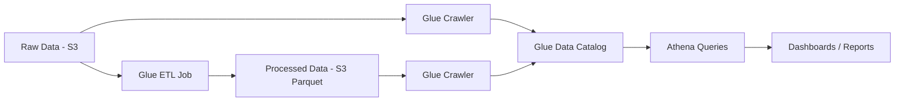

# How to Build a Batch Analytics Pipeline with Glue and Athena

Author: [nawazdhandala](https://github.com/nawazdhandala)

Tags: AWS, Glue, Athena, ETL, Analytics

Description: Learn how to build a complete batch analytics pipeline using AWS Glue for ETL and Amazon Athena for querying, covering crawlers, PySpark jobs, partitioning, and query optimization.

---

Not everything needs to be real-time. Most analytics workloads - monthly reports, customer segmentation, trend analysis - work perfectly fine with data that's hours or a day old. For these use cases, a batch analytics pipeline with AWS Glue and Athena is the sweet spot: Glue handles the ETL (extract, transform, load), and Athena handles the querying. Both are serverless, so you're not managing any infrastructure.

This guide builds a complete pipeline from raw data landing in S3 through transformation with Glue to querying with Athena.

## Pipeline Architecture



## Step 1: Set Up the S3 Data Lake Structure

Organize your S3 bucket with clear zones for raw, processed, and curated data.

```bash
# Create the bucket structure
aws s3api put-object --bucket my-analytics-lake --key raw/
aws s3api put-object --bucket my-analytics-lake --key processed/
aws s3api put-object --bucket my-analytics-lake --key curated/
aws s3api put-object --bucket my-analytics-lake --key scripts/
aws s3api put-object --bucket my-analytics-lake --key temp/
```

Upload some sample raw data. Let's simulate e-commerce event logs in JSON format.

```bash
# Generate and upload sample data
cat > /tmp/events_sample.json << 'JSONEOF'
{"event_id":"e001","user_id":"u100","event_type":"page_view","page":"/home","timestamp":"2025-12-01T10:30:00Z","device":"mobile","country":"US"}
{"event_id":"e002","user_id":"u101","event_type":"page_view","page":"/products","timestamp":"2025-12-01T10:31:00Z","device":"desktop","country":"UK"}
{"event_id":"e003","user_id":"u100","event_type":"add_to_cart","product_id":"p200","price":29.99,"timestamp":"2025-12-01T10:32:00Z","device":"mobile","country":"US"}
{"event_id":"e004","user_id":"u100","event_type":"purchase","product_id":"p200","price":29.99,"timestamp":"2025-12-01T10:35:00Z","device":"mobile","country":"US"}
{"event_id":"e005","user_id":"u102","event_type":"page_view","page":"/about","timestamp":"2025-12-01T10:36:00Z","device":"tablet","country":"DE"}
JSONEOF

aws s3 cp /tmp/events_sample.json s3://my-analytics-lake/raw/events/year=2025/month=12/day=01/events.json
```

## Step 2: Create a Glue Crawler for Raw Data

The crawler scans your S3 data and creates table definitions in the Glue Data Catalog.

```bash
# Create the crawler IAM role
aws iam create-role \
  --role-name GlueServiceRole \
  --assume-role-policy-document '{
    "Version": "2012-10-17",
    "Statement": [{
      "Effect": "Allow",
      "Principal": {"Service": "glue.amazonaws.com"},
      "Action": "sts:AssumeRole"
    }]
  }'

aws iam attach-role-policy \
  --role-name GlueServiceRole \
  --policy-arn arn:aws:iam::aws:policy/service-role/AWSGlueServiceRole

# Add S3 access
aws iam put-role-policy \
  --role-name GlueServiceRole \
  --policy-name S3Access \
  --policy-document '{
    "Version": "2012-10-17",
    "Statement": [{
      "Effect": "Allow",
      "Action": ["s3:GetObject", "s3:PutObject", "s3:ListBucket", "s3:DeleteObject"],
      "Resource": ["arn:aws:s3:::my-analytics-lake", "arn:aws:s3:::my-analytics-lake/*"]
    }]
  }'

# Create the Glue database
aws glue create-database --database-input '{"Name": "analytics"}'

# Create the crawler
aws glue create-crawler \
  --name raw-events-crawler \
  --role GlueServiceRole \
  --database-name analytics \
  --targets '{
    "S3Targets": [{
      "Path": "s3://my-analytics-lake/raw/events/"
    }]
  }' \
  --recrawl-policy '{"RecrawlBehavior": "CRAWL_NEW_FOLDERS_ONLY"}' \
  --schema-change-policy '{
    "UpdateBehavior": "UPDATE_IN_DATABASE",
    "DeleteBehavior": "LOG"
  }'

# Run the crawler
aws glue start-crawler --name raw-events-crawler
```

## Step 3: Write a Glue ETL Job

Now the interesting part. Create a PySpark ETL job that reads raw JSON data, cleans and transforms it, and writes partitioned Parquet files.

```python
# etl_events.py - Glue ETL job script
import sys
from awsglue.transforms import *
from awsglue.utils import getResolvedOptions
from pyspark.context import SparkContext
from awsglue.context import GlueContext
from awsglue.job import Job
from awsglue.dynamicframe import DynamicFrame
from pyspark.sql.functions import (
    col, when, date_format, hour, dayofweek,
    to_timestamp, lit, coalesce
)

# Initialize Glue context
args = getResolvedOptions(sys.argv, ['JOB_NAME', 'source_database', 'source_table', 'output_path'])
sc = SparkContext()
glueContext = GlueContext(sc)
spark = glueContext.spark_session
job = Job(glueContext)
job.init(args['JOB_NAME'], args)

# Read from the Glue Data Catalog
raw_dyf = glueContext.create_dynamic_frame.from_catalog(
    database=args['source_database'],
    table_name=args['source_table'],
    transformation_ctx="raw_dyf"
)

# Convert to Spark DataFrame for easier transformations
df = raw_dyf.toDF()

print(f"Raw record count: {df.count()}")

# Clean and transform the data
transformed = df \
    .withColumn("event_timestamp", to_timestamp(col("timestamp"))) \
    .withColumn("event_date", date_format(col("event_timestamp"), "yyyy-MM-dd")) \
    .withColumn("event_hour", hour(col("event_timestamp"))) \
    .withColumn("day_of_week", dayofweek(col("event_timestamp"))) \
    .withColumn("price", coalesce(col("price"), lit(0.0))) \
    .withColumn("device_category", when(col("device") == "mobile", "mobile")
                                   .when(col("device") == "tablet", "mobile")
                                   .otherwise("desktop")) \
    .withColumn("is_purchase", when(col("event_type") == "purchase", True)
                               .otherwise(False)) \
    .drop("timestamp")  # Drop the original string timestamp

# Remove duplicates based on event_id
deduplicated = transformed.dropDuplicates(["event_id"])

print(f"After dedup: {deduplicated.count()}")

# Convert back to DynamicFrame
output_dyf = DynamicFrame.fromDF(deduplicated, glueContext, "output_dyf")

# Write as partitioned Parquet to the processed zone
glueContext.write_dynamic_frame.from_options(
    frame=output_dyf,
    connection_type="s3",
    connection_options={
        "path": args['output_path'],
        "partitionKeys": ["event_date", "event_type"]
    },
    format="parquet",
    format_options={"compression": "snappy"},
    transformation_ctx="write_output"
)

job.commit()
print("ETL job completed successfully")
```

Upload the script and create the job.

```bash
# Upload the ETL script to S3
aws s3 cp etl_events.py s3://my-analytics-lake/scripts/etl_events.py

# Create the Glue job
aws glue create-job \
  --name events-etl \
  --role GlueServiceRole \
  --command '{
    "Name": "glueetl",
    "ScriptLocation": "s3://my-analytics-lake/scripts/etl_events.py",
    "PythonVersion": "3"
  }' \
  --default-arguments '{
    "--source_database": "analytics",
    "--source_table": "events",
    "--output_path": "s3://my-analytics-lake/processed/events/",
    "--TempDir": "s3://my-analytics-lake/temp/",
    "--enable-metrics": "true",
    "--enable-continuous-cloudwatch-log": "true",
    "--job-bookmark-option": "job-bookmark-enable"
  }' \
  --glue-version "4.0" \
  --number-of-workers 5 \
  --worker-type G.1X \
  --timeout 120

# Run the job
aws glue start-job-run --job-name events-etl
```

The `job-bookmark-enable` setting is crucial. It tracks which data the job has already processed, so subsequent runs only process new files. This makes incremental processing efficient.

## Step 4: Crawl the Processed Data

After the ETL job finishes, crawl the processed data to register it in the catalog.

```bash
# Create a crawler for processed data
aws glue create-crawler \
  --name processed-events-crawler \
  --role GlueServiceRole \
  --database-name analytics \
  --table-prefix "processed_" \
  --targets '{
    "S3Targets": [{
      "Path": "s3://my-analytics-lake/processed/events/"
    }]
  }'

# Run it
aws glue start-crawler --name processed-events-crawler
```

## Step 5: Schedule the Pipeline

Set up a trigger to run the ETL job on a schedule, followed by the crawler.

```bash
# Create a scheduled trigger for the ETL job
aws glue create-trigger \
  --name daily-etl-trigger \
  --type SCHEDULED \
  --schedule "cron(0 6 * * ? *)" \
  --actions '[{"JobName": "events-etl"}]' \
  --start-on-creation

# Create a conditional trigger for the crawler (runs after ETL succeeds)
aws glue create-trigger \
  --name post-etl-crawler-trigger \
  --type CONDITIONAL \
  --predicate '{
    "Conditions": [{
      "LogicalOperator": "EQUALS",
      "JobName": "events-etl",
      "State": "SUCCEEDED"
    }]
  }' \
  --actions '[{"CrawlerName": "processed-events-crawler"}]' \
  --start-on-creation
```

## Step 6: Query with Athena

Now query your processed data with standard SQL.

```bash
# Create an Athena workgroup
aws athena create-work-group \
  --name analytics-workgroup \
  --configuration '{
    "ResultConfiguration": {
      "OutputLocation": "s3://my-analytics-lake/athena-results/"
    },
    "EnforceWorkGroupConfiguration": true,
    "PublishCloudWatchMetricsEnabled": true
  }'

# Run a query - daily revenue summary
aws athena start-query-execution \
  --work-group analytics-workgroup \
  --query-string "
    SELECT event_date,
           COUNT(*) as total_events,
           COUNT(DISTINCT user_id) as unique_users,
           SUM(CASE WHEN is_purchase = true THEN 1 ELSE 0 END) as purchases,
           SUM(CASE WHEN is_purchase = true THEN price ELSE 0 END) as revenue
    FROM analytics.processed_events
    WHERE event_date >= '2025-12-01'
    GROUP BY event_date
    ORDER BY event_date DESC
  "
```

Check query results.

```bash
# Get query execution status
aws athena get-query-execution \
  --query-execution-id "abc-123" \
  --query 'QueryExecution.{Status:Status.State,DataScanned:Statistics.DataScannedInBytes,Runtime:Statistics.EngineExecutionTimeInMillis}'

# Download results
aws athena get-query-results \
  --query-execution-id "abc-123" \
  --output table
```

## Step 7: Create Views for Common Queries

Athena views save analysts from writing complex SQL repeatedly.

```sql
-- Create a view for daily metrics (run via Athena)
CREATE OR REPLACE VIEW analytics.daily_metrics AS
SELECT
    event_date,
    device_category,
    country,
    COUNT(DISTINCT user_id) as unique_users,
    COUNT(CASE WHEN event_type = 'page_view' THEN 1 END) as page_views,
    COUNT(CASE WHEN event_type = 'add_to_cart' THEN 1 END) as add_to_carts,
    COUNT(CASE WHEN event_type = 'purchase' THEN 1 END) as purchases,
    SUM(CASE WHEN event_type = 'purchase' THEN price ELSE 0 END) as revenue,
    CAST(COUNT(CASE WHEN event_type = 'purchase' THEN 1 END) AS DOUBLE) /
        NULLIF(COUNT(DISTINCT user_id), 0) * 100 as conversion_rate
FROM analytics.processed_events
GROUP BY event_date, device_category, country;
```

## Monitoring the Pipeline

Set up monitoring to catch failures before they become stale-data problems.

```bash
# Create a CloudWatch alarm for Glue job failures
aws cloudwatch put-metric-alarm \
  --alarm-name glue-etl-failure \
  --namespace "Glue" \
  --metric-name "glue.driver.aggregate.numFailedTasks" \
  --dimensions Name=JobName,Value=events-etl Name=JobRunId,Value=ALL \
  --statistic Sum \
  --period 300 \
  --evaluation-periods 1 \
  --threshold 1 \
  --comparison-operator GreaterThanOrEqualToThreshold \
  --alarm-actions "arn:aws:sns:us-east-1:123456789012:pipeline-alerts"
```

For more on setting up comprehensive monitoring, see our guide on [CloudWatch alarms](https://oneuptime.com/blog/post/set-up-aws-cloudwatch-alarms/view).

This pipeline handles the vast majority of batch analytics use cases. Raw data lands in S3, Glue transforms it into optimized Parquet with proper partitioning, and Athena queries it with SQL. The whole thing runs on a schedule with no servers to manage. Scale it up by adding more Glue workers or optimizing your Parquet file sizes - but the architecture stays the same whether you're processing megabytes or petabytes.
