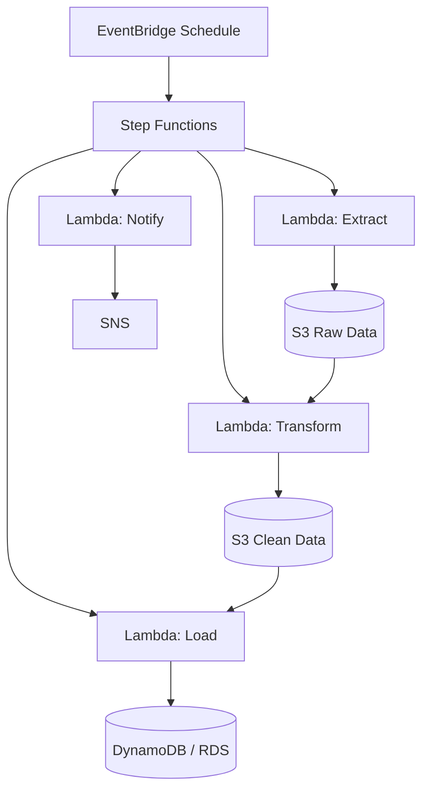

# How to Build a Batch Data Processing Pipeline on AWS

Author: [nawazdhandala](https://github.com/nawazdhandala)

Tags: AWS, Step Functions, Lambda, S3, Data Engineering

Description: Build a scalable batch data processing pipeline on AWS using Step Functions, Lambda, S3, and Glue with scheduling, error handling, and monitoring.

---

Not every data pipeline needs to be real-time. Many workloads - daily reports, data warehouse ETL, log aggregation, image processing - work perfectly fine (and more cost-effectively) as batch jobs. AWS offers several ways to build batch pipelines, from simple Lambda-based flows to full-blown Glue ETL jobs. Let's build a practical batch pipeline that processes data on a schedule.

## Architecture

Here's the pipeline we're building:



EventBridge triggers a Step Functions state machine on schedule, which orchestrates extract, transform, and load steps - with error handling and notifications built in.

## Step 1: S3 Buckets for Data Storage

Create separate buckets for each stage of the pipeline:

```bash
# Create buckets for raw, processed, and archive data
aws s3 mb s3://my-pipeline-raw-data
aws s3 mb s3://my-pipeline-processed-data
aws s3 mb s3://my-pipeline-archive

# Set lifecycle rules to archive old data automatically
aws s3api put-bucket-lifecycle-configuration \
  --bucket my-pipeline-raw-data \
  --lifecycle-configuration '{
    "Rules": [
      {
        "ID": "ArchiveOldData",
        "Status": "Enabled",
        "Filter": {"Prefix": ""},
        "Transitions": [
          {"Days": 30, "StorageClass": "GLACIER"}
        ],
        "Expiration": {"Days": 365}
      }
    ]
  }'
```

## Step 2: Lambda Functions

Create the individual processing functions.

### Extract Function

This function pulls data from a source (API, database, etc.) and writes it to S3:

```javascript
// extract/handler.js
const { S3Client, PutObjectCommand } = require('@aws-sdk/client-s3');

const s3 = new S3Client({});
const RAW_BUCKET = process.env.RAW_BUCKET;

exports.handler = async (event) => {
  const { source, date } = event;
  const processingDate = date || new Date().toISOString().split('T')[0];

  console.log(`Extracting data for ${processingDate} from ${source}`);

  try {
    // Simulate fetching data from an API or database
    // Replace this with your actual data source
    const data = await fetchDataFromSource(source, processingDate);

    const key = `${source}/${processingDate}/raw-data.json`;

    await s3.send(new PutObjectCommand({
      Bucket: RAW_BUCKET,
      Key: key,
      Body: JSON.stringify(data),
      ContentType: 'application/json',
    }));

    return {
      status: 'success',
      bucket: RAW_BUCKET,
      key,
      recordCount: data.length,
      processingDate,
    };
  } catch (err) {
    console.error('Extract failed:', err);
    throw new Error(`Extract failed: ${err.message}`);
  }
};

async function fetchDataFromSource(source, date) {
  // Replace with actual API calls, database queries, etc.
  // This is a placeholder that generates sample data
  const records = [];
  for (let i = 0; i < 1000; i++) {
    records.push({
      id: `${date}-${i}`,
      timestamp: `${date}T${String(Math.floor(Math.random() * 24)).padStart(2, '0')}:00:00Z`,
      value: Math.random() * 100,
      category: ['A', 'B', 'C'][Math.floor(Math.random() * 3)],
    });
  }
  return records;
}
```

### Transform Function

Clean, validate, and transform the raw data:

```javascript
// transform/handler.js
const { S3Client, GetObjectCommand, PutObjectCommand } = require('@aws-sdk/client-s3');

const s3 = new S3Client({});
const PROCESSED_BUCKET = process.env.PROCESSED_BUCKET;

exports.handler = async (event) => {
  const { bucket, key, processingDate } = event;

  console.log(`Transforming data from s3://${bucket}/${key}`);

  try {
    // Read raw data from S3
    const rawResponse = await s3.send(new GetObjectCommand({
      Bucket: bucket,
      Key: key,
    }));
    const rawData = JSON.parse(await rawResponse.Body.transformToString());

    // Transform the data
    const transformed = rawData
      .filter(record => record.value !== null && record.value !== undefined)
      .map(record => ({
        ...record,
        value: Math.round(record.value * 100) / 100,
        processedAt: new Date().toISOString(),
        // Add derived fields
        valueCategory: record.value > 75 ? 'high' : record.value > 25 ? 'medium' : 'low',
      }));

    // Calculate summary statistics
    const summary = {
      totalRecords: transformed.length,
      averageValue: transformed.reduce((sum, r) => sum + r.value, 0) / transformed.length,
      byCategory: {},
    };

    for (const record of transformed) {
      summary.byCategory[record.category] = (summary.byCategory[record.category] || 0) + 1;
    }

    // Write transformed data
    const outputKey = `${processingDate}/transformed-data.json`;
    await s3.send(new PutObjectCommand({
      Bucket: PROCESSED_BUCKET,
      Key: outputKey,
      Body: JSON.stringify(transformed),
      ContentType: 'application/json',
    }));

    // Write summary
    const summaryKey = `${processingDate}/summary.json`;
    await s3.send(new PutObjectCommand({
      Bucket: PROCESSED_BUCKET,
      Key: summaryKey,
      Body: JSON.stringify(summary),
      ContentType: 'application/json',
    }));

    return {
      status: 'success',
      bucket: PROCESSED_BUCKET,
      dataKey: outputKey,
      summaryKey,
      recordCount: transformed.length,
      droppedRecords: rawData.length - transformed.length,
      summary,
    };
  } catch (err) {
    console.error('Transform failed:', err);
    throw new Error(`Transform failed: ${err.message}`);
  }
};
```

### Load Function

Load the processed data into the final destination:

```javascript
// load/handler.js
const { S3Client, GetObjectCommand } = require('@aws-sdk/client-s3');
const { DynamoDBClient } = require('@aws-sdk/client-dynamodb');
const { DynamoDBDocumentClient, BatchWriteCommand } = require('@aws-sdk/lib-dynamodb');

const s3 = new S3Client({});
const docClient = DynamoDBDocumentClient.from(new DynamoDBClient({}));
const TABLE = process.env.DATA_TABLE;

exports.handler = async (event) => {
  const { bucket, dataKey } = event;

  console.log(`Loading data from s3://${bucket}/${dataKey}`);

  try {
    // Read processed data
    const response = await s3.send(new GetObjectCommand({
      Bucket: bucket,
      Key: dataKey,
    }));
    const data = JSON.parse(await response.Body.transformToString());

    // Batch write to DynamoDB (25 items per batch)
    let loaded = 0;
    const batchSize = 25;

    for (let i = 0; i < data.length; i += batchSize) {
      const batch = data.slice(i, i + batchSize);
      const putRequests = batch.map(item => ({
        PutRequest: { Item: item },
      }));

      await docClient.send(new BatchWriteCommand({
        RequestItems: {
          [TABLE]: putRequests,
        },
      }));

      loaded += batch.length;
    }

    return {
      status: 'success',
      recordsLoaded: loaded,
    };
  } catch (err) {
    console.error('Load failed:', err);
    throw new Error(`Load failed: ${err.message}`);
  }
};
```

## Step 3: Step Functions State Machine

Orchestrate the pipeline with Step Functions. This gives you visual monitoring, automatic retries, and parallel execution:

```json
{
  "Comment": "Batch Data Processing Pipeline",
  "StartAt": "Extract",
  "States": {
    "Extract": {
      "Type": "Task",
      "Resource": "arn:aws:lambda:us-east-1:ACCOUNT_ID:function:pipeline-extract",
      "Parameters": {
        "source": "main-api",
        "date.$": "$.date"
      },
      "ResultPath": "$.extractResult",
      "Retry": [
        {
          "ErrorEquals": ["States.TaskFailed"],
          "IntervalSeconds": 60,
          "MaxAttempts": 3,
          "BackoffRate": 2
        }
      ],
      "Catch": [
        {
          "ErrorEquals": ["States.ALL"],
          "ResultPath": "$.error",
          "Next": "NotifyFailure"
        }
      ],
      "Next": "Transform"
    },
    "Transform": {
      "Type": "Task",
      "Resource": "arn:aws:lambda:us-east-1:ACCOUNT_ID:function:pipeline-transform",
      "Parameters": {
        "bucket.$": "$.extractResult.bucket",
        "key.$": "$.extractResult.key",
        "processingDate.$": "$.extractResult.processingDate"
      },
      "ResultPath": "$.transformResult",
      "Retry": [
        {
          "ErrorEquals": ["States.TaskFailed"],
          "IntervalSeconds": 30,
          "MaxAttempts": 2
        }
      ],
      "Catch": [
        {
          "ErrorEquals": ["States.ALL"],
          "ResultPath": "$.error",
          "Next": "NotifyFailure"
        }
      ],
      "Next": "Load"
    },
    "Load": {
      "Type": "Task",
      "Resource": "arn:aws:lambda:us-east-1:ACCOUNT_ID:function:pipeline-load",
      "Parameters": {
        "bucket.$": "$.transformResult.bucket",
        "dataKey.$": "$.transformResult.dataKey"
      },
      "ResultPath": "$.loadResult",
      "Retry": [
        {
          "ErrorEquals": ["States.TaskFailed"],
          "IntervalSeconds": 60,
          "MaxAttempts": 3
        }
      ],
      "Catch": [
        {
          "ErrorEquals": ["States.ALL"],
          "ResultPath": "$.error",
          "Next": "NotifyFailure"
        }
      ],
      "Next": "NotifySuccess"
    },
    "NotifySuccess": {
      "Type": "Task",
      "Resource": "arn:aws:states:::sns:publish",
      "Parameters": {
        "TopicArn": "arn:aws:sns:us-east-1:ACCOUNT_ID:pipeline-notifications",
        "Subject": "Pipeline Completed Successfully",
        "Message.$": "States.Format('Pipeline completed. Records processed: {}', $.loadResult.recordsLoaded)"
      },
      "End": true
    },
    "NotifyFailure": {
      "Type": "Task",
      "Resource": "arn:aws:states:::sns:publish",
      "Parameters": {
        "TopicArn": "arn:aws:sns:us-east-1:ACCOUNT_ID:pipeline-notifications",
        "Subject": "Pipeline Failed",
        "Message.$": "States.Format('Pipeline failed: {}', $.error)"
      },
      "End": true
    }
  }
}
```

## Step 4: Schedule with EventBridge

Trigger the pipeline on a schedule:

```bash
# Create an EventBridge rule that runs daily at 2 AM UTC
aws events put-rule \
  --name daily-pipeline \
  --schedule-expression "cron(0 2 * * ? *)" \
  --description "Trigger batch pipeline daily at 2 AM UTC"

# Add the Step Functions state machine as a target
aws events put-targets \
  --rule daily-pipeline \
  --targets '[{
    "Id": "pipeline-target",
    "Arn": "arn:aws:states:us-east-1:ACCOUNT_ID:stateMachine:data-pipeline",
    "RoleArn": "arn:aws:iam::ACCOUNT_ID:role/eventbridge-sfn-role",
    "Input": "{\"date\": \"<aws.scheduler.current-date>\"}"
  }]'
```

## Monitoring

Monitor your pipeline execution in Step Functions' visual console or with CloudWatch:

```bash
# List recent executions
aws stepfunctions list-executions \
  --state-machine-arn arn:aws:states:us-east-1:ACCOUNT_ID:stateMachine:data-pipeline \
  --status-filter FAILED \
  --max-results 10
```

For production pipelines, set up alerts on execution failures and duration anomalies. Consider using [OneUptime](https://oneuptime.com/blog/post/aws-monitoring-tools-comparison/view) for comprehensive pipeline monitoring with incident management.

## Summary

A batch data processing pipeline on AWS is built from straightforward components: S3 for storage, Lambda for processing, Step Functions for orchestration, and EventBridge for scheduling. The Step Functions state machine gives you automatic retries, error handling, and visual monitoring - all without writing any orchestration code yourself. This pattern works for everything from simple daily reports to complex multi-step ETL workflows. Start simple and add complexity only when your data volumes and transformation needs demand it.
