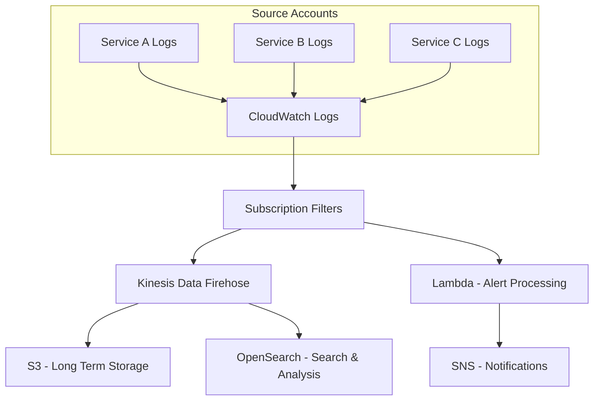

# How to Build a Centralized Log Aggregation System on AWS

Author: [nawazdhandala](https://github.com/nawazdhandala)

Tags: AWS, Logging, CloudWatch, Kinesis, OpenSearch

Description: Build a centralized log aggregation system on AWS using CloudWatch, Kinesis Data Firehose, and OpenSearch to collect, process, and search logs from all services.

---

When you're running a handful of services, checking logs in each service's CloudWatch log group is manageable. When you're running fifty services across multiple accounts, it becomes a nightmare. You need centralized log aggregation - a single place where logs from every service, every account, and every region come together for searching, analysis, and alerting.

Let's build one on AWS.

## Architecture Options

There are two main approaches on AWS:

1. **CloudWatch-centric** - Keep logs in CloudWatch, use cross-account sharing and Logs Insights
2. **OpenSearch-centric** - Stream logs to OpenSearch for richer search and visualization

The right choice depends on your scale and query needs. CloudWatch is simpler and cheaper for small to medium setups. OpenSearch gives you more powerful search and Kibana dashboards for larger environments.



## Setting Up the Central Log Account

Start with a dedicated AWS account (or at least a dedicated set of resources) for centralized logging.

```typescript
// CDK: Central logging infrastructure
import * as cdk from 'aws-cdk-lib';
import * as kinesis from 'aws-cdk-lib/aws-kinesis';
import * as firehose from 'aws-cdk-lib/aws-kinesisfirehose';
import * as s3 from 'aws-cdk-lib/aws-s3';
import * as opensearch from 'aws-cdk-lib/aws-opensearchservice';

export class CentralLoggingStack extends cdk.Stack {
  constructor(scope: cdk.App, id: string) {
    super(scope, id);

    // S3 bucket for long-term log storage
    const logBucket = new s3.Bucket(this, 'LogArchiveBucket', {
      bucketName: 'central-log-archive',
      lifecycleRules: [
        {
          transitions: [
            { storageClass: s3.StorageClass.INFREQUENT_ACCESS, transitionAfter: cdk.Duration.days(30) },
            { storageClass: s3.StorageClass.GLACIER, transitionAfter: cdk.Duration.days(90) },
          ],
          expiration: cdk.Duration.days(365), // Keep logs for 1 year
        },
      ],
      encryption: s3.BucketEncryption.S3_MANAGED,
    });

    // Kinesis Data Stream as the central intake
    const logStream = new kinesis.Stream(this, 'CentralLogStream', {
      streamName: 'central-log-stream',
      shardCount: 2, // Scale based on volume
      retentionPeriod: cdk.Duration.hours(48),
    });

    // OpenSearch domain for search and visualization
    const searchDomain = new opensearch.Domain(this, 'LogSearch', {
      version: opensearch.EngineVersion.OPENSEARCH_2_11,
      capacity: {
        dataNodeInstanceType: 'r6g.large.search',
        dataNodes: 2,
      },
      ebs: {
        volumeSize: 200,
        volumeType: ec2.EbsDeviceVolumeType.GP3,
      },
      zoneAwareness: { availabilityZoneCount: 2 },
      encryptionAtRest: { enabled: true },
      nodeToNodeEncryption: true,
      enforceHttps: true,
    });
  }
}
```

## Streaming Logs with Kinesis Firehose

Kinesis Data Firehose delivers logs to both S3 and OpenSearch without you managing any infrastructure.

```typescript
// Firehose delivery stream to S3 and OpenSearch
const deliveryStream = new firehose.CfnDeliveryStream(this, 'LogDeliveryStream', {
  deliveryStreamName: 'central-log-delivery',
  deliveryStreamType: 'KinesisStreamAsSource',
  kinesisStreamSourceConfiguration: {
    kinesisStreamArn: logStream.streamArn,
    roleArn: firehoseRole.roleArn,
  },
  amazonopensearchserviceDestinationConfiguration: {
    domainArn: searchDomain.domainArn,
    indexName: 'logs',
    indexRotationPeriod: 'OneDay', // New index each day
    roleArn: firehoseRole.roleArn,
    bufferingHints: {
      intervalInSeconds: 60,
      sizeInMBs: 5,
    },
    retryOptions: {
      durationInSeconds: 300,
    },
    s3BackupMode: 'AllDocuments', // Also send to S3
    s3Configuration: {
      bucketArn: logBucket.bucketArn,
      roleArn: firehoseRole.roleArn,
      prefix: 'logs/year=!{timestamp:yyyy}/month=!{timestamp:MM}/day=!{timestamp:dd}/',
      bufferingHints: {
        intervalInSeconds: 300,
        sizeInMBs: 64,
      },
      compressionFormat: 'GZIP',
    },
  },
});
```

## Sending Logs from Application Services

Each service sends its CloudWatch logs to the central Kinesis stream using subscription filters.

```typescript
// In each service's stack - subscribe logs to central stream
import * as logs from 'aws-cdk-lib/aws-logs';
import * as logsDestinations from 'aws-cdk-lib/aws-logs-destinations';

// Cross-account destination (if logs go to a different account)
const destination = new logs.CrossAccountDestination(this, 'CentralLogDestination', {
  destinationName: 'central-logs',
  targetArn: 'arn:aws:kinesis:us-east-1:CENTRAL_ACCOUNT:stream/central-log-stream',
  role: destinationRole,
});

// Subscribe all service log groups
const serviceLogGroups = [
  '/aws/lambda/order-service',
  '/aws/lambda/payment-service',
  '/aws/lambda/inventory-service',
  '/ecs/web-application',
];

serviceLogGroups.forEach((logGroupName, index) => {
  const logGroup = logs.LogGroup.fromLogGroupName(this, `LogGroup${index}`, logGroupName);

  new logs.SubscriptionFilter(this, `Sub${index}`, {
    logGroup,
    destination: new logsDestinations.KinesisDestination(centralStream),
    filterPattern: logs.FilterPattern.allEvents(), // Send everything
  });
});
```

## Log Processing Lambda

Transform and enrich logs before they reach OpenSearch.

```javascript
// lambda/log-processor.js - Process and enrich log events
const zlib = require('zlib');

exports.handler = async (event) => {
  const output = [];

  for (const record of event.records) {
    // Decode and decompress the CloudWatch log data
    const payload = Buffer.from(record.data, 'base64');
    const decompressed = zlib.gunzipSync(payload);
    const logData = JSON.parse(decompressed.toString());

    // Process each log event
    const enrichedEvents = logData.logEvents.map(logEvent => {
      let parsedMessage;
      try {
        parsedMessage = JSON.parse(logEvent.message);
      } catch {
        parsedMessage = { message: logEvent.message };
      }

      return {
        '@timestamp': new Date(logEvent.timestamp).toISOString(),
        logGroup: logData.logGroup,
        logStream: logData.logStream,
        account: logData.owner,
        ...parsedMessage,
        // Add derived fields
        service: extractServiceName(logData.logGroup),
        environment: extractEnvironment(logData.logGroup),
      };
    });

    // Re-encode for Firehose
    const outputData = enrichedEvents
      .map(e => JSON.stringify(e))
      .join('\n') + '\n';

    output.push({
      recordId: record.recordId,
      result: 'Ok',
      data: Buffer.from(outputData).toString('base64'),
    });
  }

  return { records: output };
};

function extractServiceName(logGroup) {
  // Extract service name from log group like /aws/lambda/order-service
  const parts = logGroup.split('/');
  return parts[parts.length - 1];
}

function extractEnvironment(logGroup) {
  if (logGroup.includes('prod')) return 'production';
  if (logGroup.includes('staging')) return 'staging';
  return 'development';
}
```

## OpenSearch Index Template

Define a proper index template for log data in OpenSearch.

```json
{
  "index_patterns": ["logs-*"],
  "template": {
    "settings": {
      "number_of_shards": 2,
      "number_of_replicas": 1,
      "index.lifecycle.name": "log-retention-policy",
      "index.lifecycle.rollover_alias": "logs"
    },
    "mappings": {
      "properties": {
        "@timestamp": { "type": "date" },
        "service": { "type": "keyword" },
        "environment": { "type": "keyword" },
        "level": { "type": "keyword" },
        "message": { "type": "text" },
        "error": { "type": "text" },
        "requestId": { "type": "keyword" },
        "userId": { "type": "keyword" },
        "duration": { "type": "float" },
        "account": { "type": "keyword" },
        "logGroup": { "type": "keyword" }
      }
    }
  }
}
```

## Index Lifecycle Management

Logs grow fast. Set up index lifecycle policies to manage storage costs.

```json
{
  "policy": {
    "phases": {
      "hot": {
        "actions": {
          "rollover": {
            "max_size": "30gb",
            "max_age": "1d"
          }
        }
      },
      "warm": {
        "min_age": "7d",
        "actions": {
          "shrink": { "number_of_shards": 1 },
          "forcemerge": { "max_num_segments": 1 }
        }
      },
      "delete": {
        "min_age": "30d",
        "actions": {
          "delete": {}
        }
      }
    }
  }
}
```

## Real-Time Alerting

Set up alerts for patterns that need immediate attention.

```javascript
// lambda/alert-processor.js - Process logs and trigger alerts
const { SNSClient, PublishCommand } = require('@aws-sdk/client-sns');
const snsClient = new SNSClient({});

// Alert rules
const alertRules = [
  {
    name: 'Critical Error',
    match: (log) => log.level === 'ERROR' && log.message?.includes('CRITICAL'),
    topic: process.env.CRITICAL_TOPIC_ARN,
  },
  {
    name: 'Authentication Failure Spike',
    match: (log) => log.message?.includes('authentication failed'),
    threshold: 10, // More than 10 per minute
    topic: process.env.SECURITY_TOPIC_ARN,
  },
  {
    name: 'Out of Memory',
    match: (log) => log.message?.includes('OutOfMemoryError') || log.message?.includes('Runtime.ExitError'),
    topic: process.env.CRITICAL_TOPIC_ARN,
  },
];

exports.handler = async (event) => {
  for (const record of event.Records) {
    const log = JSON.parse(record.body);

    for (const rule of alertRules) {
      if (rule.match(log)) {
        await snsClient.send(new PublishCommand({
          TopicArn: rule.topic,
          Subject: `Alert: ${rule.name} - ${log.service}`,
          Message: JSON.stringify({
            alert: rule.name,
            service: log.service,
            environment: log.environment,
            message: log.message,
            timestamp: log['@timestamp'],
          }, null, 2),
        }));
      }
    }
  }
};
```

## CloudWatch Cross-Account Observability

For simpler setups, CloudWatch's built-in cross-account observability might be enough.

```bash
# Enable cross-account observability in the monitoring account
aws cloudwatch put-metric-data-account-policy \
  --policy-name "CrossAccountSharing" \
  --policy-document '{"Statement":[{"Effect":"Allow","Principal":{"AWS":["111111111111","222222222222"]},"Action":["cloudwatch:PutMetricData"],"Resource":"*"}]}'
```

## Cost Management

Log aggregation costs can spiral without attention. Here are the levers:

- **Filter at the source** - Only send logs above a certain level to the central system
- **Compress everything** - Firehose supports GZIP compression for S3
- **Use lifecycle policies** - Move old logs to cheaper storage, delete when no longer needed
- **Right-size OpenSearch** - Use UltraWarm for older indices
- **Sample high-volume logs** - You don't need every single debug log in production

## Monitoring the Monitoring

Your logging infrastructure needs monitoring too. Track Kinesis iterator age (are you falling behind?), Firehose delivery success rates, and OpenSearch cluster health.

For a broader view of monitoring practices, check out our companion guide on [building a logging and monitoring stack on AWS](https://oneuptime.com/blog/post/2026-02-12-build-logging-and-monitoring-stack-on-aws/view).

## Summary

Centralized log aggregation on AWS connects CloudWatch logs from all your services through Kinesis to OpenSearch for search and S3 for archival. The Lambda processor in the middle enriches logs with context, and alerting rules catch critical issues in real time. Start with CloudWatch cross-account sharing for simple setups, and graduate to the full Kinesis-OpenSearch pipeline when you need richer search and visualization capabilities.
