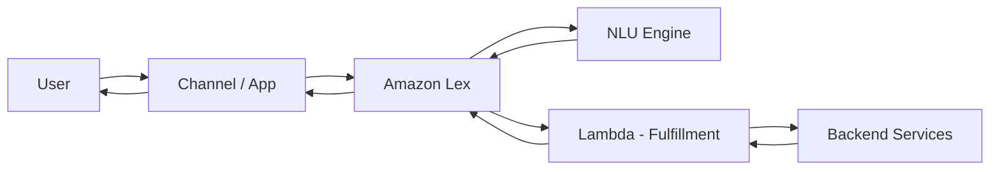

# How to Build a Chatbot with Amazon Lex

Author: [nawazdhandala](https://github.com/nawazdhandala)

Tags: AWS, Amazon Lex, Chatbot, Serverless, AI

Description: Learn how to build a conversational chatbot using Amazon Lex, from creating your first bot to testing it in the console and deploying it to real channels.

---

Chatbots have gone from a novelty to a necessity. If you've ever been on a support page and a little widget popped up asking how it could help, there's a good chance that was powered by something like Amazon Lex. It's the same technology behind Alexa, and AWS has made it available so you can build your own conversational interfaces without needing a PhD in natural language processing.

In this guide, we'll walk through building a chatbot from scratch using Amazon Lex V2. We'll cover the core concepts, set up a bot in the AWS console, and then interact with it programmatically.

## What Is Amazon Lex?

Amazon Lex is a fully managed service for building conversational interfaces using voice and text. It handles the heavy lifting of speech recognition and natural language understanding (NLU). You define what your bot should understand - the intents, the slots, the sample utterances - and Lex figures out how to match user input to those definitions.

The V2 version of Lex brought some nice improvements: better versioning, simpler APIs, and support for multiple languages in a single bot.

## Core Concepts

Before we start building, let's get the vocabulary straight:

- **Bot**: The top-level resource. Think of it as the container for your chatbot.
- **Intent**: An action the user wants to perform. "Book a hotel" or "Check order status" would be intents.
- **Slot**: A piece of data the bot needs to collect. For a hotel booking, that might be the city, check-in date, or number of nights.
- **Utterance**: A sample phrase a user might say to trigger an intent. "I want to book a room" or "Reserve a hotel" would both map to a booking intent.
- **Fulfillment**: What happens after the bot collects all the information it needs. Usually this means calling a Lambda function.

## Creating Your First Bot

Head to the Amazon Lex console and click "Create bot." You'll see an option to start from a blank bot or use a template. Let's start from scratch.

Give your bot a name, set the IAM permissions (Lex will offer to create a role for you), choose a language, and pick a voice if you want voice interaction. For now, text-only is fine.

Once the bot is created, you'll land on the intent editor. Every bot starts with a `FallbackIntent` that fires when Lex can't match user input to anything. Let's add a real intent.

## Adding an Intent

Click "Add intent" and name it something descriptive like `OrderPizza`. Now we need to tell Lex what phrases should trigger this intent.

Add sample utterances like:

- I want to order a pizza
- Can I get a pizza
- Order pizza please
- I'd like a pizza

Lex uses these samples to train its NLU model. It doesn't need to match them exactly - it'll generalize from these examples.

## Defining Slots

Our pizza order needs some details. Let's add slots for size and crust type.

Click "Add slot" and configure it:

- **Name**: `PizzaSize`
- **Slot type**: You can use a built-in type or create a custom one. Let's create a custom slot type called `PizzaSizeType` with values: small, medium, large.
- **Prompt**: "What size pizza would you like? Small, medium, or large?"

Add another slot:

- **Name**: `CrustType`
- **Slot type**: Custom - `CrustType` with values: thin, thick, stuffed.
- **Prompt**: "What type of crust? Thin, thick, or stuffed?"

## Setting Up the Conversation Flow

Lex V2 lets you define the conversation flow visually. After adding your slots, set them as required so the bot will prompt for them if the user doesn't provide them upfront.

You can also add confirmation prompts. Under the "Confirmation" section, add something like:

"So you'd like a {PizzaSize} pizza with {CrustType} crust. Should I place this order?"

If the user says yes, the bot proceeds to fulfillment. If no, it can start over or close.

## Building and Testing

Click "Build" at the top of the console. This trains the NLU model with your utterances and slot types. It takes a minute or two.

Once it's built, use the test window on the right side of the console. Type "I want to order a pizza" and watch the bot walk through the conversation, asking for size and crust type, then confirming.

## Interacting with Lex Programmatically

The console is great for testing, but eventually you'll want to interact with Lex from your application. Here's how to do it with the AWS SDK for Python (boto3).

First, install boto3 if you haven't already:

```bash
# Install the AWS SDK for Python
pip install boto3
```

Now let's write a simple script that sends a message to your bot and prints the response:

```python
# Send a text message to an Amazon Lex V2 bot and print the response
import boto3

client = boto3.client('lexv2-runtime', region_name='us-east-1')

response = client.recognize_text(
    botId='YOUR_BOT_ID',
    botAliasId='TSTALIASID',  # Test alias
    localeId='en_US',
    sessionId='test-session-001',
    text='I want to order a pizza'
)

# Print each message from the bot
for message in response['messages']:
    print(message['content'])
```

Replace `YOUR_BOT_ID` with the actual bot ID from the console. The `TSTALIASID` is the default test alias that Lex creates automatically.

To continue the conversation, send another message with the same session ID:

```python
# Continue the conversation by providing slot values
response = client.recognize_text(
    botId='YOUR_BOT_ID',
    botAliasId='TSTALIASID',
    localeId='en_US',
    sessionId='test-session-001',
    text='Large'
)

for message in response['messages']:
    print(message['content'])
```

## Using the AWS CLI

You can also test your bot quickly from the command line:

```bash
# Send a test message to the Lex bot via CLI
aws lexv2-runtime recognize-text \
  --bot-id YOUR_BOT_ID \
  --bot-alias-id TSTALIASID \
  --locale-id en_US \
  --session-id cli-test-001 \
  --text "I want a pizza"
```

## Deploying to Channels

Amazon Lex supports direct integration with several messaging platforms:

- Facebook Messenger
- Slack
- Twilio SMS
- Amazon Connect (for voice)

To set up a channel, go to your bot's "Channel integrations" section in the console. Each channel requires its own set of credentials (like a Facebook page token or Slack app credentials), but Lex handles the message routing once configured.

## Architecture Overview

Here's how the pieces fit together:



## Best Practices

**Start simple.** Don't try to build a bot that handles 50 intents on day one. Start with 2-3 intents, get them working well, then expand.

**Use slot elicitation wisely.** Make slots required only when you actually need them. Optional slots can be filled from context without bugging the user.

**Test with real users early.** People will say things you never anticipated. The sooner you see real utterances, the sooner you can improve your training data.

**Monitor with CloudWatch.** Lex publishes metrics like `MissedUtteranceCount` and `RuntimeRequestCount`. Set up alarms so you know when your bot is confused. For deeper observability, consider integrating with a platform like [OneUptime](https://oneuptime.com/blog/post/use-amazon-devops-guru-for-operational-insights/view) to track performance across your entire stack.

**Version your bots.** Use aliases and versions to manage deployments. Your test alias can point to the draft version while your production alias points to a stable, tested version.

## What's Next

Once your bot is working, you'll want to add fulfillment logic. That means connecting an AWS Lambda function to handle the actual business logic - like saving the pizza order to a database or calling an API. Check out our guide on [integrating Amazon Lex with Lambda](https://oneuptime.com/blog/post/integrate-amazon-lex-with-lambda-for-fulfillment/view) for the next step.

You'll also want to fine-tune your intents and slots as you gather more data. Lex provides conversation logs that show you exactly what users are saying and where the bot gets confused. Use that data to add more utterances and improve accuracy over time.

Building chatbots with Lex is genuinely straightforward once you understand the core concepts. The hardest part isn't the technology - it's designing conversations that feel natural and actually help your users.
