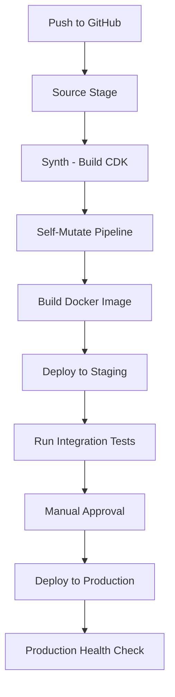

# How to Build a CI/CD Pipeline for ECS with CDK Pipelines

Author: [nawazdhandala](https://github.com/nawazdhandala)

Tags: AWS, ECS, CDK, CI/CD, DevOps, Infrastructure as Code

Description: Learn how to build a fully automated CI/CD pipeline for Amazon ECS deployments using AWS CDK Pipelines with self-mutating capabilities

---

If you have been deploying to Amazon ECS manually or through cobbled-together scripts, you know the pain. Every deployment feels risky, rollbacks are manual, and there is no consistent process across environments. CDK Pipelines changes all of that by giving you a code-first, self-mutating CI/CD pipeline that deploys your ECS services reliably.

In this guide, we will build a complete CI/CD pipeline that takes your containerized application from source code to production on ECS, using AWS CDK Pipelines.

## Why CDK Pipelines for ECS?

CDK Pipelines is a construct library built on top of AWS CodePipeline. What makes it special is the self-mutation capability - the pipeline can update itself when you change its definition. This means your pipeline infrastructure and your application infrastructure live in the same codebase and evolve together.

For ECS workloads specifically, CDK Pipelines gives you:

- Automated Docker image builds via CodeBuild
- Staged deployments across multiple environments
- Built-in approval steps before production
- Automatic rollback on failure
- Infrastructure and application code deployed together

## Prerequisites

You will need the AWS CDK v2 installed, an AWS account bootstrapped for CDK, and a GitHub repository (or CodeCommit) for your source code. You should also have a working Dockerized application ready to deploy.

## Project Structure

```
my-ecs-pipeline/
  lib/
    pipeline-stack.ts       # The pipeline itself
    ecs-stage.ts            # ECS deployment stage
    ecs-service-stack.ts    # ECS service definition
  bin/
    app.ts                  # CDK app entry point
  Dockerfile                # Your application
  package.json
  cdk.json
```

## Step 1: Set Up the CDK App

Start with a fresh CDK project and install the required dependencies.

```bash
# Initialize a new CDK project
npx cdk init app --language typescript

# Install CDK Pipelines and ECS constructs
npm install aws-cdk-lib constructs
```

Configure your CDK app entry point to use the pipeline stack.

```typescript
// bin/app.ts
import * as cdk from 'aws-cdk-lib';
import { PipelineStack } from '../lib/pipeline-stack';

const app = new cdk.App();

// Pipeline stack lives in your CI/CD account
new PipelineStack(app, 'EcsPipelineStack', {
  env: {
    account: '111111111111',
    region: 'us-east-1',
  },
});

app.synth();
```

## Step 2: Define the ECS Service Stack

This stack contains your actual ECS service - the Fargate task definition, service, and load balancer.

```typescript
// lib/ecs-service-stack.ts
import * as cdk from 'aws-cdk-lib';
import * as ecs from 'aws-cdk-lib/aws-ecs';
import * as ec2 from 'aws-cdk-lib/aws-ec2';
import * as elbv2 from 'aws-cdk-lib/aws-elasticloadbalancingv2';
import * as ecr_assets from 'aws-cdk-lib/aws-ecr-assets';
import { Construct } from 'constructs';

export class EcsServiceStack extends cdk.Stack {
  constructor(scope: Construct, id: string, props?: cdk.StackProps) {
    super(scope, id, props);

    // Create a VPC for the ECS cluster
    const vpc = new ec2.Vpc(this, 'ServiceVpc', {
      maxAzs: 2,
      natGateways: 1,
    });

    // Create the ECS cluster
    const cluster = new ecs.Cluster(this, 'Cluster', {
      vpc,
      containerInsights: true,
    });

    // Build Docker image from the repository root
    const image = new ecr_assets.DockerImageAsset(this, 'AppImage', {
      directory: './',
    });

    // Define the Fargate task
    const taskDef = new ecs.FargateTaskDefinition(this, 'TaskDef', {
      memoryLimitMiB: 512,
      cpu: 256,
    });

    // Add the container to the task
    const container = taskDef.addContainer('app', {
      image: ecs.ContainerImage.fromDockerImageAsset(image),
      logging: ecs.LogDrivers.awsLogs({ streamPrefix: 'app' }),
      environment: {
        NODE_ENV: 'production',
      },
    });

    container.addPortMappings({ containerPort: 3000 });

    // Create the Fargate service behind an ALB
    const service = new ecs.FargateService(this, 'Service', {
      cluster,
      taskDefinition: taskDef,
      desiredCount: 2,
      circuitBreaker: { rollback: true },
    });

    // Set up the Application Load Balancer
    const alb = new elbv2.ApplicationLoadBalancer(this, 'ALB', {
      vpc,
      internetFacing: true,
    });

    const listener = alb.addListener('Listener', { port: 80 });
    listener.addTargets('Target', {
      port: 3000,
      targets: [service],
      healthCheck: {
        path: '/health',
        interval: cdk.Duration.seconds(30),
      },
    });
  }
}
```

## Step 3: Create the Deployment Stage

A stage in CDK Pipelines groups one or more stacks that get deployed together. This is where you wire the ECS service stack into the pipeline.

```typescript
// lib/ecs-stage.ts
import * as cdk from 'aws-cdk-lib';
import { Construct } from 'constructs';
import { EcsServiceStack } from './ecs-service-stack';

export class EcsStage extends cdk.Stage {
  constructor(scope: Construct, id: string, props?: cdk.StageProps) {
    super(scope, id, props);

    // Instantiate the ECS service stack within this stage
    new EcsServiceStack(this, 'EcsService', {});
  }
}
```

## Step 4: Build the Pipeline

This is where it all comes together. The pipeline stack defines the source, build, and deployment stages.

```typescript
// lib/pipeline-stack.ts
import * as cdk from 'aws-cdk-lib';
import { Construct } from 'constructs';
import {
  CodePipeline,
  CodePipelineSource,
  ShellStep,
  ManualApprovalStep,
} from 'aws-cdk-lib/pipelines';
import { EcsStage } from './ecs-stage';

export class PipelineStack extends cdk.Stack {
  constructor(scope: Construct, id: string, props?: cdk.StackProps) {
    super(scope, id, props);

    // Define the pipeline with source and build steps
    const pipeline = new CodePipeline(this, 'Pipeline', {
      pipelineName: 'EcsDeployPipeline',
      synth: new ShellStep('Synth', {
        // Pull source from GitHub
        input: CodePipelineSource.gitHub('your-org/your-repo', 'main', {
          authentication: cdk.SecretValue.secretsManager('github-token'),
        }),
        // Build commands - install deps, build, and synthesize CDK
        commands: [
          'npm ci',
          'npm run build',
          'npx cdk synth',
        ],
      }),
      // Enable Docker builds in the synth step
      dockerEnabledForSynth: true,
      dockerEnabledForSelfMutation: true,
    });

    // Add staging environment
    const staging = new EcsStage(this, 'Staging', {
      env: {
        account: '222222222222',
        region: 'us-east-1',
      },
    });
    pipeline.addStage(staging);

    // Add production with a manual approval gate
    const production = new EcsStage(this, 'Production', {
      env: {
        account: '333333333333',
        region: 'us-east-1',
      },
    });
    pipeline.addStage(production, {
      pre: [
        new ManualApprovalStep('PromoteToProd', {
          comment: 'Review staging deployment before promoting to production',
        }),
      ],
    });
  }
}
```

## Step 5: Add Testing to the Pipeline

You can add validation steps after each stage to run integration tests or smoke tests.

```typescript
// Add a post-deployment test step after staging
pipeline.addStage(staging, {
  post: [
    new ShellStep('IntegrationTests', {
      commands: [
        'npm run test:integration',
      ],
      envFromCfnOutputs: {
        // Pass the ALB URL to your tests
        SERVICE_URL: stagingService.serviceUrl,
      },
    }),
  ],
});
```

## How the Pipeline Flow Works

Here is the sequence of operations when you push code to the main branch.



## Step 6: Bootstrap and Deploy

Before deploying, you need to bootstrap each target account and establish trust between them.

```bash
# Bootstrap the pipeline account
npx cdk bootstrap aws://111111111111/us-east-1

# Bootstrap target accounts with trust to the pipeline account
npx cdk bootstrap aws://222222222222/us-east-1 \
  --trust 111111111111 \
  --cloudformation-execution-policies arn:aws:iam::aws:policy/AdministratorAccess

npx cdk bootstrap aws://333333333333/us-east-1 \
  --trust 111111111111 \
  --cloudformation-execution-policies arn:aws:iam::aws:policy/AdministratorAccess

# Deploy the pipeline (this is the only manual deploy you ever do)
npx cdk deploy EcsPipelineStack
```

After this initial deploy, the pipeline takes over. Every push to the main branch triggers the pipeline, which can even update itself if you change the pipeline definition.

## Adding Environment-Specific Configuration

For real-world deployments, you want different configurations per environment. Pass parameters through the stage props.

```typescript
// Pass environment-specific config to each stage
const staging = new EcsStage(this, 'Staging', {
  env: { account: '222222222222', region: 'us-east-1' },
});

// Use context or stage-specific properties
// In your EcsServiceStack, read these to adjust task count, CPU, etc.
```

## Monitoring Your Pipeline

Once the pipeline is running, you should monitor it. Set up CloudWatch alarms for pipeline failures and integrate with SNS for notifications. You can also check out our guide on [monitoring ECS services with CloudWatch](https://oneuptime.com/blog/post/2026-02-12-monitor-ecs-tasks-cloudwatch-metrics/view) for observability best practices.

## Common Pitfalls

**Docker builds failing in CodeBuild**: Make sure you set `dockerEnabledForSynth: true` on the pipeline. Without this, Docker commands will not be available during the build.

**Cross-account deployment errors**: Double-check that you bootstrapped each target account with the `--trust` flag pointing to the pipeline account.

**Self-mutation loops**: If your synth step produces different output each time (e.g., timestamps in generated files), the pipeline will keep updating itself. Make sure your synth output is deterministic.

## Wrapping Up

CDK Pipelines gives you a production-grade CI/CD pipeline for ECS with remarkably little code. The self-mutating capability means the pipeline evolves with your application, and the staged deployment model with approval gates gives you confidence in production releases. Once you set it up, you rarely need to touch the pipeline directly - just push code and let it handle the rest.

For more on deploying to ECS, see our guides on [creating ECS Fargate services with CDK](https://oneuptime.com/blog/post/2026-02-12-create-ecs-fargate-service-with-cdk/view) and [ECS deployment strategies](https://oneuptime.com/blog/post/2026-02-12-codedeploy-ecs-deployments/view).
