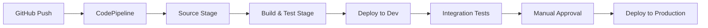

# How to Build a CI/CD Pipeline for Infrastructure on AWS

Author: [nawazdhandala](https://github.com/nawazdhandala)

Tags: AWS, CI/CD, CodePipeline, CDK, Infrastructure as Code

Description: Build a CI/CD pipeline for infrastructure as code on AWS using CodePipeline, CodeBuild, and CDK to automatically test and deploy infrastructure changes.

---

Deploying infrastructure changes by running CDK or CloudFormation commands from your laptop is fine for a side project. For anything serious, you want a pipeline that tests changes, requires approval for production, and keeps an audit trail. Infrastructure CI/CD brings the same discipline to infrastructure that you already have for application code.

Let's build a pipeline that automatically deploys CDK infrastructure through dev, staging, and production environments.

## Architecture



## The CDK Pipeline

CDK Pipelines is a high-level construct that creates a self-mutating pipeline. When you change the pipeline definition, it updates itself.

```typescript
// lib/pipeline-stack.ts
import * as cdk from 'aws-cdk-lib';
import { CodePipeline, CodePipelineSource, ShellStep, ManualApprovalStep } from 'aws-cdk-lib/pipelines';

export class PipelineStack extends cdk.Stack {
  constructor(scope: cdk.App, id: string) {
    super(scope, id);

    const pipeline = new CodePipeline(this, 'InfraPipeline', {
      pipelineName: 'InfrastructurePipeline',
      crossAccountKeys: true, // Enable cross-account deployments

      // Source: pull from GitHub
      synth: new ShellStep('Synth', {
        input: CodePipelineSource.gitHub('your-org/infra-repo', 'main', {
          authentication: cdk.SecretValue.secretsManager('github-token'),
        }),
        commands: [
          'npm ci',
          'npm run build',
          'npm run test',
          'npx cdk synth',
        ],
        primaryOutputDirectory: 'cdk.out',
      }),

      // Docker enabled for building container images
      dockerEnabledForSynth: true,
    });

    // Dev environment - deploy automatically
    const devStage = pipeline.addStage(new InfraStage(this, 'Dev', {
      env: { account: '111111111111', region: 'us-east-1' },
    }));

    // Run integration tests after dev deployment
    devStage.addPost(new ShellStep('IntegrationTests', {
      commands: [
        'npm ci',
        'npm run test:integration',
      ],
      envFromCfnOutputs: {
        API_URL: devStage.apiUrlOutput,
      },
    }));

    // Staging environment - deploy automatically after dev
    const stagingStage = pipeline.addStage(new InfraStage(this, 'Staging', {
      env: { account: '222222222222', region: 'us-east-1' },
    }));

    // Manual approval before production
    stagingStage.addPost(new ManualApprovalStep('PromoteToProduction', {
      comment: 'Review staging deployment and approve for production',
    }));

    // Production environment - deploy after approval
    const prodStage = pipeline.addStage(new InfraStage(this, 'Production', {
      env: { account: '333333333333', region: 'us-east-1' },
    }));
  }
}
```

## The Infrastructure Stage

Each environment gets its own stage with the actual infrastructure stacks.

```typescript
// lib/infra-stage.ts
import * as cdk from 'aws-cdk-lib';
import { Construct } from 'constructs';

export class InfraStage extends cdk.Stage {
  public readonly apiUrlOutput: cdk.CfnOutput;

  constructor(scope: Construct, id: string, props?: cdk.StageProps) {
    super(scope, id, props);

    // Network stack
    const networkStack = new NetworkStack(this, 'Network');

    // Database stack depends on network
    const dbStack = new DatabaseStack(this, 'Database', {
      vpc: networkStack.vpc,
    });

    // Application stack depends on both
    const appStack = new ApplicationStack(this, 'Application', {
      vpc: networkStack.vpc,
      database: dbStack.database,
    });

    this.apiUrlOutput = appStack.apiUrlOutput;
  }
}
```

## Adding Tests

Test your infrastructure code before deploying. CDK supports snapshot testing and fine-grained assertions.

```typescript
// test/infra.test.ts
import * as cdk from 'aws-cdk-lib';
import { Template, Match } from 'aws-cdk-lib/assertions';
import { NetworkStack } from '../lib/network-stack';
import { DatabaseStack } from '../lib/database-stack';

describe('NetworkStack', () => {
  test('creates VPC with 3 AZs', () => {
    const app = new cdk.App();
    const stack = new NetworkStack(app, 'TestNetwork');
    const template = Template.fromStack(stack);

    template.resourceCountIs('AWS::EC2::VPC', 1);
    template.resourceCountIs('AWS::EC2::Subnet', 9); // 3 AZs x 3 tiers
  });

  test('creates NAT Gateways for redundancy', () => {
    const app = new cdk.App();
    const stack = new NetworkStack(app, 'TestNetwork');
    const template = Template.fromStack(stack);

    template.resourceCountIs('AWS::EC2::NatGateway', 2);
  });
});

describe('DatabaseStack', () => {
  test('database is Multi-AZ', () => {
    const app = new cdk.App();
    const networkStack = new NetworkStack(app, 'Network');
    const stack = new DatabaseStack(app, 'Database', { vpc: networkStack.vpc });
    const template = Template.fromStack(stack);

    template.hasResourceProperties('AWS::RDS::DBInstance', {
      MultiAZ: true,
      DeletionProtection: true,
    });
  });

  test('database has encryption enabled', () => {
    const app = new cdk.App();
    const networkStack = new NetworkStack(app, 'Network');
    const stack = new DatabaseStack(app, 'Database', { vpc: networkStack.vpc });
    const template = Template.fromStack(stack);

    template.hasResourceProperties('AWS::RDS::DBInstance', {
      StorageEncrypted: true,
    });
  });
});
```

## Security Scanning in the Pipeline

Add security checks to catch misconfigurations before they reach production.

```typescript
// Add cfn-nag or checkov scanning to the pipeline
const securityScan = new ShellStep('SecurityScan', {
  input: pipeline.synth.primaryOutput,
  commands: [
    'pip install checkov',
    'checkov -d . --framework cloudformation --soft-fail',
  ],
});

devStage.addPre(securityScan);
```

## Using CodeBuild for Custom Build Steps

For more complex build requirements, use CodeBuild directly.

```typescript
// Custom CodeBuild project for building and testing
import * as codebuild from 'aws-cdk-lib/aws-codebuild';

const buildProject = new codebuild.PipelineProject(this, 'BuildProject', {
  buildSpec: codebuild.BuildSpec.fromObject({
    version: '0.2',
    phases: {
      install: {
        'runtime-versions': {
          nodejs: '18',
        },
        commands: [
          'npm ci',
        ],
      },
      pre_build: {
        commands: [
          'npm run lint',
          'npm run test',
        ],
      },
      build: {
        commands: [
          'npx cdk synth',
        ],
      },
      post_build: {
        commands: [
          // Run infrastructure compliance checks
          'pip install cfn-lint',
          'cfn-lint cdk.out/*.template.json',
        ],
      },
    },
    artifacts: {
      'base-directory': 'cdk.out',
      files: ['**/*'],
    },
    reports: {
      'test-reports': {
        files: ['junit.xml'],
        'base-directory': 'test-results',
        'file-format': 'JUNITXML',
      },
    },
  }),
  environment: {
    buildImage: codebuild.LinuxBuildImage.STANDARD_7_0,
    computeType: codebuild.ComputeType.MEDIUM,
  },
});
```

## Rollback Strategies

CloudFormation (which CDK generates) has built-in rollback on failure. But you should also plan for rollbacks when the deployment succeeds but the application breaks.

```typescript
// Add a post-deployment health check
prodStage.addPost(new ShellStep('HealthCheck', {
  commands: [
    // Wait for deployment to stabilize
    'sleep 60',
    // Check the application health endpoint
    'STATUS=$(curl -s -o /dev/null -w "%{http_code}" $API_URL/health)',
    'if [ "$STATUS" != "200" ]; then echo "Health check failed" && exit 1; fi',
  ],
  envFromCfnOutputs: {
    API_URL: prodStage.apiUrlOutput,
  },
}));
```

If the health check fails, you'll need to manually trigger a rollback or deploy the previous version. Consider keeping a "last known good" tag or version.

## Environment-Specific Configuration

Use CDK context or environment variables for per-environment settings.

```typescript
// lib/application-stack.ts
export class ApplicationStack extends cdk.Stack {
  constructor(scope: Construct, id: string, props: ApplicationProps) {
    super(scope, id, props);

    const isProd = this.node.tryGetContext('environment') === 'production';

    const service = new ecs.FargateService(this, 'AppService', {
      cluster: props.cluster,
      taskDefinition,
      desiredCount: isProd ? 4 : 1,
      circuitBreaker: { rollback: true },
    });

    // Production gets more aggressive scaling
    if (isProd) {
      const scaling = service.autoScaleTaskCount({
        minCapacity: 4,
        maxCapacity: 20,
      });
      scaling.scaleOnCpuUtilization('CpuScaling', {
        targetUtilizationPercent: 60,
      });
    }
  }
}
```

## Notifications

Get notified when pipeline stages succeed or fail.

```typescript
// Pipeline notifications
import * as codestarnotifications from 'aws-cdk-lib/aws-codestarnotifications';

new codestarnotifications.NotificationRule(this, 'PipelineNotification', {
  source: pipeline.pipeline,
  events: [
    'codepipeline-pipeline-pipeline-execution-failed',
    'codepipeline-pipeline-pipeline-execution-succeeded',
    'codepipeline-pipeline-manual-approval-needed',
  ],
  targets: [notificationTopic],
});
```

## Monitoring Pipeline Health

Track pipeline execution times and success rates.

```typescript
// Pipeline execution monitoring
new cloudwatch.Alarm(this, 'PipelineFailureAlarm', {
  metric: new cloudwatch.Metric({
    namespace: 'AWS/CodePipeline',
    metricName: 'PipelineExecutionFailedCount',
    dimensionsMap: { PipelineName: pipeline.pipeline.pipelineName },
    period: cdk.Duration.hours(1),
    statistic: 'Sum',
  }),
  threshold: 1,
  evaluationPeriods: 1,
  alarmDescription: 'Infrastructure pipeline failed',
});
```

For full observability across your infrastructure, check out our guide on [building a logging and monitoring stack on AWS](https://oneuptime.com/blog/post/2026-02-12-build-logging-and-monitoring-stack-on-aws/view).

## Summary

A CI/CD pipeline for infrastructure brings rigor to infrastructure changes. CDK Pipelines makes it straightforward - define your pipeline in code, add testing stages, require approvals for production, and let the pipeline handle the rest. The self-mutating nature means the pipeline evolves with your infrastructure. Start with a simple source-build-deploy pipeline and add security scanning, integration testing, and multi-account deployments as your team grows.
