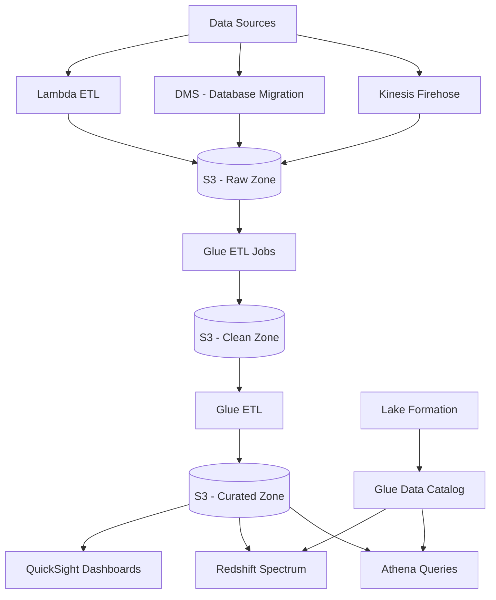

# How to Build a Data Lake Architecture on AWS

Author: [nawazdhandala](https://github.com/nawazdhandala)

Tags: AWS, Data Lake, S3, Glue, Athena

Description: Design and implement a data lake on AWS using S3, Glue, Athena, and Lake Formation with proper data organization, cataloging, security, and query capabilities.

---

A data lake is a centralized repository where you store all your structured, semi-structured, and unstructured data at any scale. Unlike a traditional data warehouse that requires you to define schemas upfront, a data lake lets you dump raw data first and figure out how to query it later. AWS provides all the building blocks for this, with S3 as the storage foundation.

Let's build a production-ready data lake from the ground up.

## Architecture



## Zone-Based Organization

The key to a well-organized data lake is separating data into zones based on processing stage.

Create the S3 buckets for each zone:

```bash
# Raw zone - data lands here exactly as it arrives
aws s3 mb s3://my-datalake-raw --region us-east-1

# Clean zone - validated, deduplicated, and format-standardized
aws s3 mb s3://my-datalake-clean --region us-east-1

# Curated zone - business-ready, aggregated, enriched
aws s3 mb s3://my-datalake-curated --region us-east-1

# Enable versioning on all buckets
for bucket in raw clean curated; do
  aws s3api put-bucket-versioning \
    --bucket my-datalake-$bucket \
    --versioning-configuration Status=Enabled
done

# Enable server-side encryption
for bucket in raw clean curated; do
  aws s3api put-bucket-encryption \
    --bucket my-datalake-$bucket \
    --server-side-encryption-configuration '{
      "Rules": [{"ApplyServerSideEncryptionByDefault": {"SSEAlgorithm": "aws:kms"}}]
    }'
done
```

## Data Organization in S3

Use a consistent path structure so Athena can partition your data efficiently:

```
s3://my-datalake-raw/
  source=webapp/
    year=2026/
      month=02/
        day=12/
          events-20260212-001.json.gz
          events-20260212-002.json.gz
  source=mobile-app/
    year=2026/
      month=02/
        day=12/
          sessions-20260212.parquet

s3://my-datalake-clean/
  database=analytics/
    table=user_events/
      year=2026/
        month=02/
          day=12/
            part-00000.parquet
            part-00001.parquet

s3://my-datalake-curated/
  database=reporting/
    table=daily_metrics/
      year=2026/
        month=02/
          daily-metrics-20260212.parquet
```

Parquet is the recommended format for analytical workloads because it's columnar, compressed, and works natively with Athena and Glue.

## Ingesting Data

### From Application APIs via Kinesis Firehose

Kinesis Firehose is the simplest way to stream data into S3:

```bash
# Create a Firehose delivery stream
aws firehose create-delivery-stream \
  --delivery-stream-name app-events-to-datalake \
  --delivery-stream-type DirectPut \
  --extended-s3-destination-configuration '{
    "BucketARN": "arn:aws:s3:::my-datalake-raw",
    "RoleARN": "arn:aws:iam::ACCOUNT_ID:role/firehose-delivery-role",
    "Prefix": "source=webapp/year=!{timestamp:yyyy}/month=!{timestamp:MM}/day=!{timestamp:dd}/",
    "ErrorOutputPrefix": "errors/source=webapp/year=!{timestamp:yyyy}/month=!{timestamp:MM}/",
    "BufferingHints": {
      "SizeInMBs": 64,
      "IntervalInSeconds": 300
    },
    "CompressionFormat": "GZIP",
    "DataFormatConversionConfiguration": {
      "Enabled": true,
      "InputFormatConfiguration": {
        "Deserializer": {"OpenXJsonSerDe": {}}
      },
      "OutputFormatConfiguration": {
        "Serializer": {"ParquetSerDe": {"Compression": "SNAPPY"}}
      },
      "SchemaConfiguration": {
        "DatabaseName": "datalake_raw",
        "TableName": "webapp_events",
        "RoleARN": "arn:aws:iam::ACCOUNT_ID:role/firehose-glue-role"
      }
    }
  }'
```

### From Databases via AWS DMS

Use Database Migration Service to replicate database tables into the data lake:

```bash
# Create a DMS replication instance
aws dms create-replication-instance \
  --replication-instance-identifier datalake-replication \
  --replication-instance-class dms.t3.medium \
  --allocated-storage 50

# Create source and target endpoints
# (configure based on your source database)
```

## Glue Data Catalog

The Glue Data Catalog acts as a central metadata store. Crawlers automatically discover schemas.

Create a crawler to catalog your raw data:

```bash
# Create a Glue database
aws glue create-database \
  --database-input '{"Name": "datalake_raw", "Description": "Raw zone data"}'

aws glue create-database \
  --database-input '{"Name": "datalake_clean", "Description": "Clean zone data"}'

aws glue create-database \
  --database-input '{"Name": "datalake_curated", "Description": "Curated zone data"}'

# Create a crawler for the raw zone
aws glue create-crawler \
  --name raw-zone-crawler \
  --role arn:aws:iam::ACCOUNT_ID:role/glue-crawler-role \
  --database-name datalake_raw \
  --targets '{
    "S3Targets": [
      {"Path": "s3://my-datalake-raw/source=webapp/"},
      {"Path": "s3://my-datalake-raw/source=mobile-app/"}
    ]
  }' \
  --schedule 'cron(0 */4 * * ? *)' \
  --schema-change-policy '{"UpdateBehavior": "UPDATE_IN_DATABASE", "DeleteBehavior": "LOG"}'

# Run the crawler
aws glue start-crawler --name raw-zone-crawler
```

## Glue ETL Jobs

Create ETL jobs to transform data from raw to clean and clean to curated.

Here's a Glue ETL script that cleans and transforms raw data:

```python
# glue-etl-raw-to-clean.py
import sys
from awsglue.transforms import *
from awsglue.utils import getResolvedOptions
from pyspark.context import SparkContext
from awsglue.context import GlueContext
from awsglue.job import Job
from pyspark.sql.functions import col, to_timestamp, year, month, dayofmonth

args = getResolvedOptions(sys.argv, ['JOB_NAME', 'source_database', 'source_table', 'target_path'])

sc = SparkContext()
glueContext = GlueContext(sc)
spark = glueContext.spark_session
job = Job(glueContext)
job.init(args['JOB_NAME'], args)

# Read from the Glue catalog
datasource = glueContext.create_dynamic_frame.from_catalog(
    database=args['source_database'],
    table_name=args['source_table'],
    transformation_ctx="datasource"
)

# Convert to Spark DataFrame for transformations
df = datasource.toDF()

# Clean and transform
cleaned_df = (df
    .dropDuplicates(['id'])
    .filter(col('id').isNotNull())
    .withColumn('event_timestamp', to_timestamp(col('timestamp')))
    .withColumn('year', year(col('event_timestamp')))
    .withColumn('month', month(col('event_timestamp')))
    .withColumn('day', dayofmonth(col('event_timestamp')))
    .drop('timestamp')
)

# Write as partitioned Parquet to the clean zone
cleaned_df.write \
    .mode('overwrite') \
    .partitionBy('year', 'month', 'day') \
    .parquet(args['target_path'])

job.commit()
```

Create the Glue job:

```bash
# Upload the script to S3
aws s3 cp glue-etl-raw-to-clean.py s3://my-datalake-scripts/etl/

# Create the Glue job
aws glue create-job \
  --name raw-to-clean-etl \
  --role arn:aws:iam::ACCOUNT_ID:role/glue-etl-role \
  --command '{
    "Name": "glueetl",
    "ScriptLocation": "s3://my-datalake-scripts/etl/glue-etl-raw-to-clean.py",
    "PythonVersion": "3"
  }' \
  --default-arguments '{
    "--source_database": "datalake_raw",
    "--source_table": "webapp_events",
    "--target_path": "s3://my-datalake-clean/database=analytics/table=user_events/",
    "--job-language": "python",
    "--enable-metrics": "true"
  }' \
  --glue-version "4.0" \
  --number-of-workers 5 \
  --worker-type G.1X
```

## Querying with Athena

Once your data is cataloged, you can query it directly with SQL through Athena:

```sql
-- Query clean zone data using standard SQL
SELECT
    event_type,
    COUNT(*) as event_count,
    AVG(value) as avg_value,
    MIN(event_timestamp) as first_event,
    MAX(event_timestamp) as last_event
FROM datalake_clean.user_events
WHERE year = 2026 AND month = 2
GROUP BY event_type
ORDER BY event_count DESC
LIMIT 20;

-- Create a view in the curated zone
CREATE OR REPLACE VIEW datalake_curated.daily_event_summary AS
SELECT
    DATE(event_timestamp) as event_date,
    event_type,
    COUNT(*) as total_events,
    COUNT(DISTINCT user_id) as unique_users,
    AVG(value) as avg_value
FROM datalake_clean.user_events
GROUP BY DATE(event_timestamp), event_type;
```

Set up Athena to save query results:

```bash
# Create a workgroup with result location
aws athena create-work-group \
  --name datalake-queries \
  --configuration '{
    "ResultConfiguration": {
      "OutputLocation": "s3://my-datalake-curated/athena-results/",
      "EncryptionConfiguration": {"EncryptionOption": "SSE_S3"}
    },
    "EnforceWorkGroupConfiguration": true,
    "PublishCloudWatchMetricsEnabled": true,
    "BytesScannedCutoffPerQuery": 10737418240
  }'
```

## Lake Formation Security

Use Lake Formation for fine-grained access control:

```bash
# Register the S3 locations with Lake Formation
aws lakeformation register-resource \
  --resource-arn arn:aws:s3:::my-datalake-clean \
  --use-service-linked-role

# Grant a role access to specific tables
aws lakeformation grant-permissions \
  --principal '{"DataLakePrincipalIdentifier": "arn:aws:iam::ACCOUNT_ID:role/analyst-role"}' \
  --resource '{"Table": {"DatabaseName": "datalake_curated", "Name": "daily_event_summary"}}' \
  --permissions '["SELECT"]'
```

## Monitoring

Track data freshness, ETL job success rates, and query performance. For comprehensive data lake monitoring, check out [OneUptime](https://oneuptime.com/blog/post/aws-monitoring-tools-comparison/view) for alerting and observability.

## Summary

A well-architected data lake on AWS uses S3 as the storage foundation, Glue for cataloging and ETL, and Athena for ad-hoc queries. The zone-based organization (raw, clean, curated) keeps your data manageable as it grows. Start by getting data into the raw zone, then incrementally build out your transformation pipelines. The beauty of this architecture is that you can start querying data immediately with Athena and optimize later as your analytical needs evolve.
