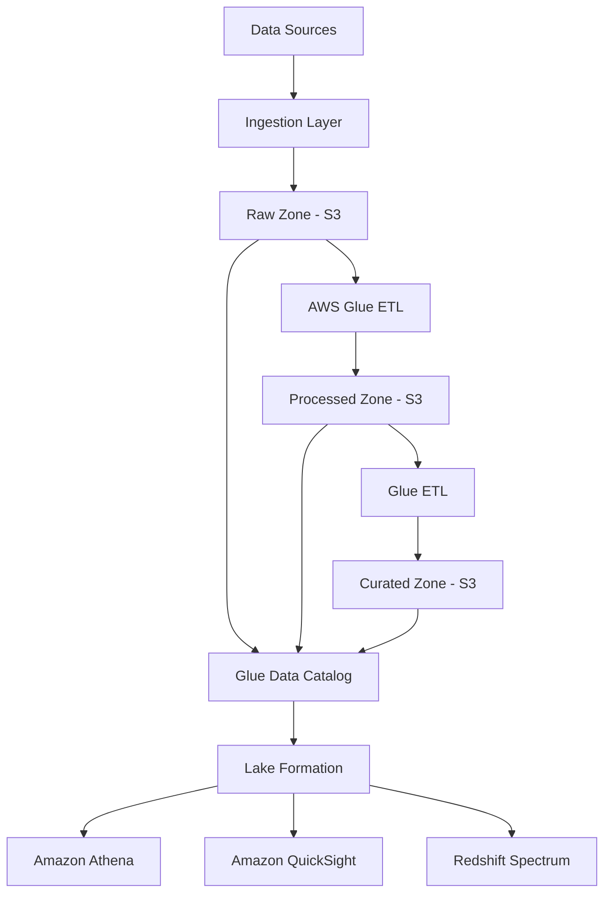

# How to Build a Data Lake on S3 with Glue and Lake Formation

Author: [nawazdhandala](https://github.com/nawazdhandala)

Tags: AWS, S3, Glue, Lake Formation, Data Lake

Description: A comprehensive guide to building a governed data lake on Amazon S3 using AWS Glue for ETL and cataloging and Lake Formation for security and access control.

---

A data lake is just an S3 bucket until you add structure, governance, and tooling around it. The combination of S3 for storage, Glue for cataloging and ETL, and Lake Formation for permissions creates a data lake that's actually usable - not just a dumping ground for files nobody can find.

This guide puts all three pieces together, from initial setup through ingestion, transformation, and secure access. If you've been thinking about building a data lake or replacing an overloaded data warehouse, this is the practical path.

## Data Lake Architecture



## Step 1: Create the S3 Storage Layer

Organize your bucket into zones. Each zone represents a different stage of data maturity.

```bash
# Create the data lake bucket with versioning
aws s3 mb s3://mycompany-data-lake --region us-east-1

aws s3api put-bucket-versioning \
  --bucket mycompany-data-lake \
  --versioning-configuration Status=Enabled

# Create the zone structure
for zone in raw processed curated athena-results scripts temp logs; do
  aws s3api put-object --bucket mycompany-data-lake --key "${zone}/"
done

# Set lifecycle rules for cost optimization
aws s3api put-bucket-lifecycle-configuration \
  --bucket mycompany-data-lake \
  --lifecycle-configuration '{
    "Rules": [
      {
        "ID": "raw-to-glacier",
        "Filter": {"Prefix": "raw/"},
        "Status": "Enabled",
        "Transitions": [
          {"Days": 90, "StorageClass": "GLACIER_IR"},
          {"Days": 365, "StorageClass": "DEEP_ARCHIVE"}
        ]
      },
      {
        "ID": "clean-temp",
        "Filter": {"Prefix": "temp/"},
        "Status": "Enabled",
        "Expiration": {"Days": 7}
      },
      {
        "ID": "clean-athena-results",
        "Filter": {"Prefix": "athena-results/"},
        "Status": "Enabled",
        "Expiration": {"Days": 30}
      }
    ]
  }'
```

## Step 2: Configure Lake Formation

Set up Lake Formation as the governance layer over your data lake.

```bash
# Set the Lake Formation admin
aws lakeformation put-data-lake-settings \
  --data-lake-settings '{
    "DataLakeAdmins": [
      {"DataLakePrincipalIdentifier": "arn:aws:iam::123456789012:role/DataLakeAdmin"}
    ],
    "CreateDatabaseDefaultPermissions": [],
    "CreateTableDefaultPermissions": []
  }'

# Create the data access role
cat > lf-role-policy.json << 'EOF'
{
  "Version": "2012-10-17",
  "Statement": [{
    "Effect": "Allow",
    "Action": [
      "s3:GetObject",
      "s3:PutObject",
      "s3:DeleteObject",
      "s3:ListBucket",
      "s3:GetBucketLocation"
    ],
    "Resource": [
      "arn:aws:s3:::mycompany-data-lake",
      "arn:aws:s3:::mycompany-data-lake/*"
    ]
  }]
}
EOF

# Register the S3 location with Lake Formation
aws lakeformation register-resource \
  --resource-arn "arn:aws:s3:::mycompany-data-lake" \
  --use-service-linked-role
```

## Step 3: Create the Data Catalog Databases

Create databases in the Glue Data Catalog for each zone.

```bash
# Create databases for each zone
aws glue create-database --database-input '{
  "Name": "raw_zone",
  "Description": "Raw ingested data - original format preserved",
  "LocationUri": "s3://mycompany-data-lake/raw/"
}'

aws glue create-database --database-input '{
  "Name": "processed_zone",
  "Description": "Cleaned and standardized data in Parquet format",
  "LocationUri": "s3://mycompany-data-lake/processed/"
}'

aws glue create-database --database-input '{
  "Name": "curated_zone",
  "Description": "Business-ready aggregated datasets",
  "LocationUri": "s3://mycompany-data-lake/curated/"
}'
```

## Step 4: Build the Ingestion Layer

Create a Glue job that ingests data from an RDS database into the raw zone.

```python
# ingest_rds.py - Glue job to ingest from RDS to S3 raw zone
import sys
from awsglue.transforms import *
from awsglue.utils import getResolvedOptions
from pyspark.context import SparkContext
from awsglue.context import GlueContext
from awsglue.job import Job
from datetime import datetime

args = getResolvedOptions(sys.argv, ['JOB_NAME', 'connection_name', 'database', 'tables'])
sc = SparkContext()
glueContext = GlueContext(sc)
spark = glueContext.spark_session
job = Job(glueContext)
job.init(args['JOB_NAME'], args)

today = datetime.utcnow().strftime('%Y-%m-%d')
tables = args['tables'].split(',')

for table_name in tables:
    print(f"Ingesting table: {table_name}")

    # Read from RDS via Glue connection
    source_df = glueContext.create_dynamic_frame.from_catalog(
        database=args['database'],
        table_name=table_name,
        transformation_ctx=f"source_{table_name}"
    )

    record_count = source_df.count()
    print(f"  Records: {record_count}")

    # Write to raw zone as JSON with date partition
    glueContext.write_dynamic_frame.from_options(
        frame=source_df,
        connection_type="s3",
        connection_options={
            "path": f"s3://mycompany-data-lake/raw/{table_name}/ingest_date={today}/"
        },
        format="json",
        transformation_ctx=f"write_{table_name}"
    )

    print(f"  Written to raw zone")

job.commit()
```

## Step 5: Build the Transformation Layer

Transform raw data into clean, typed, partitioned Parquet files in the processed zone.

```python
# transform_orders.py - Clean and transform order data
import sys
from awsglue.transforms import *
from awsglue.utils import getResolvedOptions
from pyspark.context import SparkContext
from awsglue.context import GlueContext
from awsglue.job import Job
from awsglue.dynamicframe import DynamicFrame
from pyspark.sql.functions import (
    col, when, year, month, dayofmonth,
    to_timestamp, trim, lower, regexp_replace
)
from pyspark.sql.types import DoubleType, IntegerType

args = getResolvedOptions(sys.argv, ['JOB_NAME'])
sc = SparkContext()
glueContext = GlueContext(sc)
spark = glueContext.spark_session
job = Job(glueContext)
job.init(args['JOB_NAME'], args)

# Read raw orders
raw_orders = glueContext.create_dynamic_frame.from_catalog(
    database="raw_zone",
    table_name="orders",
    transformation_ctx="raw_orders"
).toDF()

print(f"Raw orders count: {raw_orders.count()}")

# Clean and transform
processed = raw_orders \
    .withColumn("order_date", to_timestamp(col("order_date"))) \
    .withColumn("amount", col("amount").cast(DoubleType())) \
    .withColumn("quantity", col("quantity").cast(IntegerType())) \
    .withColumn("email", lower(trim(col("email")))) \
    .withColumn("status", lower(trim(col("status")))) \
    .withColumn("year", year(col("order_date"))) \
    .withColumn("month", month(col("order_date"))) \
    .filter(col("amount") > 0) \
    .filter(col("status").isin("completed", "shipped", "pending", "refunded")) \
    .dropDuplicates(["order_id"])

print(f"Processed orders count: {processed.count()}")

# Write to processed zone as partitioned Parquet
output_dyf = DynamicFrame.fromDF(processed, glueContext, "output")

glueContext.write_dynamic_frame.from_options(
    frame=output_dyf,
    connection_type="s3",
    connection_options={
        "path": "s3://mycompany-data-lake/processed/orders/",
        "partitionKeys": ["year", "month"]
    },
    format="parquet",
    format_options={"compression": "snappy"},
    transformation_ctx="write_processed"
)

job.commit()
```

## Step 6: Build Curated Datasets

Create business-ready aggregated datasets in the curated zone.

```python
# curate_daily_metrics.py - Build daily business metrics
import sys
from awsglue.utils import getResolvedOptions
from pyspark.context import SparkContext
from awsglue.context import GlueContext
from awsglue.job import Job
from awsglue.dynamicframe import DynamicFrame
from pyspark.sql.functions import (
    col, count, sum as spark_sum, avg,
    countDistinct, date_format
)

args = getResolvedOptions(sys.argv, ['JOB_NAME'])
sc = SparkContext()
glueContext = GlueContext(sc)
spark = glueContext.spark_session
job = Job(glueContext)
job.init(args['JOB_NAME'], args)

# Read from processed zone
orders = glueContext.create_dynamic_frame.from_catalog(
    database="processed_zone",
    table_name="orders",
    transformation_ctx="orders"
).toDF()

# Aggregate to daily metrics
daily_metrics = orders \
    .withColumn("date", date_format(col("order_date"), "yyyy-MM-dd")) \
    .groupBy("date", "status") \
    .agg(
        count("order_id").alias("order_count"),
        countDistinct("customer_id").alias("unique_customers"),
        spark_sum("amount").alias("total_revenue"),
        avg("amount").alias("avg_order_value"),
        spark_sum("quantity").alias("total_items")
    )

# Write to curated zone
output_dyf = DynamicFrame.fromDF(daily_metrics, glueContext, "output")

glueContext.write_dynamic_frame.from_options(
    frame=output_dyf,
    connection_type="s3",
    connection_options={
        "path": "s3://mycompany-data-lake/curated/daily_metrics/"
    },
    format="parquet",
    format_options={"compression": "snappy"},
    transformation_ctx="write_curated"
)

job.commit()
```

## Step 7: Set Up Crawlers for All Zones

```bash
# Crawler for processed zone
aws glue create-crawler \
  --name processed-zone-crawler \
  --role GlueServiceRole \
  --database-name processed_zone \
  --targets '{"S3Targets": [{"Path": "s3://mycompany-data-lake/processed/"}]}' \
  --recrawl-policy '{"RecrawlBehavior": "CRAWL_NEW_FOLDERS_ONLY"}'

# Crawler for curated zone
aws glue create-crawler \
  --name curated-zone-crawler \
  --role GlueServiceRole \
  --database-name curated_zone \
  --targets '{"S3Targets": [{"Path": "s3://mycompany-data-lake/curated/"}]}' \
  --recrawl-policy '{"RecrawlBehavior": "CRAWL_NEW_FOLDERS_ONLY"}'
```

## Step 8: Configure Lake Formation Permissions

Now lock down access using Lake Formation instead of S3 bucket policies.

```bash
# Grant data engineers full access to all zones
aws lakeformation grant-permissions \
  --principal '{"DataLakePrincipalIdentifier": "arn:aws:iam::123456789012:role/DataEngineerRole"}' \
  --resource '{"Database": {"Name": "raw_zone"}}' \
  --permissions '["ALL"]'

aws lakeformation grant-permissions \
  --principal '{"DataLakePrincipalIdentifier": "arn:aws:iam::123456789012:role/DataEngineerRole"}' \
  --resource '{"Database": {"Name": "processed_zone"}}' \
  --permissions '["ALL"]'

# Grant analysts read access to processed and curated only
aws lakeformation grant-permissions \
  --principal '{"DataLakePrincipalIdentifier": "arn:aws:iam::123456789012:role/AnalystRole"}' \
  --resource '{"Table": {"DatabaseName": "processed_zone", "TableWildcard": {}}}' \
  --permissions '["SELECT", "DESCRIBE"]'

aws lakeformation grant-permissions \
  --principal '{"DataLakePrincipalIdentifier": "arn:aws:iam::123456789012:role/AnalystRole"}' \
  --resource '{"Table": {"DatabaseName": "curated_zone", "TableWildcard": {}}}' \
  --permissions '["SELECT", "DESCRIBE"]'

# Grant QuickSight access to curated zone only
aws lakeformation grant-permissions \
  --principal '{"DataLakePrincipalIdentifier": "arn:aws:iam::123456789012:role/aws-quicksight-service-role-v0"}' \
  --resource '{"Table": {"DatabaseName": "curated_zone", "TableWildcard": {}}}' \
  --permissions '["SELECT", "DESCRIBE"]'
```

## Step 9: Orchestrate the Pipeline

Chain everything together with Glue Workflow.

```bash
# Create the workflow
aws glue create-workflow --name daily-data-lake-pipeline

# Create triggers for the pipeline stages
aws glue create-trigger \
  --workflow-name daily-data-lake-pipeline \
  --name start-ingestion \
  --type SCHEDULED \
  --schedule "cron(0 4 * * ? *)" \
  --actions '[{"JobName": "ingest-rds-orders"}]'

aws glue create-trigger \
  --workflow-name daily-data-lake-pipeline \
  --name start-transform \
  --type CONDITIONAL \
  --predicate '{"Conditions": [{"LogicalOperator": "EQUALS", "JobName": "ingest-rds-orders", "State": "SUCCEEDED"}]}' \
  --actions '[{"JobName": "transform-orders"}]'

aws glue create-trigger \
  --workflow-name daily-data-lake-pipeline \
  --name start-curate \
  --type CONDITIONAL \
  --predicate '{"Conditions": [{"LogicalOperator": "EQUALS", "JobName": "transform-orders", "State": "SUCCEEDED"}]}' \
  --actions '[{"JobName": "curate-daily-metrics"}, {"CrawlerName": "processed-zone-crawler"}]'
```

This gives you a fully governed data lake. Raw data flows in, gets cleaned and transformed, and analysts query the curated results through Athena - all with fine-grained access control via Lake Formation. For more details on the individual components, see our guides on [Lake Formation setup](https://oneuptime.com/blog/post/set-up-amazon-lake-formation-for-data-lakes/view) and [batch analytics with Glue and Athena](https://oneuptime.com/blog/post/build-batch-analytics-pipeline-glue-athena/view).
