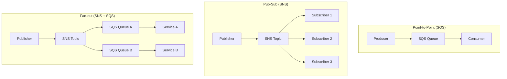

# How to Build a Decoupled Architecture with SQS and SNS

Author: [nawazdhandala](https://github.com/nawazdhandala)

Tags: AWS, SQS, SNS, Architecture, Microservices

Description: Build a decoupled microservices architecture on AWS using SQS for point-to-point messaging and SNS for publish-subscribe patterns with practical examples.

---

Tight coupling is the enemy of reliable distributed systems. When Service A calls Service B directly and Service B goes down, Service A fails too. Multiply that across dozens of services and you've got a fragile system where any single failure cascades everywhere.

SQS and SNS are AWS's messaging primitives. SQS provides queues for point-to-point communication. SNS provides topics for publish-subscribe. Together, they're the foundation for decoupled architectures.

## SQS vs SNS: When to Use Which

**SQS (Simple Queue Service)** - One producer, one consumer (or one consumer group). Messages are stored until processed. Great for task queues and work distribution.

**SNS (Simple Notification Service)** - One publisher, many subscribers. Messages are pushed to all subscribers immediately. Great for events and fan-out.

**SNS + SQS (Fan-out pattern)** - One publisher, multiple consumer groups. SNS distributes to multiple SQS queues, each processed independently.



## Building a Decoupled Order Processing System

Let's build something real - an order processing system where placing an order triggers multiple independent workflows.

```typescript
// CDK stack for decoupled order processing
import * as cdk from 'aws-cdk-lib';
import * as sqs from 'aws-cdk-lib/aws-sqs';
import * as sns from 'aws-cdk-lib/aws-sns';
import * as snsSubscriptions from 'aws-cdk-lib/aws-sns-subscriptions';
import * as lambda from 'aws-cdk-lib/aws-lambda';
import * as lambdaEventSources from 'aws-cdk-lib/aws-lambda-event-sources';

export class OrderProcessingStack extends cdk.Stack {
  constructor(scope: cdk.App, id: string) {
    super(scope, id);

    // SNS topic for order events
    const orderTopic = new sns.Topic(this, 'OrderEventsTopic', {
      topicName: 'order-events',
    });

    // SQS queues for each downstream service
    const paymentQueue = new sqs.Queue(this, 'PaymentQueue', {
      visibilityTimeout: cdk.Duration.minutes(5),
      deadLetterQueue: {
        queue: new sqs.Queue(this, 'PaymentDLQ', {
          retentionPeriod: cdk.Duration.days(14),
        }),
        maxReceiveCount: 3,
      },
    });

    const inventoryQueue = new sqs.Queue(this, 'InventoryQueue', {
      visibilityTimeout: cdk.Duration.minutes(5),
      deadLetterQueue: {
        queue: new sqs.Queue(this, 'InventoryDLQ', {
          retentionPeriod: cdk.Duration.days(14),
        }),
        maxReceiveCount: 3,
      },
    });

    const notificationQueue = new sqs.Queue(this, 'NotificationQueue', {
      visibilityTimeout: cdk.Duration.minutes(2),
      deadLetterQueue: {
        queue: new sqs.Queue(this, 'NotificationDLQ'),
        maxReceiveCount: 3,
      },
    });

    const analyticsQueue = new sqs.Queue(this, 'AnalyticsQueue', {
      visibilityTimeout: cdk.Duration.minutes(1),
    });

    // Subscribe all queues to the order topic
    orderTopic.addSubscription(new snsSubscriptions.SqsSubscription(paymentQueue));
    orderTopic.addSubscription(new snsSubscriptions.SqsSubscription(inventoryQueue));
    orderTopic.addSubscription(new snsSubscriptions.SqsSubscription(notificationQueue));
    orderTopic.addSubscription(new snsSubscriptions.SqsSubscription(analyticsQueue));

    // Lambda functions for each service
    const paymentHandler = new lambda.Function(this, 'PaymentHandler', {
      runtime: lambda.Runtime.NODEJS_18_X,
      handler: 'payment.handler',
      code: lambda.Code.fromAsset('lambda'),
    });

    const inventoryHandler = new lambda.Function(this, 'InventoryHandler', {
      runtime: lambda.Runtime.NODEJS_18_X,
      handler: 'inventory.handler',
      code: lambda.Code.fromAsset('lambda'),
    });

    // Connect Lambdas to their queues
    paymentHandler.addEventSource(new lambdaEventSources.SqsEventSource(paymentQueue, {
      batchSize: 1,
    }));

    inventoryHandler.addEventSource(new lambdaEventSources.SqsEventSource(inventoryQueue, {
      batchSize: 10,
      maxBatchingWindow: cdk.Duration.seconds(5),
    }));
  }
}
```

## Publishing Order Events

The order service publishes events to SNS. It doesn't know or care who's listening.

```javascript
// lambda/order-service.js
const { SNSClient, PublishCommand } = require('@aws-sdk/client-sns');

const snsClient = new SNSClient({});

exports.handler = async (event) => {
  const order = JSON.parse(event.body);

  // Validate and save the order
  const orderId = await saveOrder(order);

  // Publish an event - all downstream services pick it up
  await snsClient.send(new PublishCommand({
    TopicArn: process.env.ORDER_TOPIC_ARN,
    Message: JSON.stringify({
      eventType: 'ORDER_PLACED',
      orderId,
      userId: order.userId,
      items: order.items,
      total: order.total,
      timestamp: new Date().toISOString(),
    }),
    MessageAttributes: {
      eventType: {
        DataType: 'String',
        StringValue: 'ORDER_PLACED',
      },
      orderTotal: {
        DataType: 'Number',
        StringValue: String(order.total),
      },
    },
  }));

  return {
    statusCode: 201,
    body: JSON.stringify({ orderId, status: 'placed' }),
  };
};
```

## Consuming Events

Each downstream service processes events independently. If the notification service is slow, it doesn't affect payment processing.

```javascript
// lambda/payment.js - Processes payments
exports.handler = async (event) => {
  for (const record of event.Records) {
    const snsMessage = JSON.parse(record.body);
    const orderEvent = JSON.parse(snsMessage.Message);

    if (orderEvent.eventType !== 'ORDER_PLACED') return;

    console.log(`Processing payment for order ${orderEvent.orderId}`);

    try {
      const result = await chargePayment({
        userId: orderEvent.userId,
        amount: orderEvent.total,
        orderId: orderEvent.orderId,
      });

      // Publish payment result to another topic
      await publishEvent('PAYMENT_COMPLETED', {
        orderId: orderEvent.orderId,
        transactionId: result.transactionId,
      });
    } catch (error) {
      console.error(`Payment failed for order ${orderEvent.orderId}:`, error);
      // Message goes back to queue for retry, eventually to DLQ
      throw error;
    }
  }
};
```

```javascript
// lambda/inventory.js - Updates inventory
exports.handler = async (event) => {
  for (const record of event.Records) {
    const snsMessage = JSON.parse(record.body);
    const orderEvent = JSON.parse(snsMessage.Message);

    if (orderEvent.eventType !== 'ORDER_PLACED') return;

    console.log(`Reserving inventory for order ${orderEvent.orderId}`);

    for (const item of orderEvent.items) {
      await reserveInventory(item.productId, item.quantity);
    }

    console.log(`Inventory reserved for ${orderEvent.items.length} items`);
  }
};
```

## Message Filtering

Not every subscriber needs every message. SNS filter policies let subscribers receive only the messages they care about.

```typescript
// Filter subscription to only receive high-value orders
orderTopic.addSubscription(new snsSubscriptions.SqsSubscription(vipQueue, {
  filterPolicy: {
    orderTotal: sns.SubscriptionFilter.numericFilter({
      greaterThanOrEqualTo: 1000,
    }),
    eventType: sns.SubscriptionFilter.stringFilter({
      allowlist: ['ORDER_PLACED', 'ORDER_UPDATED'],
    }),
  },
}));
```

## FIFO Queues for Ordering Guarantees

Standard SQS queues don't guarantee message ordering. If you need messages processed in order (like order status updates), use FIFO queues.

```typescript
// FIFO queue for ordered processing
const orderStatusQueue = new sqs.Queue(this, 'OrderStatusQueue', {
  fifo: true,
  queueName: 'order-status.fifo',
  contentBasedDeduplication: true, // Dedup based on message content
  deadLetterQueue: {
    queue: new sqs.Queue(this, 'OrderStatusDLQ', {
      fifo: true,
      queueName: 'order-status-dlq.fifo',
    }),
    maxReceiveCount: 3,
  },
});

// FIFO SNS topic
const orderStatusTopic = new sns.Topic(this, 'OrderStatusTopic', {
  fifo: true,
  topicName: 'order-status.fifo',
  contentBasedDeduplication: true,
});
```

When publishing to a FIFO topic, include a message group ID to maintain ordering within a group.

```javascript
// Publish to FIFO topic - messages for the same order stay in order
await snsClient.send(new PublishCommand({
  TopicArn: process.env.ORDER_STATUS_TOPIC_ARN,
  Message: JSON.stringify({ orderId, status: 'shipped' }),
  MessageGroupId: orderId, // All messages for this order are in order
}));
```

## Error Handling and Dead Letter Queues

Messages that fail processing repeatedly end up in the DLQ. Monitor it and build a mechanism to replay or investigate failed messages.

```javascript
// lambda/dlq-processor.js - Process failed messages
const { SQSClient, ReceiveMessageCommand, DeleteMessageCommand, SendMessageCommand } = require('@aws-sdk/client-sqs');

const sqsClient = new SQSClient({});

exports.handler = async () => {
  // Read from DLQ
  const { Messages } = await sqsClient.send(new ReceiveMessageCommand({
    QueueUrl: process.env.DLQ_URL,
    MaxNumberOfMessages: 10,
    WaitTimeSeconds: 5,
  }));

  if (!Messages) return;

  for (const message of Messages) {
    console.log('Failed message:', message.Body);

    // Log for investigation
    await logFailedMessage(message);

    // Optionally replay to the main queue after fixing the issue
    // await sqsClient.send(new SendMessageCommand({
    //   QueueUrl: process.env.MAIN_QUEUE_URL,
    //   MessageBody: message.Body,
    // }));

    await sqsClient.send(new DeleteMessageCommand({
      QueueUrl: process.env.DLQ_URL,
      ReceiptHandle: message.ReceiptHandle,
    }));
  }
};
```

## Monitoring

Keep an eye on queue depth, message age, and DLQ activity.

```typescript
// Queue monitoring alarms
new cloudwatch.Alarm(this, 'QueueBacklogAlarm', {
  metric: paymentQueue.metricApproximateNumberOfMessagesVisible({
    period: cdk.Duration.minutes(5),
  }),
  threshold: 100,
  evaluationPeriods: 3,
  alarmDescription: 'Payment queue backlog is growing',
});

new cloudwatch.Alarm(this, 'MessageAgeAlarm', {
  metric: paymentQueue.metricApproximateAgeOfOldestMessage({
    period: cdk.Duration.minutes(5),
  }),
  threshold: 300, // 5 minutes
  evaluationPeriods: 2,
  alarmDescription: 'Payment messages are taking too long to process',
});
```

For comprehensive monitoring setup, see our guide on [building a logging and monitoring stack on AWS](https://oneuptime.com/blog/post/build-logging-and-monitoring-stack-on-aws/view).

## Summary

SQS and SNS are the building blocks of decoupled architectures on AWS. Use SNS when an event needs to reach multiple subscribers, SQS when work needs to be queued for a single consumer, and combine them for fan-out patterns. Add FIFO when ordering matters, filter policies when not everyone needs every message, and dead letter queues to catch failures. The result is a system where services are independent, failures are isolated, and you can scale each piece independently.
