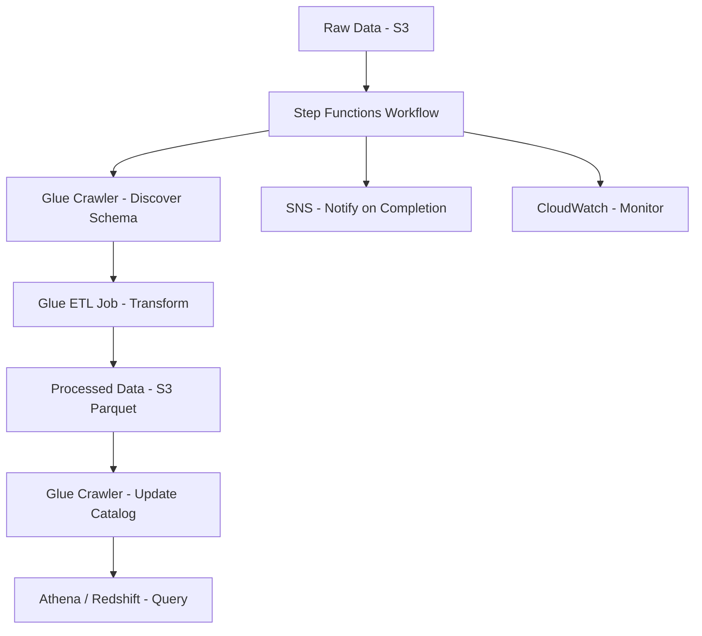

# How to Build an ETL Pipeline with AWS Glue and Step Functions

Author: [nawazdhandala](https://github.com/nawazdhandala)

Tags: AWS, Glue, Step Functions, ETL, Data Engineering

Description: Build a production ETL pipeline on AWS using Glue for data transformation, Step Functions for orchestration, and S3 for data lake storage with practical examples.

---

ETL - Extract, Transform, Load - is the backbone of data engineering. You pull data from source systems, clean and transform it, then load it into a data warehouse or data lake for analysis. AWS Glue handles the heavy lifting of data transformation, and Step Functions orchestrates the entire pipeline.

Let's build a complete ETL pipeline that processes raw data from S3, transforms it with Glue, and loads it into a queryable format.

## Architecture



## Setting Up the Data Lake

Start with an organized S3 structure. Separate raw, processed, and failed data.

```typescript
// CDK: Data lake buckets
import * as cdk from 'aws-cdk-lib';
import * as s3 from 'aws-cdk-lib/aws-s3';
import * as glue from 'aws-cdk-lib/aws-glue';
import * as iam from 'aws-cdk-lib/aws-iam';

export class EtlPipelineStack extends cdk.Stack {
  constructor(scope: cdk.App, id: string) {
    super(scope, id);

    // Data lake buckets
    const rawBucket = new s3.Bucket(this, 'RawDataBucket', {
      bucketName: 'my-datalake-raw',
      lifecycleRules: [{
        transitions: [{
          storageClass: s3.StorageClass.INFREQUENT_ACCESS,
          transitionAfter: cdk.Duration.days(90),
        }],
      }],
    });

    const processedBucket = new s3.Bucket(this, 'ProcessedDataBucket', {
      bucketName: 'my-datalake-processed',
    });

    const failedBucket = new s3.Bucket(this, 'FailedDataBucket', {
      bucketName: 'my-datalake-failed',
    });

    // Glue database (catalog)
    const database = new glue.CfnDatabase(this, 'GlueDatabase', {
      catalogId: cdk.Aws.ACCOUNT_ID,
      databaseInput: {
        name: 'analytics_db',
        description: 'Analytics data lake database',
      },
    });
  }
}
```

## Glue Crawlers - Schema Discovery

Crawlers scan your data in S3 and automatically create table definitions in the Glue Data Catalog.

```typescript
// Glue Crawler for raw data
const glueRole = new iam.Role(this, 'GlueRole', {
  assumedBy: new iam.ServicePrincipal('glue.amazonaws.com'),
  managedPolicies: [
    iam.ManagedPolicy.fromAwsManagedPolicyName('service-role/AWSGlueServiceRole'),
  ],
});

rawBucket.grantRead(glueRole);
processedBucket.grantReadWrite(glueRole);

const rawCrawler = new glue.CfnCrawler(this, 'RawDataCrawler', {
  role: glueRole.roleArn,
  databaseName: 'analytics_db',
  targets: {
    s3Targets: [{
      path: `s3://${rawBucket.bucketName}/events/`,
    }],
  },
  schemaChangePolicy: {
    updateBehavior: 'UPDATE_IN_DATABASE',
    deleteBehavior: 'LOG',
  },
  configuration: JSON.stringify({
    Version: 1.0,
    Grouping: { TableGroupingPolicy: 'CombineCompatibleSchemas' },
  }),
});
```

## The Glue ETL Job

Here's where the transformation happens. Glue ETL jobs run PySpark under the hood. You can write them in Python.

```python
# glue-scripts/transform_events.py
import sys
from awsglue.transforms import *
from awsglue.utils import getResolvedOptions
from pyspark.context import SparkContext
from awsglue.context import GlueContext
from awsglue.job import Job
from awsglue.dynamicframe import DynamicFrame
from pyspark.sql.functions import col, when, to_timestamp, year, month, dayofmonth

# Initialize Glue context
args = getResolvedOptions(sys.argv, ['JOB_NAME', 'source_path', 'output_path'])
sc = SparkContext()
glueContext = GlueContext(sc)
spark = glueContext.spark_session
job = Job(glueContext)
job.init(args['JOB_NAME'], args)

# Read raw data from S3
raw_data = glueContext.create_dynamic_frame.from_catalog(
    database="analytics_db",
    table_name="events",
    transformation_ctx="raw_data"
)

print(f"Raw record count: {raw_data.count()}")

# Convert to Spark DataFrame for easier transformation
df = raw_data.toDF()

# Clean and transform the data
transformed = df \
    .filter(col("user_id").isNotNull()) \
    .filter(col("event_type").isNotNull()) \
    .withColumn("event_timestamp", to_timestamp(col("timestamp"))) \
    .withColumn("year", year(col("event_timestamp"))) \
    .withColumn("month", month(col("event_timestamp"))) \
    .withColumn("day", dayofmonth(col("event_timestamp"))) \
    .withColumn("event_category",
        when(col("event_type").isin("purchase", "add_to_cart", "checkout"), "commerce")
        .when(col("event_type").isin("page_view", "search", "click"), "engagement")
        .otherwise("other")
    ) \
    .drop("timestamp") \
    .dropDuplicates(["user_id", "event_type", "event_timestamp"])

print(f"Transformed record count: {transformed.count()}")

# Convert back to DynamicFrame
output_frame = DynamicFrame.fromDF(transformed, glueContext, "output_frame")

# Write as Parquet, partitioned by date
glueContext.write_dynamic_frame.from_options(
    frame=output_frame,
    connection_type="s3",
    connection_options={
        "path": args['output_path'],
        "partitionKeys": ["year", "month", "day"]
    },
    format="parquet",
    format_options={"compression": "snappy"},
    transformation_ctx="write_output"
)

job.commit()
```

Define the Glue job in CDK.

```typescript
// Glue ETL Job definition
const etlJob = new glue.CfnJob(this, 'TransformJob', {
  name: 'transform-events',
  role: glueRole.roleArn,
  command: {
    name: 'glueetl',
    scriptLocation: `s3://${scriptsBucket.bucketName}/glue-scripts/transform_events.py`,
    pythonVersion: '3',
  },
  defaultArguments: {
    '--source_path': `s3://${rawBucket.bucketName}/events/`,
    '--output_path': `s3://${processedBucket.bucketName}/events/`,
    '--job-bookmark-option': 'job-bookmark-enable', // Track processed data
    '--enable-metrics': 'true',
    '--enable-continuous-cloudwatch-log': 'true',
  },
  glueVersion: '4.0',
  workerType: 'G.1X',
  numberOfWorkers: 10,
  timeout: 120, // Minutes
});
```

## Orchestration with Step Functions

Step Functions ties everything together into a reliable workflow with error handling.

```json
{
  "Comment": "ETL Pipeline - Extract, Transform, Load",
  "StartAt": "RunRawCrawler",
  "States": {
    "RunRawCrawler": {
      "Type": "Task",
      "Resource": "arn:aws:states:::glue:startCrawler.sync",
      "Parameters": {
        "Name": "raw-data-crawler"
      },
      "Retry": [
        {
          "ErrorEquals": ["States.TaskFailed"],
          "IntervalSeconds": 60,
          "MaxAttempts": 2,
          "BackoffRate": 2
        }
      ],
      "Next": "RunETLJob"
    },
    "RunETLJob": {
      "Type": "Task",
      "Resource": "arn:aws:states:::glue:startJobRun.sync",
      "Parameters": {
        "JobName": "transform-events",
        "Arguments": {
          "--source_path.$": "$.sourcePath",
          "--output_path.$": "$.outputPath"
        }
      },
      "Retry": [
        {
          "ErrorEquals": ["States.TaskFailed"],
          "IntervalSeconds": 120,
          "MaxAttempts": 2,
          "BackoffRate": 2
        }
      ],
      "Catch": [
        {
          "ErrorEquals": ["States.ALL"],
          "Next": "HandleETLFailure"
        }
      ],
      "Next": "RunProcessedCrawler"
    },
    "RunProcessedCrawler": {
      "Type": "Task",
      "Resource": "arn:aws:states:::glue:startCrawler.sync",
      "Parameters": {
        "Name": "processed-data-crawler"
      },
      "Next": "RunDataQualityCheck"
    },
    "RunDataQualityCheck": {
      "Type": "Task",
      "Resource": "arn:aws:lambda:us-east-1:123456789:function:data-quality-check",
      "Next": "QualityCheckPassed"
    },
    "QualityCheckPassed": {
      "Type": "Choice",
      "Choices": [
        {
          "Variable": "$.qualityScore",
          "NumericGreaterThanEquals": 95,
          "Next": "NotifySuccess"
        }
      ],
      "Default": "NotifyQualityIssue"
    },
    "NotifySuccess": {
      "Type": "Task",
      "Resource": "arn:aws:states:::sns:publish",
      "Parameters": {
        "TopicArn": "arn:aws:sns:us-east-1:123456789:etl-notifications",
        "Message": "ETL pipeline completed successfully"
      },
      "End": true
    },
    "NotifyQualityIssue": {
      "Type": "Task",
      "Resource": "arn:aws:states:::sns:publish",
      "Parameters": {
        "TopicArn": "arn:aws:sns:us-east-1:123456789:etl-notifications",
        "Message": "ETL pipeline completed but data quality is below threshold"
      },
      "End": true
    },
    "HandleETLFailure": {
      "Type": "Task",
      "Resource": "arn:aws:states:::sns:publish",
      "Parameters": {
        "TopicArn": "arn:aws:sns:us-east-1:123456789:etl-notifications",
        "Message.$": "States.Format('ETL job failed: {}', $.Error)"
      },
      "End": true
    }
  }
}
```

## Data Quality Checks

After transformation, verify the data meets quality standards.

```javascript
// lambda/data-quality-check.js
const { AthenaClient, StartQueryExecutionCommand, GetQueryResultsCommand } = require('@aws-sdk/client-athena');

const athena = new AthenaClient({});

exports.handler = async (event) => {
  const checks = [
    // Check for null values in critical fields
    {
      name: 'null_check',
      query: `SELECT COUNT(*) as null_count FROM analytics_db.events WHERE user_id IS NULL OR event_type IS NULL`,
      threshold: 0,
    },
    // Check record count is reasonable
    {
      name: 'record_count',
      query: `SELECT COUNT(*) as cnt FROM analytics_db.events WHERE year = ${new Date().getFullYear()} AND month = ${new Date().getMonth() + 1}`,
      minThreshold: 1000,
    },
    // Check for duplicate records
    {
      name: 'duplicate_check',
      query: `SELECT COUNT(*) - COUNT(DISTINCT user_id || event_type || CAST(event_timestamp AS VARCHAR)) as dupes FROM analytics_db.events`,
      threshold: 0,
    },
  ];

  let passedChecks = 0;

  for (const check of checks) {
    const result = await runAthenaQuery(check.query);
    const value = parseInt(result);
    const passed = check.threshold !== undefined ? value <= check.threshold : value >= check.minThreshold;

    console.log(`Check ${check.name}: value=${value}, passed=${passed}`);
    if (passed) passedChecks++;
  }

  const qualityScore = (passedChecks / checks.length) * 100;
  return { qualityScore, passedChecks, totalChecks: checks.length };
};
```

## Scheduling the Pipeline

Trigger the Step Functions workflow on a schedule using EventBridge.

```typescript
// Schedule the pipeline to run daily
import * as events from 'aws-cdk-lib/aws-events';
import * as targets from 'aws-cdk-lib/aws-events-targets';

new events.Rule(this, 'DailyETL', {
  schedule: events.Schedule.cron({ hour: '4', minute: '0' }),
  targets: [new targets.SfnStateMachine(stateMachine, {
    input: events.RuleTargetInput.fromObject({
      sourcePath: `s3://${rawBucket.bucketName}/events/`,
      outputPath: `s3://${processedBucket.bucketName}/events/`,
      runDate: events.EventField.time,
    }),
  })],
});
```

## Monitoring the Pipeline

Track job durations, failure rates, and data volume.

```typescript
// Step Functions execution monitoring
new cloudwatch.Alarm(this, 'ETLFailureAlarm', {
  metric: new cloudwatch.Metric({
    namespace: 'AWS/States',
    metricName: 'ExecutionsFailed',
    dimensionsMap: { StateMachineArn: stateMachine.stateMachineArn },
    period: cdk.Duration.hours(1),
    statistic: 'Sum',
  }),
  threshold: 1,
  evaluationPeriods: 1,
  alarmDescription: 'ETL pipeline execution failed',
});
```

For comprehensive monitoring, see our guide on [building a logging and monitoring stack on AWS](https://oneuptime.com/blog/post/build-logging-and-monitoring-stack-on-aws/view).

## Cost Optimization

Glue is priced per DPU-hour (Data Processing Unit). A few tips to manage costs:

- Use job bookmarks to avoid reprocessing old data
- Right-size your worker count based on data volume
- Use Glue's auto-scaling to match resources to workload
- Store processed data as compressed Parquet for cheaper querying
- Partition your data by date to limit Athena scan costs

## Summary

An ETL pipeline with Glue and Step Functions gives you a managed, scalable data processing system. Glue crawlers discover schemas, ETL jobs transform data, Step Functions orchestrate the workflow with retries and error handling, and the Glue Data Catalog makes everything queryable. Start simple with a single transformation job and add complexity (data quality checks, multiple data sources, incremental processing) as your needs grow.
