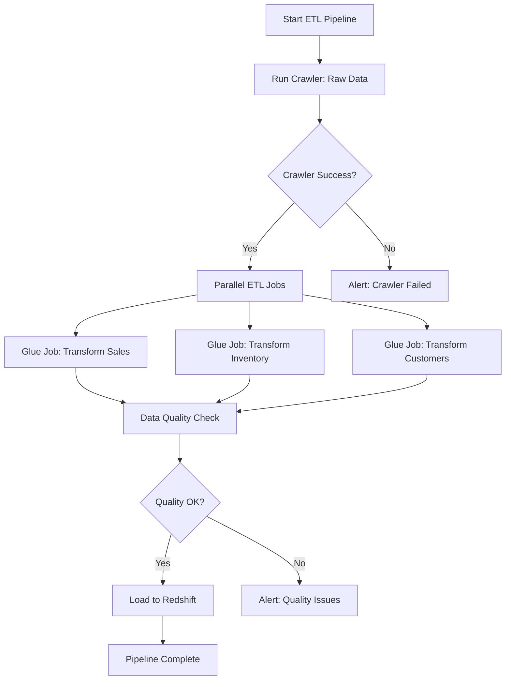

# How to Build ETL Workflows with Step Functions and Glue

Author: [nawazdhandala](https://github.com/nawazdhandala)

Tags: AWS, Step Functions, Glue, ETL, Data Engineering, Serverless

Description: Build reliable ETL pipelines by orchestrating AWS Glue jobs with Step Functions for scheduling, error handling, and dependencies

---

AWS Glue handles the extract-transform-load work. But who orchestrates when Glue jobs run, what happens when they fail, and how they depend on each other? That is where Step Functions comes in.

Step Functions has native Glue integrations that let you start crawlers, run ETL jobs, wait for completion, and handle errors - all without writing a single line of Lambda code. This guide walks through building production-grade ETL workflows.

## Why Step Functions for ETL Orchestration?

Glue has its own triggers and workflows, but they are limited. Step Functions gives you:

- **Complex dependency graphs** - Run jobs in parallel, chain sequential steps, fan out and fan in
- **Error handling** - Retry failed jobs with exponential backoff, catch specific errors, route to different paths
- **Human approval gates** - Pause a pipeline for data quality review
- **Cross-service orchestration** - Combine Glue, Lambda, Athena, Redshift, and S3 in one workflow
- **Visual monitoring** - See exactly where your pipeline is and what failed



## Step 1: Run a Glue Crawler

Crawlers scan your data sources and update the Glue Data Catalog. Step Functions can start a crawler and wait for it to finish using the `.sync` integration pattern.

```json
{
  "RunCrawler": {
    "Type": "Task",
    "Resource": "arn:aws:states:::aws-sdk:glue:startCrawler",
    "Parameters": {
      "Name": "raw-data-crawler"
    },
    "Next": "WaitForCrawler"
  },
  "WaitForCrawler": {
    "Type": "Task",
    "Resource": "arn:aws:states:::aws-sdk:glue:getCrawler",
    "Parameters": {
      "Name": "raw-data-crawler"
    },
    "ResultPath": "$.crawlerStatus",
    "Next": "CheckCrawlerStatus"
  },
  "CheckCrawlerStatus": {
    "Type": "Choice",
    "Choices": [
      {
        "Variable": "$.crawlerStatus.Crawler.State",
        "StringEquals": "READY",
        "Next": "CrawlerComplete"
      },
      {
        "Variable": "$.crawlerStatus.Crawler.State",
        "StringEquals": "RUNNING",
        "Next": "WaitBeforeCheck"
      }
    ],
    "Default": "CrawlerFailed"
  },
  "WaitBeforeCheck": {
    "Type": "Wait",
    "Seconds": 30,
    "Next": "WaitForCrawler"
  }
}
```

## Step 2: Run Glue ETL Jobs

The native Glue job integration with `.sync` is the cleanest approach. Step Functions starts the job and waits for it to complete:

```json
{
  "TransformSalesData": {
    "Type": "Task",
    "Resource": "arn:aws:states:::glue:startJobRun.sync",
    "Parameters": {
      "JobName": "transform-sales-data",
      "Arguments": {
        "--source_database": "raw_data",
        "--source_table": "sales_raw",
        "--target_path": "s3://my-data-lake/transformed/sales/",
        "--processing_date.$": "$.processingDate"
      }
    },
    "ResultPath": "$.salesJobResult",
    "Retry": [
      {
        "ErrorEquals": ["Glue.ConcurrentRunsExceededException"],
        "IntervalSeconds": 60,
        "MaxAttempts": 3,
        "BackoffRate": 2.0
      }
    ],
    "Catch": [
      {
        "ErrorEquals": ["States.ALL"],
        "Next": "HandleJobFailure",
        "ResultPath": "$.error"
      }
    ],
    "Next": "DataQualityCheck"
  }
}
```

Note the `.sync` suffix on the resource ARN. This is critical - without it, Step Functions starts the Glue job and immediately moves to the next state without waiting for completion.

### Passing Dynamic Parameters

You can pass parameters from the Step Functions input to Glue job arguments:

```json
{
  "Parameters": {
    "JobName": "transform-data",
    "Arguments": {
      "--date.$": "$.processingDate",
      "--region.$": "$.targetRegion",
      "--mode": "full"
    },
    "NumberOfWorkers": 10,
    "WorkerType": "G.1X",
    "Timeout": 120
  }
}
```

## Step 3: Running Jobs in Parallel

Most ETL pipelines have jobs that can run simultaneously. Use the Parallel state:

```json
{
  "Comment": "ETL pipeline with parallel transform jobs",
  "StartAt": "RunCrawler",
  "States": {
    "RunCrawler": {
      "Type": "Task",
      "Resource": "arn:aws:states:::glue:startJobRun.sync",
      "Parameters": {
        "JobName": "catalog-raw-data"
      },
      "Next": "ParallelTransforms"
    },
    "ParallelTransforms": {
      "Type": "Parallel",
      "Branches": [
        {
          "StartAt": "TransformSales",
          "States": {
            "TransformSales": {
              "Type": "Task",
              "Resource": "arn:aws:states:::glue:startJobRun.sync",
              "Parameters": {
                "JobName": "transform-sales",
                "Arguments": {
                  "--date.$": "$.processingDate"
                }
              },
              "End": true
            }
          }
        },
        {
          "StartAt": "TransformInventory",
          "States": {
            "TransformInventory": {
              "Type": "Task",
              "Resource": "arn:aws:states:::glue:startJobRun.sync",
              "Parameters": {
                "JobName": "transform-inventory",
                "Arguments": {
                  "--date.$": "$.processingDate"
                }
              },
              "End": true
            }
          }
        },
        {
          "StartAt": "TransformCustomers",
          "States": {
            "TransformCustomers": {
              "Type": "Task",
              "Resource": "arn:aws:states:::glue:startJobRun.sync",
              "Parameters": {
                "JobName": "transform-customers",
                "Arguments": {
                  "--date.$": "$.processingDate"
                }
              },
              "End": true
            }
          }
        }
      ],
      "ResultPath": "$.transformResults",
      "Next": "RunAggregation"
    },
    "RunAggregation": {
      "Type": "Task",
      "Resource": "arn:aws:states:::glue:startJobRun.sync",
      "Parameters": {
        "JobName": "aggregate-all-data",
        "Arguments": {
          "--date.$": "$.processingDate"
        }
      },
      "Next": "DataQualityCheck"
    },
    "DataQualityCheck": {
      "Type": "Task",
      "Resource": "arn:aws:lambda:us-east-1:123456789012:function:check-data-quality",
      "ResultPath": "$.qualityResult",
      "Next": "IsQualityOK"
    },
    "IsQualityOK": {
      "Type": "Choice",
      "Choices": [
        {
          "Variable": "$.qualityResult.passed",
          "BooleanEquals": true,
          "Next": "LoadToRedshift"
        }
      ],
      "Default": "QualityFailed"
    },
    "LoadToRedshift": {
      "Type": "Task",
      "Resource": "arn:aws:states:::glue:startJobRun.sync",
      "Parameters": {
        "JobName": "load-to-redshift"
      },
      "Next": "PipelineComplete"
    },
    "PipelineComplete": {
      "Type": "Succeed"
    },
    "QualityFailed": {
      "Type": "Task",
      "Resource": "arn:aws:states:::sns:publish",
      "Parameters": {
        "TopicArn": "arn:aws:sns:us-east-1:123456789012:data-quality-alerts",
        "Message.$": "States.Format('Data quality check failed: {}', $.qualityResult.details)"
      },
      "Next": "PipelineFailed"
    },
    "PipelineFailed": {
      "Type": "Fail",
      "Error": "DataQualityFailed",
      "Cause": "Data quality checks did not pass"
    }
  }
}
```

## Data Quality Checks

The quality check Lambda validates transformed data before loading:

```python
# Data quality check that validates row counts, null ratios, and freshness
import boto3

def handler(event, context):
    athena = boto3.client('athena')
    processing_date = event['processingDate']

    checks = []

    # Check 1: Row count is reasonable
    row_count = run_athena_query(
        athena,
        f"SELECT COUNT(*) as cnt FROM transformed_sales WHERE date = '{processing_date}'"
    )
    checks.append({
        'check': 'row_count',
        'passed': row_count > 1000,
        'value': row_count,
        'threshold': 1000
    })

    # Check 2: No null primary keys
    null_count = run_athena_query(
        athena,
        f"SELECT COUNT(*) as cnt FROM transformed_sales WHERE order_id IS NULL AND date = '{processing_date}'"
    )
    checks.append({
        'check': 'null_primary_keys',
        'passed': null_count == 0,
        'value': null_count,
        'threshold': 0
    })

    # Check 3: Revenue values are positive
    negative_revenue = run_athena_query(
        athena,
        f"SELECT COUNT(*) as cnt FROM transformed_sales WHERE revenue < 0 AND date = '{processing_date}'"
    )
    checks.append({
        'check': 'negative_revenue',
        'passed': negative_revenue == 0,
        'value': negative_revenue,
        'threshold': 0
    })

    all_passed = all(c['passed'] for c in checks)

    return {
        'passed': all_passed,
        'checks': checks,
        'details': f"{sum(1 for c in checks if c['passed'])}/{len(checks)} checks passed"
    }

def run_athena_query(client, query):
    # Simplified Athena query execution
    response = client.start_query_execution(
        QueryString=query,
        ResultConfiguration={'OutputLocation': 's3://my-athena-results/'}
    )
    # Wait for and parse result (simplified)
    return 0
```

## Scheduling the Pipeline

Use EventBridge to trigger the pipeline on a schedule:

```bash
# Schedule the ETL pipeline to run daily at 2 AM UTC
aws events put-rule \
  --name daily-etl-pipeline \
  --schedule-expression "cron(0 2 * * ? *)" \
  --state ENABLED

aws events put-targets \
  --rule daily-etl-pipeline \
  --targets '[{
    "Id": "etl-pipeline",
    "Arn": "arn:aws:states:us-east-1:123456789012:stateMachine:etl-pipeline",
    "RoleArn": "arn:aws:iam::123456789012:role/eventbridge-sfn-role",
    "Input": "{\"processingDate\": \"<aws.scheduler.execution-id>\"}"
  }]'
```

For dynamic date handling, use a Lambda function as the first step to calculate the processing date based on the current time.

## Error Handling Best Practices

1. **Retry transient errors** - `ConcurrentRunsExceededException` and timeout errors are usually transient
2. **Catch and alert on permanent failures** - Missing data sources or schema changes need human attention
3. **Use SNS for notifications** - Send alerts when the pipeline fails or data quality checks do not pass
4. **Log Glue job run IDs** - Include the `JobRunId` in error messages for easy debugging

## Wrapping Up

Step Functions turns individual Glue jobs into reliable, observable ETL pipelines. The native `.sync` integration means you do not need Lambda functions just to poll job status. Parallel states let independent transforms run simultaneously. And the error handling gives you confidence that failures are caught and communicated.

For pipelines that need to process millions of files, combine Step Functions with [Distributed Map](https://oneuptime.com/blog/post/2026-02-12-use-step-functions-distributed-map-for-large-scale-processing/view) to parallelize at massive scale.
