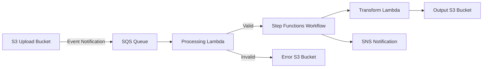

# How to Build a File Processing Pipeline on AWS

Author: [nawazdhandala](https://github.com/nawazdhandala)

Tags: AWS, S3, Lambda, Step Functions, SQS

Description: Step-by-step guide to building a scalable file processing pipeline on AWS using S3 event triggers, Lambda, SQS, and Step Functions for orchestration.

---

Processing files at scale is one of those problems that sounds simple until you actually try to do it. A user uploads a CSV, you parse it, validate the data, maybe transform it, and store the results. Easy enough for one file. But what about thousands of files per hour, each one a different size, some of them malformed? That's where a proper pipeline matters.

AWS has all the pieces you need. Let's put them together.

## Architecture

The pipeline we're building handles three stages: ingestion, processing, and output. S3 handles file storage, Lambda does the heavy lifting, SQS buffers the work, and Step Functions orchestrate multi-step workflows.



## Setting Up the Ingestion Layer

The first step is an S3 bucket that triggers processing when files arrive. We put SQS between S3 and Lambda for a good reason - it buffers bursts and gives you built-in retry behavior.

```typescript
// lib/file-pipeline-stack.ts
import * as cdk from 'aws-cdk-lib';
import * as s3 from 'aws-cdk-lib/aws-s3';
import * as sqs from 'aws-cdk-lib/aws-sqs';
import * as lambda from 'aws-cdk-lib/aws-lambda';
import * as s3n from 'aws-cdk-lib/aws-s3-notifications';
import * as lambdaEventSources from 'aws-cdk-lib/aws-lambda-event-sources';

export class FilePipelineStack extends cdk.Stack {
  constructor(scope: cdk.App, id: string) {
    super(scope, id);

    // Upload bucket where files arrive
    const uploadBucket = new s3.Bucket(this, 'UploadBucket', {
      removalPolicy: cdk.RemovalPolicy.DESTROY,
      lifecycleRules: [{
        expiration: cdk.Duration.days(7), // Auto-delete after 7 days
      }],
    });

    // Dead letter queue for failed messages
    const dlq = new sqs.Queue(this, 'ProcessingDLQ', {
      retentionPeriod: cdk.Duration.days(14),
    });

    // Main processing queue with DLQ
    const processingQueue = new sqs.Queue(this, 'ProcessingQueue', {
      visibilityTimeout: cdk.Duration.minutes(6),
      deadLetterQueue: {
        queue: dlq,
        maxReceiveCount: 3, // Retry 3 times before moving to DLQ
      },
    });

    // S3 sends events to SQS when new files arrive
    uploadBucket.addEventNotification(
      s3.EventType.OBJECT_CREATED,
      new s3n.SqsDestination(processingQueue),
      { prefix: 'uploads/', suffix: '.csv' } // Only process CSVs in uploads/
    );

    // Processing Lambda reads from the queue
    const processorFunction = new lambda.Function(this, 'ProcessorFunction', {
      runtime: lambda.Runtime.NODEJS_18_X,
      handler: 'processor.handler',
      code: lambda.Code.fromAsset('lambda'),
      timeout: cdk.Duration.minutes(5),
      memorySize: 1024,
      environment: {
        OUTPUT_BUCKET: outputBucket.bucketName,
        ERROR_BUCKET: errorBucket.bucketName,
      },
    });

    // Connect the queue to the Lambda function
    processorFunction.addEventSource(
      new lambdaEventSources.SqsEventSource(processingQueue, {
        batchSize: 1, // Process one file at a time
        maxBatchingWindow: cdk.Duration.seconds(0),
      })
    );

    uploadBucket.grantRead(processorFunction);
  }
}
```

## The Processing Lambda

This function downloads the file from S3, validates it, and kicks off further processing.

```javascript
// lambda/processor.js
const { S3Client, GetObjectCommand, PutObjectCommand } = require('@aws-sdk/client-s3');
const { SFNClient, StartExecutionCommand } = require('@aws-sdk/client-sfn');
const { Readable } = require('stream');
const csv = require('csv-parser');

const s3Client = new S3Client({});
const sfnClient = new SFNClient({});

exports.handler = async (event) => {
  for (const record of event.Records) {
    const message = JSON.parse(record.body);
    const s3Event = message.Records[0].s3;
    const bucket = s3Event.bucket.name;
    const key = decodeURIComponent(s3Event.object.key.replace(/\+/g, ' '));

    console.log(`Processing file: s3://${bucket}/${key}`);

    // Download the file from S3
    const { Body } = await s3Client.send(new GetObjectCommand({ Bucket: bucket, Key: key }));

    // Parse and validate CSV
    const rows = [];
    const errors = [];

    await new Promise((resolve, reject) => {
      Readable.from(Body)
        .pipe(csv())
        .on('data', (row) => {
          const validation = validateRow(row);
          if (validation.valid) {
            rows.push(row);
          } else {
            errors.push({ row, error: validation.error });
          }
        })
        .on('end', resolve)
        .on('error', reject);
    });

    console.log(`Parsed ${rows.length} valid rows, ${errors.length} errors`);

    // If too many errors, move to error bucket
    if (errors.length > rows.length * 0.1) {
      await s3Client.send(new PutObjectCommand({
        Bucket: process.env.ERROR_BUCKET,
        Key: `failed/${key}`,
        Body: JSON.stringify({ errors, originalFile: key }),
      }));
      continue;
    }

    // Start Step Functions workflow for valid data
    await sfnClient.send(new StartExecutionCommand({
      stateMachineArn: process.env.STATE_MACHINE_ARN,
      input: JSON.stringify({
        sourceBucket: bucket,
        sourceKey: key,
        rowCount: rows.length,
        validatedData: rows,
      }),
    }));
  }
};

function validateRow(row) {
  if (!row.email || !row.email.includes('@')) {
    return { valid: false, error: 'Invalid email' };
  }
  if (!row.name || row.name.trim().length === 0) {
    return { valid: false, error: 'Missing name' };
  }
  return { valid: true };
}
```

## Multi-Step Processing with Step Functions

For complex file processing, Step Functions let you define a workflow with parallel steps, error handling, and retries.

```json
{
  "Comment": "File processing workflow",
  "StartAt": "TransformData",
  "States": {
    "TransformData": {
      "Type": "Task",
      "Resource": "arn:aws:lambda:us-east-1:123456789:function:TransformData",
      "Retry": [
        {
          "ErrorEquals": ["States.TaskFailed"],
          "IntervalSeconds": 30,
          "MaxAttempts": 2,
          "BackoffRate": 2
        }
      ],
      "Catch": [
        {
          "ErrorEquals": ["States.ALL"],
          "Next": "HandleError"
        }
      ],
      "Next": "CheckFileSize"
    },
    "CheckFileSize": {
      "Type": "Choice",
      "Choices": [
        {
          "Variable": "$.rowCount",
          "NumericGreaterThan": 10000,
          "Next": "ProcessLargeFile"
        }
      ],
      "Default": "ProcessSmallFile"
    },
    "ProcessLargeFile": {
      "Type": "Map",
      "ItemsPath": "$.chunks",
      "MaxConcurrency": 10,
      "Iterator": {
        "StartAt": "ProcessChunk",
        "States": {
          "ProcessChunk": {
            "Type": "Task",
            "Resource": "arn:aws:lambda:us-east-1:123456789:function:ProcessChunk",
            "End": true
          }
        }
      },
      "Next": "MergeResults"
    },
    "ProcessSmallFile": {
      "Type": "Task",
      "Resource": "arn:aws:lambda:us-east-1:123456789:function:ProcessSmallFile",
      "Next": "MergeResults"
    },
    "MergeResults": {
      "Type": "Task",
      "Resource": "arn:aws:lambda:us-east-1:123456789:function:MergeResults",
      "Next": "NotifyComplete"
    },
    "NotifyComplete": {
      "Type": "Task",
      "Resource": "arn:aws:states:::sns:publish",
      "Parameters": {
        "TopicArn": "arn:aws:sns:us-east-1:123456789:processing-complete",
        "Message.$": "States.Format('Processing complete: {} rows processed', $.totalRows)"
      },
      "End": true
    },
    "HandleError": {
      "Type": "Task",
      "Resource": "arn:aws:lambda:us-east-1:123456789:function:HandleError",
      "End": true
    }
  }
}
```

## Handling Large Files

Lambda has a 15-minute timeout and limited temp storage (10 GB on `/tmp`). For really large files, you need a different approach.

```javascript
// lambda/large-file-splitter.js
// Split large files into chunks using S3 Select or streaming
const { S3Client, SelectObjectContentCommand } = require('@aws-sdk/client-s3');

const s3Client = new S3Client({});

exports.handler = async (event) => {
  const { bucket, key } = event;

  // Use S3 Select to query CSV data without downloading the entire file
  const params = {
    Bucket: bucket,
    Key: key,
    ExpressionType: 'SQL',
    Expression: "SELECT * FROM s3object s WHERE s.status = 'active'",
    InputSerialization: {
      CSV: { FileHeaderInfo: 'USE', RecordDelimiter: '\n', FieldDelimiter: ',' },
    },
    OutputSerialization: {
      JSON: { RecordDelimiter: '\n' },
    },
  };

  const response = await s3Client.send(new SelectObjectContentCommand(params));

  let results = '';
  for await (const event of response.Payload) {
    if (event.Records) {
      results += event.Records.Payload.toString();
    }
  }

  return { filteredRecords: results.split('\n').filter(Boolean).length };
};
```

## Error Handling and Observability

A production pipeline needs solid error handling. Here's what to monitor:

- Files landing in the DLQ (processing failures after retries)
- Step Functions execution failures
- Processing latency (time from upload to completion)
- Error rates per file type

For building out a full observability stack around your pipeline, check out [building a centralized log aggregation system on AWS](https://oneuptime.com/blog/post/2026-02-12-build-centralized-log-aggregation-system-on-aws/view).

```typescript
// CloudWatch alarm for DLQ messages
new cloudwatch.Alarm(this, 'DLQAlarm', {
  metric: dlq.metricApproximateNumberOfMessagesVisible({
    period: cdk.Duration.minutes(5),
  }),
  threshold: 1,
  evaluationPeriods: 1,
  alarmDescription: 'Files failed processing and landed in DLQ',
});
```

## Cost Optimization

A few tips to keep costs down:

- Use S3 lifecycle rules to move processed files to cheaper storage classes
- Set Lambda memory appropriately - too much wastes money, too little wastes time
- Use SQS long polling to reduce empty receives
- Consider S3 Batch Operations for one-time bulk processing instead of event-driven pipelines

## Summary

Building a file processing pipeline on AWS is about connecting the right services together. S3 for storage, SQS for buffering, Lambda for processing, and Step Functions for orchestration. The event-driven architecture means you don't pay for idle resources, and the pipeline scales automatically with load. Start simple and add complexity only when you need it.
