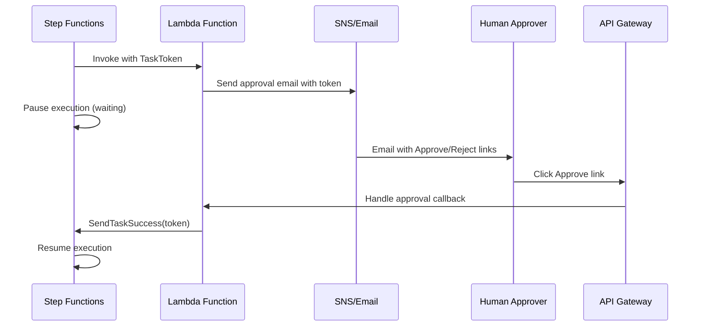

# How to Build Human Approval Workflows with Step Functions

Author: [nawazdhandala](https://github.com/nawazdhandala)

Tags: AWS, Step Functions, Approval Workflows, Serverless, Automation

Description: Build human-in-the-loop approval workflows using AWS Step Functions with task tokens and callback patterns

---

Not everything should be fully automated. Deploying to production, approving expense reports, releasing customer data - these operations often need a human to review and approve before proceeding. AWS Step Functions makes it straightforward to build workflows that pause, wait for human input, and then continue.

The key mechanism is the task token pattern. Step Functions generates a unique token, sends it to a human (via email, Slack, or a web interface), and pauses the execution. When the human approves or rejects, your system sends the token back to Step Functions with the decision, and the workflow resumes.

## How Task Tokens Work

When a Step Functions task uses the `.waitForTaskToken` integration pattern, the workflow pauses and generates a unique token. This token is passed to your task (typically a Lambda function) which sends it somewhere a human can interact with it. The execution remains paused until someone calls `SendTaskSuccess` or `SendTaskFailure` with that token.



## The State Machine Definition

Here is a complete approval workflow that requests deployment approval via email:

```json
{
  "Comment": "Deployment approval workflow with human review step",
  "StartAt": "PrepareDeployment",
  "States": {
    "PrepareDeployment": {
      "Type": "Task",
      "Resource": "arn:aws:lambda:us-east-1:123456789012:function:prepare-deployment",
      "ResultPath": "$.deploymentDetails",
      "Next": "RequestApproval"
    },
    "RequestApproval": {
      "Type": "Task",
      "Resource": "arn:aws:states:::lambda:invoke.waitForTaskToken",
      "Parameters": {
        "FunctionName": "send-approval-request",
        "Payload": {
          "taskToken.$": "$$.Task.Token",
          "deploymentDetails.$": "$.deploymentDetails",
          "requestedBy.$": "$.requestedBy"
        }
      },
      "ResultPath": "$.approvalResult",
      "TimeoutSeconds": 86400,
      "Catch": [
        {
          "ErrorEquals": ["States.Timeout"],
          "Next": "ApprovalTimedOut",
          "ResultPath": "$.error"
        },
        {
          "ErrorEquals": ["RejectedError"],
          "Next": "DeploymentRejected",
          "ResultPath": "$.error"
        }
      ],
      "Next": "ExecuteDeployment"
    },
    "ExecuteDeployment": {
      "Type": "Task",
      "Resource": "arn:aws:lambda:us-east-1:123456789012:function:execute-deployment",
      "ResultPath": "$.deploymentResult",
      "Next": "DeploymentComplete"
    },
    "DeploymentComplete": {
      "Type": "Succeed"
    },
    "ApprovalTimedOut": {
      "Type": "Task",
      "Resource": "arn:aws:lambda:us-east-1:123456789012:function:notify-timeout",
      "Next": "DeploymentCancelled"
    },
    "DeploymentRejected": {
      "Type": "Task",
      "Resource": "arn:aws:lambda:us-east-1:123456789012:function:notify-rejection",
      "Next": "DeploymentCancelled"
    },
    "DeploymentCancelled": {
      "Type": "Fail",
      "Error": "DeploymentCancelled",
      "Cause": "Deployment was rejected or timed out"
    }
  }
}
```

Notice the `"Resource": "arn:aws:states:::lambda:invoke.waitForTaskToken"` - the `.waitForTaskToken` suffix tells Step Functions to pause and wait for a callback.

## Sending the Approval Request

The Lambda function that sends the approval request receives the task token and creates a notification with approve/reject links:

```python
# Sends an approval email with approve/reject links containing the task token
import boto3
import json
import urllib.parse
import os

def handler(event, context):
    task_token = event['taskToken']
    deployment = event['deploymentDetails']
    requested_by = event['requestedBy']

    # URL-encode the task token for use in links
    encoded_token = urllib.parse.quote(task_token, safe='')

    api_base = os.environ['API_GATEWAY_URL']
    approve_url = f"{api_base}/approve?token={encoded_token}&action=approve"
    reject_url = f"{api_base}/approve?token={encoded_token}&action=reject"

    # Send the email via SES
    ses = boto3.client('ses')
    ses.send_email(
        Source='deployments@example.com',
        Destination={'ToAddresses': ['team-lead@example.com']},
        Message={
            'Subject': {
                'Data': f"Deployment Approval Required: {deployment['serviceName']}"
            },
            'Body': {
                'Html': {
                    'Data': f"""
                    <h2>Deployment Approval Required</h2>
                    <p>Requested by: {requested_by}</p>
                    <p>Service: {deployment['serviceName']}</p>
                    <p>Version: {deployment['version']}</p>
                    <p>Environment: {deployment['environment']}</p>
                    <p>Changes:</p>
                    <pre>{deployment['changeLog']}</pre>
                    <br>
                    <a href="{approve_url}" style="background-color: green; color: white; padding: 10px 20px; text-decoration: none;">
                        Approve
                    </a>
                    &nbsp;&nbsp;
                    <a href="{reject_url}" style="background-color: red; color: white; padding: 10px 20px; text-decoration: none;">
                        Reject
                    </a>
                    """
                }
            }
        }
    )

    # Store the token for reference
    dynamodb = boto3.resource('dynamodb')
    table = dynamodb.Table('approval-requests')
    table.put_item(Item={
        'taskToken': task_token,
        'deployment': deployment,
        'requestedBy': requested_by,
        'status': 'pending'
    })

    return {'message': 'Approval request sent'}
```

## Handling the Approval Callback

Set up an API Gateway endpoint that the approve/reject links point to:

```python
# API Gateway Lambda handler that processes approve/reject decisions
import boto3
import json

def handler(event, context):
    params = event.get('queryStringParameters', {})
    token = params.get('token')
    action = params.get('action')

    if not token or action not in ['approve', 'reject']:
        return {
            'statusCode': 400,
            'body': json.dumps({'error': 'Invalid request'})
        }

    sfn = boto3.client('stepfunctions')

    try:
        if action == 'approve':
            # Resume the workflow with success
            sfn.send_task_success(
                taskToken=token,
                output=json.dumps({
                    'approved': True,
                    'approvedBy': 'team-lead@example.com',
                    'approvedAt': str(context.get_remaining_time_in_millis())
                })
            )
            message = 'Deployment approved! The deployment will proceed.'
        else:
            # Resume the workflow with failure
            sfn.send_task_failure(
                taskToken=token,
                error='RejectedError',
                cause='Deployment was rejected by approver'
            )
            message = 'Deployment rejected. The workflow has been cancelled.'

        return {
            'statusCode': 200,
            'headers': {'Content-Type': 'text/html'},
            'body': f'<html><body><h2>{message}</h2></body></html>'
        }

    except sfn.exceptions.TaskTimedOut:
        return {
            'statusCode': 410,
            'body': json.dumps({'error': 'This approval request has expired'})
        }
    except sfn.exceptions.InvalidToken:
        return {
            'statusCode': 400,
            'body': json.dumps({'error': 'Invalid or already processed token'})
        }
```

## Slack-Based Approvals

Email works fine, but many teams prefer Slack. Here is how to send an approval request to Slack with interactive buttons:

```python
# Send an interactive approval message to Slack with approve/reject buttons
import requests
import json
import os

def send_slack_approval(task_token, deployment, channel='#deployments'):
    slack_token = os.environ['SLACK_BOT_TOKEN']

    payload = {
        'channel': channel,
        'text': f"Deployment approval required for {deployment['serviceName']}",
        'blocks': [
            {
                'type': 'section',
                'text': {
                    'type': 'mrkdwn',
                    'text': f"*Deployment Approval Required*\n"
                            f"Service: `{deployment['serviceName']}`\n"
                            f"Version: `{deployment['version']}`\n"
                            f"Environment: `{deployment['environment']}`"
                }
            },
            {
                'type': 'actions',
                'elements': [
                    {
                        'type': 'button',
                        'text': {'type': 'plain_text', 'text': 'Approve'},
                        'style': 'primary',
                        'action_id': 'approve_deployment',
                        'value': task_token
                    },
                    {
                        'type': 'button',
                        'text': {'type': 'plain_text', 'text': 'Reject'},
                        'style': 'danger',
                        'action_id': 'reject_deployment',
                        'value': task_token
                    }
                ]
            }
        ]
    }

    requests.post(
        'https://slack.com/api/chat.postMessage',
        headers={'Authorization': f'Bearer {slack_token}'},
        json=payload
    )
```

The Slack interaction handler (triggered by button clicks) calls `send_task_success` or `send_task_failure` just like the API Gateway handler.

## Multi-Level Approvals

For workflows requiring multiple approvals (like manager + security review), chain approval states:

```json
{
  "RequestManagerApproval": {
    "Type": "Task",
    "Resource": "arn:aws:states:::lambda:invoke.waitForTaskToken",
    "Parameters": {
      "FunctionName": "send-approval-request",
      "Payload": {
        "taskToken.$": "$$.Task.Token",
        "approverRole": "manager",
        "approverEmail": "manager@example.com"
      }
    },
    "TimeoutSeconds": 86400,
    "Next": "RequestSecurityApproval"
  },
  "RequestSecurityApproval": {
    "Type": "Task",
    "Resource": "arn:aws:states:::lambda:invoke.waitForTaskToken",
    "Parameters": {
      "FunctionName": "send-approval-request",
      "Payload": {
        "taskToken.$": "$$.Task.Token",
        "approverRole": "security",
        "approverEmail": "security-team@example.com"
      }
    },
    "TimeoutSeconds": 86400,
    "Next": "ExecuteDeployment"
  }
}
```

## Timeout Handling

Always set a `TimeoutSeconds` on approval states. Without it, a forgotten approval request will keep the execution running forever (and you will pay for it). Step Functions executions can run for up to one year, but you probably do not want an approval pending that long.

A 24-hour timeout (`86400` seconds) is a reasonable default. For urgent operations, use shorter timeouts and send reminder notifications before expiry.

## Wrapping Up

Human approval workflows with Step Functions are surprisingly straightforward. The task token pattern handles the hard part - pausing an execution and resuming it later based on external input. Whether you use email, Slack, or a custom web interface for the approval UI, the underlying pattern is the same: generate a token, present it to a human, and call back when they decide.

For workflows that also need parallel processing steps, check out our guide on [building parallel processing pipelines with Step Functions](https://oneuptime.com/blog/post/build-parallel-processing-pipelines-with-step-functions/view).
