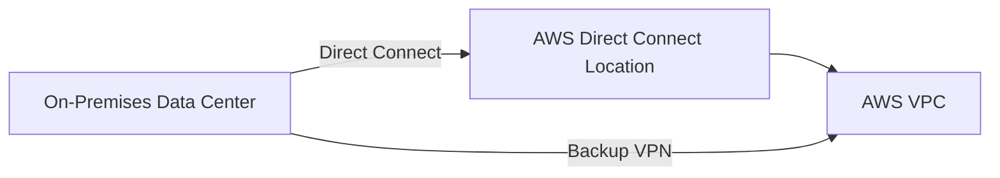

# How to Build a Hybrid Cloud Architecture with AWS

Author: [nawazdhandala](https://github.com/nawazdhandala)

Tags: AWS, Hybrid Cloud, VPN, Direct Connect, Architecture

Description: Build a hybrid cloud architecture connecting on-premises infrastructure to AWS using VPN, Direct Connect, and services designed for hybrid workloads.

---

Not everything moves to the cloud overnight. Legacy systems, compliance requirements, data sovereignty laws, or just practical migration timelines mean most organizations run a hybrid setup for years. The challenge is making on-premises and cloud resources work together as if they were one environment.

AWS has a solid set of services for hybrid architectures. Let's walk through how to connect, extend, and manage a hybrid cloud setup.

## Connectivity Options

The first decision is how to connect your on-premises network to AWS. You have three main options.

### Site-to-Site VPN

The quickest way to get connected. A VPN creates an encrypted tunnel over the public internet between your data center and your AWS VPC.

```typescript
// CDK: Site-to-Site VPN setup
import * as cdk from 'aws-cdk-lib';
import * as ec2 from 'aws-cdk-lib/aws-ec2';

export class HybridStack extends cdk.Stack {
  constructor(scope: cdk.App, id: string) {
    super(scope, id);

    const vpc = new ec2.Vpc(this, 'HybridVpc', {
      maxAzs: 3,
      ipAddresses: ec2.IpAddresses.cidr('10.1.0.0/16'),
    });

    // Virtual Private Gateway (AWS side of the VPN)
    const vpnGateway = vpc.addVpnGateway({
      type: ec2.VpnConnectionType.IPSEC_1,
      amazonSideAsn: 64512,
    });

    // Customer Gateway (your side of the VPN)
    const customerGateway = new ec2.CfnCustomerGateway(this, 'CustomerGW', {
      type: 'ipsec.1',
      bgpAsn: 65000,
      ipAddress: '203.0.113.1', // Your on-premises public IP
    });

    // VPN Connection
    const vpnConnection = new ec2.CfnVPNConnection(this, 'VpnConnection', {
      type: 'ipsec.1',
      customerGatewayId: customerGateway.ref,
      vpnGatewayId: vpnGateway.gatewayId,
      staticRoutesOnly: false, // Use BGP for dynamic routing
      options: {
        tunnelOptions: [
          {
            preSharedKey: 'your-secure-psk-1',
            tunnelInsideCidr: '169.254.10.0/30',
          },
          {
            preSharedKey: 'your-secure-psk-2',
            tunnelInsideCidr: '169.254.10.4/30',
          },
        ],
      },
    });
  }
}
```

VPN gives you up to 1.25 Gbps per tunnel (two tunnels per connection). For most workloads, this is plenty. If you need more bandwidth or lower latency, look at Direct Connect.

### AWS Direct Connect

Direct Connect is a dedicated physical connection between your data center and AWS. It bypasses the internet entirely, giving you consistent low latency and high bandwidth.



Direct Connect takes weeks to provision (you're literally running fiber), but the benefits for hybrid workloads are significant:

- Dedicated bandwidth: 1 Gbps, 10 Gbps, or 100 Gbps
- Consistent latency (no internet variability)
- Lower data transfer costs
- Private connectivity (doesn't traverse the internet)

Always set up a VPN as a backup path in case your Direct Connect link goes down.

### AWS Transit Gateway

When you have multiple VPCs and on-premises locations, Transit Gateway acts as a central hub.

```typescript
// Transit Gateway for hub-and-spoke architecture
const transitGateway = new ec2.CfnTransitGateway(this, 'TransitGateway', {
  amazonSideAsn: 64512,
  autoAcceptSharedAttachments: 'enable',
  defaultRouteTableAssociation: 'enable',
  defaultRouteTablePropagation: 'enable',
  description: 'Central hub for hybrid networking',
});

// Attach VPCs to Transit Gateway
const attachment = new ec2.CfnTransitGatewayAttachment(this, 'VpcAttachment', {
  transitGatewayId: transitGateway.ref,
  vpcId: vpc.vpcId,
  subnetIds: vpc.selectSubnets({
    subnetType: ec2.SubnetType.PRIVATE_WITH_EGRESS,
  }).subnetIds,
});
```

## Hybrid DNS

DNS resolution across environments is critical. AWS Route 53 Resolver handles this.

```typescript
// Route 53 Resolver for hybrid DNS
import * as route53resolver from 'aws-cdk-lib/aws-route53resolver';

// Outbound endpoint: AWS can resolve on-premises DNS names
const outboundEndpoint = new route53resolver.CfnResolverEndpoint(this, 'OutboundDns', {
  direction: 'OUTBOUND',
  ipAddresses: [
    { subnetId: vpc.privateSubnets[0].subnetId },
    { subnetId: vpc.privateSubnets[1].subnetId },
  ],
  securityGroupIds: [dnsSecurityGroup.securityGroupId],
});

// Forward on-premises domain queries to your DNS servers
new route53resolver.CfnResolverRule(this, 'ForwardRule', {
  domainName: 'internal.company.com',
  ruleType: 'FORWARD',
  resolverEndpointId: outboundEndpoint.ref,
  targetIps: [
    { ip: '10.0.1.53', port: '53' }, // On-premises DNS server
    { ip: '10.0.2.53', port: '53' },
  ],
});

// Inbound endpoint: on-premises can resolve AWS DNS names
const inboundEndpoint = new route53resolver.CfnResolverEndpoint(this, 'InboundDns', {
  direction: 'INBOUND',
  ipAddresses: [
    { subnetId: vpc.privateSubnets[0].subnetId },
    { subnetId: vpc.privateSubnets[1].subnetId },
  ],
  securityGroupIds: [dnsSecurityGroup.securityGroupId],
});
```

## Hybrid Storage

### AWS Storage Gateway

Storage Gateway bridges on-premises applications to AWS cloud storage. It supports file, volume, and tape interfaces.

```bash
# Deploy Storage Gateway as a VM on-premises
# Then activate it and create an NFS file share

aws storagegateway create-nfs-file-share \
  --client-token "unique-token" \
  --gateway-arn "arn:aws:storagegateway:us-east-1:123456789:gateway/sgw-12345" \
  --role "arn:aws:iam::123456789:role/StorageGatewayRole" \
  --location-arn "arn:aws:s3:::my-hybrid-bucket" \
  --default-storage-class "S3_STANDARD" \
  --client-list "10.0.0.0/16"
```

On-premises applications mount the NFS share like any network drive. Behind the scenes, files are stored in S3 with local caching for performance.

### DataSync

For bulk data movement between on-premises and AWS, DataSync is faster and more efficient than doing it yourself.

```typescript
// DataSync task for regular data sync
const datasyncTask = new datasync.CfnTask(this, 'SyncTask', {
  sourceLocationArn: onPremLocationArn,
  destinationLocationArn: s3LocationArn,
  options: {
    verifyMode: 'ONLY_FILES_TRANSFERRED',
    overwriteMode: 'ALWAYS',
    transferMode: 'CHANGED',
    logLevel: 'BASIC',
  },
  schedule: {
    scheduleExpression: 'cron(0 */6 * * ? *)', // Every 6 hours
  },
});
```

## Hybrid Identity

Use AWS IAM Identity Center (formerly SSO) with your on-premises Active Directory for unified identity management.

```typescript
// Connect to on-premises AD through AWS Managed Microsoft AD
const directory = new directoryservice.CfnMicrosoftAD(this, 'ManagedAD', {
  name: 'corp.example.com',
  password: 'SecurePassword123!', // Use Secrets Manager in production
  vpcSettings: {
    vpcId: vpc.vpcId,
    subnetIds: [
      vpc.privateSubnets[0].subnetId,
      vpc.privateSubnets[1].subnetId,
    ],
  },
  edition: 'Standard',
});
```

## Monitoring a Hybrid Environment

Monitoring hybrid setups is tricky because you need visibility into both environments. CloudWatch Agent runs on both on-premises and AWS instances.

```bash
# Install CloudWatch Agent on on-premises servers
wget https://s3.amazonaws.com/amazoncloudwatch-agent/linux/amd64/latest/AmazonCloudWatchAgent.zip
unzip AmazonCloudWatchAgent.zip
sudo ./install.sh
```

```json
{
  "metrics": {
    "namespace": "HybridInfra/OnPremises",
    "metrics_collected": {
      "cpu": {
        "measurement": ["cpu_usage_idle", "cpu_usage_user", "cpu_usage_system"],
        "metrics_collection_interval": 60
      },
      "mem": {
        "measurement": ["mem_used_percent"],
        "metrics_collection_interval": 60
      },
      "disk": {
        "measurement": ["used_percent"],
        "resources": ["/"],
        "metrics_collection_interval": 60
      }
    }
  }
}
```

For a comprehensive monitoring approach, check out our guide on [building a logging and monitoring stack on AWS](https://oneuptime.com/blog/post/build-logging-and-monitoring-stack-on-aws/view).

## Security Considerations

Hybrid architectures expand your attack surface. Some important security measures:

- Encrypt all traffic between on-premises and AWS (VPN or Direct Connect with MACsec)
- Use security groups and NACLs to restrict access between environments
- Implement least-privilege IAM policies for hybrid resources
- Use AWS Systems Manager for patch management across both environments
- Monitor network traffic with VPC Flow Logs

## Summary

Building a hybrid cloud architecture on AWS is about connecting networks, extending services, and unifying management across environments. Start with VPN for quick connectivity, graduate to Direct Connect for production workloads, and use Transit Gateway when you outgrow point-to-point connections. Layer on hybrid DNS, storage, and identity to make the two environments feel like one. The goal is a smooth migration path where you can move workloads at your own pace.
