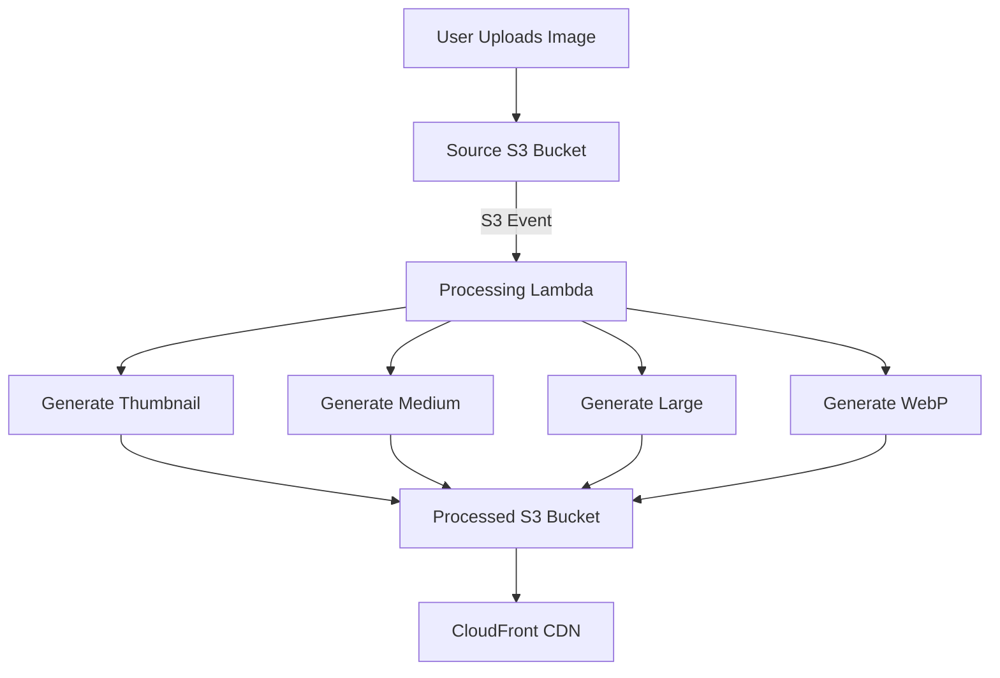

# How to Build an Image Processing Pipeline on AWS with Lambda

Author: [nawazdhandala](https://github.com/nawazdhandala)

Tags: AWS, Lambda, S3, Image Processing, Serverless

Description: Build a serverless image processing pipeline on AWS using Lambda, S3 triggers, and Sharp to resize, optimize, and transform images automatically on upload.

---

Users upload images. You need thumbnails, multiple sizes, optimized versions for web, maybe watermarks. Doing this synchronously during upload makes your API slow. Doing it on a server you manage means worrying about scaling, memory, and disk space. A serverless pipeline solves all of this.

In this guide, we'll build an image processing pipeline that automatically resizes and optimizes images when they're uploaded to S3, using Lambda and the Sharp library.

## What We're Building

When an image gets uploaded to the source bucket, the pipeline automatically generates:
- A thumbnail (150x150)
- A medium size (600x600)
- A large size (1200x1200)
- A WebP version for modern browsers



## Setting Up the Lambda Layer

Sharp is a Node.js library for image processing. It uses native binaries, so you need a Lambda layer built for the Amazon Linux environment.

```bash
# Build the Sharp layer for Lambda (Amazon Linux 2)
mkdir -p sharp-layer/nodejs
cd sharp-layer/nodejs
npm init -y
npm install --platform=linux --arch=x64 sharp
cd ..
zip -r sharp-layer.zip nodejs/
```

Upload this layer to Lambda, or use CDK to manage it.

```typescript
// CDK stack setup
import * as cdk from 'aws-cdk-lib';
import * as lambda from 'aws-cdk-lib/aws-lambda';
import * as s3 from 'aws-cdk-lib/aws-s3';
import * as s3n from 'aws-cdk-lib/aws-s3-notifications';

export class ImagePipelineStack extends cdk.Stack {
  constructor(scope: cdk.App, id: string) {
    super(scope, id);

    // Source and destination buckets
    const sourceBucket = new s3.Bucket(this, 'SourceBucket', {
      cors: [{
        allowedMethods: [s3.HttpMethod.PUT, s3.HttpMethod.POST],
        allowedOrigins: ['*'],
        allowedHeaders: ['*'],
      }],
    });

    const processedBucket = new s3.Bucket(this, 'ProcessedBucket', {
      publicReadAccess: false,
    });

    // Sharp Lambda layer
    const sharpLayer = new lambda.LayerVersion(this, 'SharpLayer', {
      code: lambda.Code.fromAsset('layers/sharp-layer.zip'),
      compatibleRuntimes: [lambda.Runtime.NODEJS_18_X],
      description: 'Sharp image processing library',
    });

    // Image processing Lambda
    const processorFunction = new lambda.Function(this, 'ImageProcessor', {
      runtime: lambda.Runtime.NODEJS_18_X,
      handler: 'index.handler',
      code: lambda.Code.fromAsset('lambda/image-processor'),
      layers: [sharpLayer],
      timeout: cdk.Duration.minutes(2),
      memorySize: 1536, // Image processing needs decent memory
      environment: {
        PROCESSED_BUCKET: processedBucket.bucketName,
      },
    });

    // Grant permissions
    sourceBucket.grantRead(processorFunction);
    processedBucket.grantWrite(processorFunction);

    // Trigger on image uploads
    sourceBucket.addEventNotification(
      s3.EventType.OBJECT_CREATED,
      new s3n.LambdaDestination(processorFunction),
      { suffix: '.jpg' }
    );
    sourceBucket.addEventNotification(
      s3.EventType.OBJECT_CREATED,
      new s3n.LambdaDestination(processorFunction),
      { suffix: '.png' }
    );
  }
}
```

## The Image Processing Lambda

Here's the core Lambda function that does the actual image processing.

```javascript
// lambda/image-processor/index.js
const { S3Client, GetObjectCommand, PutObjectCommand } = require('@aws-sdk/client-s3');
const sharp = require('sharp');

const s3Client = new S3Client({});
const PROCESSED_BUCKET = process.env.PROCESSED_BUCKET;

// Define the output sizes we want
const SIZES = [
  { name: 'thumbnail', width: 150, height: 150, fit: 'cover' },
  { name: 'medium', width: 600, height: 600, fit: 'inside' },
  { name: 'large', width: 1200, height: 1200, fit: 'inside' },
];

exports.handler = async (event) => {
  const record = event.Records[0];
  const bucket = record.s3.bucket.name;
  const key = decodeURIComponent(record.s3.object.key.replace(/\+/g, ' '));

  console.log(`Processing image: s3://${bucket}/${key}`);

  // Download the original image
  const { Body, ContentType } = await s3Client.send(
    new GetObjectCommand({ Bucket: bucket, Key: key })
  );

  const imageBuffer = Buffer.from(await Body.transformToByteArray());

  // Get image metadata
  const metadata = await sharp(imageBuffer).metadata();
  console.log(`Original: ${metadata.width}x${metadata.height}, format: ${metadata.format}`);

  // Strip the extension from the key for output naming
  const baseName = key.replace(/\.[^.]+$/, '');
  const extension = key.match(/\.[^.]+$/)[0];

  const uploadPromises = [];

  // Generate each size variant
  for (const size of SIZES) {
    const resized = await sharp(imageBuffer)
      .resize(size.width, size.height, {
        fit: size.fit,
        withoutEnlargement: true, // Don't upscale small images
      })
      .jpeg({ quality: 85, progressive: true })
      .toBuffer();

    uploadPromises.push(
      s3Client.send(new PutObjectCommand({
        Bucket: PROCESSED_BUCKET,
        Key: `${size.name}/${baseName}${extension}`,
        Body: resized,
        ContentType: 'image/jpeg',
        CacheControl: 'max-age=31536000', // Cache for 1 year
      }))
    );

    console.log(`Generated ${size.name}: ${size.width}x${size.height}`);
  }

  // Generate WebP version for modern browsers
  const webpBuffer = await sharp(imageBuffer)
    .resize(1200, 1200, { fit: 'inside', withoutEnlargement: true })
    .webp({ quality: 80 })
    .toBuffer();

  uploadPromises.push(
    s3Client.send(new PutObjectCommand({
      Bucket: PROCESSED_BUCKET,
      Key: `webp/${baseName}.webp`,
      Body: webpBuffer,
      ContentType: 'image/webp',
      CacheControl: 'max-age=31536000',
    }))
  );

  // Upload all variants in parallel
  await Promise.all(uploadPromises);

  console.log(`Processed ${key}: ${uploadPromises.length} variants generated`);

  return {
    statusCode: 200,
    original: key,
    variants: SIZES.map(s => s.name).concat(['webp']),
  };
};
```

## Adding Watermarks

If you need to add watermarks to images, Sharp makes it straightforward with composite operations.

```javascript
// Add a watermark to processed images
async function addWatermark(imageBuffer, watermarkPath) {
  // Load the watermark image
  const watermark = await sharp(watermarkPath)
    .resize(200, 50, { fit: 'inside' })
    .toBuffer();

  // Composite the watermark onto the image
  return sharp(imageBuffer)
    .composite([{
      input: watermark,
      gravity: 'southeast', // Bottom-right corner
      blend: 'over',
    }])
    .toBuffer();
}
```

## Handling EXIF Data

Photos from cameras contain EXIF data with rotation info. If you don't handle this, images can appear sideways.

```javascript
// Sharp auto-rotates based on EXIF by default, but you can control it
const processed = await sharp(imageBuffer)
  .rotate() // Auto-rotate based on EXIF orientation
  .resize(600, 600, { fit: 'inside' })
  .jpeg({ quality: 85 })
  .withMetadata({ orientation: undefined }) // Strip orientation after rotating
  .toBuffer();
```

## Serving Through CloudFront

Put CloudFront in front of your processed bucket for fast delivery worldwide.

```typescript
// CloudFront distribution for the processed images
const distribution = new cloudfront.Distribution(this, 'ImageCDN', {
  defaultBehavior: {
    origin: new origins.S3Origin(processedBucket),
    viewerProtocolPolicy: cloudfront.ViewerProtocolPolicy.REDIRECT_TO_HTTPS,
    cachePolicy: cloudfront.CachePolicy.CACHING_OPTIMIZED,
  },
});
```

With CloudFront, you can also use Lambda@Edge to serve the right format based on the client's `Accept` header - WebP for browsers that support it, JPEG for the rest.

## Error Handling

Image processing can fail in many ways - corrupted files, unsupported formats, files that aren't actually images. Wrap your handler properly.

```javascript
// Robust error handling wrapper
exports.handler = async (event) => {
  const record = event.Records[0];
  const key = decodeURIComponent(record.s3.object.key.replace(/\+/g, ' '));

  try {
    await processImage(record);
  } catch (error) {
    console.error(`Failed to process ${key}:`, error.message);

    // Move the problematic file to an error prefix
    await s3Client.send(new CopyObjectCommand({
      Bucket: process.env.ERROR_BUCKET,
      CopySource: `${record.s3.bucket.name}/${key}`,
      Key: `errors/${key}`,
    }));

    // Don't throw - we don't want retries for corrupted files
    return { statusCode: 200, error: error.message };
  }
};
```

## Performance Tips

Lambda memory directly affects CPU allocation. For image processing, 1536 MB is a good starting point. You can benchmark different settings using [AWS Lambda Power Tuning](https://github.com/alexcasalboni/aws-lambda-power-tuning) to find the sweet spot between speed and cost.

A few other things that help performance:

- Process variants in parallel with `Promise.all()`
- Use `withoutEnlargement: true` to skip unnecessary upscaling
- Set appropriate memory based on your largest expected image
- Use `/tmp` storage for intermediate files if needed (up to 10 GB)

For monitoring your pipeline in production, you'll want visibility into processing times and error rates. Our guide on [building a logging and monitoring stack on AWS](https://oneuptime.com/blog/post/build-logging-and-monitoring-stack-on-aws/view) covers setting up the right CloudWatch metrics and alarms.

## Summary

A serverless image processing pipeline on AWS gives you automatic scaling, pay-per-use pricing, and zero server management. S3 triggers kick off processing, Lambda handles the actual work with Sharp, and CloudFront delivers the results. It scales from zero to thousands of images per minute without any manual intervention. Start with the basic resize pipeline and add features like watermarking, format conversion, and metadata extraction as your needs grow.
