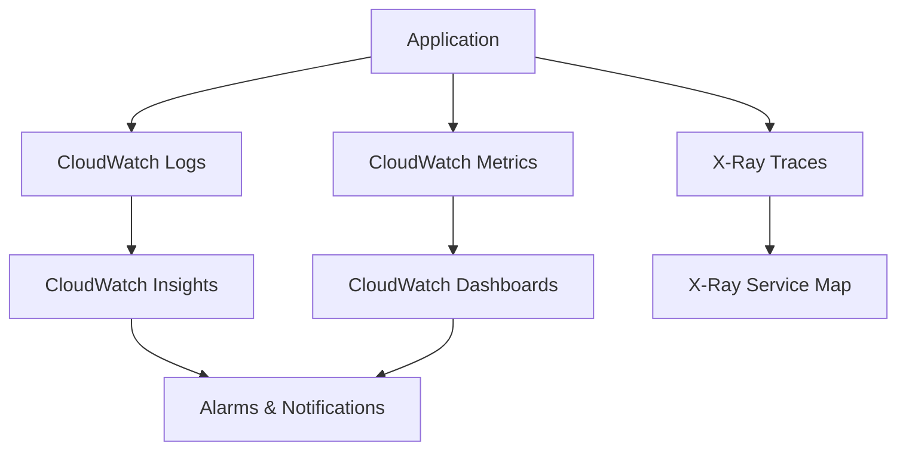

# How to Build a Logging and Monitoring Stack on AWS

Author: [nawazdhandala](https://github.com/nawazdhandala)

Tags: AWS, CloudWatch, Monitoring, Logging, Observability

Description: Build a comprehensive logging and monitoring stack on AWS using CloudWatch, X-Ray, and custom metrics to gain full observability into your applications.

---

You can't fix what you can't see. When something goes wrong in production - and it will - you need logs to understand what happened, metrics to see the trend, and traces to follow a request through your system. AWS has all the pieces for a solid observability stack. The trick is putting them together in a way that actually helps you find problems fast.

## The Three Pillars

Observability rests on three pillars: logs, metrics, and traces. You need all three.

- **Logs** tell you what happened ("Error: connection refused to database at 3:42 AM")
- **Metrics** tell you the trend ("Database connection errors increased 500% in the last hour")
- **Traces** tell you the path ("This request spent 4 seconds waiting for the database, then timed out")



## Structured Logging

The biggest mistake with logging is using unstructured text. Parsing free-text logs at scale is painful. Use structured JSON logging from the start.

```javascript
// logger.js - Structured JSON logger
class Logger {
  constructor(context = {}) {
    this.context = context;
  }

  log(level, message, data = {}) {
    const entry = {
      timestamp: new Date().toISOString(),
      level,
      message,
      ...this.context,
      ...data,
    };
    console.log(JSON.stringify(entry));
  }

  info(message, data) { this.log('INFO', message, data); }
  warn(message, data) { this.log('WARN', message, data); }
  error(message, data) { this.log('ERROR', message, data); }

  // Create a child logger with additional context
  child(context) {
    return new Logger({ ...this.context, ...context });
  }
}

// Usage
const logger = new Logger({ service: 'order-service', version: '1.2.3' });

exports.handler = async (event) => {
  const requestLogger = logger.child({
    requestId: event.requestContext?.requestId,
    userId: event.requestContext?.authorizer?.claims?.sub,
  });

  requestLogger.info('Processing order', { orderId: 'ORD-123', items: 3 });

  try {
    const result = await processOrder(event);
    requestLogger.info('Order processed successfully', {
      orderId: 'ORD-123',
      duration: result.duration,
    });
    return { statusCode: 200, body: JSON.stringify(result) };
  } catch (error) {
    requestLogger.error('Order processing failed', {
      orderId: 'ORD-123',
      error: error.message,
      stack: error.stack,
    });
    return { statusCode: 500, body: JSON.stringify({ error: 'Internal error' }) };
  }
};
```

## CloudWatch Log Groups and Retention

Lambda creates log groups automatically, but you should manage them explicitly for cost control.

```typescript
// CDK: Managed log groups with retention
import * as logs from 'aws-cdk-lib/aws-logs';

const logGroup = new logs.LogGroup(this, 'AppLogs', {
  logGroupName: '/app/order-service',
  retention: logs.RetentionDays.THIRTY_DAYS,  // Don't keep logs forever
  removalPolicy: cdk.RemovalPolicy.DESTROY,
});

// Attach to Lambda function
const orderFunction = new lambda.Function(this, 'OrderFunction', {
  runtime: lambda.Runtime.NODEJS_18_X,
  handler: 'index.handler',
  code: lambda.Code.fromAsset('lambda'),
  logGroup,
});
```

## CloudWatch Insights Queries

CloudWatch Logs Insights lets you query structured logs with a SQL-like syntax. These queries are worth saving.

```
# Find all errors in the last hour
fields @timestamp, @message, level, error, requestId
| filter level = "ERROR"
| sort @timestamp desc
| limit 50

# Calculate error rate per minute
filter level = "ERROR" or level = "INFO"
| stats count(*) as total,
        sum(level = "ERROR") as errors,
        (sum(level = "ERROR") / count(*)) * 100 as error_rate
  by bin(5m) as time_bucket

# Slowest requests
fields @timestamp, requestId, duration, path
| filter duration > 1000
| sort duration desc
| limit 20

# Top errors by message
filter level = "ERROR"
| stats count(*) as count by error
| sort count desc
| limit 10
```

## Custom Metrics

CloudWatch built-in metrics cover infrastructure. For application-level metrics, publish custom ones.

```javascript
// Publish custom metrics using CloudWatch Embedded Metric Format (EMF)
const { createMetricsLogger, Unit } = require('aws-embedded-metrics');

exports.handler = async (event) => {
  const metrics = createMetricsLogger();

  // Set dimensions for filtering
  metrics.setDimensions({ Service: 'OrderService', Environment: 'production' });

  const start = Date.now();
  try {
    const result = await processOrder(event);

    // Track successful order metrics
    metrics.putMetric('OrderProcessingTime', Date.now() - start, Unit.Milliseconds);
    metrics.putMetric('OrderValue', result.total, Unit.None);
    metrics.putMetric('OrdersProcessed', 1, Unit.Count);
    metrics.putMetric('OrderErrors', 0, Unit.Count);

    await metrics.flush();
    return result;
  } catch (error) {
    metrics.putMetric('OrderProcessingTime', Date.now() - start, Unit.Milliseconds);
    metrics.putMetric('OrderErrors', 1, Unit.Count);
    await metrics.flush();
    throw error;
  }
};
```

EMF is the recommended approach for Lambda because it's batched and efficient. For EC2 or ECS, use the CloudWatch agent.

## Distributed Tracing with X-Ray

X-Ray traces requests as they flow through your system. Instrument your Lambda functions to see the full request path.

```javascript
// Enable X-Ray tracing in Lambda
const AWSXRay = require('aws-xray-sdk-core');
const AWS = AWSXRay.captureAWS(require('aws-sdk'));

// X-Ray automatically captures AWS SDK calls
// For HTTP calls, wrap the client
const https = AWSXRay.captureHTTPs(require('https'));

exports.handler = async (event) => {
  // Create a subsegment for custom work
  const segment = AWSXRay.getSegment();
  const subsegment = segment.addNewSubsegment('processOrder');

  try {
    subsegment.addAnnotation('orderId', event.orderId);
    subsegment.addMetadata('orderItems', event.items);

    // AWS SDK calls are automatically traced
    const dbResult = await dynamoClient.send(new PutItemCommand({...}));

    // HTTP calls are also traced
    const paymentResult = await callPaymentService(event);

    subsegment.close();
    return { success: true };
  } catch (error) {
    subsegment.addError(error);
    subsegment.close();
    throw error;
  }
};
```

Enable X-Ray in your CDK stack.

```typescript
// Enable X-Ray tracing
const orderFunction = new lambda.Function(this, 'OrderFunction', {
  runtime: lambda.Runtime.NODEJS_18_X,
  handler: 'index.handler',
  code: lambda.Code.fromAsset('lambda'),
  tracing: lambda.Tracing.ACTIVE,  // Enable X-Ray
});

// Enable X-Ray on API Gateway
const api = new apigateway.RestApi(this, 'Api', {
  deployOptions: {
    tracingEnabled: true,
  },
});
```

## CloudWatch Dashboards

Build dashboards that give you a quick health overview.

```typescript
// CDK: Operational dashboard
const dashboard = new cloudwatch.Dashboard(this, 'ServiceDashboard', {
  dashboardName: 'OrderService-Dashboard',
});

dashboard.addWidgets(
  // Row 1: Key business metrics
  new cloudwatch.GraphWidget({
    title: 'Orders Per Minute',
    left: [new cloudwatch.Metric({
      namespace: 'OrderService',
      metricName: 'OrdersProcessed',
      statistic: 'Sum',
      period: cdk.Duration.minutes(1),
    })],
    width: 12,
  }),
  new cloudwatch.GraphWidget({
    title: 'Error Rate',
    left: [new cloudwatch.MathExpression({
      expression: 'errors / (orders + errors) * 100',
      usingMetrics: {
        errors: new cloudwatch.Metric({
          namespace: 'OrderService',
          metricName: 'OrderErrors',
          statistic: 'Sum',
          period: cdk.Duration.minutes(5),
        }),
        orders: new cloudwatch.Metric({
          namespace: 'OrderService',
          metricName: 'OrdersProcessed',
          statistic: 'Sum',
          period: cdk.Duration.minutes(5),
        }),
      },
    })],
    width: 12,
  }),

  // Row 2: Performance
  new cloudwatch.GraphWidget({
    title: 'Processing Latency (p50, p90, p99)',
    left: [
      new cloudwatch.Metric({
        namespace: 'OrderService',
        metricName: 'OrderProcessingTime',
        statistic: 'p50',
      }),
      new cloudwatch.Metric({
        namespace: 'OrderService',
        metricName: 'OrderProcessingTime',
        statistic: 'p90',
      }),
      new cloudwatch.Metric({
        namespace: 'OrderService',
        metricName: 'OrderProcessingTime',
        statistic: 'p99',
      }),
    ],
    width: 12,
  }),
  new cloudwatch.GraphWidget({
    title: 'Lambda Concurrent Executions',
    left: [orderFunction.metricInvocations()],
    right: [orderFunction.metricErrors()],
    width: 12,
  }),
);
```

## Alarms and Notifications

Set up alarms for conditions that need human attention.

```typescript
// Critical alarms
const errorAlarm = new cloudwatch.Alarm(this, 'HighErrorRate', {
  metric: new cloudwatch.MathExpression({
    expression: 'errors / invocations * 100',
    usingMetrics: {
      errors: orderFunction.metricErrors({ period: cdk.Duration.minutes(5) }),
      invocations: orderFunction.metricInvocations({ period: cdk.Duration.minutes(5) }),
    },
  }),
  threshold: 5,  // Alert if error rate exceeds 5%
  evaluationPeriods: 2,
  comparisonOperator: cloudwatch.ComparisonOperator.GREATER_THAN_THRESHOLD,
  alarmDescription: 'Order service error rate above 5%',
  treatMissingData: cloudwatch.TreatMissingData.NOT_BREACHING,
});

// High latency alarm
new cloudwatch.Alarm(this, 'HighLatency', {
  metric: new cloudwatch.Metric({
    namespace: 'OrderService',
    metricName: 'OrderProcessingTime',
    statistic: 'p99',
    period: cdk.Duration.minutes(5),
  }),
  threshold: 5000,  // 5 seconds
  evaluationPeriods: 3,
  alarmDescription: 'P99 latency above 5 seconds',
});

// Send alarms to SNS
const alarmTopic = new sns.Topic(this, 'AlarmTopic');
alarmTopic.addSubscription(new snsSubscriptions.EmailSubscription('ops@company.com'));
errorAlarm.addAlarmAction(new cloudwatchActions.SnsAction(alarmTopic));
```

## Log Aggregation Across Services

When you have multiple services, subscribe log groups to a central processing function or Kinesis stream.

```typescript
// Centralized log processing
const logProcessingFunction = new lambda.Function(this, 'LogProcessor', {
  runtime: lambda.Runtime.NODEJS_18_X,
  handler: 'log-processor.handler',
  code: lambda.Code.fromAsset('lambda'),
});

// Subscribe multiple log groups to the processor
new logs.SubscriptionFilter(this, 'OrderServiceLogs', {
  logGroup: orderLogGroup,
  filterPattern: logs.FilterPattern.literal('ERROR'),
  destination: new logsDestinations.LambdaDestination(logProcessingFunction),
});

new logs.SubscriptionFilter(this, 'PaymentServiceLogs', {
  logGroup: paymentLogGroup,
  filterPattern: logs.FilterPattern.literal('ERROR'),
  destination: new logsDestinations.LambdaDestination(logProcessingFunction),
});
```

For a deeper dive into centralized log aggregation, check out our guide on [building a centralized log aggregation system on AWS](https://oneuptime.com/blog/post/build-centralized-log-aggregation-system-on-aws/view).

## Summary

A production monitoring stack on AWS combines structured logging in CloudWatch Logs, custom application metrics with EMF, distributed tracing with X-Ray, dashboards for visualization, and alarms for alerting. Start with structured logging and basic alarms. Add custom metrics for business-level visibility. Layer on tracing when you need to debug cross-service issues. The investment pays off the first time you diagnose a production issue in minutes instead of hours.
