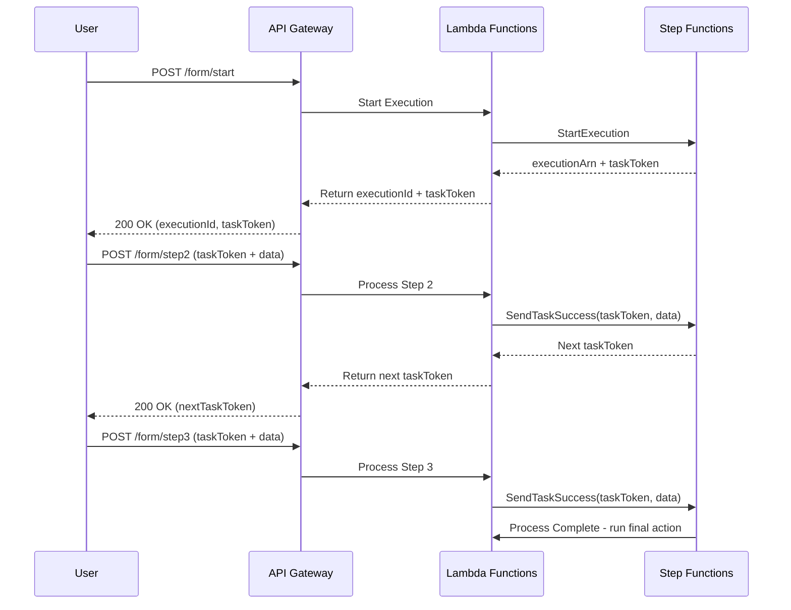

# How to Build Multi-Step Forms with Step Functions and API Gateway

Author: [nawazdhandala](https://github.com/nawazdhandala)

Tags: AWS, Step Functions, API Gateway, Serverless, Workflow, Forms

Description: Build multi-step form workflows using AWS Step Functions and API Gateway with state persistence and validation at each step

---

Multi-step forms are everywhere. Insurance applications, job applications, onboarding wizards, checkout flows. They all share the same backend challenge: you need to persist state across multiple submissions, validate at each step, and handle users who abandon partway through or come back days later.

Most teams build this with a database table to track form state and a bunch of API endpoints to handle each step. It works, but it is messy. AWS Step Functions offers a cleaner approach. Each form submission advances a state machine execution, the state is managed for you, and you can add timeouts, retries, and branching logic declaratively.

In this guide, you will build a multi-step form backend using Step Functions with API Gateway as the entry point.

## Architecture Overview

The pattern uses Step Functions' callback pattern. Each step pauses the execution and waits for the user to submit the next form section. API Gateway receives the submission and sends a task token to resume the execution.



## Step 1: Define the State Machine

The state machine defines your form's flow. Each step is a Task state with a callback pattern that waits for external input.

```json
{
  "Comment": "Multi-step insurance application form",
  "StartAt": "CollectPersonalInfo",
  "States": {
    "CollectPersonalInfo": {
      "Type": "Task",
      "Resource": "arn:aws:states:::lambda:invoke.waitForTaskToken",
      "Parameters": {
        "FunctionName": "form-step-handler",
        "Payload": {
          "step": "personal_info",
          "taskToken.$": "$$.Task.Token",
          "formData.$": "$"
        }
      },
      "TimeoutSeconds": 86400,
      "Next": "ValidatePersonalInfo"
    },
    "ValidatePersonalInfo": {
      "Type": "Task",
      "Resource": "arn:aws:lambda:us-east-1:123456789012:function:validate-personal-info",
      "Next": "CollectAddressInfo",
      "Catch": [
        {
          "ErrorEquals": ["ValidationError"],
          "Next": "CollectPersonalInfo"
        }
      ]
    },
    "CollectAddressInfo": {
      "Type": "Task",
      "Resource": "arn:aws:states:::lambda:invoke.waitForTaskToken",
      "Parameters": {
        "FunctionName": "form-step-handler",
        "Payload": {
          "step": "address_info",
          "taskToken.$": "$$.Task.Token",
          "formData.$": "$"
        }
      },
      "TimeoutSeconds": 86400,
      "Next": "CollectInsuranceDetails"
    },
    "CollectInsuranceDetails": {
      "Type": "Task",
      "Resource": "arn:aws:states:::lambda:invoke.waitForTaskToken",
      "Parameters": {
        "FunctionName": "form-step-handler",
        "Payload": {
          "step": "insurance_details",
          "taskToken.$": "$$.Task.Token",
          "formData.$": "$"
        }
      },
      "TimeoutSeconds": 86400,
      "Next": "ReviewAndSubmit"
    },
    "ReviewAndSubmit": {
      "Type": "Task",
      "Resource": "arn:aws:lambda:us-east-1:123456789012:function:submit-application",
      "End": true
    }
  }
}
```

Key design decisions here:

- **waitForTaskToken**: Each collection step pauses and waits for the user to submit data via a task token callback.
- **TimeoutSeconds**: 86400 (24 hours) gives users a full day to complete each step. Adjust based on your requirements.
- **Catch blocks**: Validation failures loop back to the same step so the user can correct their input.

## Step 2: Create the API Endpoints

You need two main endpoints: one to start a new form and one to submit data for each step.

```python
# start_form.py - Initialize a new form execution
import boto3
import json
import uuid

sfn = boto3.client('stepfunctions')

STATE_MACHINE_ARN = 'arn:aws:states:us-east-1:123456789012:stateMachine:insurance-form'

def lambda_handler(event, context):
    """Start a new multi-step form workflow."""

    form_id = str(uuid.uuid4())

    # Start the Step Functions execution
    response = sfn.start_execution(
        stateMachineArn=STATE_MACHINE_ARN,
        name=form_id,
        input=json.dumps({
            'formId': form_id,
            'startedAt': context.function_name,
            'steps': {}
        })
    )

    return {
        'statusCode': 200,
        'body': json.dumps({
            'formId': form_id,
            'executionArn': response['executionArn'],
            'message': 'Form started. Waiting for personal info submission.'
        })
    }
```

```python
# form_step_handler.py - Lambda that runs when a step is reached
import boto3
import json

dynamodb = boto3.resource('dynamodb')
table = dynamodb.Table('form-task-tokens')

def lambda_handler(event, context):
    """Store the task token for the current step."""

    payload = event.get('Payload', event)
    step = payload['step']
    task_token = payload['taskToken']
    form_data = payload['formData']
    form_id = form_data.get('formId')

    # Store the task token so the submit endpoint can find it
    table.put_item(Item={
        'formId': form_id,
        'currentStep': step,
        'taskToken': task_token,
        'formData': json.dumps(form_data),
    })

    print(f"Form {form_id} waiting at step: {step}")

    # This function does not return to Step Functions
    # The execution stays paused until SendTaskSuccess is called
```

```python
# submit_step.py - Handle form step submissions from the user
import boto3
import json

sfn = boto3.client('stepfunctions')
dynamodb = boto3.resource('dynamodb')
table = dynamodb.Table('form-task-tokens')

def lambda_handler(event, context):
    """Process a form step submission and advance the workflow."""

    body = json.loads(event.get('body', '{}'))
    form_id = body.get('formId')
    step_data = body.get('data', {})

    # Look up the current task token for this form
    response = table.get_item(Key={'formId': form_id})
    item = response.get('Item')

    if not item:
        return {
            'statusCode': 404,
            'body': json.dumps({'error': 'Form not found or already completed'})
        }

    task_token = item['taskToken']
    current_step = item['currentStep']
    form_data = json.loads(item['formData'])

    # Merge the new step data into the accumulated form data
    form_data['steps'][current_step] = step_data

    # Validate the step data
    errors = validate_step(current_step, step_data)
    if errors:
        # Send failure to loop back
        sfn.send_task_failure(
            taskToken=task_token,
            error='ValidationError',
            cause=json.dumps(errors)
        )
        return {
            'statusCode': 400,
            'body': json.dumps({'errors': errors})
        }

    # Advance the workflow by sending task success
    sfn.send_task_success(
        taskToken=task_token,
        output=json.dumps(form_data)
    )

    return {
        'statusCode': 200,
        'body': json.dumps({
            'message': f'Step {current_step} completed',
            'formId': form_id
        })
    }


def validate_step(step, data):
    """Validate form data for a specific step."""
    errors = []

    if step == 'personal_info':
        if not data.get('firstName'):
            errors.append('First name is required')
        if not data.get('lastName'):
            errors.append('Last name is required')
        if not data.get('email'):
            errors.append('Email is required')
        if not data.get('dateOfBirth'):
            errors.append('Date of birth is required')

    elif step == 'address_info':
        if not data.get('street'):
            errors.append('Street address is required')
        if not data.get('city'):
            errors.append('City is required')
        if not data.get('state'):
            errors.append('State is required')
        if not data.get('zipCode'):
            errors.append('ZIP code is required')

    elif step == 'insurance_details':
        if not data.get('coverageType'):
            errors.append('Coverage type is required')
        if not data.get('coverageAmount'):
            errors.append('Coverage amount is required')

    return errors
```

## Step 3: Set Up API Gateway Routes

Create an HTTP API with routes for starting and submitting forms.

```bash
# Create the HTTP API
aws apigatewayv2 create-api \
  --name insurance-form-api \
  --protocol-type HTTP

# Create routes
# POST /form/start -> start_form Lambda
# POST /form/submit -> submit_step Lambda
# GET /form/{formId}/status -> get_form_status Lambda
```

## Step 4: Handle Abandoned Forms

Users abandon forms all the time. The `TimeoutSeconds` in your state machine handles this gracefully. When a step times out, you can route to a cleanup state.

```json
{
  "CollectPersonalInfo": {
    "Type": "Task",
    "Resource": "arn:aws:states:::lambda:invoke.waitForTaskToken",
    "Parameters": {
      "FunctionName": "form-step-handler",
      "Payload": {
        "step": "personal_info",
        "taskToken.$": "$$.Task.Token",
        "formData.$": "$"
      }
    },
    "TimeoutSeconds": 86400,
    "Next": "ValidatePersonalInfo",
    "Catch": [
      {
        "ErrorEquals": ["States.Timeout"],
        "Next": "HandleAbandonment"
      }
    ]
  },
  "HandleAbandonment": {
    "Type": "Task",
    "Resource": "arn:aws:lambda:us-east-1:123456789012:function:handle-abandoned-form",
    "End": true
  }
}
```

The abandonment handler can send reminder emails, clean up partial data, or log analytics.

## Step 5: Add a Status Endpoint

Let users check their form progress.

```python
# get_form_status.py - Check form completion status
import boto3
import json

sfn = boto3.client('stepfunctions')

def lambda_handler(event, context):
    """Get the current status of a form execution."""

    form_id = event['pathParameters']['formId']
    execution_arn = f"arn:aws:states:us-east-1:123456789012:execution:insurance-form:{form_id}"

    try:
        response = sfn.describe_execution(executionArn=execution_arn)

        return {
            'statusCode': 200,
            'body': json.dumps({
                'formId': form_id,
                'status': response['status'],
                'startDate': str(response['startDate']),
                'currentInput': json.loads(response.get('input', '{}')),
            })
        }
    except sfn.exceptions.ExecutionDoesNotExist:
        return {
            'statusCode': 404,
            'body': json.dumps({'error': 'Form not found'})
        }
```

## Cost Considerations

Step Functions Standard Workflows charge per state transition. For a 4-step form, each submission triggers roughly 2-3 state transitions (task start, validation, next task). At $0.025 per 1,000 transitions, 10,000 form completions cost about $1.50 in Step Functions charges.

If cost is a concern, consider Step Functions Express Workflows for forms that must be completed in a single session (under 5 minutes).

For monitoring your form workflow, check out our guide on [monitoring API endpoints with CloudWatch Synthetics](https://oneuptime.com/blog/post/monitor-api-endpoints-with-cloudwatch-synthetics/view).

## Wrapping Up

Step Functions provides a natural fit for multi-step form workflows. Each step maps to a state, validation logic is explicit, timeouts handle abandonment, and the entire form state is managed by AWS. You do not need to build your own state machine in application code. The callback pattern with task tokens is the key enabler - it lets your workflow pause indefinitely until the user submits the next step. Add API Gateway in front, and you have a fully serverless form backend.
