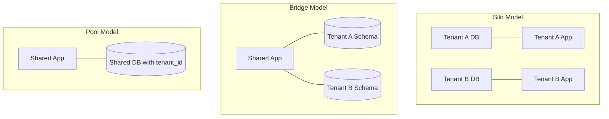

# How to Build a Multi-Tenant SaaS Application on AWS

Author: [nawazdhandala](https://github.com/nawazdhandala)

Tags: AWS, SaaS, Multi-Tenant, Architecture

Description: Design and implement a multi-tenant SaaS application on AWS with tenant isolation, shared infrastructure, authentication, billing integration, and scaling strategies.

---

Building a multi-tenant SaaS application means serving multiple customers from a single codebase and infrastructure while keeping their data isolated. It's one of the trickier architectural challenges, but AWS provides solid primitives for every piece of the puzzle. Let's walk through the key decisions and implementation details.

## Tenancy Models

Before writing any code, you need to decide on your tenancy model. There are three main approaches:



**Silo**: Each tenant gets their own database and potentially their own compute. Maximum isolation but highest cost and operational overhead.

**Bridge**: Shared application layer, separate database schemas per tenant. Good balance of isolation and efficiency.

**Pool**: Shared everything with a `tenant_id` column. Most cost-effective but requires careful access control.

For most SaaS startups, start with the pool model and migrate to bridge or silo as specific tenants need it (usually for compliance or performance reasons).

## Authentication with Cognito

Use Amazon Cognito for multi-tenant authentication. Each user belongs to a tenant, and the tenant ID is embedded in their JWT token.

Create a Cognito User Pool:

```bash
# Create the user pool
aws cognito-idp create-user-pool \
  --pool-name saas-app-users \
  --auto-verified-attributes email \
  --schema '[
    {"Name": "tenant_id", "AttributeDataType": "String", "Mutable": true, "Required": false},
    {"Name": "tenant_role", "AttributeDataType": "String", "Mutable": true, "Required": false}
  ]' \
  --policies '{
    "PasswordPolicy": {
      "MinimumLength": 12,
      "RequireUppercase": true,
      "RequireLowercase": true,
      "RequireNumbers": true,
      "RequireSymbols": false
    }
  }'

# Create an app client
aws cognito-idp create-user-pool-client \
  --user-pool-id YOUR_POOL_ID \
  --client-name saas-web-app \
  --generate-secret \
  --explicit-auth-flows ALLOW_USER_SRP_AUTH ALLOW_REFRESH_TOKEN_AUTH
```

Add a pre-token generation Lambda trigger that injects tenant context into JWTs:

```javascript
// auth/pre-token-trigger.js
exports.handler = async (event) => {
  const tenantId = event.request.userAttributes['custom:tenant_id'];
  const tenantRole = event.request.userAttributes['custom:tenant_role'] || 'user';

  // Add tenant claims to the ID token
  event.response = {
    claimsOverrideDetails: {
      claimsToAddOrOverride: {
        'tenant_id': tenantId,
        'tenant_role': tenantRole,
      },
    },
  };

  return event;
};
```

## Tenant-Aware API Layer

Build your API to automatically scope all operations to the requesting tenant.

Create middleware that extracts and validates tenant context:

```javascript
// middleware/tenant.js
function tenantMiddleware(req, res, next) {
  // Extract tenant ID from the JWT (set by Cognito)
  const tenantId = req.user?.tenant_id;

  if (!tenantId) {
    return res.status(403).json({ error: 'Tenant context required' });
  }

  // Attach tenant context to the request
  req.tenantId = tenantId;
  req.tenantRole = req.user.tenant_role;

  // Log with tenant context for debugging
  req.log = {
    info: (msg, data) => console.log(JSON.stringify({
      level: 'INFO',
      tenantId,
      message: msg,
      ...data,
      timestamp: new Date().toISOString(),
    })),
    error: (msg, data) => console.error(JSON.stringify({
      level: 'ERROR',
      tenantId,
      message: msg,
      ...data,
      timestamp: new Date().toISOString(),
    })),
  };

  next();
}

module.exports = { tenantMiddleware };
```

## Database Design (Pool Model)

For the pool model, every table includes a `tenant_id` column, and Row Level Security (RLS) ensures tenants can only see their own data.

DynamoDB approach with composite keys:

```javascript
// services/dynamodb-tenant.js
const { DynamoDBDocumentClient, QueryCommand, PutCommand } = require('@aws-sdk/lib-dynamodb');

class TenantAwareDB {
  constructor(docClient, tableName) {
    this.docClient = docClient;
    this.tableName = tableName;
  }

  // All queries are automatically scoped to the tenant
  async query(tenantId, params = {}) {
    const result = await this.docClient.send(new QueryCommand({
      TableName: this.tableName,
      KeyConditionExpression: 'pk = :pk',
      ExpressionAttributeValues: {
        ':pk': `TENANT#${tenantId}`,
        ...params.expressionValues,
      },
      ...(params.sortKeyCondition && {
        KeyConditionExpression: `pk = :pk AND ${params.sortKeyCondition}`,
      }),
    }));

    return result.Items;
  }

  async put(tenantId, item) {
    await this.docClient.send(new PutCommand({
      TableName: this.tableName,
      Item: {
        pk: `TENANT#${tenantId}`,
        sk: item.sk,
        ...item,
        tenantId,
        updatedAt: new Date().toISOString(),
      },
      // Ensure we don't accidentally overwrite another tenant's data
      ConditionExpression: 'attribute_not_exists(pk) OR pk = :pk',
      ExpressionAttributeValues: {
        ':pk': `TENANT#${tenantId}`,
      },
    }));
  }
}

module.exports = { TenantAwareDB };
```

For RDS with PostgreSQL and Row Level Security:

```sql
-- Enable RLS on tables
ALTER TABLE projects ENABLE ROW LEVEL SECURITY;

-- Create a policy that restricts access to the current tenant
CREATE POLICY tenant_isolation ON projects
    USING (tenant_id = current_setting('app.current_tenant_id'));

-- Set the tenant context at the beginning of each request
-- (done in your application's database middleware)
SET app.current_tenant_id = 'tenant-123';
```

## Tenant Onboarding

Automate tenant provisioning with a Lambda function:

```javascript
// onboarding/create-tenant.js
const { v4: uuidv4 } = require('uuid');
const { DynamoDBDocumentClient, PutCommand } = require('@aws-sdk/lib-dynamodb');
const { CognitoIdentityProviderClient, AdminCreateUserCommand } = require('@aws-sdk/client-cognito-identity-provider');

const docClient = DynamoDBDocumentClient.from(/* ... */);
const cognito = new CognitoIdentityProviderClient({});

async function createTenant(tenantName, adminEmail, plan) {
  const tenantId = uuidv4();

  // Step 1: Create tenant record
  await docClient.send(new PutCommand({
    TableName: 'Tenants',
    Item: {
      pk: `TENANT#${tenantId}`,
      sk: 'METADATA',
      tenantId,
      name: tenantName,
      plan,
      status: 'active',
      createdAt: new Date().toISOString(),
      settings: {
        maxUsers: plan === 'enterprise' ? 500 : plan === 'pro' ? 50 : 5,
        features: getFeaturesByPlan(plan),
      },
    },
  }));

  // Step 2: Create admin user in Cognito
  await cognito.send(new AdminCreateUserCommand({
    UserPoolId: process.env.USER_POOL_ID,
    Username: adminEmail,
    UserAttributes: [
      { Name: 'email', Value: adminEmail },
      { Name: 'email_verified', Value: 'true' },
      { Name: 'custom:tenant_id', Value: tenantId },
      { Name: 'custom:tenant_role', Value: 'admin' },
    ],
    DesiredDeliveryMediums: ['EMAIL'],
  }));

  // Step 3: Set up default resources (optional)
  // Create default dashboards, sample data, etc.

  return { tenantId, adminEmail };
}

function getFeaturesByPlan(plan) {
  const features = {
    free: ['basic-monitoring', 'email-alerts'],
    pro: ['basic-monitoring', 'email-alerts', 'sms-alerts', 'integrations', 'api-access'],
    enterprise: ['basic-monitoring', 'email-alerts', 'sms-alerts', 'integrations', 'api-access', 'sso', 'audit-log', 'custom-domains'],
  };
  return features[plan] || features.free;
}

module.exports = { createTenant };
```

## Rate Limiting and Quotas

Different tenants get different resource limits based on their plan:

```javascript
// middleware/rate-limit.js
const { DynamoDBDocumentClient, UpdateCommand, GetCommand } = require('@aws-sdk/lib-dynamodb');

const LIMITS = {
  free: { requestsPerMinute: 60, apiCallsPerDay: 1000 },
  pro: { requestsPerMinute: 300, apiCallsPerDay: 50000 },
  enterprise: { requestsPerMinute: 1000, apiCallsPerDay: 500000 },
};

async function rateLimitMiddleware(req, res, next) {
  const tenantId = req.tenantId;
  const tenant = await getTenantInfo(tenantId);
  const limits = LIMITS[tenant.plan] || LIMITS.free;

  const minuteKey = `${tenantId}:${Math.floor(Date.now() / 60000)}`;

  // Use DynamoDB atomic counter for distributed rate limiting
  const result = await docClient.send(new UpdateCommand({
    TableName: 'RateLimits',
    Key: { pk: minuteKey },
    UpdateExpression: 'SET requestCount = if_not_exists(requestCount, :zero) + :one, #ttl = :ttl',
    ExpressionAttributeNames: { '#ttl': 'ttl' },
    ExpressionAttributeValues: {
      ':zero': 0,
      ':one': 1,
      ':ttl': Math.floor(Date.now() / 1000) + 120,
    },
    ReturnValues: 'ALL_NEW',
  }));

  if (result.Attributes.requestCount > limits.requestsPerMinute) {
    return res.status(429).json({
      error: 'Rate limit exceeded',
      retryAfter: 60,
    });
  }

  next();
}
```

## Monitoring

Multi-tenant monitoring adds an extra dimension: you need to track metrics per tenant to identify noisy neighbors and ensure fair resource usage.

```javascript
// Log with tenant context for per-tenant dashboards
function logMetric(tenantId, metricName, value) {
  console.log(JSON.stringify({
    _aws: {
      Timestamp: Date.now(),
      CloudWatchMetrics: [{
        Namespace: 'SaaSApp',
        Dimensions: [['TenantId'], ['TenantId', 'Plan']],
        Metrics: [{ Name: metricName, Unit: 'Count' }],
      }],
    },
    TenantId: tenantId,
    Plan: 'pro',
    [metricName]: value,
  }));
}
```

For production SaaS monitoring across all tenants, consider integrating with [OneUptime](https://oneuptime.com/blog/post/2026-02-13-aws-monitoring-tools-comparison/view) for comprehensive observability and incident management.

## Summary

Building a multi-tenant SaaS on AWS requires careful attention to data isolation, authentication, rate limiting, and per-tenant monitoring. Start with the pool model for simplicity, use Cognito for authentication with tenant-aware JWTs, and build middleware that automatically scopes all database operations to the requesting tenant. As you grow, you can selectively move high-value tenants to dedicated resources while keeping the shared infrastructure for smaller customers. The key is designing your tenant context layer well from the start - it touches every part of your application.
