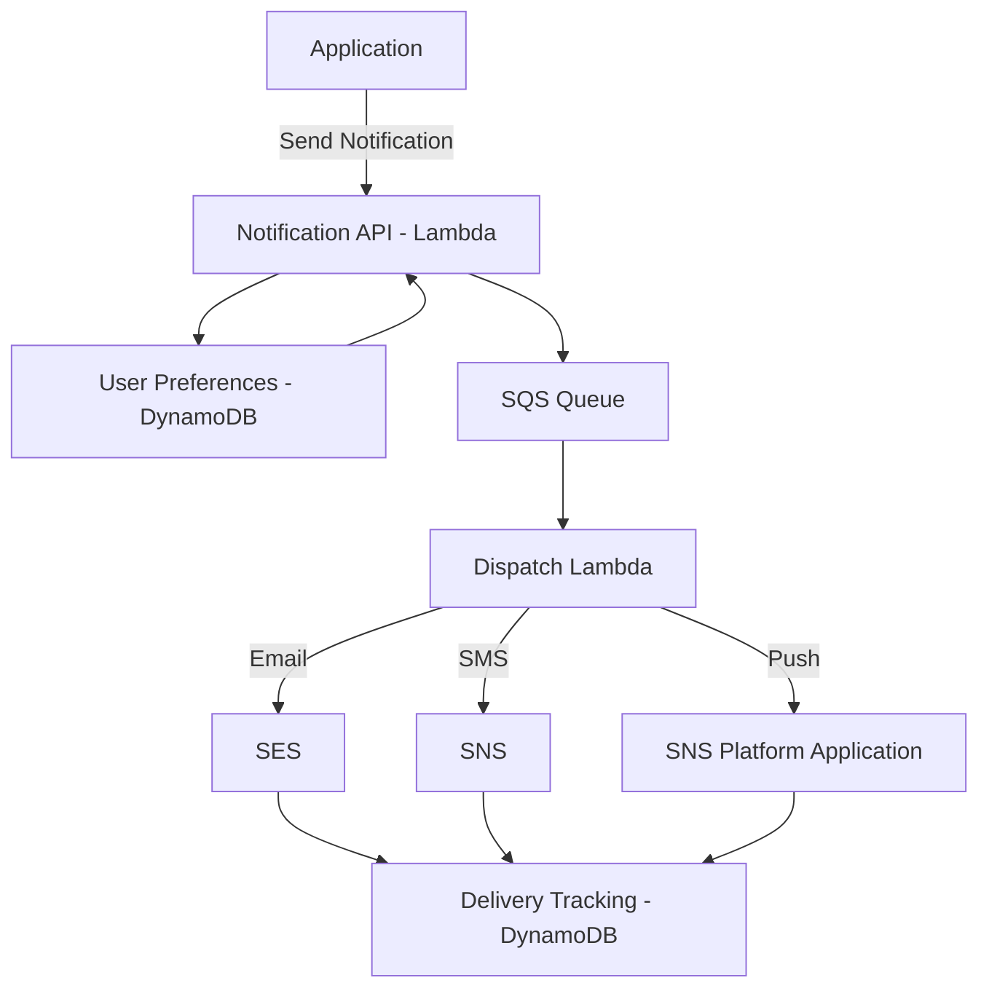

# How to Build a Notification System on AWS (Email, SMS, Push)

Author: [nawazdhandala](https://github.com/nawazdhandala)

Tags: AWS, SNS, SES, Lambda, Notifications

Description: Learn how to build a multi-channel notification system on AWS that delivers email, SMS, and push notifications using SNS, SES, and Lambda.

---

Every modern application needs notifications. Users expect emails for account activity, SMS for security alerts, and push notifications for real-time updates. Building this across multiple channels from scratch is a lot of work. AWS provides services for each channel, and with some thoughtful architecture, you can wire them into a unified notification system.

Let's build one that handles email, SMS, and push notifications with proper templating, delivery tracking, and user preferences.

## Architecture



The key idea is separating the notification request from delivery. Your application sends a notification intent (what to say, who to tell), and the system figures out which channels to use based on user preferences, then dispatches accordingly.

## The Notification Request API

Start with a Lambda behind API Gateway that accepts notification requests.

```javascript
// lambda/notification-api.js
const { SQSClient, SendMessageCommand } = require('@aws-sdk/client-sqs');
const { DynamoDBClient, GetItemCommand } = require('@aws-sdk/client-dynamodb');

const sqsClient = new SQSClient({});
const dynamoClient = new DynamoDBClient({});

exports.handler = async (event) => {
  const body = JSON.parse(event.body);
  const { userId, templateId, data, channels } = body;

  // Look up user preferences
  const { Item: preferences } = await dynamoClient.send(new GetItemCommand({
    TableName: process.env.PREFERENCES_TABLE,
    Key: { userId: { S: userId } },
  }));

  // Determine which channels to use
  const enabledChannels = channels || determineChannels(preferences, templateId);

  // Queue the notification for async processing
  const notificationId = `${Date.now()}-${Math.random().toString(36).substr(2, 9)}`;

  await sqsClient.send(new SendMessageCommand({
    QueueUrl: process.env.NOTIFICATION_QUEUE_URL,
    MessageBody: JSON.stringify({
      notificationId,
      userId,
      templateId,
      data,
      channels: enabledChannels,
      email: preferences?.email?.S,
      phone: preferences?.phone?.S,
      deviceToken: preferences?.deviceToken?.S,
      timestamp: new Date().toISOString(),
    }),
  }));

  return {
    statusCode: 202,
    body: JSON.stringify({ notificationId, channels: enabledChannels }),
  };
};

function determineChannels(preferences, templateId) {
  const channels = [];
  if (preferences?.emailEnabled?.BOOL !== false) channels.push('email');
  if (preferences?.smsEnabled?.BOOL === true) channels.push('sms');
  if (preferences?.pushEnabled?.BOOL !== false && preferences?.deviceToken) channels.push('push');
  return channels;
}
```

## Email with SES

Amazon SES handles email delivery. You'll need to verify your sending domain first.

```javascript
// lambda/dispatchers/email.js
const { SESv2Client, SendEmailCommand } = require('@aws-sdk/client-sesv2');

const sesClient = new SESv2Client({});

async function sendEmail(notification) {
  const { email, templateId, data } = notification;

  // Render the template
  const { subject, htmlBody, textBody } = renderTemplate(templateId, data);

  const params = {
    FromEmailAddress: 'notifications@yourapp.com',
    Destination: {
      ToAddresses: [email],
    },
    Content: {
      Simple: {
        Subject: { Data: subject },
        Body: {
          Html: { Data: htmlBody },
          Text: { Data: textBody },
        },
      },
    },
    // Track opens and clicks
    ConfigurationSetName: 'notification-tracking',
  };

  const result = await sesClient.send(new SendEmailCommand(params));
  return { messageId: result.MessageId, channel: 'email' };
}

function renderTemplate(templateId, data) {
  // Simple template rendering - in production, use SES templates or a library
  const templates = {
    'order-confirmation': {
      subject: `Order #${data.orderId} Confirmed`,
      htmlBody: `<h1>Thanks for your order!</h1><p>Your order #${data.orderId} has been confirmed and will ship by ${data.estimatedDelivery}.</p>`,
      textBody: `Thanks for your order! Your order #${data.orderId} has been confirmed.`,
    },
    'security-alert': {
      subject: 'Security Alert - New Login Detected',
      htmlBody: `<h1>New Login</h1><p>A new login was detected from ${data.location} at ${data.time}. If this wasn't you, please reset your password immediately.</p>`,
      textBody: `New login detected from ${data.location} at ${data.time}.`,
    },
  };

  return templates[templateId] || { subject: 'Notification', htmlBody: data.message, textBody: data.message };
}

module.exports = { sendEmail };
```

## SMS with SNS

For SMS, SNS is straightforward. Just be mindful of costs - SMS is significantly more expensive than email.

```javascript
// lambda/dispatchers/sms.js
const { SNSClient, PublishCommand } = require('@aws-sdk/client-sns');

const snsClient = new SNSClient({});

async function sendSMS(notification) {
  const { phone, templateId, data } = notification;

  // SMS messages should be short and direct
  const message = renderSMSTemplate(templateId, data);

  const result = await snsClient.send(new PublishCommand({
    PhoneNumber: phone,
    Message: message,
    MessageAttributes: {
      'AWS.SNS.SMS.SMSType': {
        DataType: 'String',
        StringValue: 'Transactional', // Higher delivery priority than Promotional
      },
      'AWS.SNS.SMS.SenderID': {
        DataType: 'String',
        StringValue: 'YourApp',
      },
    },
  }));

  return { messageId: result.MessageId, channel: 'sms' };
}

function renderSMSTemplate(templateId, data) {
  const templates = {
    'order-confirmation': `Your order #${data.orderId} is confirmed. Track at: ${data.trackingUrl}`,
    'security-alert': `Security alert: New login from ${data.location}. Not you? Reset password at ${data.resetUrl}`,
    'verification': `Your verification code is ${data.code}. Expires in 10 minutes.`,
  };

  return templates[templateId] || data.message;
}

module.exports = { sendSMS };
```

## Push Notifications with SNS

SNS also handles push notifications through platform applications (APNs for iOS, FCM for Android).

```javascript
// lambda/dispatchers/push.js
const { SNSClient, PublishCommand } = require('@aws-sdk/client-sns');

const snsClient = new SNSClient({});

async function sendPush(notification) {
  const { deviceToken, templateId, data } = notification;

  // Build the push payload for both iOS and Android
  const payload = {
    default: data.message || 'You have a new notification',
    APNS: JSON.stringify({
      aps: {
        alert: {
          title: getPushTitle(templateId),
          body: getPushBody(templateId, data),
        },
        badge: data.badgeCount || 1,
        sound: 'default',
      },
      data: { templateId, ...data },
    }),
    GCM: JSON.stringify({
      notification: {
        title: getPushTitle(templateId),
        body: getPushBody(templateId, data),
      },
      data: { templateId, ...data },
    }),
  };

  const result = await snsClient.send(new PublishCommand({
    TargetArn: deviceToken, // This is the SNS endpoint ARN
    Message: JSON.stringify(payload),
    MessageStructure: 'json',
  }));

  return { messageId: result.MessageId, channel: 'push' };
}

function getPushTitle(templateId) {
  const titles = {
    'order-confirmation': 'Order Confirmed',
    'security-alert': 'Security Alert',
    'new-message': 'New Message',
  };
  return titles[templateId] || 'Notification';
}

function getPushBody(templateId, data) {
  const bodies = {
    'order-confirmation': `Order #${data.orderId} is on its way!`,
    'security-alert': `New login detected from ${data.location}`,
    'new-message': `${data.senderName}: ${data.preview}`,
  };
  return bodies[templateId] || data.message;
}

module.exports = { sendPush };
```

## The Dispatch Lambda

This Lambda pulls from SQS and sends through the appropriate channels.

```javascript
// lambda/dispatch.js
const { sendEmail } = require('./dispatchers/email');
const { sendSMS } = require('./dispatchers/sms');
const { sendPush } = require('./dispatchers/push');
const { DynamoDBClient, PutItemCommand } = require('@aws-sdk/client-dynamodb');

const dynamoClient = new DynamoDBClient({});

exports.handler = async (event) => {
  for (const record of event.Records) {
    const notification = JSON.parse(record.body);
    const results = [];

    // Dispatch to each enabled channel
    for (const channel of notification.channels) {
      try {
        let result;
        switch (channel) {
          case 'email':
            result = await sendEmail(notification);
            break;
          case 'sms':
            result = await sendSMS(notification);
            break;
          case 'push':
            result = await sendPush(notification);
            break;
        }
        results.push({ ...result, status: 'sent' });
      } catch (error) {
        console.error(`Failed to send ${channel} notification:`, error);
        results.push({ channel, status: 'failed', error: error.message });
      }
    }

    // Record delivery status
    await dynamoClient.send(new PutItemCommand({
      TableName: process.env.DELIVERY_TABLE,
      Item: {
        notificationId: { S: notification.notificationId },
        userId: { S: notification.userId },
        templateId: { S: notification.templateId },
        channels: { S: JSON.stringify(results) },
        timestamp: { S: notification.timestamp },
      },
    }));
  }
};
```

## Tracking Email Delivery

SES can send delivery, bounce, and complaint events to SNS. Set this up to track actual delivery.

```typescript
// Configure SES event notifications
const deliveryTopic = new sns.Topic(this, 'EmailDeliveryTopic');

// Lambda to process delivery events
const deliveryTracker = new lambda.Function(this, 'DeliveryTracker', {
  runtime: lambda.Runtime.NODEJS_18_X,
  handler: 'delivery-tracker.handler',
  code: lambda.Code.fromAsset('lambda'),
});

deliveryTopic.addSubscription(new snsSubscriptions.LambdaSubscription(deliveryTracker));
```

## Rate Limiting and Throttling

Be careful with notification volume. SES has sending limits (start at 200 emails/day in sandbox mode). SNS SMS has spend limits. Add rate limiting in your dispatch layer.

For monitoring the health of your notification system, consider setting up proper alerting. Check out [how to build a logging and monitoring stack on AWS](https://oneuptime.com/blog/post/2026-02-12-build-logging-and-monitoring-stack-on-aws/view) for tips on CloudWatch dashboards and alarms that'll help you catch delivery issues before users notice.

## Summary

A multi-channel notification system on AWS combines SES for email, SNS for SMS and push, SQS for buffering, and DynamoDB for preferences and tracking. The decoupled architecture means adding a new channel later (say, Slack or in-app notifications) is just a matter of adding a new dispatcher. Start with email since it's the cheapest, add SMS for critical alerts, and layer on push for real-time engagement.
