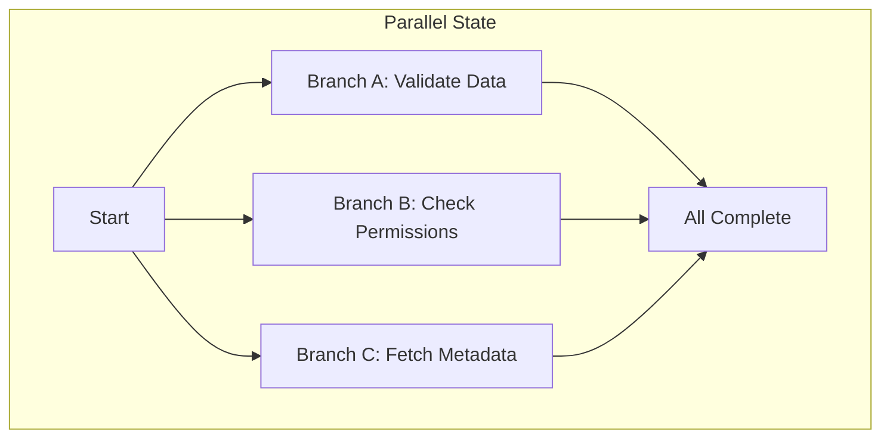
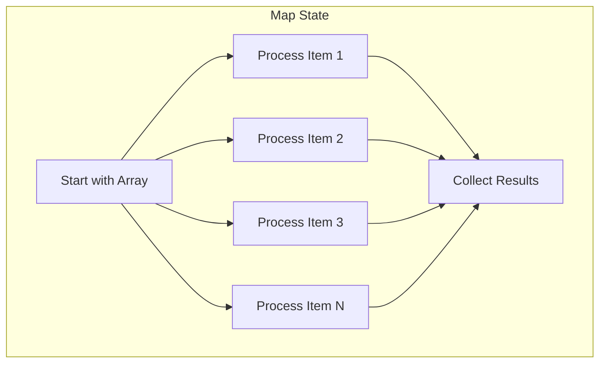

# How to Build Parallel Processing Pipelines with Step Functions

Author: [nawazdhandala](https://github.com/nawazdhandala)

Tags: AWS, Step Functions, Parallel Processing, Serverless, Workflows, Lambda

Description: Learn how to use AWS Step Functions Parallel and Map states to build efficient parallel processing pipelines

---

Sequential processing is simple but slow. When you have independent tasks that do not depend on each other, running them one after another wastes time. AWS Step Functions provides two powerful constructs for parallel execution: the Parallel state and the Map state. Together, they let you build pipelines that process work concurrently while still maintaining orchestration control.

## Parallel State vs Map State

Before diving in, understand the difference:

- **Parallel state** - Runs a fixed set of different branches simultaneously. Use this when you have 2-10 distinct tasks that can run at the same time.
- **Map state** - Runs the same set of steps against each item in an array. Use this when you have a dynamic list of items that all need the same processing.





## Building with Parallel State

Here is a real-world example: an order processing pipeline that validates payment, checks inventory, and verifies the shipping address simultaneously.

```json
{
  "Comment": "Order validation with parallel checks",
  "StartAt": "ValidateOrder",
  "States": {
    "ValidateOrder": {
      "Type": "Parallel",
      "Branches": [
        {
          "StartAt": "ValidatePayment",
          "States": {
            "ValidatePayment": {
              "Type": "Task",
              "Resource": "arn:aws:lambda:us-east-1:123456789012:function:validate-payment",
              "End": true
            }
          }
        },
        {
          "StartAt": "CheckInventory",
          "States": {
            "CheckInventory": {
              "Type": "Task",
              "Resource": "arn:aws:lambda:us-east-1:123456789012:function:check-inventory",
              "End": true
            }
          }
        },
        {
          "StartAt": "VerifyAddress",
          "States": {
            "VerifyAddress": {
              "Type": "Task",
              "Resource": "arn:aws:lambda:us-east-1:123456789012:function:verify-address",
              "End": true
            }
          }
        }
      ],
      "ResultPath": "$.validationResults",
      "Next": "ProcessValidation"
    },
    "ProcessValidation": {
      "Type": "Task",
      "Resource": "arn:aws:lambda:us-east-1:123456789012:function:process-validation",
      "End": true
    }
  }
}
```

The Parallel state waits for ALL branches to complete before moving to the next state. The output is an array where each element is the output of the corresponding branch (in order).

### Handling Branch Failures

By default, if any branch fails, the entire Parallel state fails. Use `Catch` to handle failures gracefully:

```json
{
  "ValidateOrder": {
    "Type": "Parallel",
    "Branches": [
      {"StartAt": "ValidatePayment", "States": {"ValidatePayment": {"Type": "Task", "Resource": "...", "End": true}}},
      {"StartAt": "CheckInventory", "States": {"CheckInventory": {"Type": "Task", "Resource": "...", "End": true}}},
      {"StartAt": "VerifyAddress", "States": {"VerifyAddress": {"Type": "Task", "Resource": "...", "End": true}}}
    ],
    "Catch": [
      {
        "ErrorEquals": ["States.ALL"],
        "Next": "HandleValidationFailure",
        "ResultPath": "$.error"
      }
    ],
    "Next": "ProcessResults"
  }
}
```

## Building with Map State (Inline Mode)

Map state is perfect for processing arrays. Here is an example that processes a batch of image uploads:

```json
{
  "Comment": "Process a batch of uploaded images in parallel",
  "StartAt": "ProcessImages",
  "States": {
    "ProcessImages": {
      "Type": "Map",
      "ItemsPath": "$.images",
      "MaxConcurrency": 10,
      "ItemProcessor": {
        "ProcessorConfig": {
          "Mode": "INLINE"
        },
        "StartAt": "ResizeImage",
        "States": {
          "ResizeImage": {
            "Type": "Task",
            "Resource": "arn:aws:lambda:us-east-1:123456789012:function:resize-image",
            "Next": "GenerateThumbnail"
          },
          "GenerateThumbnail": {
            "Type": "Task",
            "Resource": "arn:aws:lambda:us-east-1:123456789012:function:generate-thumbnail",
            "Next": "UpdateMetadata"
          },
          "UpdateMetadata": {
            "Type": "Task",
            "Resource": "arn:aws:lambda:us-east-1:123456789012:function:update-metadata",
            "End": true
          }
        }
      },
      "ResultPath": "$.processedImages",
      "Next": "NotifyComplete"
    },
    "NotifyComplete": {
      "Type": "Task",
      "Resource": "arn:aws:lambda:us-east-1:123456789012:function:notify-complete",
      "End": true
    }
  }
}
```

Key settings for Map state:

- **ItemsPath** - JSONPath to the array in the input
- **MaxConcurrency** - How many items to process simultaneously (0 = unlimited)
- **ItemProcessor** - The state machine to run for each item

### Controlling Concurrency

`MaxConcurrency` is critical for protecting downstream services. If your array has 1,000 items and each one calls a database, unlimited concurrency will overwhelm it.

```json
{
  "ProcessItems": {
    "Type": "Map",
    "ItemsPath": "$.items",
    "MaxConcurrency": 25,
    "ItemProcessor": {
      "ProcessorConfig": {
        "Mode": "INLINE"
      },
      "StartAt": "ProcessItem",
      "States": {
        "ProcessItem": {
          "Type": "Task",
          "Resource": "arn:aws:lambda:us-east-1:123456789012:function:process-item",
          "Retry": [
            {
              "ErrorEquals": ["States.TaskFailed"],
              "IntervalSeconds": 2,
              "MaxAttempts": 3,
              "BackoffRate": 2.0
            }
          ],
          "End": true
        }
      }
    }
  }
}
```

### Passing Context to Map Iterations

Each iteration of a Map state receives the individual array item. To also pass shared context (like configuration), use `ItemSelector`:

```json
{
  "ProcessOrders": {
    "Type": "Map",
    "ItemsPath": "$.orders",
    "ItemSelector": {
      "order.$": "$$.Map.Item.Value",
      "index.$": "$$.Map.Item.Index",
      "config.$": "$.processingConfig",
      "batchId.$": "$.batchId"
    },
    "ItemProcessor": {
      "ProcessorConfig": {"Mode": "INLINE"},
      "StartAt": "ProcessOrder",
      "States": {
        "ProcessOrder": {
          "Type": "Task",
          "Resource": "arn:aws:lambda:us-east-1:123456789012:function:process-order",
          "End": true
        }
      }
    }
  }
}
```

Each Lambda invocation receives both the individual order and the shared config/batchId.

## Combining Parallel and Map States

Real pipelines often combine both. Here is an ETL pipeline that fetches data from multiple sources in parallel, then processes all records through a map:

```json
{
  "Comment": "ETL pipeline with parallel fetch and map-based processing",
  "StartAt": "FetchData",
  "States": {
    "FetchData": {
      "Type": "Parallel",
      "Branches": [
        {
          "StartAt": "FetchFromAPI",
          "States": {
            "FetchFromAPI": {
              "Type": "Task",
              "Resource": "arn:aws:lambda:us-east-1:123456789012:function:fetch-api-data",
              "End": true
            }
          }
        },
        {
          "StartAt": "FetchFromDatabase",
          "States": {
            "FetchFromDatabase": {
              "Type": "Task",
              "Resource": "arn:aws:lambda:us-east-1:123456789012:function:fetch-db-data",
              "End": true
            }
          }
        },
        {
          "StartAt": "FetchFromS3",
          "States": {
            "FetchFromS3": {
              "Type": "Task",
              "Resource": "arn:aws:lambda:us-east-1:123456789012:function:fetch-s3-data",
              "End": true
            }
          }
        }
      ],
      "ResultPath": "$.rawData",
      "Next": "MergeData"
    },
    "MergeData": {
      "Type": "Task",
      "Resource": "arn:aws:lambda:us-east-1:123456789012:function:merge-data",
      "ResultPath": "$.mergedRecords",
      "Next": "TransformRecords"
    },
    "TransformRecords": {
      "Type": "Map",
      "ItemsPath": "$.mergedRecords",
      "MaxConcurrency": 50,
      "ItemProcessor": {
        "ProcessorConfig": {"Mode": "INLINE"},
        "StartAt": "TransformRecord",
        "States": {
          "TransformRecord": {
            "Type": "Task",
            "Resource": "arn:aws:lambda:us-east-1:123456789012:function:transform-record",
            "Next": "LoadRecord"
          },
          "LoadRecord": {
            "Type": "Task",
            "Resource": "arn:aws:lambda:us-east-1:123456789012:function:load-record",
            "End": true
          }
        }
      },
      "Next": "PipelineComplete"
    },
    "PipelineComplete": {
      "Type": "Succeed"
    }
  }
}
```

## Error Handling Strategies

### Tolerate Partial Failures in Map

By default, a Map state fails if any iteration fails. For batch processing where some failures are acceptable, use `ToleratedFailurePercentage`:

```json
{
  "ProcessBatch": {
    "Type": "Map",
    "ItemsPath": "$.records",
    "MaxConcurrency": 20,
    "ToleratedFailurePercentage": 10,
    "ItemProcessor": {
      "ProcessorConfig": {"Mode": "INLINE"},
      "StartAt": "ProcessRecord",
      "States": {
        "ProcessRecord": {
          "Type": "Task",
          "Resource": "arn:aws:lambda:us-east-1:123456789012:function:process-record",
          "End": true
        }
      }
    }
  }
}
```

This allows up to 10% of items to fail without failing the entire Map state.

### Retry Individual Items

Add retry logic inside the Map processor to handle transient failures:

```json
{
  "ProcessRecord": {
    "Type": "Task",
    "Resource": "arn:aws:lambda:us-east-1:123456789012:function:process-record",
    "Retry": [
      {
        "ErrorEquals": ["TooManyRequestsException", "ServiceUnavailableException"],
        "IntervalSeconds": 1,
        "MaxAttempts": 5,
        "BackoffRate": 2.0
      }
    ],
    "End": true
  }
}
```

## Performance Tips

1. **Right-size MaxConcurrency** - Match it to what your downstream systems can handle, not what Step Functions can do
2. **Keep Lambda payloads small** - Step Functions has a 256KB payload limit per state. For large data, pass S3 references instead
3. **Use Express Workflows for high-volume maps** - If each map iteration is under 5 minutes and you have thousands of items, consider [Express Workflows](https://oneuptime.com/blog/post/2026-02-12-use-step-functions-express-workflows-for-high-volume-events/view)
4. **For massive datasets, use Distributed Map** - When your array has millions of items, check out our guide on [Step Functions Distributed Map](https://oneuptime.com/blog/post/2026-02-12-use-step-functions-distributed-map-for-large-scale-processing/view)

## Wrapping Up

Parallel and Map states transform Step Functions from a simple sequential orchestrator into a powerful parallel processing engine. Use Parallel for fixed sets of different tasks. Use Map for dynamic arrays of identical tasks. Combine them for complex pipelines. And always set appropriate concurrency limits to protect your downstream services.
